# User Guide - Synchronisation of dynamic sensor prototypes and stereo configurations
> *For more information, visit [iniVation support](https://inivation.com/support/)*
---

This guide describes how to synchronise the event timestamps from
dynamic vision and audio sensors when using them together.

## Table of contents
- [Device synchronisation overview](#device-synchronisation-overview)
  - [Synchronisation protocol and event injection](#synchronisation-protocol-and-event-injection)
  - [DVS128 synchronisation](#dvs128-synchronisation)
  - [DAVIS240 synchronisation](#davis240-synchronisation)
    - [External input events](#external-input-events)
    - [Timestamp synchronization](#timestamp-synchronization)
- [Synchronising devices of different types](#synchronising-devices-of-different-types)

## Device synchronisation overview

The following prototypes deliver packets of timestamped address-events
over USB:

-   [DVS128](#dvs128-synchronisation)
-   [DAVIS240](#davis240-synchronisation)
-   FX3 development board

In order to utilize the timestamps from more than one device, either
live or offline, in an application where precise timing of events is
critical, the timestamps must be synchronised. This is achieved by a
physical wired connection between devices that relays a synchronisation
signal. This signal can either be generated from one of the devices (the
"master") or it can be generated externally. It is also possible to
deliver trigger signals to devices which cause them to insert special
events into their event streams.

### Synchronisation protocol and event injection

All devices use one of two compatible protocols, with minor differences
between these two protocols:

-   DVS128, and DAVIS240 with logic from 2014 use protocol 1.
-   DAVIS240 with logic from 2015 and FX3 development boards use
    protocol 2.

In protocol 1, a device must be told whether it is a master, which
produces synchronisation pulses, or whether it is a slave, which
receives synchronisation pulses. In protocol 2, a device assumes that it
is a master, unless it is receiving synchronisation pulses, in which
case it assumes it is a slave automatically. This simplifies setup.

In both protocols a 10 kHz clock is used to advance the timestamps. In
slaves, timestamps are allowed to advance on the falling edge of the
clock. If the falling edge is delayed by a small period - up to 16 us
for protocol 1, and up to 10 us for protocol 2 - then any events in that
waiting period continue to take the same timestamp until the falling
edge is detected.

After the small period, it is assumed that a falling pulse represents a
reset pulse. The reset pulse is supposed to last 200 us. In protocol 1,
slave devices pause their clock indefinitely until the next falling
edge, at which point they reset their clock and then continue to
increment it. In protocol 2, if the falling edge is not received by 210
us from the previous falling edge, then the device assumes that it has
become a master itself, having lost connection with its previous master
- at this point it resets its clock, starts to increment it and sends
out a 10 kHz synchronisation clock of its own.

It's also possible to fake a master by generating a clean 10KHz clock
and a reset pulse and feeding these into the first device in the chain,
by using external hardware such as a programmable function generator.

The devices also support injecting an event into their event stream in
response to an external stimulus, such as a falling edge, happening on
their input signal pin.

The DAVISes have a stereo cable, so two in and two output signals, which
means the "clock" signal and the "event injection" signal are always
separate and well-defined, so there is no ambiguity on what is a clock
and what is an event injection signal. This also means we can reliably
detect when a clock is fed into a device and automatically figure out if
it's a slave or a master, as described above.

The DVS128 only have two pins total, so there are software
switches to select if it's a master, meaning its OUT pin will generate
a synchronisation clock and its IN pin will be used to inject special
events, or a slave, meaning both the IN and OUT pins are dedicated to
synchronisation, by respectively receiving and forwarding the clock.

### DVS128 synchronisation

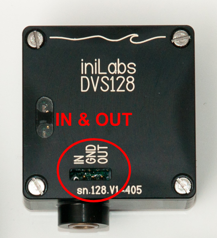

Multiple DVS128 cameras can be synchronized to microsecond time-stamp
precision by connecting them between each other so they can exchange a
synchronisation signal.

This signal is 3.3V. DO NOT connect this with devices using a 5V signal!

To connect cameras, you can use coax cables together with T-connectors
and the Pomona Electronics 5069 coax breakout adaptor with 0.025" pin
connectors (e.g.
[http://www.digikey.com/product-search/en?x=-1075&y=-87&lang=en&site=us&KeyWords=pomona+5069](http://www.digikey.com/product-search/en?x=-1075&y=-87&lang=en&site=us&KeyWords=pomona+5069)

or

**BROKEN**
[http://www.testpath.com/Items/Breakout-BNC-Female-to-0025-in-Square-Pin-Sockets-113-531.htm.](http://www.testpath.com/Items/Breakout-BNC-Female-to-0025-in-Square-Pin-Sockets-113-531.htm.)

Minimally, however, you just need to use rectangular female header pin
crimps and a copper cable, as shown in this picture:

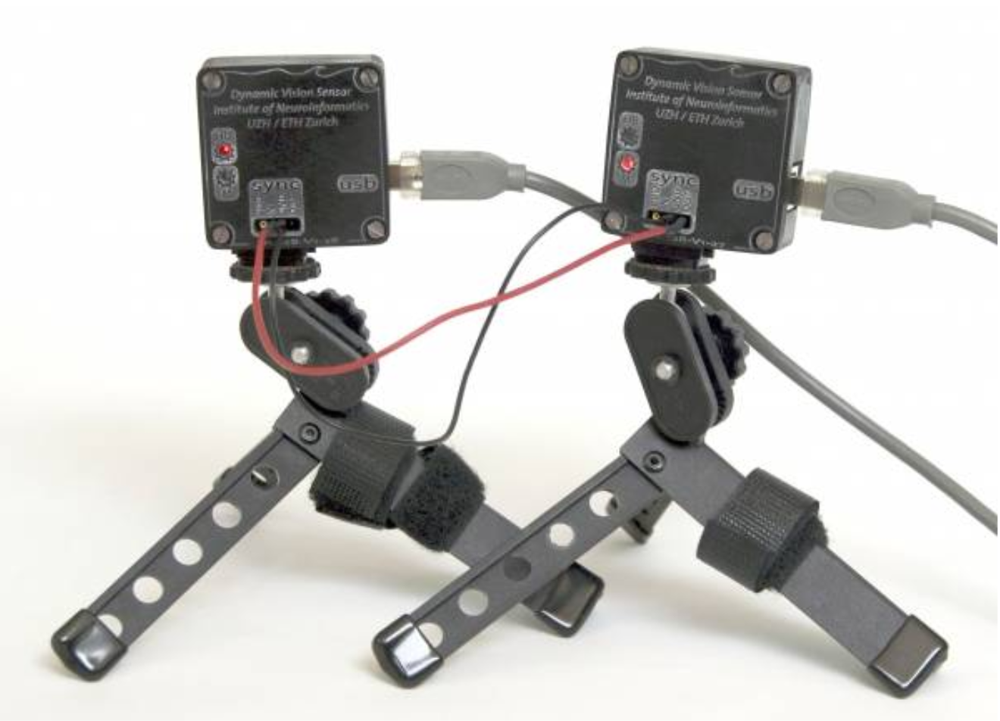

For synchronisation, DVS128 cameras with a firmware version number >=
11 should be used, older firmware versions are not synchronized properly
if the USB load is high.

To enable this functionality, the cameras must be connected so that the
OUT of the master is connected to the IN of the slave(s).

If the cameras are connected to the same computer, the ground pins do
not have to be connected (to avoid possible ground loops). If the
cameras are connected to different computers, the ground pins should be
connected, as shown in the picture above.

Starting from firmware version 11, the timestamp master camera has to be
selected in software. In the jAER software, use "File" -> "New Viewer"
to get a second view window. Use each window to select one of the
connected devices from the "Interface" menu. Then, For the timestamp
master (where the OUT is connected) the checkbox 'Timestamp master /
Enable sync event output' in the DVS128-menu has to be checked, for the
slave(s), it has to be unchecked.

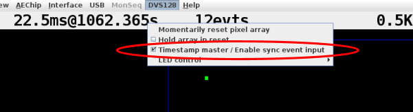

The master camera keeps its bottom LED lit, while the slaves extinguish
theirs.

To synchronize the cameras after plugging them in, press '0' in the
AEViewer window of the timestamp master to reset the timestamps of all
the cameras.

A capability of DVS128 firmware revision 7+ is the ability to inject
synthetic events into the event stream on falling edges detected on the
IN pin. In this mode, the function of the IN pin is modified so that
instead of clocking the internal timestamp counter, it now injects a
special event with bit 15 set on every falling edge of the IN pin.

The IN pin is not 5V tolerant. High must not exceed 3.3V.

**Warning! Do not connect with a DAVIS240, see
[here](#synchronising-devices-of-different-types) for a
discussion.**

To enable this mode, while the DVS128 is plugged in, use the DVS128 menu
to enable the checkbox 'Timestamp master / Enable sync event output',
as seen in the picture above.

Falling edges of the IN pin should result in the logging of special
events, which are denoted by having the SYNC_EVENT_BITMASK bit set in
their address (bit 15).

### DAVIS240 synchronisation

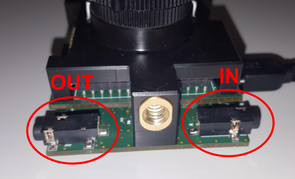

Synchronisation of different devices is a feature that DAVIS240 performs
through two 3.5mm audio jacks, one at each side of the device. These are
labelled "IN" and "OUT" on the back of the device (although these are
written back to front), as in this image:

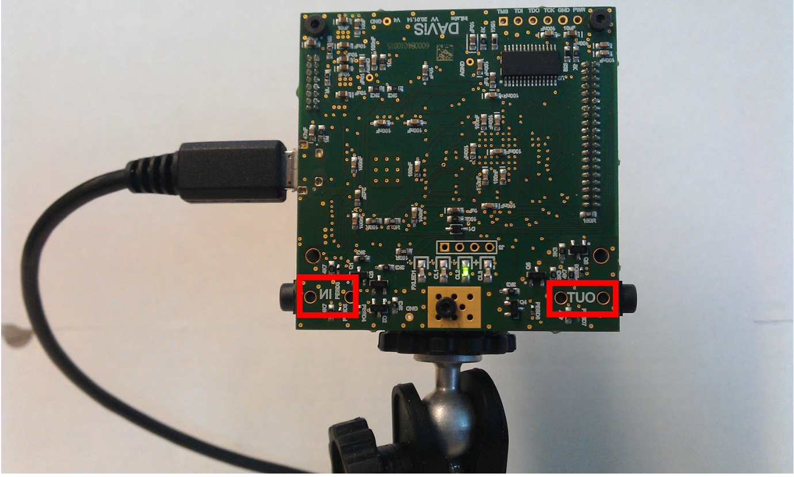

The pinout of these jacks is as follows:

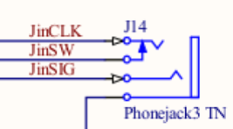

- Pin 1: Ground (external first circle of an audio jack from the cable, "sleeve").
- Pin 3: Signal (external 2nd circle).
- Pin 2: Clock (tip)
- Pin 4: the tip of the jack also performs a Switch function, that can
let the device know if there is a cable attached. This is currently
not used.

The signal voltage is 5V.

**Warning! The signal voltage in DAVIS240 is different to that of
DVS128 - If you wish to synchronise between DAVIS240 and
DVS128, please ask us for [more
information](#synchronising-devices-of-different-types) -
directly connecting DAVIS240 to DVS128 may damage the
DVS128!)**

To synchronise two devices you need a stereo 3.5mm plug patch cable.
When directly connecting two devices, use a cable like this:

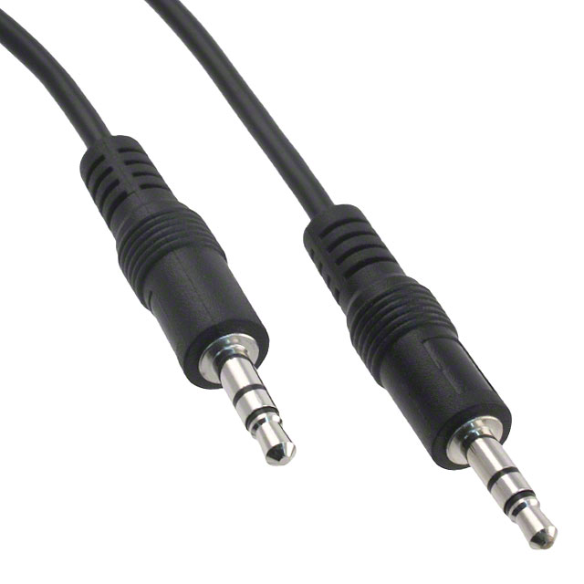

If needing to access the two signals separately, you should instead use
cables like these:

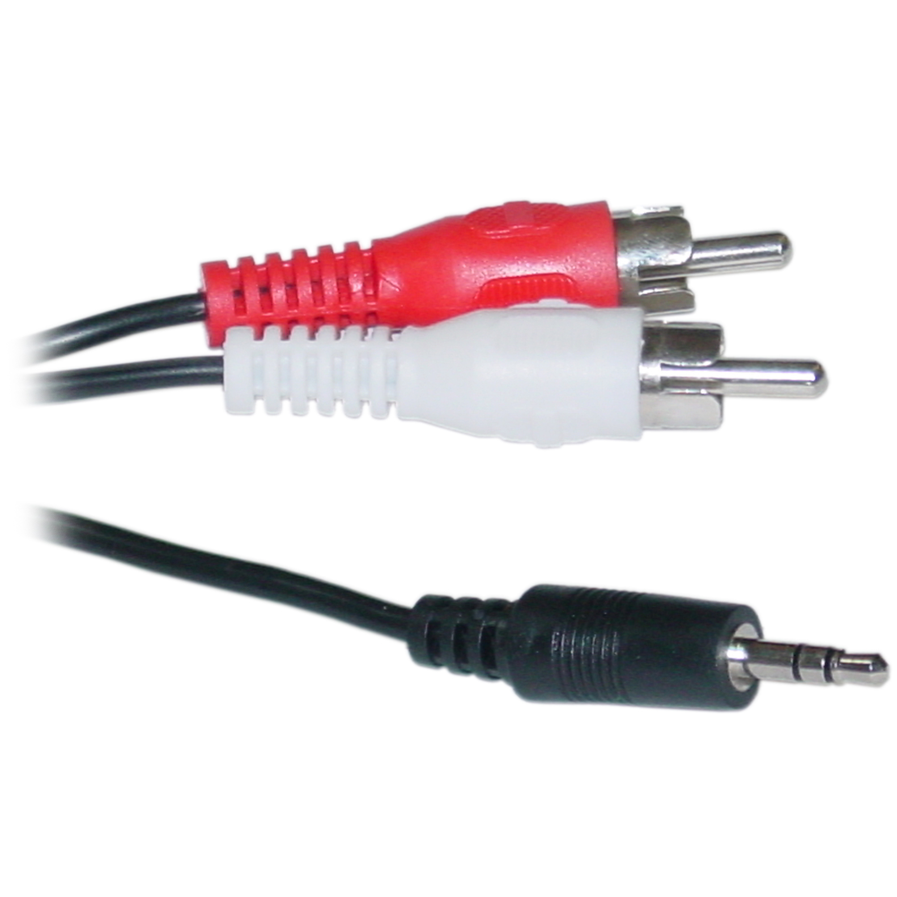

You can get these from digikey or any AV store.

#### External input events

Signal 1 (pin 3, JinSIG above) is used for external event injection; it
detects rising or falling edges or pulses of a certain polarity and
minimal length, and generates an event in response to this that you can
detect on the host, where this event has a unique address corresponding
to DavisChip.EXTERNAL_INPUT_EVENT_ADDR. The input is passed directly
to the output, so that multiple chained devices may react to the same
external stimulus and inject an event in response to it. This can be
useful if you want to have precise timing in your event stream coupled
with an external event happening, like a flash going off or an LED
turning on.

To enable these events in jAER, go to the hardware configuration panel
and select the "External Input Config" tab. Then enable the detection
using the top radio button and select the mode by the other buttons
below:

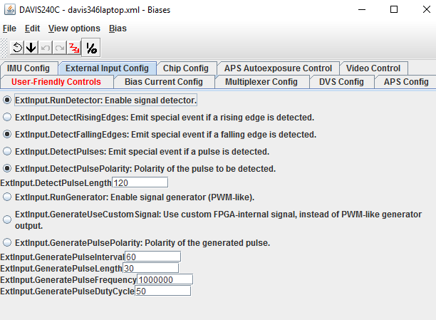

#### Timestamp synchronization

Signal 2 (pin 2, JinCLK above) is used for timestamp synchronization
between devices. This corrects drift in the digital clocks of the
devices and keeps them in lock-step.

The timestamp sync signal is a 10 KHz clock, following the protocol
described
[above](#synchronisation-protocol-and-event-injection).

The moment two (or more) cameras are connected together, all the slaves
automatically sync their timestamp increments to the master. The slave
will reset its timestamp to zero, whereas the master will continue
running.

A camera that detects the 10kHz clock on it's input pin will show text
"Slave camera" at the lower left of the AEViewer window, just below the
frame area. If this indication is not shown, then the clock has not been
detected.

Once you've connected all devices, it's usually a good idea to tell
the master to issue a timestamp reset so all devices have a common
starting point. To do this:

-   From jAER: press "0" (zero) in the jAER window which controls the master;
-   in cAER: toggle /1/DAVIS-FX2/multiplexer/TimestampReset.

We did an experiment using 150m of untwisted 2-conductor cable to
synchronize two DAVIS240C cameras. The cable was soldered to a
sacrificed 3.5mm audio patch cable. The setup is shown below. The person
being filmed in the video stands at the foot of the stairs alongside a
blinking LED bike light and was bouncing a tennis ball.

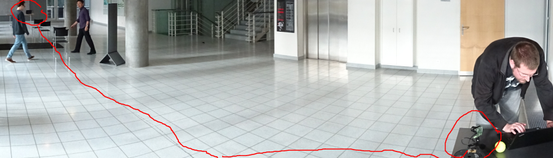

See [this video of the synchronized
playback](https://youtu.be/E7TQBlZ8rJ0) of the recorded
video.

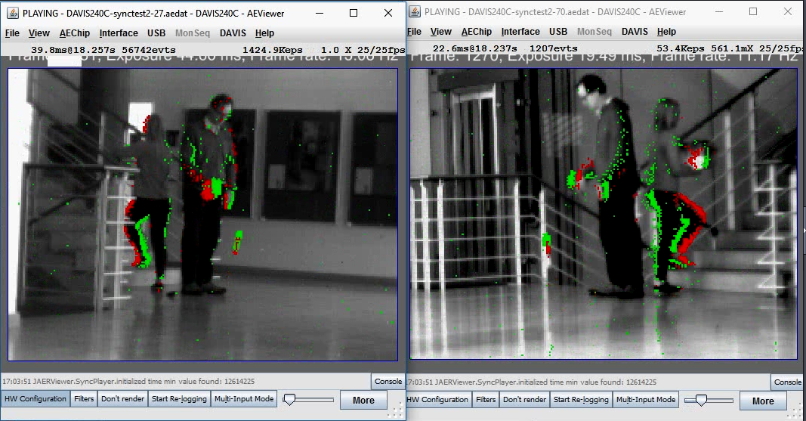

## Synchronising devices of different types

All iniLabs devices use a [compatible
protocol](#synchronisation-protocol-and-event-injection)
for synchronization. The only difference between devices is the voltage
of the involved signals.

-   DVS128 use 3.3V.
-   DAVIS240 uses 5V.
-   The FX3 development boards can use both 3.3V and 5V, selectable via
    a jumper.

Given the different signal voltages, a DAVIS240 cannot be connected
directly to a DVS128. While having it act as a slave and receive
3.3V from a DVS128 should be safe, it is not guaranteed to work
correctly.

The other way around, having a DAVIS240 act as a master for a
DVS128, can damage the slave device, and should not be done.

If you need to synchronize DAVIS240 with DVS128, please contact our
support department for more information.
