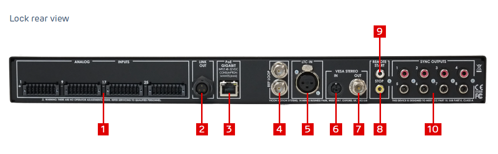

# DAVIS Synchronization and Calibration with Vicon

The DAVIS cameras can be calibrated and synchronized with the Vicon
Motion Capture System.

During the collection of the data for the dataset DHPE17, Dataset for
Human Action Recognition and Human Pose Estimation, we synchronized and
calibrated 4 DAVIS cameras with the Vicon. The Vicon information can be
used as ground truth to check and compare the output from the 4
calibrated cameras and for training a network for pose estimation.

## Synchronization with the Vicon

The Vicon has available a
[Lock+](https://www.vicon.com/products/vicon-devices/lock-sync-box)
Vicon control box for connecting, integrating and synchronizing
third-party devices with the Vicon motion capture system. The rear panel
of the Lock+ box, shown in the following picture, shows the Sync Outputs
sockets. The Sync Output can trigger external devices, as the DAVIS
cameras, with a synchronization signal. The output signal is specified
in a synchronization configuration file (GPO, General Purpose Output),
which is uploaded in the Vicon Application Software,
[Nexus](https://www.vicon.com/products/software/nexus).

For our specific application we defined a GPO configuration file,
supplied with Nexus, *Duration.gpo*, that specified the characteristics
of the synchronization signal. When the capture starts, a StartCapture
event is generated from the Vicon, and the synchronization output
latches high (5V signal) for the whole duration of the capture. Then
when the recording ends, a StopCapture event is produced, and the output
latches low. The output signal is sent to the “first” DAVIS camera,
master, and produces a **special event** every time that the recording
starts and every time that it ends.

The connection between the Vicon and the master DAVIS is made by two
cables, one for the signal and one for the reference. One end of the
output signal cable is plug to the Sync Output Socket set as output, and
the other end to the pin 4 of the DAVIS motherboard (red cable in the
picture). The reference cable connects one non triggered Sync Output
Socket with the pin 5 (yellow cable). The pink cable in the pictures is
connected to the GND (pin 1).

When the DAVIS detect a rising or a falling edge between pin 4 and 5
generates a **special event**. The timestamp associated to this event
can be used to synchronize the two system.

To enable the detection of the special events in jAER, it is needed to
go to the hardware configuration panel, then Exterrnal Input Config Tab,
and enable the ExInput.RunDetector:Enable signal detector.

The black cable in the picture is used to synchronize the master DAVIS
camera with the other slaves cameras. Pin 8, Sync Clk Out, generate an
output signal that is read by the first slave camera as an input, pin
10, Sync Clk in. The Sync Clk out pin of the first camera is linked the
Sync Clk in of the second camera, the Sync Clk out of the second camera
is linked to the “Sync Clk in” of the third camera, etc. In this way,
the four camera DAVIS system is synchronized to the first DAVIS camera,
triggered by the Vicon. In this way, the four camera DAVIS system is
synchronized to the first DAVIS camera, triggered by the Vicon.

 

  

# Calibration with the Vicon

In order to compare the data acquired from the two systems, it is
important to define the world coordinate system relative to which all
the other systems are converted to.

In our experiment, we decided to referred all the systems (DAVIS cameras
and Vicon) to the master DAVIS camera (DAVIS 1), that we considered as
our word coordinate system. The DAVIS cameras are calibrated in pairs
using a chessboard pattern and the OpenCV library (which can be run on
Matlab or jAER, filter SingleOrStereoCalibration). The cameras are
calibrated in order: DAVIS2 referred to DAVIS1, DAVIS3 referred to
DAVIS2, DAVIS4 referred to DAVIS3. In this way it is possible to define
the transformation matrices between the different system
T2-\>1, T3-\>2, T4-\>3 and reference
everything to DAVIS1. To referred the Vicon to DAVIS1, it is possible to
use different methods. Here we presented the *change of basis theorem*,
that we used to find the transformation matrix TVicon-\>1.

Once the Vicon has been calibrated, with the specific Vicon
[calibration
tool](https://www.vicon.com/products/vicon-devices/calibration),
we used a custom metallic frame with reflective markers at its
extremities to calibrate the Vicon respect to DAVIS1. The frame can be
seen from the two systems and it is use to find the transformation
matrix between them. The metallic frame was set at the origin of the
Vicon in its coordinate system, with each axes aligned with the three
basis vectors.

We expressed the basic vector of the frame, in the Vicon coordinate
system, as a set of vectors, linearly independent and orthogonal. The
basis vector of the Vicon system can be written as:

The position of the same frame basis vector referred from the DAVIS1 can
be estimated through triangulation. In this way it is possible to define
the 3D coordinate of each markers at the extremities of the frame X, Y
and Z, coordinate of the basis vector in the DAVIS1 system.

In the DAVIS1 space the basis vector can be defined as:

The transformation matrix TVicon-\>1 is so defined:

An example of calibration with Vicon:

