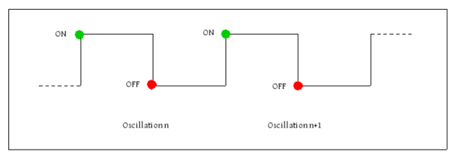

# LED Marker Signaling and Location Tracking with the Dynamic Vision Sensor

## Overview

In the field of object tracking, one of the most important issue to go
into is the choice of the markers to use for the specific application.
On the market, it is possible to find two main types of tracking
markers: active or passive. The most common active markers are LEDs
(Light Emitting Diodes), while passive markers are made by
[retroreflective](https://en.wikipedia.org/wiki/Retroreflective)
material that reflect light. The main advantage of active markers is
that each LED can emit a unique frequency, resulting in a unique
identification of the marker. Moreover, LEDs are better visible than the
passive reflective markers.

In this overview, it is presented the potentiality of the Dynamic Vision
Sensor, DVS, in LED tracking compared to normal frame-based camera. The
DVS is highly sensible to light variation so it can be able to
distinguish different LED flicker frequency and track multiple LEDs. The
technical pitfalls of using frame-based camera technology are analyzed
as a basis for pursuing this event-based approach.

## Background

Light Emitting Diodes (LEDs) are known to operate robustly under a
voltage supply that continuously oscillates between on (V+) and off
(ground) for a large range of frequencies. As a consequence, that makes
the LED pulses continuously on and off. The flicker is apparent to the
human eye up to 60 Hz, while for higher frequencies, greater than the
human flicker fusion threshold, the LED looks stationary.

This characteristic feature provides the basis for visually identifying
and tracking LEDs as markers. For examples, in scenes where they may be
obscured by other sources of light, a sufficiently high frequency of
oscillation is discernible if measured and observed at a high temporal
resolution. Moreover, multiple LEDs may be differentiated if tuned to
operate at sufficiently separated frequencies. It is also possible to
find application in the line-of-sight signaling, in the transmission of
an encoded information by modulating the frequency of the oscillation.

All these applications are difficult tasks for traditional frame-based
cameras. Frame-based cameras have a low temporal resolution (typically
60 fps) and high computing requirements in order to filter the sequence
of frames. Some improvement can be achieve increasing the frame rate,
but this directly corresponds to an increase in computing resources.
Furthermore, tracking light sources as markers by image recognition is a
non-trivial task; it is possible to differentiate the marker using
physical characteristics (size, colour, etc) but not the flicker
frequency, that is the most specific one to identify the marker.

## DVS

Due to its asynchronous mode of operation, the Dynamic Vision Sensor
(DVS) is capable of capturing changes in illumination in an observed
scene at a very high temporal resolution compared to a traditional
frame-based camera. It has been observed capturing the oscillations of
LEDs (hereon referred to as markers) at frequencies of up to 40 kHz.
However, this requires good lighting conditions, strong biasing of the
chip and that the signal produced by the marker stimulates multiple
pixels.

The DVS only captures these changes when and where they occur in the
scene, producing a sparse data set that inherently captures the
oscillations as ON and OFF events. This is potentially far less resource
intensive, requiring less computing memory and power.

For its properties DVS prove useful in the case of tracking markers in a
scene: only a small fraction of the pixel array has a high density of
constant activity, depending on the size and distance of the markers,
and this is right the information regarding the position of the marker
that has to be processed.

The algorithmic requirements are potentially also reduced: instead of
trying to identify one or more markers in an entire scene as an image
object and then characterize its features, one only needs to filter out
event addresses that have temporally-sparse activity relative to that of
the markers. This may result in a more robust method of tracking,
resulting in fewer tracking losses.

## Operation

The DVS generate an event, when it senses a change in light at the pixel
level. As a marker switches into an on state, this produces ON events,
when it switches into an off state produces OFF events. The events
produced by the markers in the sensor array correspond to the LED
position in the observed scene.

If we assume an oscillation generates a square waveform, we can expect
two events per wavelength at any given frequency. This is shown in the
diagram below:

The diagram illustrates an ideal response of DVS pixels to the signal
produced by a marker, where events are triggered at the waveform edges
(in reality, we would expect them to be produced after some time
constant from the edge). So, for a given frequency *f*, *2f* events are
produced by each stimulated pixel. The difference in event type (ON and
OFF) can be utilized to improve robustness.

Tracking of markers can be generalized in three dimensions by using a
setup comprising multiple sensors, placed in contrasting positions and
calibrated to reflect this. Synchronization is achieved by referencing
the timestamps of events produced from all devices to that of a single
device chosen as master.

Algorithmically, it is possible to elaborate the stream of events in
different ways. It is possible to calculate the LED frequency from the
time interval between two transition events (ON-OFF or OFF-ON), and in
this way identify the single LED. Once the LEDs are identified, they can
be tracked using different tracking filter, for example a cluster
tracking algorithm. And other possibility could be tracking a marker
creating histograms of events over the x and y addresses. The two
histograms show the number of event for each pixel locations. Since the
LED is flickering the most activated pixels would correspond to the
position of the marker in x and y coordinates. Varying the frequency of
the markers would result in a corresponding change in the number of
events at the LED addresses, allowing one to apply a basic threshold to
distinguish between markers.

More and more specific algorithms for different application can be
created and invented to track the LED markers in several ways. Surely,
DVS cameras establish a valid alternative to the normal frame based
camera and can bring lots of advantages in the LED tracking application,
reducing computing memory, power consumption, and increasing for
processing speed in the data elaboration.
