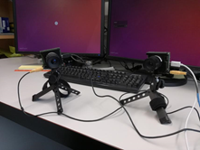
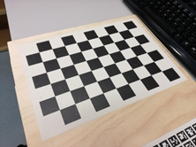
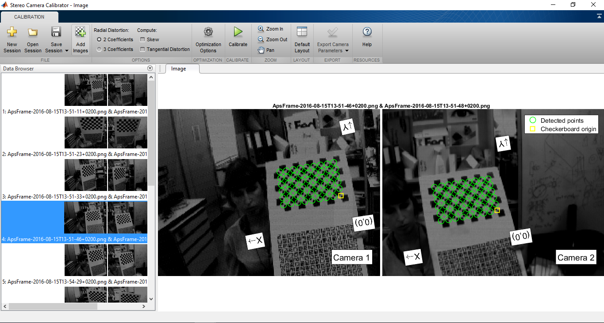
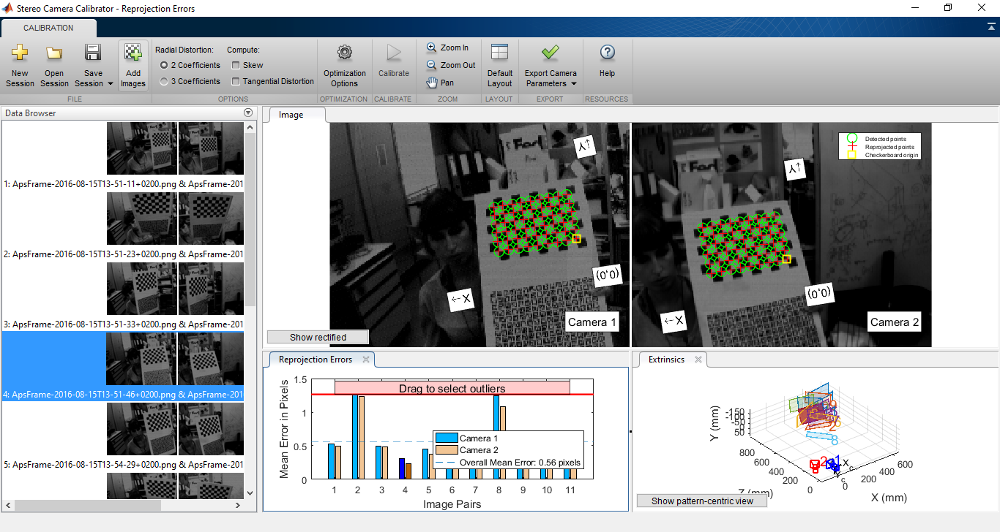
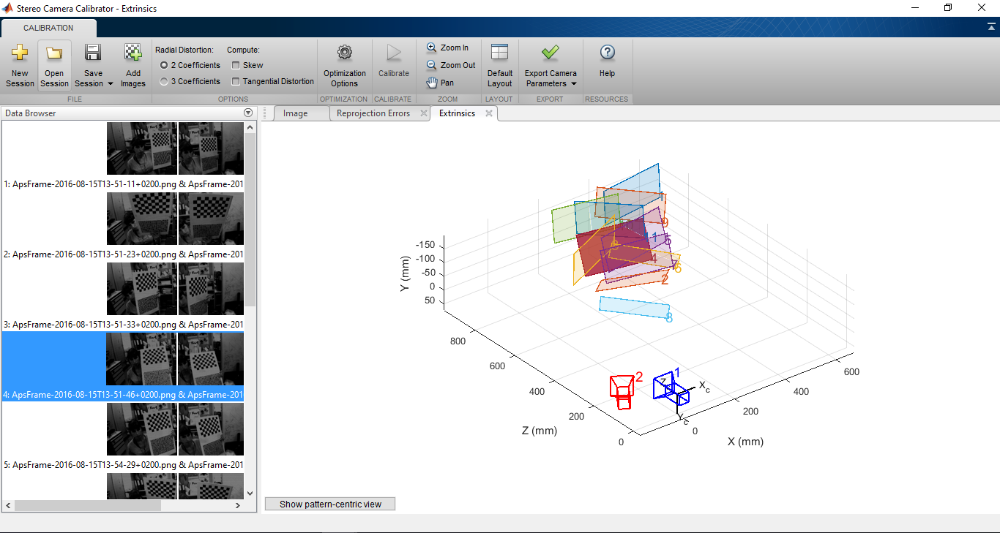

# How to calibrate a stereo setup (two DVS or DAVIS sensors) 

The main idea is to acquire several images, in different positions, of a
checkboard pattern from two different camera. Once we have recorded the
accumulated images we can use our preferred vision software tool
(Matlab/Python/Opencv) to carry the stereo calibration and estimate the
parameters of each of the two cameras.

The workflow to calibrate a stereo camera can be summarized in the
following steps:

1.  Prepare the cameras set up and the checkboard calibration pattern.

 

2.  Open two viewers with jAER software. Save images of the checkboard
    patterns in different position, at the same time, from the two
    camera (es. Using for example filter ApsFrameExtractor).

3.  Now it is possible to use the acquired image to calibrate our
    stereo set up. It is possible to use different methods and
    software, for example 
    [Opencv](http://docs.opencv.org/2.4/modules/calib3d/doc/camera_calibration_and_3d_reconstruction.html)
    or Matlab
    [Matlab](http://mathworks.com/help/vision/ug/stereo-camera-calibrator-app.html).

4.  Stereo calibration using Matlab App. You can use the already
    existing toolbox to calibrate your cameras. Open the App and load
    the acquired images from the two cameras. The toolbox recognize
    the calibration pattern in every pair of images.

    

    Press the calibrate button. The toolbox calculates the stereo
    calibration parameters, displays thecalibration errors and plot the
    position of the cameras in a 3D space.

    

    

    Stereo calibration parameters:

    - Camera1Parameters ( IntrinsicMatrix, RotationMatrices, Traslationvector);
    - Camera2Parameters ( IntrinsicMatrix, RotationMatrices, Traslationvector);
    - Fundamental Matrix
    - Essential Matrix
    - RotationOfCamera2
    - TranslationOfCamera2

    Evaluate the calibration accuracy. It is possible to improve the
    calibration adding or removing images, changing the number of radial
    distortion coefficients, computing skew and tangential distortion or
    setting the optimization options.

    Moreover, it is possible to save and export the parameters object in
    the Matlab Workspace. The data can be saved to be imported in jAER
    software for the stereo calibration of the two camera.

5.  Alternatively, it is possible to calibrate the cameras using
    Opencv and Python, as in the example below:

```python
import numpy as np
import cv2
from matplotlib import pyplot as plt

imgL = cv2.imread('right.png',0)
imgR = cv2.imread('left.png',0)

stereo = cv2.createStereoBM(numDisparities=16, blockSize=15)
disparity = stereo.compute(imgL,imgR)
plt.imshow(disparity,'gray')
plt.show()
```

This should produce a disparity map.

```python
#!/usr/bin/env python

'''

Simple example of stereo image matching and point cloud generation.

Resulting .ply file cam be easily viewed using MeshLab (
http://meshlab.sourceforge.net/ )

'''

#!/usr/bin/env python
'''
Simple example of stereo image matching and point cloud generation.
Resulting .ply file cam be easily viewed using MeshLab ( http://meshlab.sourceforge.net/ )
'''
 
import numpy as np
import cv2
 
ply_header = '''ply
format ascii 1.0
element vertex %(vert_num)d
property float x
property float y
property float z
property uchar red
property uchar green
property uchar blue
end_header
'''
 
def write_ply(fn, verts, colors):
   verts = verts.reshape(-1, 3)
   colors = colors.reshape(-1, 3)
   verts = np.hstack([verts, colors])
   with open(fn, 'w') as f:
       f.write(ply_header % dict(vert_num=len(verts)))
       np.savetxt(f, verts, '%f %f %f %d %d %d')
 
if __name__ == '__main__':
   print 'loading images...'
   imgL = cv2.pyrDown( cv2.imread('calib_right.png') )  # downscale images for faster processing
   imgR = cv2.pyrDown( cv2.imread('calib_left.png') )
 
   # disparity range is tuned for 'aloe' image pair
   window_size = 3
   min_disp = 16
   num_disp = 112-min_disp
   stereo = cv2.StereoSGBM_create(minDisparity = min_disp,
       numDisparities = num_disp,
       blockSize = 16,
       P1 = 8*3*window_size**2,
       P2 = 32*3*window_size**2,
       disp12MaxDiff = 1,
       uniquenessRatio = 10,
       speckleWindowSize = 100,
       speckleRange = 32
   )
 
   print 'computing disparity...'
   disp = stereo.compute(imgL, imgR).astype(np.float32) / 16.0
 
   print 'generating 3d point cloud...',
   h, w = imgL.shape[:2]
   f = 0.8*w                          # guess for focal length
   Q = np.float32([[1, 0, 0, -0.5*w],
                   [0,-1, 0,  0.5*h], # turn points 180 deg around x-axis,
                   [0, 0, 0,     -f], # so that y-axis looks up
                   [0, 0, 1,      0]])
   points = cv2.reprojectImageTo3D(disp, Q)
   colors = cv2.cvtColor(imgL, cv2.COLOR_BGR2RGB)
   mask = disp > disp.min()
   out_points = points[mask]
   out_colors = colors[mask]
   out_fn = 'out.ply'
   write_ply('out.ply', out_points, out_colors)
   print '%s saved' % 'out.ply'
 
   cv2.imshow('left', imgL)
   cv2.imshow('disparity', (disp-min_disp)/num_disp)
   cv2.waitKey()
   cv2.destroyAllWindows()

```