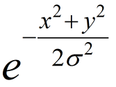

# DVS particle tracking pixel bandwidth considerations (iniLabs AppNote)

A common application of DVS sensors is for tracking moving particles.
For a DVS to respond with temporal contrast events to these particles,
the required pixel bandwidth were analyzed by David Borer in his PhD
work [1] at the Inst. of Fluid Dynamic (IFD) at ETH Zurich. This
application note repeats his analysis with a practical example. It also
supplies a Matlab script and a Google spreadsheet to allow computing
specific scenarios.

The analysis that follows assumes the particle causes a small spot of
intensity change over the DVS sensor, covering such a small number of
pixels that the intensity profile can be assumed to be Gaussian. This
assumption simplifies the analysis because the power spectrum of a
Gaussian has a simple closed form. Therefore if the particle is larger
than a few pixels the assumptions below do not hold and a modified
analysis might be required. However in practice, a large moving particle
of uniform color will generally create a leading and trailing edge and a
rectangular profile of intensity change. The overall power spectrum of
such a large particle will resemble the Gaussian assumed here in overall
shape and bandwidth. Note that a semitransparent particle, such as a
soap bubble, cell, etc, will likely not conform to this assumption.

We will assume the particles move at a speed *U* at a distance *Z* from
the sensor and that the lens has focal length *f*<sub>c</sub>.

<p align="center"></p>

We will assume a particle is imaged as a spot (usually dark, but here
assumed to be bright) with a Gaussian intensity profile that has a
standard deviation (spread, 1-sigma) of *σ* pixels.

> 

In Borer, the example is taken to correspond to a particle that with a
diameter of 1 pixel, resulting in *σ*=0.3 px. This calculation is
explained as follows. If we assume that the particle causes a perfectly
sharp disk shape with height of 1 in intensity units on the focal plane
with radius *r* px, then the Gaussian

with the same integrated volume (here total intensity integrated over
the spot) as the disk (πr<sup>2</sup>) has

> 

because the 2D [Gaussian integral](https://en.wikipedia.org/wiki/Gaussian_integral) above has a value of 2πσ<sup>2</sup>, I.e.

> 

Therefore for a 1 pixel diameter disk, r=0.5 and

> 

If the particle has an image velocity of *u* pixels per second, then the
particle movement causes a Gaussian change of intensity over time at
each DVS pixel. The following equation (1) (3.6 in Borer) provides the
intensity as a function of time and the resulting Fourier frequency
spectrum.

> (1)

Here *I*<sub>max</sub> is the maximum intensity, and *f* is the
frequency in Hertz.

The key equations are the following. The temporal bandwidth (frequency
range) of the moving particle is given by the standard deviation of the
Fourier transform, which is given by (2):


>  (2)

Here the particle has an image velocity of *u* pixels per second and a
Gaussian spread of σ pixels.

The intuition for (2) is that the particle passes the pixel in a time
σ/u. The 1/2π converts from radians to Hz.

The DVS pixel bandwidth must be several times *σ*<sub>f</sub> to avoid
reduction of contrast caused by low pass filtering of this spectrum.

The speed *u* is the speed of the particle in the image plane in
pixels/second (px/s). It is given by (3):

>  (3)

with speed *U* in the scene (perpendicular to the camera), distance to
camera *Z*, focal length *f*<sub>c</sub> and pixel pitch ∆<sub>p</sub>,

# Additional considerations

There are several assumptions in this analysis that may not hold in
practice. The first one is the assumption of a Gaussian intensity
profile, as already mentioned. Also, the pixels have a finite fill
factor of about 10% to 20%, and between these photodiode regions the
pixels contain dead area. Therefore a small particle can in principle
not be imaged at all by a pixel if it passes over the dead region
between pixels.

# Example

In the case of inilabs sensors, the pixel pitch ∆<sub>p</sub> is 40um
for DVS128, and 18.5um for DAVIS240.

We will assume the use of a DVS128 and that the particles have a
diameter of 1 pixel. The distance to the particles is Z=1m. Then
*r*=0.5px and *σ*=0.35px. If the lens has focal length of 6mm, then the
particles have a physical dimension of *D* given in (4)

>  (4)

If the particle moves at U=10m/s perpendicular to the sensor at a
distance of Z=1m from the sensor and we use a lens with
f<sub>c</sub>=6mm, then from (3) we find that *u*=1.5e3 px/s. Then from
(2), we can compute that *σ*<sub>f</sub>=579 Hz. Therefore for this
scenario, the DVS pixel must have a 3dB bandwidth of substantially more
than 600 Hz in order to not reduce the photocurrent contrast too much
for temporal contrast event generation. If the bandwidth is only 600Hz,
then already the amplitude of the response will be reduced to ½ of the
low speed value, halving the number of generated events.

Plots of the intensity function versus time and the resulting Fourier
spectrum for this example are shown next. These plots are generated by
the [available matlab
script](#matlab-script). The spectrum peaks at zero frequency
because the particle causes a net DC shift, but the relevant figure is
the bandwidth, which is given by the spread of the spectrum. From the
spectrum plot, it is clear that the pixel 3dB bandwidth needs to be
above 1.5kHz to capture most of the power.

<p align="center"></p>

*Plots of (1) in case of U=10; % speed in m/s of particle perpendicular
to sensor*

*fc=6/1000; % focal length in meters*

*Z=1; % distance to particle in meters*

*D=.007; % size (diameter) of particle in meters*

*p=40e-6; % pixel pitch meters*

<p align="center"></p>

*Gaussian intensity profile for above example*

# DVS128 bandwidth

The measured bandwidth of the DVS128 pixels is shown below [2]. The
bandwidth is roughly proportional to pixel illumination when the other
pixel biases do not limit the bandwidth (“Fast biases” were used in this
measurement.). Under high illumination, the DVS128 pixel bandwidth can
reach 3 kHz.

The conditions of this measurement used an LED with luminance of about
300nit [3] using an f/1.2 lens. This luminance is similar to an LCD
computer monitor level. Using photometry, it is possible to estimate the
equivalent scene illumination conditions corresponding to this
luminance [4]. A luminance of 300nit corresponds to a perfect
Lambertian reflector illuminated by 1klux, which corresponds to bright
indoor lighting. Any real scene will have much less reflectance. If we
assume that the objects being tracked have Kodak gray card reflectance
(18%) then the scene illumination corresponding to the 0dec curve in the
plot would be 5klux, which roughly corresponds to a moderately clouded
outdoor illumination condition at noon or about operating room indoor
lighting conditions. Note however that in the conditions of this
measurement, the same bandwidth was achieved at 10x lower luminance
conditions (-1 dec curve).

If higher bandwidth is desired, it is possible to modify the master bias
current by replacement of the controlling resistor, but this change
would also require readjustment of many other bias values. Please
inquire with inilabs regarding engineering for these scenarios. Note
that the primary requirement for high pixel bandwidth is high
illumination level.

<p align="center"></p>

*DVS128 pixel bandwidth, from Lichtsteiner et al. 2008. The plots show
the number of recorded events per cycle of sinusoidal illumination
variation; curves are labeled with decade attenuation from bare LED with
an un-attenuated luminance of about 300 nit using a 6 mm f/1.2 lens.
Data were collected from a single pixel over the duration of 10 s; then
the number of events was divided by the stimulation frequency times the
collection duration, leading to an average number of events per
stimulation cycle. The inset shows programmed bias pixel bias currents.*

# Effect of refractory period

All DVS pixels have an adjustable refractory period (**RP**). The RP is
the duration in time that the pixel ignores log intensity changes after
it has generated an event. During the RP, the pixel is shorting a switch
in the differencing amplifier which outputs the change in log intensity,
so it throws away the log intensity change during this period.

The effect of RP on detecting moving particles is that the pixel can
still image the leading edge of the particle but perhaps not the
trailing edge. In addition, high contrast particles will produce a
smaller number of events when they move faster.

# Matlab script

The matlab script
[DVSBandwidthForParticleImaging.m](https://drive.google.com/file/d/0BzvXOhBHjRheRFlWdXpSSGlTLTg/view?usp=sharing)
computes some of the quantities discussed above. Part of this script is
copied below, along with a sample output.

```matlab
% compute the pixel intensity function and fourier spectrum for a small

% particle

%

% inilabs.com

% T. Delbruck 2015, based on Borer 2014

U=10; % speed in m/s of particle perpendicular to sensor

f=.006; % focal length in meters

Z=1; % distance to particle in meters

D=.007; % size of particle in meters

p=40e-6; % pixel pitch meters

s=(D/f)*Z; % size of particle in px

u=(U*f)/(Z*p); % speed of particle in px/s on focal plane
```

Output of script above

```
Speed perpendicular to image plane U=10 m/s

Focal length of lens f=6 mm

Distance to particle Z=1 m

Particle diameter D=0.007 m

Pixel pitch p=40 um

**** computed results *****

Particle speed u=1.5e+03 px/s

Diameter of particle s=1.2 px

Pixel power spectrum width sigma_f =579 Hz
```

## Google spreadsheet

The Google spreadsheet “[DVS particle tracking
bandwidth
computations](https://docs.google.com/spreadsheets/d/1kPs8HCEYqSJeetMF_7tdY9vvbYwcQ3nfYQ2q7GlZ4do/edit?usp=sharing)”
also computes the quantities above.

---
#### Footnotes
1. D.J.Borer, [“4D Flow Visualization with Dynamic Vision Sensors,”](https://e-collection.library.ethz.ch/view/eth:47156) PhD Thesis, ETH Zurich, Zurich, Switzerland, 2014

2.  P.Lichtsteiner, C.Posch, and T.Delbrück, “[A 128 x 128 120dB 15us Latency Asynchronous Temporal Contrast Vision Sensor](https://drive.google.com/open?id=0BzvXOhBHjRheSkViSGdQSEhqWDg),”
    *IEEE J. Solid-State Circuits*, vol. 43, no. 2, pp. 566–576, 2008.

3.  nit=cd/m<sup>2</sup>

4.  T.Delbruck, [“Notes on practical photometry”](https://www.ini.uzh.ch/~tobi/wiki/doku.php?id=radiometry), 1997. 
