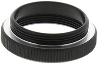

# FAQ and Troubleshooting Guide

Can't find the answer you need? We use multiple Google Groups forums for
all questions regarding inivation products:

> [[https://groups.google.com/d/forum/caer-users]{.underline}](https://groups.google.com/d/forum/caer-users)

> [[https://groups.google.com/d/forum/jaer-users]{.underline}](https://groups.google.com/d/forum/jaer-users)

> [[https://groups.google.com/d/forum/davis-users]{.underline}](https://groups.google.com/d/forum/davis-users)

> [[https://groups.google.com/d/forum/dynapse-users]{.underline}](https://groups.google.com/d/forum/dynapse-users)

If your question involves confidential information, however, please use
[[support@inivation.com]{.underline}](mailto:support@inivation.com).

> [[Troubleshooting guide]{.underline}](#troubleshooting-guide)
>
> [[FAQ]{.underline}](#faq)

## Troubleshooting guide

| **Symptoms**                      | **Possible solutions**            |
|===================================+===================================|
| jAER is running and a DVS is      | 1.  Check that there is no lens   |
| plugged in. Either there are no   |      cap.                         |
| spikes coming out, or there are   |                                   |
| some spikes but they don\'t make  | 2.  Check that the lens aperture  |
| sense.                            |      is open.                     |
|                                   |                                   |
|                                   | 3.  In jAER, load or reload a     |
|                                   |      standard set of biases for   |
|                                   |      your device.                |
|                                   |                                   |
|                                   | 4.  Check that all filters are    |
|                                   |      disabled.                   |
|                                   |                                   |
|                                   | 5.  Check that "capture events"   |
|                                   |      and "display events" are    |
|                                   |      both enabled on the         |
|                                   |      user-friendly tab of the    |
|                                   |      "Biases / HW configuration" |
|                                   |      dialogue (DAVIS only).      |
|-----------------------------------|-----------------------------------|
| I can't get the image into focus  | Have you got the CS-C adapter     |
| - it's really blurry.             | ring between the lens and the     |
|                                   | camera? The adapter ring looks    |
|                                   | like this:                        |
|                                   |                                   |
|                                   | {width="2.18 |
|                                   | 75in"                             |
|                                   | height="1.4270833333333333in"}    |
|                                   |                                   |
|                                   | This doesn't apply to eDVS. If    |
|                                   | you have the eDVS, are you aware  |
|                                   | that the lens screws in and out   |
|                                   | of the lens holder in order to    |
|                                   | focus it?                         |
+-----------------------------------+-----------------------------------+
| I can't install a linux driver    | You don't need to; just upgrade   |
| for my DVS128.                    | to jAER version 1.5 or higher.    |
+-----------------------------------+-----------------------------------+
| I can't install a linux driver    | There isn't one - use Windows     |
| for my USBAERMini2 board.         | instead.                          |
+-----------------------------------+-----------------------------------+
| I'm using jAER 1.5, but still     | Ensure that the user you're       |
| can't access my device from       | running jAER as does have access  |
| Linux.                            | to the device. This might require |
|                                   | an udev rule to be added, please  |
|                                   | refer to the                      |
|                                   | [[DAVIS240]{.underline}](https:// |
|                                   | inilabs.com/support/hardware/davi |
|                                   | s240/)                            |
|                                   | user guide and its section        |
|                                   | "Install USB driver - Linux".     |
+-----------------------------------+-----------------------------------+
| Windows can't automatically find  | Use zadig to install the correct  |
| the right driver for my DAVIS240. | driver. See the [[reflashing      |
|                                   | guide]{.underline}](http://www.in |
|                                   | ilabs.com/support/reflashing).    |
+-----------------------------------+-----------------------------------+
| Some columns of pixels are not    | This is by design: see the        |
| working on my DAVIS240B.          | [[specifications                  |
|                                   | page]{.underline}](http://www.ini |
|                                   | labs.com/products/davis/specifica |
|                                   | tions),                           |
|                                   | section "DAVIS240B array layout". |
+-----------------------------------+-----------------------------------+

FAQ
===

+-----------------------------------+-----------------------------------+
| **Question**                      | **Answer**                        |
+===================================+===================================+
| Can the DVS see infrared (IR)?    | The DVS chip can see all visible  |
| What is the range of frequencies  | light plus near-infrared (NIR)    |
| that the DVS can see?             | down to about 1.1 um. The         |
|                                   | luminosity function should be     |
|                                   | that of a standard CMOS sensor    |
|                                   | (sensitivity peaking around       |
|                                   | 700-750 nm) although we have not  |
|                                   | measured this.                    |
+-----------------------------------+-----------------------------------+
| Can I synchronise timestamps      | Yes, DVS128, DAVIS240 and DAS1    |
| between two prototypes?           | can all be synchronised to each   |
|                                   | other, see the [[synchronisation  |
|                                   | guide]{.underline}](http://www.in |
|                                   | ilabs.com/support/synch).         |
|                                   |                                   |
|                                   | eDVS and DVS128\_PAER don't have  |
|                                   | any built in synchronisation      |
|                                   | capability.                       |
+-----------------------------------+-----------------------------------+
| Why is there a frame rate (FPS)   | This is the rate at which jAER is |
| on the jAER toolbar?              | rendering frames for              |
|                                   | visualisation of the data; the    |
|                                   | DVS doesn't output frames but     |
|                                   | rather outputs events in real     |
|                                   | time, see the [[jAER user         |
|                                   | guide]{.underline}](http://www.in |
|                                   | ilabs.com/support/jaer).          |
|                                   | for more details.                 |
+-----------------------------------+-----------------------------------+
