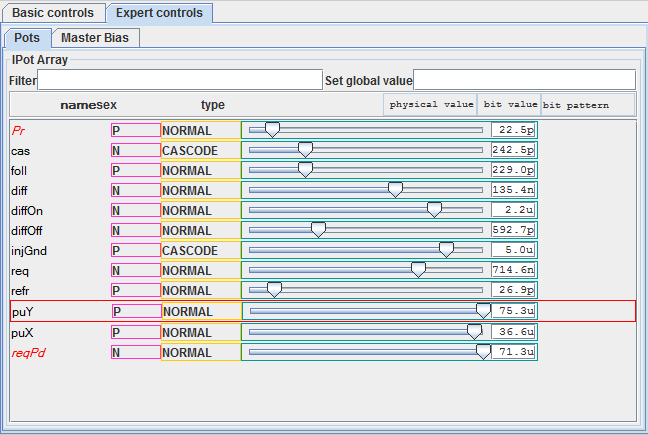
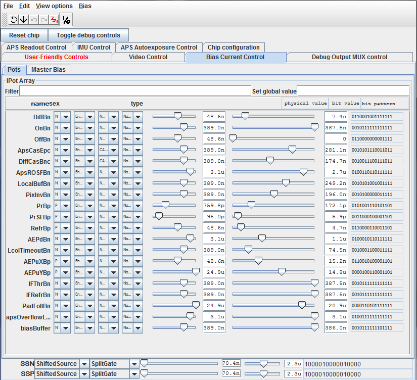
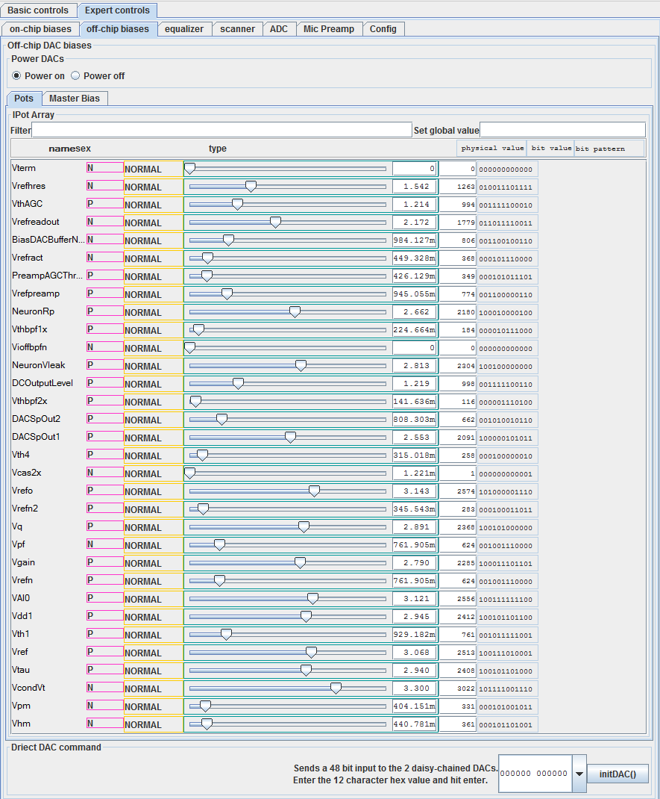
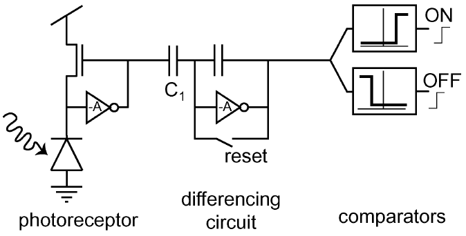
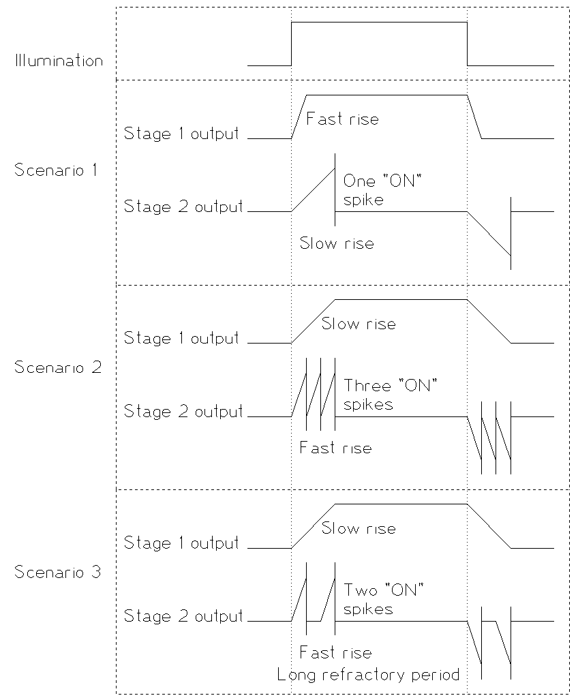
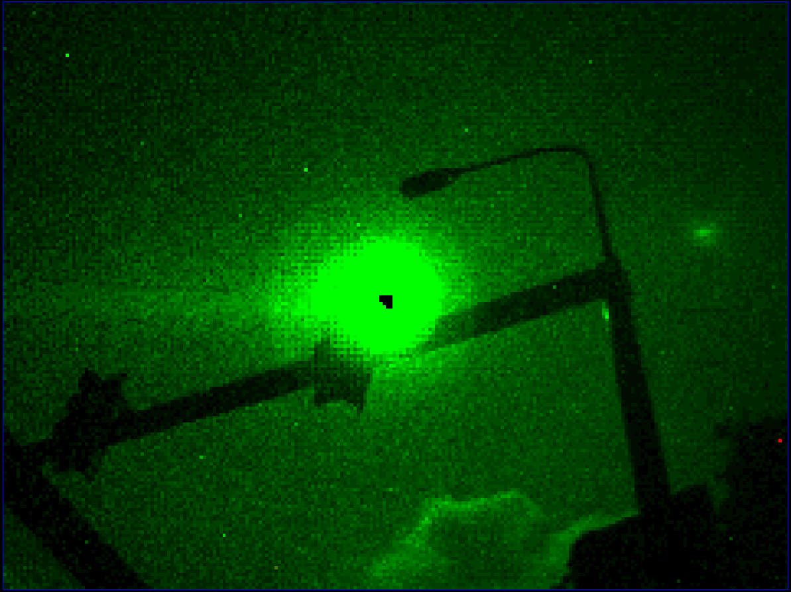
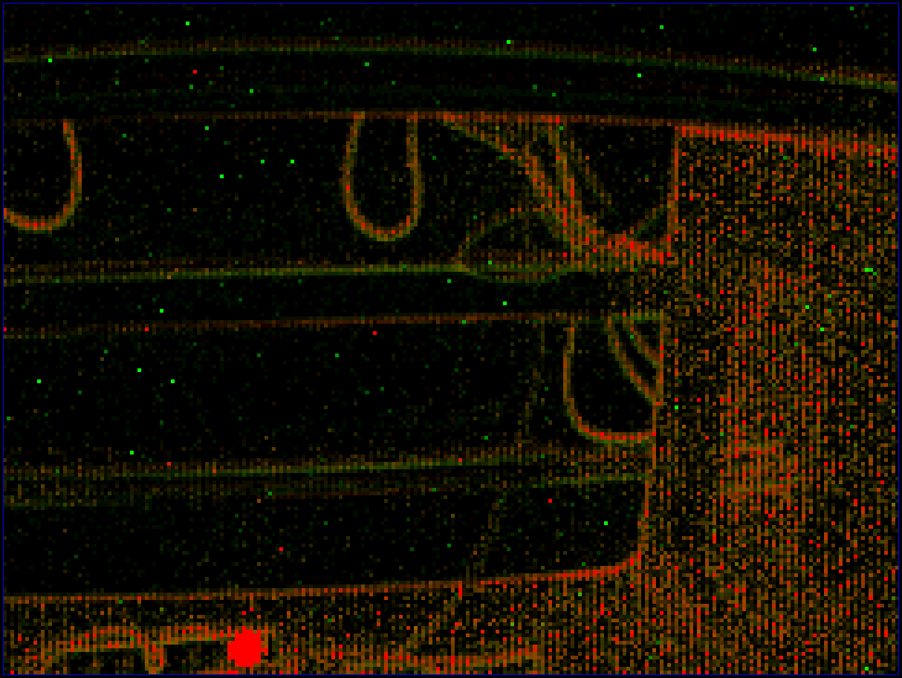

# Biasing Dynamic Sensors
> *For more information, visit [iniVation support](https://inivation.com/support/)*
---

This guide explains how to control the on-chip parameters ("biases") of
our Dynamic Vision Sensors (DVS128, eDVS, DAVIS240).

Note: The eDVS and DVS128-PAER use the same chip as the DVS128 - in this
guide, all information about the DVS128 applies equally to these other
devices.

- [What is a bias?](#what-is-a-bias)
- [How are biases generated in our sensors?](#how-are-biases-generated-in-our-sensors)
- [Understanding the biases control panel](#understanding-the-biases-control-panel)
  - [Simple biases](#simple-biases)
  - [Compound biases](#compound-biases)
  - [Voltage biases](#voltage-biases)
- [Which actual values should I use?](#which-actual-values-should-i-use)
- [Dynamic vision sensor biases](#dynamic-vision-sensor-biases)
  - [Understanding the DVS pixel](#understanding-the-dvs-pixel)
  - [Pixel bandwidth vs chip bandwidth](#pixel-bandwidth-vs-chip-bandwidth)
  - [Biases common to DVS128 and DAVIS240](#biases-common-to-dvs128-and-davis240)
    - [Pr / PrBp - Photoreceptor bias](#pr-prbp---photoreceptor-bias)
    - [foll / PrSFBp - Source follower](#foll-prsfbp---source-follower)
    - [diff / DiffBn - Differential](#diff-diffbn---differential)
    - [diffOn/Off / OnBn/OffBn - Thresholds for On and Off events](#diffonoff-onbnoffbn---thresholds-for-on-and-off-events)
    - [refr / RefrBp - Refractory period](#refr-refrbp---refractory-period)
  - [Biases only for the DVS128](#biases-only-for-the-dvs128)
      - [cas - first stage amplifier cascode](#cas---first-stage-amplifier-cascode)
      - [injGnd - Injected Ground](#injgnd---injected-ground)
  - [Biases only for the DAVIS](#biases-only-for-the-davis)
      - [Terminology](#terminology)
        - [ApsCasEpc - Separation between APS and DVS](#apscasepc---separation-between-aps-and-dvs)
        - [ApsROSFBn - APS readout](#apsrosfbn---aps-readout)
        - [apsOverflowLevel - APS overflow level](#apsoverflowlevel---aps-overflow-level)
        - [DiffCasBnc](#diffcasbnc)
  - ["Overclocking" biases](#overclocking-biases)
    - [req / PixInvBn - Passive load for digital AER circuitry](#req-pixinvbn---passive-load-for-digital-aer-circuitry)
    - [PuY/X / AEPuYBp/XBp and reqPd / AEPdBn - Common resets for requests](#puyx-aepuybpxbp-and-reqpd-aepdbn---common-resets-for-requests)
    - [LcolTimeoutBn - Timeout after row event (DAVIS only)](#lcoltimeoutbn---timeout-after-row-event-davis-only)
  - [One event or many, in response to a change in light?](#one-event-or-many-in-response-to-a-change-in-light)
  - [Sources of noise](#sources-of-noise)
    - [Electronic noise](#electronic-noise)
    - [Background events](#background-events)
    - [APS crosstalk](#aps-crosstalk)
    - [Accumulation of noise can indicate light intensity](#accumulation-of-noise-can-indicate-light-intensity)
  - [Implications for power consumption](#implications-for-power-consumption)

## What is a bias?

Analogue electronic circuits are often parameterised by currents or
voltages which are held steady during operation - these currents or
voltages are called biases.

## How are biases generated in our sensors?

Our dynamic sensors contain digitally programmable bias generators which
can produce currents that can vary over many orders of magnitude (from
uA down to fA). These currents then produce voltages which can be
distributed across a chip to bias many circuits at once, such as pixels.

For the interested reader, the bias generator circuitry is explained in
[Delbruck and Van Schaik 2004](http://www.ini.ethz.ch/~tobi/papers/delbruckBiasgenISCAS2004.pdf).
[Delbruck and Van Schaik 2005](https://www.ini.uzh.ch/~tobi/wiki/lib/exe/fetch.php?media=delbruckbiasgenaicspprintversion.pdf),
[Delbruck et al. 2006](https://www.ini.uzh.ch/~tobi/wiki/lib/exe/fetch.php?media=delbruckbiasgeniscas2006.pdf),
[Delbruck et al. 2010](https://www.ini.uzh.ch/~tobi/wiki/lib/exe/fetch.php?media=delbruckfullyconfigbiasgeniscas2010.pdf),
[Yang et al. 2012](https://www.ini.uzh.ch/~tobi/wiki/lib/exe/fetch.php?media=yangcfbiasgeniscas2012_-_final.pdf)
and [Bias generator design kits in jAER project on SourceForge](http://jaer.wiki.sourceforge.net/biasgen),

Having the bias generator on the chip allows us to eliminate the effects
of process, voltage and temperature (PVT) variation between chips. Two
different instances of one of our sensors will have very similar
behaviours if programmed with the same biases, despite significant
differences in the fabrication of devices.

The currents produced by the bias generator vary proportionally to
absolute temperature - this is a form of temperature dependence which
ideally results in constant transconductance operation across
temperature, so that the time constants do not vary with temperature.

Our sensors are digitally programmed on startup from the attached USB
microcontroller. They can be reprogrammed dynamically in milliseconds in
order to alter their behaviour.

## Understanding the biases control panel

We recommend using jAER for working with biases - this allows biases to
be changed and the effects to be observed in real time. For how to load,
save and control the biases using jAER, please refer to the [jAER user
guide](http://www.inilabs.com/support/jaer).

The *Expert controls* (DVS128) or *Bias Current Control* (DAVIS240) tab
of the *Biases / HW Configuration* tab shows how the biases are
currently set and allows you to change them.

### Simple biases

The DVS128 uses a design of bias generator with a 24 bit
value which controls each current. Here is the control tab for the
DVS128:

<p align="center">


Each row represents a bias and has the name, sex, type, slider and
value. The sex indicates whether the bias is applied to an N- or P-type
transistor; this is set for each device and cannot be changed. The type
shows whether the transistor to which the bias is applied is in a
cascode arrangement and again is fixed.

The slider allows you to vary the current. In this case, there is a
logarithmic mapping between the slider position and the value generated.
This can be seen from the *PuY* and *PuX* values above. The *PuY* slider
is fully to the right, giving the maximum value (in this case 75.3 uA);
the *PuX* slider is almost as far to the right, yet the value of the
current is already about half of the maximum. The slider only allows a
small number of the 2\^24 possible current values to be programmed;
however the numerical accuracy increases towards the low current values,
where it is more useful. For example, the ratio of *diff* to *diffOff*
is important for setting the spiking threshold (as will be explained
later); in the above panel it can be seen that it's easy to set an
approximate 200-fold difference between these values (135.4 nA vs 592.7
pA), even though these are both very small fractions of the highest
possible current value.

The values are estimated, by calculating what the master bias should be
and dividing by the proportion set by the slider. Note that the actual
current values on the chip may be slightly different from these
calculated values.

### Compound biases 

Here is the control tab for the DAVIS240:

<p align="center">


In this case, the bias currents are created by [a two-stage coarse-fine
circuit](https://www.ini.uzh.ch/~tobi/wiki/lib/exe/fetch.php?media=yangcfbiasgeniscas2012_-_final.pdf).
The first stage provides a choice of 8 currents which are
logarithmically spaced over more than 6 orders of magnitude, from 25 uA
down to 12 pA. These are called "coarse" currents - they are controlled
by the slider to the left, and the calculated value of the coarse
current is shown in the numerical column just to the right of those
sliders.

The second stage divides the coarse current by a digitally programmable
value which is set by the slider to the right. In contrast to the
sliders on the simple bias control tab of the DVS128, this slider is
encoded linearly. These are the "fine" biases. The maximum value
achievable with a fine bias is that of the coarse bias, whereas the
minimum value achievable is zero.

To the right there is the bit sequence, which is actually used to
programme the bias. The format is:

```
UCCC FFFF FFFF LCSE

U: Unused

C: Coarse value

F: Fine value

L: 1 = Normal; 0 = Low

C: 1 = Normal; 0 = Cascode

S: 1 = N-type; 0 = P-type

E: 1 = Enabled; 0 = Disabled
```

Although the choices of Cascode, Low, P-type, Enabled etc can be changed
using the drop-down controls to the left, they should not be as they
have been selected correctly for the chip design.

The *SSN* and *SSP* values at the bottom are used within the bias
generator, and need not be altered. The interested reader is referred to
[Delbruck et al.
2010](https://neuromorphs.net/nm/raw-attachment/wiki/2010/bias10/delbruckFullyConfigBiasgenISCAS2010.pdf),
where the design of the bias generator used on the DAVIS is described in
detail.

### Voltage biases

The DAS1 also makes extensive use of voltage biases, which are supplied
from an external DAC. Here is the panel which controls these:

<p align="center">
 

In this case, the slider linearly encodes a value from 0 to 5V. The DACs
are 12 bit, and since there are not 4096 pixels across the screen, the
slider can only touch an evenly sampled subset of these possible values.
The *NORMAL* parameter has no meaning, whereas the *P* or *N* values are
informational, indicating which type of transistor the resulting bias
voltage then gates.

## Which actual values should I use?

This guide will not tell you that. Rather it will help you to understand
the effects of the biases; this will help to guide and constrain your
search for the optimal biases for your applications.

## Dynamic vision sensor biases

The DVS128 and DAVIS240 share quite a lot of circuitry. In this section,
firstly the biases that are common to both devices are explained. Later
the biases that only apply to the DAVIS240 are explained.

This list shows the biases from the DVS128 and DAVIS240. The biases from
the DVS128 follow the order from the control tab, whereas those from the
DAVIS240 have been reordered as necessary to match the biases from
DVS128, despite name changes:

| Name of bias on DVS128     | Name of bias on DAVIS240     | Brief description                                                                                              |
| -------------------------- | ---------------------------- | -------------------------------------------------------------------------------------------------------------- |
| Pr                         | PrBp                         | First stage ("Photoreceptor")                                                                                  |
| cas                        | \-                           | First stage cascode                                                                                            |
| foll                       | PrSFBp                       | Source follower separating first and second stages                                                             |
| diff                       | DiffBn                       | Second stage ("Differential")                                                                                  |
| diffOn                     | OnBn                         | Threshold for On events                                                                                        |
| diffOff                    | OffBn                        | Threshold for Off events                                                                                       |
| injGnd                     | \-                           | Injected ground                                                                                                |
| req                        | PixInvBn                     | Pull down for passive load inverters in digital AER pixel circuitry                                            |
| refr                       | RefrBp                       | Refractory period                                                                                              |
| PuY                        | AEPuYBp                      | Pull up on request from Y arbiter                                                                              |
| PuX                        | AEPuXBp                      | Pull up on request from X arbiter                                                                              |
| reqPd                      | AEPdBn                       | Pull down on chip request                                                                                      |
| \-                         | ApsCasEpc                    | Cascode separating APS and DVS parts of pixel                                                                  |
| \-                         | DiffCasBnc                   | Cascodes in differential comparator                                                                            |
| \-                         | ApsROSFBn                    | Source follower for column-parallel APS readout                                                                |
|                            | LcolTimeoutBn                | Timeout after a row event                                                                                      |
| \-                         | apsOverflowLevel             | APS overflow level                                                                                             |
| \-                         | LocalBufBn                   | \*                                                                                                             |
| \-                         | IFThrBn                      | \*                                                                                                             |
| \-                         | IFRefrBn                     | \*                                                                                                             |
| \-                         | PadFollBn                    | \*                                                                                                             |
|                            |  biasBuffer                  | \*                                                                                                             |
|                            |                              | \* These biases relate to fixed or experimental features, and are not explained here (just leave them alone).  |

In the following sections, the biases are explained in detail.

### Understanding the DVS pixel

A basic understanding of the DVS pixel design is necessary to work
effectively with biases; detailed knowledge of analogue electronics is
not required. Here is an abstracted diagram of the DVS pixel (taken from
Lichtsteiner et al. 2008):

<p align="center">


This shows that there are 3 parts of the DVS pixel:

-   The first stage is the photoreceptor; there is an amplifier whose
    job it is to stabilise the voltage across the photodiode and
    create a voltage signal which is proportional to the log of the
    light intensity (the "light-related signal").

-   The second stage, the "differencing circuit", rejects the DC
    component of the light-related signal whenever it is reset, so
    that the resulting signal doesn't carry information about the
    absolute level of illumination.

-   The third "comparators" stage detects changes in the light-related
    signal and produces digital events (ON means the light got
    brighter and OFF means it got dimmer).

### Pixel bandwidth vs chip bandwidth

It's worth disambiguating these terms. The chip bandwidth is the maximum
frequency with which events can be transmitted from the chip, if lots
are produced by pixels at the same time so that they are queueing inside
the chip to be transmitted. This is about 1M Events Per Second (EPS) for
the DVS128 and about 10M EPS for the DAVIS240.

The term "pixel bandwidth" has sometimes been used in different ways in
the DVS literature. It might relate to:

-   The maximum frequency of an oscillating illumination to which the
    pixel could reliably produce a series of ON and OFF events.

-   The maximum frequency at which a pixel can produce events in
    response to fast changes in illumination.

-   The briefest transient change in illumination that could result in
    the production of an event.

### Biases common to DVS128 and DAVIS240

#### Pr / PrBp - Photoreceptor bias

This bias controls the amplifier in the first stage, and limits the
speed with which the output of the first stage can respond to changes.
An instantaneous change in illumination causes a change in the
light-related signal which takes a finite time to readjust. This finite
time is highly variable (from microseconds to milliseconds) and it
depends on two factors: the level of illumination and this *Pr* bias.
The interaction is as follows. With low illumination and a sufficiently
high *Pr* bias, the adjustment time is dictated by the light level. With
high illumination or a low *Pr* bias, the adjustment time is dictated by
the *Pr* bias. This means that you can use the *Pr* bias to ensure that
this response time is slow, but in order to guarantee a fast response
time you need both a high *Pr* bias and sufficient scene illumination.

Implications for pixel bandwidth and noise: the speed with which a pixel
can respond to changes in light (the "bandwidth") is dictated by several
factors; the *Pr* bias and the scene illumination are two of these
factors. If the pixel bandwidth is high then it will detect faster
oscillations of illumination; however it will also respond to higher
frequency electronic noise, therefore producing more noise events
(especially in low lighting conditions).

#### foll / PrSFBp - Source follower

Between the first and the second stage, not shown in the above diagram,
there is a circuit whose job is to pass the signal from the first stage
through to the second stage whilst reducing coupling from the second
stage back to the first stage (this is a "source follower", a type of
amplifier). This bias dictates the speed at which this amplifier works.
If this bias is set sufficiently high then it should have no effect on
performance. However, if this bias is low then it can limit the
bandwidth of the pixel in much the same way as the *Pr* bias can.

#### diff / DiffBn - Differential

This bias controls the amplifier in the second stage. Unlike the *Pr*
bias which has a complex interaction with illumination level, this bias
completely determines the speed at which the second stage adjusts to a
change in the light-related signal.

#### diffOn/Off / OnBn/OffBn - Thresholds for On and Off events 

The size of the change in illumination necessary to produce events is
set by varying biases for thresholds. These are independent for
increases and decreases in illumination. This is also called setting the
"contrast sensitivity" - large thresholds imply a low contrast
sensitivity and *vice versa*.

When the pixel is reset, the output of the second stage to the
comparators is a value set by the *diff* bias. (Here we talk about a
"value" for simplicity; the value is a hypothetical current - one which
the comparators try to recreate). Once the light-related signal changes,
this value changes. If there is more light, the value gets higher and if
there is less light then the value gets lower. The change in this value
is proportional to the change in illumination, multiplied by the gain of
the amplifier. In both DVS128 and DAVIS, the gain is about 20X, so a
doubling of the amount of light means a 20-fold increase in this value.

The *diffOn* bias defines the current level at which the pixel will
produce an ON event. This must always be higher than the *diff* bias,
and the ratio between the two defines the change in light level
necessary to produce an event. For example, if *diffOn* is 10 times as
big as *diff*, then a 50% increase in illumination should trigger an
event, i.e. ratio / gain = 10 / 20 = 50% relative change expressed as a
percentage.

Likewise, the *diffOff* bias defines the current level at which the
pixel will produce an OFF event. This must always be **lower** than the
*diff* bias, and the percentage change between the two defines the
change in light level necessary to produce an event.

Due to mismatch, if you bring either *diffOn* or *diffOff* too close to
*diff* then you will see some pixels malfunctioning and at some point
the sensor will fail to perform.

#### refr / RefrBp - Refractory period

When a pixel crosses a threshold it signals to peripheral circuitry in
first one dimension then the other. This takes a finite amount of time
(typically less than 1 us, although when more than one pixel fires at a
time, this time can extend due to queueing). Once the pixel receives the
acknowledge in both dimensions indicating that communication was
successful, it resets itself. This reset requires a finite amount of
time (partially dictated by the *diff* bias).

The *refr* bias defines the time period during which the pixel will be
reset, before it can again start to detect changes in the light-related
signal coming from the first stage. Note that this does not stop the
first stage from producing the light-related signal - this happens
continuously. Thus, any changes that occur during the time it takes for
a pixel to first communicate its event and then reset itself are
ignored.

We use the term "Refractory period" because of the analogy between a DVS
pixel and a nerve cell; in neurobiology this term is commonly used to
describe this phenomenon.

### Biases only for the DVS128

#### cas - first stage amplifier cascode

The first stage amplifier contains a cascode transistor whose role is to
reduce "Miller capacitance" thus improving the speed and stability of
the circuit. There should be a wide range of values over which it makes
no difference to the performance, providing that it is significantly
higher than the *Pr* bias.

#### injGnd - Injected Ground

This is used for pixel reset to avoid a potential problem (charge
pumping leading to spurious resets - the interested reader is directed
to [Lichtsteiner et al. 2008](https://neuromorphs.net/nm/raw-attachment/wiki/2012/jaer12/lichtsteiner_DVS_JSSC08.pdf)).
The higher this is, the faster a pixel will respond to the acknowledge
in order to reset itself. Reducing this bias can cause the chip to
output spikes very slowly or stop altogether; above a certain level,
this bias will make no difference to performance.

### Biases only for the DAVIS

#### Terminology

"APS" stands for "Active-Pixel Sensor". This is the term for standard
CMOS image sensors, in which a transistor in the pixel actively
transmits a value related to the light intensity read during an
exposure. "DAVIS", in fact stands for "Dynamic and Active-pixel Vision
Sensor" - in other words, it is a fusion of DVS and APS circuitry,
capable of both producing dynamic events and taking pictures using the
same photodiodes.

The APS functionality is under control from digital logic external to
the chip, including the sequence of exposing and reading out columns and
the length of exposures. The following sections only concern the
behaviour of the APS functionality that is controlled by the bias
generator.

#### ApsCasEpc - Separation between APS and DVS

This controls a cascode which separates the APS and DVS parts of the
pixel circuit, providing a stable voltage to the photoreceptor
irrespective of whether an exposure is being performed or not. There are
a wide range of values over which this should make no difference to the
performance of the sensor.

#### ApsROSFBn - APS readout

This biases the source follower that performs column-parallel APS
readout at the edge of the chip. This needs to be quite high to give
short settling times for exposures; providing it is high, the exact
value should make little difference to the performance of the sensor.

#### apsOverflowLevel - APS overflow level

This sets the lower limit on the range of analogue values that can
result from an exposure. However, it has relatively little influence on
the range and therefore on the performance of the APS. It does however,
need to be quite high to avoid choking the photoreceptor circuit in the
case of strong illumination and long exposures.

#### DiffCasBnc

This controls cascodes in the differential comparator stages of the DVS
circuit. The purpose of the cascodes is to improve the digital swing of
the signals that represent ON and OFF events (these were not present in
DVS128). This bias should be set higher than *diffOn*. There is a wide
range of values over which this bias will make no difference to
performance.

### "Overclocking" biases

The following biases adjust the speed of the digital AER circuitry; you
should not normally need to adjust these. Users who need to turn their
chip bandwidth [up to 11](https://en.wikipedia.org/wiki/Up_to_eleven) may
experiment with these (the DVS equivalent of overclocking a PC) - we
recommend seeking more advice from us in this case.

#### req / PixInvBn - Passive load for digital AER circuitry

The actual uses of this bias in the pixel design varies from DVS128 to
DAVIS, but the essential role is the same - there are some circuits in
the digital AER circuitry of the pixel (passive load inverters) that
require a bias for operation. The current dictates the speed at which
these circuits work.

#### PuY/X / AEPuYBp/XBp and reqPd / AEPdBn - Common resets for requests

Individual elements from the arbiters pull up (or down in some cases) on
shared request lines which go to the chip-level logic for sending off
chip. There is then a chip-level transistor for each of these lines
which pulls the line back down in the absence of a pull up, thus
resetting the circuit for the next cycle. These biases control the
strengths of these various pull-down transistors, and thus have some
effect on the speed at which a cycle of AER transmission completes.

#### LcolTimeoutBn - Timeout after row event (DAVIS only)

Pixels may see a change in light and signal their row address, but then
the change in light may revert before they have a chance to signal their
column address. This leads to a row event which is not followed by any
column event (The interested reader is referred to [Rapha Berner's PhD
thesis](http://e-collection.library.ethz.ch/eserv/eth:5044/eth-5044-02.pdf)
chapter 7). This bias dictates the amount of time between a row event
being sent and the X-arbiter giving up waiting for a column request from
a pixel. If this bias is too low, row-only events will take a
significant amount of time; if this bias is too high, it's possible that
column events might not be sent.

### One event or many, in response to a change in light?

If there is a large change in the amount of illumination, will a pixel
produce only one event, or will it produce many events in proportion to
the size of the change? Depending on the application, one or the other
of these behaviours may be preferable. In fact either of these
behaviours are possible, and you have some ability to choose between
these qualitatively different modes of operation.

We have seen that the speeds of the first and second stage circuits can
be modified independently from each other. Consider the example shown in
this diagram:

<p align="center">


Let's assume that there is an instantaneous increase in light which is
large enough to produce three threshold changes, given the choice of the
biases which control the thresholds. There then follows a step back
down. This is shown in "Illumination".

In the first scenario, the DVS is biased with a high *Pr* and *PrSF* and
a low *diff*. Stage 1 quickly adapts to the new illumination level.
Stage 2 takes longer. By the time it has produced its first spike, the
stage 1 output has already settled and there is no more change to
detect.

In the second scenario, the DVS is biased with a low *Pr* and *PrSF* and
a high *diff*. Stage 1 takes a long time to adapt to the new
illumination level. In this time, Stage 2 is able to fire and reset 3
times.

The third scenario is similar to the second, except that the *refr* bias
has been set lower, resulting in a longer refractory period. The stage 2
produces its first event quickly in response to the slow rise of stage
1, but then has to wait until its reset completes. In this time it
misses some of the rise of the stage 1 output, so that in the end it
only produces two spikes in response to the change.

Remember that the production of lots of events across the chip can cause
a delay which may have the same effect as the refractory period in the
third scenario. The time to spike, the delay in communication and the
refractory period all add up to the period of the pixel, from which the
pixel bandwidth is derived.

### Sources of noise

There are three different reasons why you may see noise in the event
stream:

-   Electronic noise
-   Background events
-   APS crosstalk

#### Electronic noise

The photodiode and each of the transistors all contribute some
electronic noise. In the complete absence of light there is still a
small current across the photodiode - this is called the dark current;
this current has a certain amount of intrinsic noise. As light level
increases, the noise in the photocurrent increases, but it does not do
so exponentially, with the effect that there is less noise in the
light-related signal, which represents the log of the photocurrent.
Thus, especially in low-light conditions, and in darker areas of the
scene, the pixels may produce spurious events.

From the second stage onwards there is significant amplification of the
signal from the first stage (about a factor of 20), so that any noise
introduced to the signal is ignorable compared to the contributions from
the devices in the first stage.

The power of the electronic noise is distributed across different
frequency bands; if the *Pr* or *PrSf* biases are use to limit the
bandwidth of the first stage then this reduces the amount of noise that
is transduced into spikes (i.e. high-frequency noise is ignored, because
the transients are too quick to be detected but rather are smoothed
out).

Setting a higher threshold means that only larger deviations in the
signal produce events, thus reducing sensitivity to noise at the expense
of reducing the contrast sensitivity.

If there is a lot of electronic noise you will see both ON and OFF
events coming from pixels. If there is less noise or you have set high
thresholds, you may see an occasional ON event from a pixel, quickly
followed by an OFF event, or vice versa. This is because the
light-related signal is moving around an average value and if there is
an occasional large deviation upwards it should be followed by a return
towards the average.

#### Background events

In well-lit conditions with little electronic noise, there will
nevertheless be noise events. These are all of ON type, and from each
pixel they arrive with a certain regularity. The rate may be around 1
every 10 seconds or so, depending also on the ON threshold. This is due
to a non-ideality in the second stage circuit in which the light-related
signal drifts in a given direction in the absence of actual change. The
reader seeking a detailed explanation is referred to [Lichtsteiner et
al. 2008](https://neuromorphs.net/nm/raw-attachment/wiki/2012/jaer12/lichtsteiner_DVS_JSSC08.pdf)
section III-C. The strength of this drift is also strongly dependent on
the amount of illumination - more illumination means more frequent
events. The background event rate for pixels directed towards the sun
can be 100s of Hz.

There is no way to eliminate these events, although their frequency can
be reduced by setting high thresholds. It's quite common to eliminate
both electronic noise and background events in software by applying the
BackgroundActivity filter, as described in the [jAER user
guide](http://www.inilabs.com/support/jaer).

The drift in the second stage that leads to background events also
creates a bias towards ON events. The more infrequently events are
produced on average, the more noticeable this bias is. For some
applications it may be useful to compensate for this with a higher ON
threshold. If event rates are high on average then background events do
not occur, because pixels do not have enough time to drift between
spikes related to changes in scene illumination.

#### APS crosstalk

When a global APS exposure is performed, there can be a burst of
excessive events correlated with this. These events have a typically
noisy characteristic, although some correlation to expected activity can
also be seen, i.e. pixels which were about to spike anyway may be
induced to spike by the exposure.

This is caused by an undesirable coupling between certain nodes within
the pixel. Reduction or elimination of this may be expected in future
designs. Reducing contrast sensitivity can help to reduce this problem.

#### Accumulation of noise can indicate light intensity

Even without APS frames, it's nevertheless possible to obtain some
information about intensity. We have seen that in bright lighting, noise
is dominated by regular ON events, which are more frequent from brighter
regions. The following image was created by accumulating all the ON
events over several seconds whilst observing the sun at a traffic light.
The bloom around the sun is apparent:

<p align="center">


On the other hand, in dark conditions, noise is dominated by irregular
ON and OFF events, which are more frequent from darker regions. The
following image was created by accumulating all the ON and OFF events
over several seconds whilst observing a rats nest of cables under a
desk. In this case, the cables are black against a white wall, and
produce more events. The additional events from a light to the bottom of
the image are due to the light being driven by an oscillating current:

<p align="center">


### Implications for power consumption

The power consumption of the DVS / DAVIS chip is usually dwarfed by the
power consumption of the supporting circuitry (CPLD and USB protocol
chips) - a typical power consumption for a DVS chip is order 10 mW,
whereas the whole device may consume \>\> 100 mW. However, as embedded
applications are explored, the need may arise to limit power consumption
of the sensor itself.

Where biases are used in the pixel to create currents, there is one copy
of the current for each pixel. Most of these biases do not recreate the
same current in the pixel except in specific conditions. For example,
the *diffOn* bias is typically set to quite a high value; however the
full current only flows briefly as the pixel approaches the crossing of
the ON threshold.

Some currents, however, run continuously. An example is *foll* / *PrSf*.
If this is set to the maximum value - 25 uA - then across the chip there
are 240 \* 180 = 43200 copies of a 25 uA current being consumed, i.e.
approx 1A, at 1.8V = 1.8W! In some cases it is possible to overload the
USB power supply by setting biases inappropriately, leading to the
device being rejected by the host computer.

Full characterisation of chip performance vs power consumption is work
in progress - we would welcome collaborators in this respect.