# User Guide - DAVIS240

*Our documentation is regularly being improved along with our products.
If this guide is missing the answer to any question you may have, please
don't hesitate to ask us on the appropriate [support
forum](https://groups.google.com/d/forum/davis-users/). If
your question involves confidential information, however, please use
[support@inilabs.com. First you could try our*
*[troubleshooting
guide](https://www.inilabs.com/support/faq/).*

This user guide covers DAVIS240 prototypes (DAVIS240A, DAVIS240B, and
DAVIS240C):

 

## Table of contents
- [Introduction](#introduction)
- [Getting started](#getting-started)
- [Install USB driver](#install-usb-driver)
  - [Linux](#linux)
  - [Mac Os X](#mac-os-x)
  - [Windows (win10, win8, win7)](#windows-win10-win8-win7)
- [Serial number](#serial-number)
- [Optics](#optics)
  - [Computations of Field of View](#computations-of-field-of-view)
- [DAVIS240B array layout](#davis240b-array-layout)
- [Recorded data format](#recorded-data-format)
- [Accessories](#accessories)
  - [Connectors](#connectors)
  - [DAVIS to CAVIAR adapter](#davis-to-caviar-adapter)
  - [DAVIS AER cables](#davis-aer-cables)
- [AER format](#aer-format)
- [Receiving address-events directly from the chip](#receiving-address-events-directly-from-the-chip)
- [Firmware upgrades](#firmware-upgrades)
- [Dimensions](#dimensions)
  - [Overview](#overview)
  - [Bottom board](#bottom-board)
  - [Top board](#top-board)

## Introduction

This user guide covers DAVIS240A, DAVIS240B, and DAVIS240C devices
(which contain the SBRet10, SBRet20, and SBRet21 vision sensor ICs).
These prototypes have USB2.0. The DAVIS camera is a beta prototype in
active development. To ensure the best results out of your DAVIS camera,
obtain the latest version of the jAER software and preferably use an
integrated developer environment (IDE) (e.g. netbeans) to run the latest
code base.

For specifications see the [specifications
page](https://inilabs.com/products/dynamic-vision-sensors/specifications/).

The DAVIS240 cameras are USB devices.

The camera output can be processed by jAER or cAER or libcaer; see
[inilabs software user
guides](http://inilabs.com/support/software/). The Getting
Started guide here covers use in jAER.

## Getting started

1.  Unpack your camera. You should have a DAVIS camera with C-mount
    lens, C-CS adapter ring, mini tripod and USB A - microB cable.

2.  Install jAER, following the instructions in the [jAER user guide](http://www.inilabs.com/support/jaer).

3.  Install drivers - see the [install USB driver](#install-usb-driver) section below.

4.  Run jAER, choose the correct chip class, choose the correct
    interface and load a standard set of biases, as described in the
    [jAER user guide](http://www.inilabs.com/support/jaer):

    a.  The correct chip class is
        eu.seebetter.ini.chips.davis.DAViS240(A/B/C). Choose the A, B
        or C depending on the camera version, e.g. DAVIS240C.

    b.  The correct interface is *DAVis FX xxxxxxxx.*

    c.  The correct biases are found in:
        jAER/biasgenSettings/Davis240a/bc depending on the device you
        have.

## Install USB driver

Begin by plugging in the DAVIS240 camera into your computer.

### Linux 

Access to DAVIS devices under Linux is provided by the standard kernel
USB drivers and the libusb library. The library is already part of the
libusb4java packages and requires no further installation.

You must grant your user access to the USB device. This can be achieved
by creating, as root, an udev rule file such as:

> /etc/udev/rules.d/65-inilabs.rules

You can find ready-to-use udev rules files in [our Git
repository](https://github.com/inilabs/devices-bin/tree/master/drivers/linux/udev-rules).
Here they are:

\# All DVS/DAVIS systems
```
SUBSYSTEM==\"usb\", ATTR{idVendor}==\"152a\",
ATTR{idProduct}==\"84\[0-1\]?\", MODE=\"0666\"
```

\# eDVS 4337
```
SUBSYSTEM==\"usb\", ATTR{idVendor}==\"0403\", ATTR{idProduct}==\"6014\",
MODE=\"0666\"
```

If you're using a distribution that supports SELinux tags (i.e. Fedora
since Fedora Core 2; Debian as of the etch release; Ubuntu as of 8.04
Hardy Heron; openSUSE contains SELinux \"basic enablement\" as of
version 11.1; SUSE Linux Enterprise 11 features SELinux as a
\"technology preview\"), then please use the udev rules files in the
selinux/ sub-folder. These are:

\# All DVS/DAVIS systems
```
SUBSYSTEM==\"usb\", ATTR{idVendor}==\"152a\",
ATTR{idProduct}==\"84\[0-1\]?\", TAG+=\"uaccess\"
```

\# eDVS 4337
```
SUBSYSTEM==\"usb\", ATTR{idVendor}==\"0403\", ATTR{idProduct}==\"6014\",
TAG+=\"uaccess\"
```
To reload the udev system without rebooting type, as root:

> \$ udevadm control \--reload-rules

or, for newer udev versions:

> \$ udevadm control \--reload

Sometimes, it may also help to run:

> \$ udevadm control \--trigger

Or otherwise reboot.

Now unplug and replug the DAVIS240 camera into your computer. You're
done!

### Mac Os X

Access to DAVIS devices under Mac OS X is provided by the standard
kernel USB drivers and the libusb library. The library is already part
of the libusb4java packages and requires no further installation. Users
should automatically be able to access USB devices.

### Windows (win10, win8, win7)

Installation should proceed automatically and after several seconds you
should see a message in the control panel say "Device driver installed
successfully".

If this doesn't work you will need to use the "zadig" tool to install
the correct driver. In this case, please follow the instructions for
zadig in the [reflashing guide](http://www.inilabs.com/support/reflashing).

## Serial number

For support, we may ask you to identify the device by serial number.
This image shows you where to find it:

 

It is a 12 digit number of the form: "6000840100NN". We only use the
last two digits.

## Optics

The lens mount is designed for CS mount lenses. If you have a C-mount
lens (which can be identified from a marking on the lens), you need to
use the C to CS converter adapter ring (supplied with the device) that
moves the lens further from the chip. The chip requires lens designed
for 1/3 inch imagers (imager array area is 3.33×4.44mm).

The field of view (FOV) depends on the focal length L of the lens and
the size W of the pixel array. It is computed from geometrical optics
not accounting for any lens distortion.The angular FOV (AFOV) is given
by:

AFOV=2\*atan(W/2/L)

Where *W* is the array width \[ (number of pixels minus 1 ) \* pixel
pitch \] and *L* is the focal length. The linear FOV (LFOV) at a
distance *D* from the lens is given simply by similar triangles:

LFOV=D\*W/L

The pixel array measures:

-   Width: 240 pixels x 18.5 um/pixel = 4.44 mm

-   Height: 180 pixels x 18.5 um/pixel = 3.33 mm

The following table shows the horizontal and vertical field of view in
degrees and its size at various distances for different common focal
lengths.

### Computations of Field of View

| DAVIS240                 |                                           |                                       |                                       |                                          |
|--------------------------|-------------------------------------------|---------------------------------------|---------------------------------------|------------------------------------------|
| Lens focal length (mm)   | Angular field of view horizontal (deg)    | Angular field of view vertical (deg)  | Angular field of view diagonal (deg)  | Linear field of view horizontal (cm)     |
|                          |                                           |                                       |                                       | dist. 10 cm | dist. 30 cm | dist. 100 cm |
| 3.5                      | 64.6                                      | 50.6                                  | 76.6                                  | 12.6        | 37.9        | 126.3        |
| 4.5                      | 52.3                                      | 40.4                                  | 63.1                                  | 9.8         | 29.5        | 98.3         |
| 6                        | 40.5                                      | 30.9                                  | 49.4                                  | 7.4         | 22.1        | 73.7         |
| 12                       | 20.9                                      | 15.7                                  | 25.9                                  | 3.7         | 11.1        | 36.8         |

\* Default length is 4.5mm lens

## DAVIS240B array layout

There are 20 APS test pixels to the left. The APS test pixels are
typically slightly overexposed, compared to the main array, with the
effect dependent on illumination and exposure delay. There are 50 DVS
test pixels to the right, in 4 bands, with different statistical
properties. These are turned off for normal operation, although they can
be enabled, as shown below. Some of the DVS test pixels affect the
performance of the APS readout. Thus the area of the array which is
completely homogeneous is 190 x 180 for DVS and 170 x 180 for APS and
DVS combined. The differences between these columns can be seen in this
image:

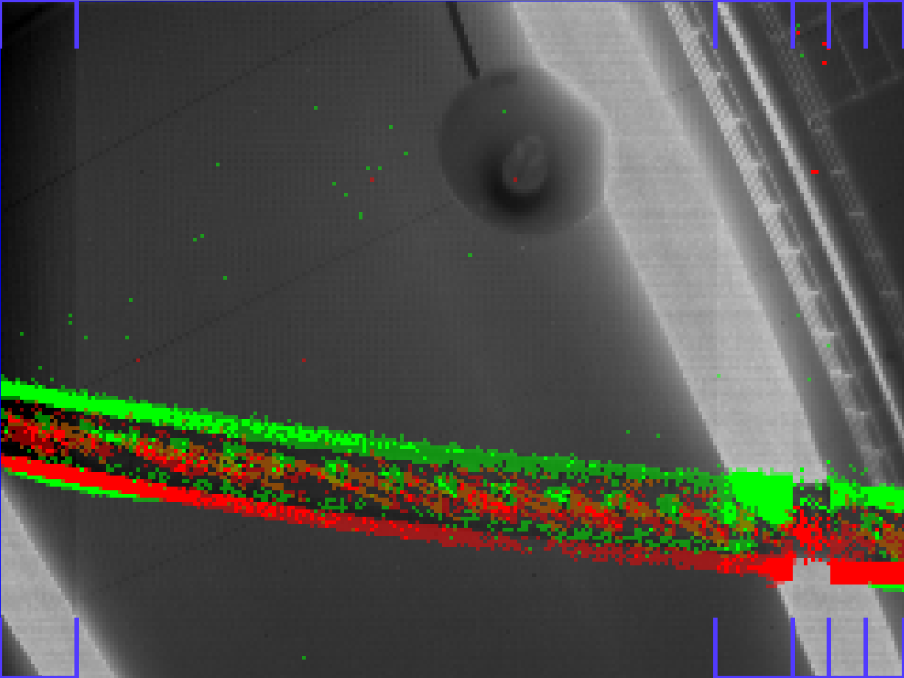 

## Recorded data format

When data is logged, a file of type ".aedat " is created. Here is a
summary of the format. A ".aedat" file contains headers, where each
header line starts with \'\#\' and ends with the hex characters 0x0D
0x0A (CRLF, windows line ending). Then there are a series of 8-byte
words, of the following format:

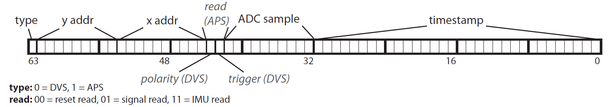 

Note: An IMU sample is a subclass of an APS type event. 7 words are sent
in series, these being 3 axes for accel, temperature, and 3 axes for
gyro - look at jAER's IMUSample class for more info.

## Accessories

### Connectors

There are these connectors to the sides of the front face of the device:

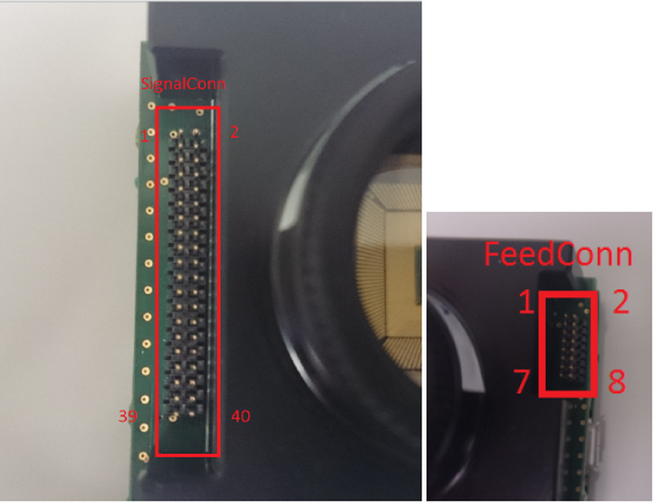 

These shows what these connectors are connected to:

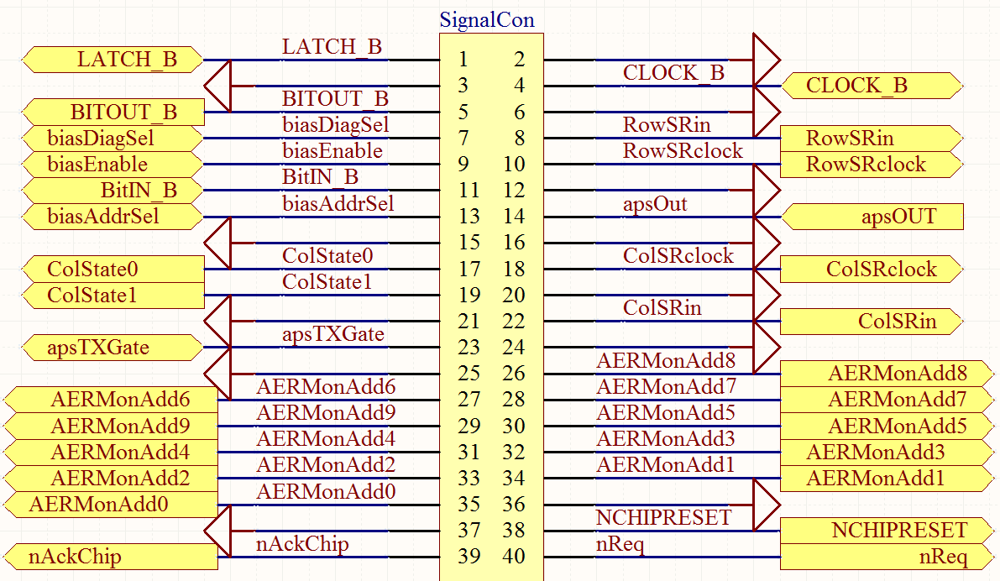 

(Note that in a previous version of this documentation, AERMonAdd6 and
AERMonAdd7 were accidentally swapped)

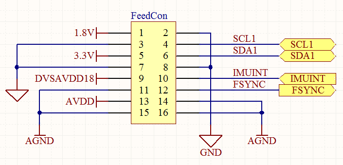 

### DAVIS to CAVIAR adapter

Optionally available is this small PCB that translates the DAVIS AER
connector to a full CAVIAR compatible connector:

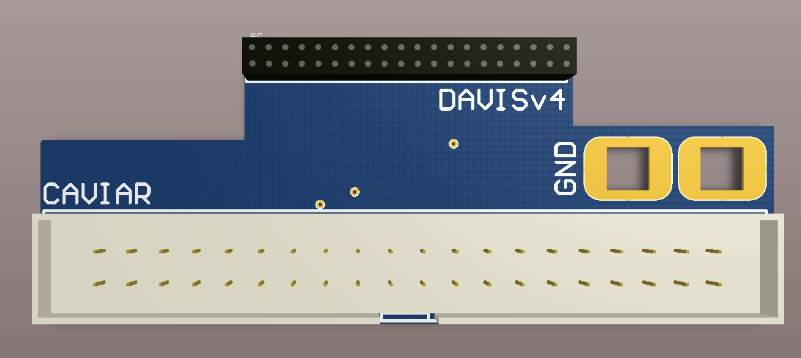 

If you prefer to design your own adapter, a perfect match for the 40
pins connector on the DAVIS is a SAMTEC FLE-120-01-G-DV

### DAVIS AER cables

The SAMTEC FFSD-20-D-X-01-N can connect the DAVIS AER connector with
another device:

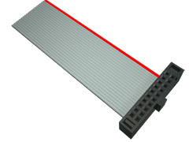 

-   The SAMTEC FFSD-20-D-X-01-N-R can connect DAVIS AER connector with
    other device with one of the connectors inverted.

-   The SAMTEC FFSD-08-D-X-01-N can connect the DAVIS I2C and POWER
    connector with other device.

In the SAMTEC product codes, X is the length of the cable in inches.

## AER format

All neuromorphic chips sold by iniLabs use the AER (Address Event
Representation) protocol to transmit events off-chip in an asynchronous
manner.

The AER protocol is a simple protocol using a variable number of lines
(bus) to transmit data, and two lines (REQ and ACK) to synchronize the
data between the sender and the receiver asynchronously using a
four-phase handshake. (This is also called a bundled asynchronous
protocol). The ACK and REQ lines are active-low.

here is explained the protocol from the receiver's perspective,
where REQ is to be considered an input and ACK an output:

1.  The receiver waits for the REQ line to be asserted by the sender
2.  At this point, the data on the bus can be considered valid and stored
3.  The receiver confirms having read the data by asserting ACK
4.  It then waits until the sender has again deasserted REQ, deasserts ACK itself and goes back to wait in (1) for the next transaction

The following website has number of very detailed explanations for
further reading:

[http://www.cl.cam.ac.uk/\~djg11/wwwhpr/fourphase/fourphase.html](http://www.cl.cam.ac.uk/~djg11/wwwhpr/fourphase/fourphase.html)

Also, for details on AER, please look at:

[https://www.ini.uzh.ch/\~amw/scx/std002.pdf](https://www.ini.uzh.ch/~amw/scx/std002.pdf)

For FPGA implementations, we recommend synchronizing at least the REQ
input using a double-flip-flop synchronizer. Data itself should also
synchronized in this way, or by connecting it directly to a register
with an Enable signal and enabling it only during phase (2).

The format of the data depends on the sensor type and size.

All current iniLabs DAVIS sensors employ a serial data
format, meaning that the X and Y addresses are not output concurrently,
but separately one after the other.

One extra data bit, called XSelect, is used to disambiguate between the
two types of address.

Current sensors employ a row-wise readout scheme, so a Y (row) address
will always be followed by a series of one or more X (column) addresses.
The column address will also contain the Polarity information bit.

NOTE: DAVIS240 A/B/C sensors may produce glitches known as "row-only
events", where a Y (row) address is followed immediately by another Y
(row) address. In this case, just discard the earlier address.

The format for DAVIS240 is documented in detail below:

```
AER bus width: 10 (9 downto 0)

XSelect is: 9

if XSelect = '1' then

    X Address, address is: 8 bits, 8 downto 1, polarity on 0

else

    Y Address, address is: 8 bits, 7 downto 0, 8 is don't care

end if;
```

## Receiving address-events directly from the chip

If you use the above connector to directly access the AER bus from the
DAVIS chip, the pins are at 3.3V. In order to handshake directly with
the device, you must first put the CPLD's Ack pin in tristate (otherwise
the CPLD will continue to try to consume events).

You do this in jAER by ticking the "Enable external AER control" tick
box on the "Chip configuration" tab of the "Hardware config / Biases"
window:

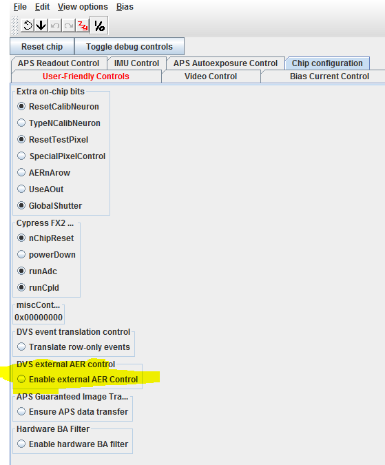 

Alternatively, you can enable AER external control using libcaer as
shown in this c++ code example
[here](https://github.com/inilabs/libcaer/blob/master/examples/davis_enable_aer.cpp).

## Firmware upgrades

If we advise you to upgrade your firmware, please read the [reflashing guide](http://www.inilabs.com/support/reflashing).

## Dimensions

### Overview

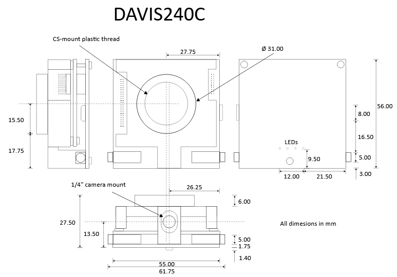 

### Bottom board

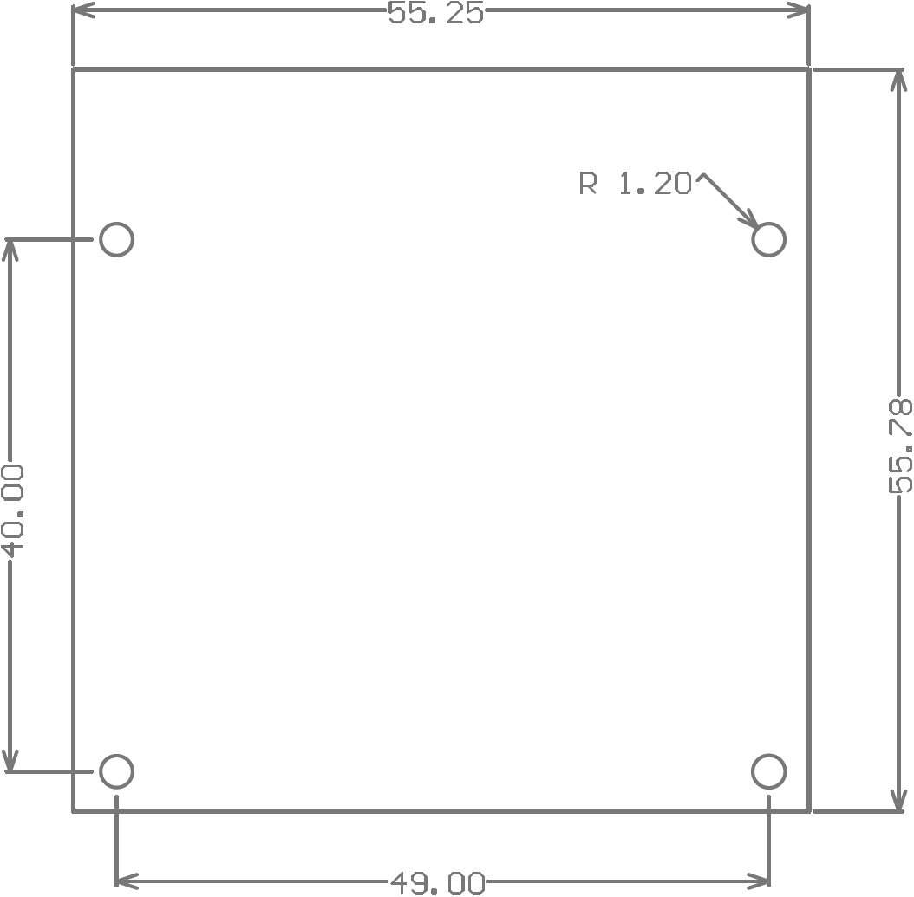 

### Top board

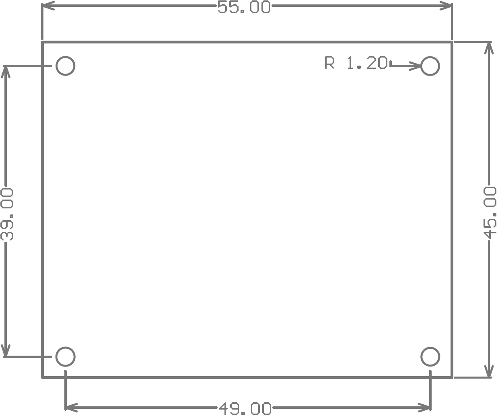 
