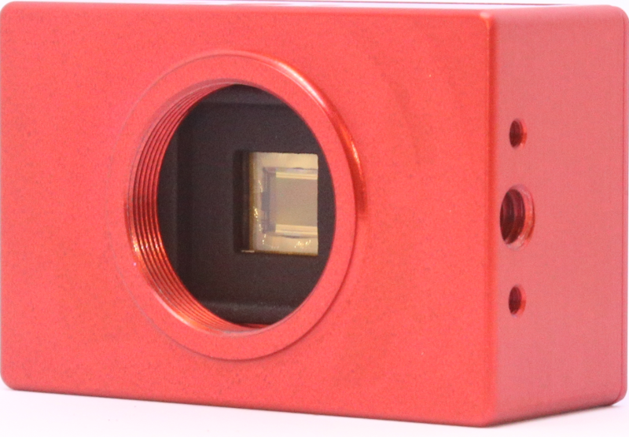
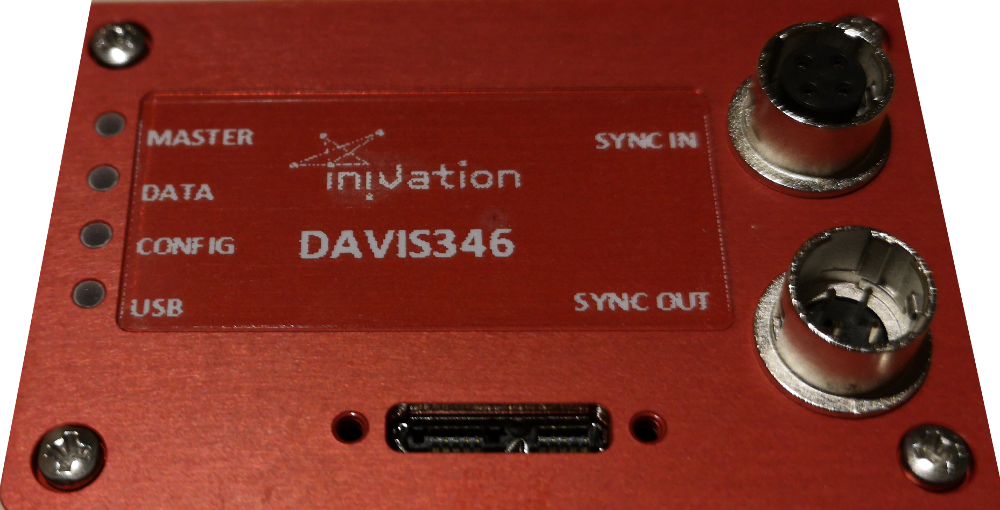
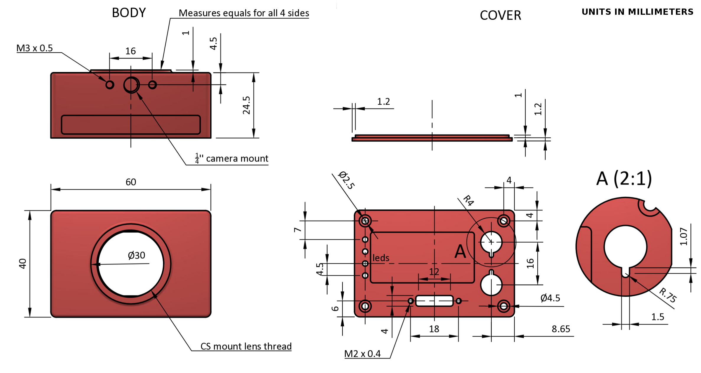

# User Guide - DAVIS346

 

## Table of contents
- [Introduction](#introduction)
- [Getting started](#getting-started)
  - [Install USB driver](#install-usb-driver)
    - [Linux](#linux)
    - [Mac Os X](#mac-os-x)
    - [Windows (win10, win8, win7)](#windows-win10-win8-win7)
- [Serial number](#serial-number)
- [Optics](#optics)
  - [Computations of Field of View](#computations-of-field-of-view)
- [Recorded data format](#recorded-data-format)
- [Accessories](#accessories)
  - [Connectors](#connectors)
- [Firmware upgrades](#firmware-upgrades)
- [Dimensions](#dimensions)
  - [Overview](#overview)

## Introduction

This user guide covers our DAVIS346 USB 3 prototype cameras.

Specifications are available [here]](https://inivation.com/support/product-specifications/).

## jAER support

This camera is compatible with [SensorsINI](https://github.com/SensorsINI)'s jAER software package.
Please select the following chip classes in jAER and load the appropriate configuration:

| Camera | Chip Class | Default Bias/HW Settings |
| ------ | ---------- | ------------------------ |
| DAVIS346 BLUE Mono | eu.seebetter.ini.chips.davis.Davis346blue | biasgenSettings/Davis346b/DAVIS346blue.xml |
| DAVIS346 RED Mono  | eu.seebetter.ini.chips.davis.Davis346red  | biasgenSettings/Davis346b/DAVIS346red.xml  |
| DAVIS346 RED Color | eu.seebetter.ini.chips.davis.Davis346redColor | biasgenSettings/Davis346b/DAVIS346red_color.xml |

## libcaer support

This camera is compatible with our libcaer software package.
The libcaer header 'libcaer/devices/davis.h' contains all configuration options.
DAVIS_CONFIG_* options apply to all DAVIS models, DAVIS346_CONFIG_* options only
to this camera.
Open the device using the 'CAER_DEVICE_DAVIS' device specifier.

## cAER support

This camera is compatible with our cAER software package.
Simply choose the 'caer_davis' module and it will automatically recognize the
camera and create its default configuration.

## Serial number

We may ask you to identify the device by serial number in support queries.
The serial number can be found on the case, usually a four digit number printed
on a label located at the top of the camera case, in the form 'COLOR 0012'.

## Optics

The lens mount is designed for CS mount lenses. If you have a C mount lens (the
lens type is usually written in fine print on the lens itself), you need to use
a C-to-CS adapter ring that moves the lens further from the chip. In case you
have received a C mount lens from us, the adapter ring will be included.
The chip requires a lens designed for 1/3 inch imagers.

The field of view (FOV) depends on the focal length L of the lens and
the size W of the pixel array. It is computed from geometrical optics, not
accounting for any lens distortion. The angular FOV (AFOV) is given by:

AFOV=2*atan(W/2/L)

Where *W* is the array width (number of pixels * pixel pitch) and *L* is the
focal length. The linear FOV (LFOV) at a distance *D* from the lens is simply
given by similar triangles:

LFOV=D*W/L

The pixel array has a resolution of 346 x 260 and measures:
-   Width: 346 pixels x 18.5 um/pixel = 6.4 mm
-   Height: 260 pixels x 18.5 um/pixel = 4.81 mm

The following table shows the horizontal and vertical field of view in degrees
and its size at various distances for different common focal lengths.

### Computations of Field of View

| Lens focal length (mm)   | Angular field of view horizontal (deg)    | Angular field of view vertical (deg)  | Angular field of view diagonal (deg)  | Linear field of view horizontal (cm)     |
| ------------------------ | ----------------------------------------- | ------------------------------------- | ------------------------------------- | ---------------------------------------- |
|                          |                                           |                                       |                                       | dist. 10 cm | dist. 30 cm | dist. 100 cm |
| 2.1                      | 113                                       | 97.7                                  | 125                                   | 30.5        | 91.4        | 305          |
| 3.5                      | 84.9                                      | 69                                    | 97.7                                  | 18.3        | 54.9        | 183          |
| 4.5                      | 70.8                                      | 56.2                                  | 83.3                                  | 14.2        | 42.7        | 142          |
| 6                        | 56.2                                      | 43.7                                  | 67.4                                  | 10.7        | 32          | 107          |
| 12                       | 29.9                                      | 22.7                                  | 36.9                                  | 5.33        | 16          | 53.3         |

## Connectors

All connectors on the DAVIS346 RED are located on the back.

A USB 3 microB connector with screws provides robust data connectivity.

Any USB 2 or 3 cables with microB connectors can be used, though we recommend
the usage of cables with appropriate screws for a more secure, robust connection.
A 1m cable with screws is included with the device.

The multi-camera synchronization connectors are HiRose HR10A-7R-4P (male, SYNC OUTPUT) and HR10A-7R-4S (female, SYNC INPUT) connectors. Cables should use the matching connectors HR10A-7P-4S (female) and HR10A-7P-4P (male).
Cables can be ordered from various suppliers, we recommend:

[Raymo Connectors](https://www.alibaba.com/product-detail/HR10A-male-and-female-4P-cable_60631952696.html)

Please note that to keep full electrical isolation between different cameras, the cable should not be shielded, or if it is, the shield should not connect one end of the cable to the other.

## Firmware upgrades

Firmware upgrades should be executed when our software advises you to.
To upgrade firmware, please read the [reflashing guide](https://inivation.com/support/software/reflashing/), which will instruct you in the usage of our Flashy tool.

## Dimensions

