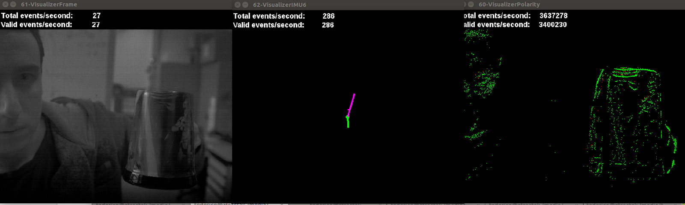

# User Guide - DAVIS USB3 development kit
> *For more information, visit [iniVation support](https://inivation.com/support/)*
---

This user guide covers the USB3 development kit, which can be used with
a range of prototype chips, including: DAVIS346BColor/Mono, and
DAVIS640Color/Mono.

## Table of contents
- [Introduction](#introduction)
- [Getting started](#getting-started)
- [Chip classes](#chip-classes)
- [Install USB driver](#install-usb-driver)
  - [Linux](#linux)
  - [Mac Os X](#mac-os-x)
  - [Windows (win7, win 8)](#windows-win7-win-8)
- [Serial number](#serial-number)
- [Connectors](#connectors)
- [Switches and jumpers](#switches-and-jumpers)
- [Synchronization and external input/output](#synchronization-and-external-inputoutput)
- [Daughterboards](#daughterboards)
- [Optics](#optics)
- [Recorded data format](#recorded-data-format)
- [Firmware upgrades](#firmware-upgrades)
- [DAVIS640 Mono example outputs](#davis640-mono-example-outputs)
- [DAVIS640 Color example outputs](#davis640-color-example-outputs)

## Introduction

This user guide covers the USB3 development kit, which can be used with
a range of prototype chips, including: DAVIS240C, DAVIS346BColor/Mono,
and DAVIS640Color/Mono.

This device is a prototype in active development. To ensure the best
results out of your prototype, obtain the latest version of the jAER
software and preferably use an integrated developer environment (IDE)
(e.g. netbeans) to run the latest code base.

The camera output can be processed by DV, jAER or libcaer; see [inivation software user
guides](https://inivation.com/support/software/). The Getting
Started guide here covers use in jAER.

## Getting started

1.  Unpack your camera. You should have a motherboard, a duaghterboard
    with chip, a lens mount and C-CS adapter ring, a mini tripod and a
    USB3 A - microB cable.
2.  **Make sure that the configuration of the device (switches; jumpers)
    is correct.** [See below](#switches-and-jumpers).
3.  Install jAER, following the instructions in the [jAER user
    guide](https://inivation.com/support/software/jaer/).
4.  Install drivers - see the [install USB
    driver](#install-usb-driver) section below.
5.  Run jAER.
6.  Choose the correct chip class ([see
    below](#chip-classes))
7.  Choose the correct interface, which is *DAVIS FX3 xxxxxxxx*
8.  Load a standard set of biases, as described in the [jAER user
    guide](https://inivation.com/support/software/jaer/); the
    correct biases are found in: jAER/biasgenSettings/ and then the
    appropriate subfolder, depending on the device you have.

## Chip classes

| Chip                  | Class                                         |
| --------------------- | --------------------------------------------- |
| DAVIS240C             | eu.seebetter.ini.chips.davis.DAVIS240C        |
| DAVIS346Mono          | eu.seebetter.ini.chips.davis.Davis346B        |
| DAVIS346Color         | eu.seebetter.ini.chips.davis.Davis346BColor* |
| DAVIS640Mono          | eu.seebetter.ini.chips.davis.Davis640         |
| DAVIS640Color         | eu.seebetter.ini.chips.davis.Davis640Color*  |
| Different chip?       |  Please ask us to fill in this information ...|

*Note that colour rendering in jAER is rather resource intensive (at
time of writing), limiting the frame rate which can effectively be
rendered. An alternative is to use the chip class for the mono version
of the chip, if you do not need to render colour.

To assist with rendering, please increase the rendering buffer size to
the maximum.

## Install USB driver

Begin by plugging in the DAVIS240 camera into your computer.

### Linux 

Access to DAVIS devices under Linux is provided by the standard kernel
USB drivers and the libusb library. The library is already part of the
libusb4java packages and requires no further installation.

You must grant your user access to the USB device. This can be achieved
by creating, as root, an udev rule file such as:

> /etc/udev/rules.d/65-inivation.rules

You can find ready-to-use udev rules files in <!--TO CHANGE--> [our Git
repository](https://gitlab.com/inivation/hardware/devices-bin/tree/master/drivers/linux/udev-rules).

If you're using a distribution that supports SELinux tags, such as
Fedora, please use the udev rules files in the selinux/ sub-folder.

To reload the udev system without rebooting type, as root:

> $ udevadm control --reload-rules

or, for newer udev versions:

> $ udevadm control --reload

Sometimes, it may also help to run:

> $ udevadm control --trigger

Or otherwise reboot.

Now unplug and replug the DAVIS240 camera into your computer. You're
done!

### Mac Os X

Access to DAVIS devices under Mac OS X is provided by the standard
kernel USB drivers and the libusb library. The library is already part
of the libusb4java packages and requires no further installation. Users
should automatically be able to access USB devices.

### Windows (win7, win 8)

Installation should proceed automatically and after several seconds you
should see a message in the control panel say "Device driver installed
successfully".

If this doesn't work you will need to use the "zadig" tool to install
the correct driver. In this case, please follow the instructions for
zadig in the [reflashing
guide](https://inivation.com/support/software/reflashing/).

## Serial number

For support, we may ask you to identify the device by serial number.
This image shows you where to find it:

 

## Connectors

The CAVIAR compatible bank can also be used for connecting to TrueNorth;
some daughterboards also offer a dedicated TrueNorth connector.

Ask us for specific instructions if you wish to use any port other than
the USB3.

Aux power: as of writing we have only tested this with a 5V supply - ask
us before you use this.

## Switches and jumpers

The 4 bank power switches as shown above must all be set to position 1
(for 3.3V signals to daughterboard). **BE SURE TO CHECK THIS, AS IT'S
EASY TO JOG THEM**.

The jumpers should all be pushed to the last left position.

- J2-J9 (power supplies from motherboard to daughterboard) must all be
connected.
- J17-J19 (supply from power regulators to motherboard) must all be
connected.
- J38 selects the power level for the synchronisation ports.
- J39 Must be jumpered from "Hold" to "+1.8VDD", unless the flash is
corrupted and you need to hold it in reset in order to reflash from the
FX3. In addition, when uploading the firmware to RAM with flashy remove
the jumper J39.

Default Jumper settings for DAVIS640

## Synchronization and external input/output

The synchronization and external I/O signals are mapped onto the
CAVIAR/AER connector. The following image shows the connector and how
the pins are mapped:

 

It is also possible to map the synchronization pins of the board to the
jack Pink (OUT) and Black (IN). Boards with serial numbers: MB-010
onwards have this option.

## Daughterboards

Which daughterboard you should have:

| Chip               | Daughterboard                                 |
| -----------------  | --------------------------------------------- |
| DAVIS240C          | V7                                            |
| DAVIS346Mono/Color | V9I2                                          |
| DAVIS640Mono/Color | V10I2                                         |
| Different chip?    | Please ask us to fill in this information ..  |

Here is a picture of the motherboard with a V10I2 daughterboard, with
DAVIS640 chip installed:

 

Note the TrueNorth port to the top right.

Note also the jumpers for power to the left and right of the chip. These
must both be connected.

## Optics

The lens mount is designed for CS mount lenses. If you have a C-mount
lens (which can be identified from a marking on the lens), you need to
use the C to CS converter adapter ring (supplied with the device) that
moves the lens further from the chip.

| Chip      | Array dimensions(mm) | Imager min size (inch)  | Suggested lens focal lengths (mm) | Angular field of view horizontal (deg) | Angular field of view vertical (deg) | Angular field of view diagonal (deg) |
| --------- | -------------------- | ----------------------- | --------------------------------- | -------------------------------------- | ------------------------------------ | ------------------------------------ | 
| DAVIS240C | 4.44x3.33            | 1/3                     | 4.5   6                       | 53   41                            | 41   31                          |  63   50                         |
| DAVIS346  | 6.4x4.81             | 1/2                     | 6   8                         | 56   44                            | 44   33                          |  67   53                         |
| DAVIS640  | 11.84x8.88           | 1                       | 12   16                       | 53   41                            | 41   31                          |  63   50                         |

## Recorded data format

Please have a look at the [AEDAT format
documentation](https://inivation.com/support/software/fileformat/).

## Firmware upgrades

If we advise you to upgrade your firmware, please read the [reflashing
guide](https://inivation.com/support/software/reflashing/).

## DAVIS640 Mono Example outputs

Examples of DAVIS640 mono camera outputs are reported below:

- With default bias settings

- jAER output using the [following biases:](https://github.com/SensorsINI/jaer/blob/master/biasgenSettings/Davis640/DAVIS640_TestExp.xml)

A recording of DAVIS640 output can be seen at the following [YouTube video](https://www.youtube.com/watch?v=_ihy0iOavfM)

## DAVIS640 Color Example outputs

An example of DAVIS640 color camera output is reported below:

Input:

Output, in presence of gradient of illumination:

 

