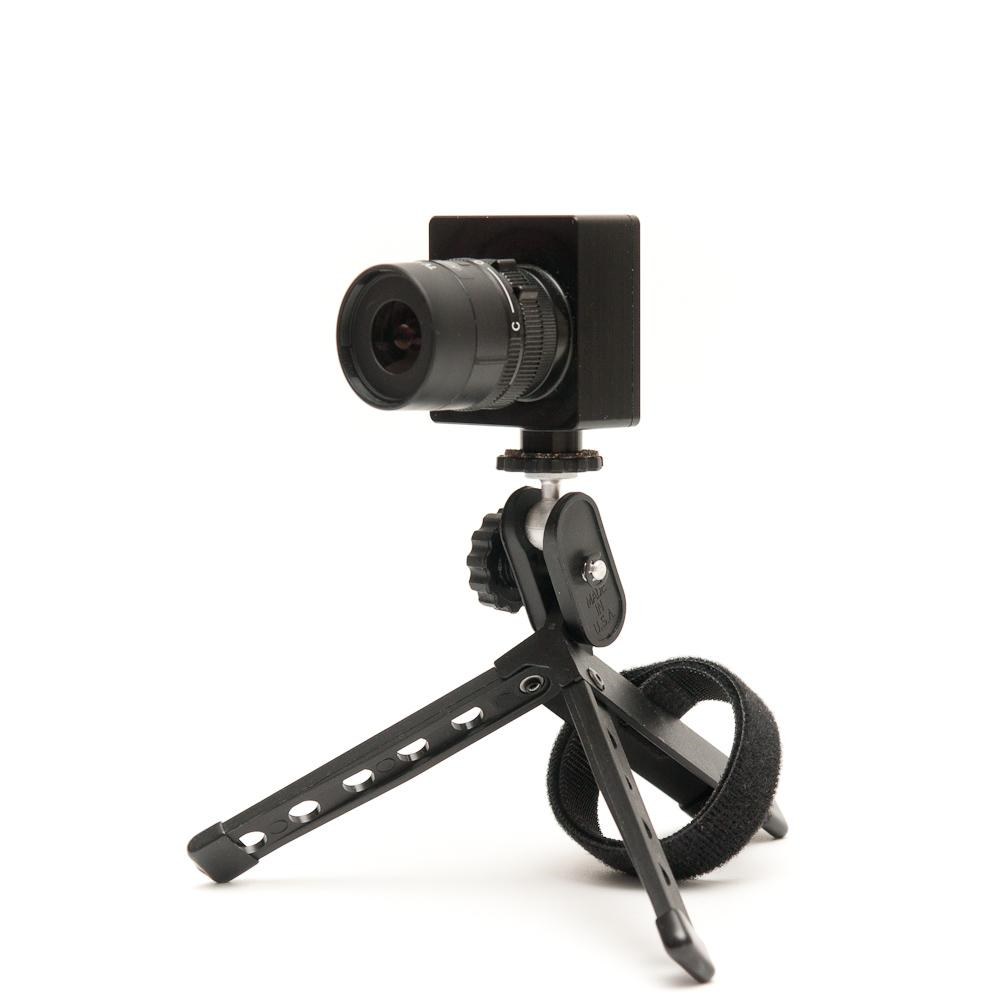
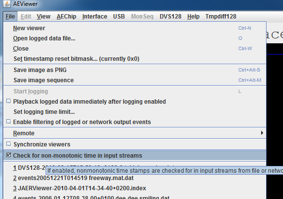

# User guide - DVS128 Dynamic Vision Sensor

*Our documentation is regularly being improved along with our products.
If this guide is missing the answer to any question you may have, please
don't hesitate to ask us on the appropriate [support
forum](https://groups.google.com/d/forum/davis-users/). If
your question involves confidential information, however, please use
[support@inilabs.com. First you could try our*
*[troubleshooting
guide](https://www.inilabs.com/support/faq/).*

This user guide covers the DVS128 camera:

- [Specifications](#specifications)
- [Getting started](#getting-started)
- [Optics](#optics)
  - [Computations of DVS128 field of view](#computations-of-dvs128-field-of-view)
- [Biasing](#biasing)
- [Stereo camera configurations](#stereo-camera-configurations)
- [Firmware updates](#firmware-updates)
- [LEDs and sync connectors](#leds-and-sync-connectors)
- [DVS128 Case Drawings](#dvs128-case-drawings)

## Specifications

Specifications for this and other DVS models can be seen here:

[http://www.inilabs.com/products/dynamic-vision-sensors/specifications](http://www.inilabs.com/products/dynamic-vision-sensors/specifications)

## Getting started 

1.  Unpack camera. You should have camera with lens, mini tripod, and a
    cs-c adapter ring.
2.  Install jAER, following the instructions in the [jAER user guide](http://www.inilabs.com/support/jaer).
3.  Plug in the DVS128 to your PC (or Mac) using a USB A-B cable.
4.  Follow the instructions here to install drivers:\
    [https://sourceforge.net/p/jaer/wiki/jAER%20USB%20Driver%20Install/](https://sourceforge.net/p/jaer/wiki/jAER%20USB%20Driver%20Install/)

## Optics

This information applies to DVS128 and DVS128\_PAER, but not to the
eDVS, which has an M12x0.5mm lens). The [lens
mount](http://www.ini.uzh.ch/~tobi/resources/) shown above
for the integrated lens mount in the DVS128 camera and the DVS128\_PAER
is designed for CS mount lenses. If you have a C-mount lens (which can
be identified from a marking on the lens), you need to use the C to CS
converter adapter ring (normally supplied with the device) that moves
the lens further from the chip. The chip requires lens designed for 1/2
inch imagers (die size is 6.0x6.3mm and active area is 5.12×5.12mm. In
any case, the field of view is larger than that of common 1/3 inch
imagers for which many lens are sold.

The field of view (FOV) depends on the focal length L of the lens and
the size W of the pixel array. The angular FOV (AFOV) is given by:

AFOV=2\*atan(W/2/L)

The linear FOV (LFOV) at a distance D from the lens is given simply by
similar triangles:

LFOV=D\*W/L

The pixel array measures 128 pixels x 40 um/pixel = 5.12 mm.

The following table shows the horizontal and vertical field of view in
degrees and its size at various distances for different common focal
lengths.

### Computations of DVS128 field of view

| DAVIS240                 |                                   |                      |                                          |   
|--------------------------|-----------------------------------|----------------------|------------------------------------------|
| Lens focal length (mm)   | AFOV horizontal or vertical (deg) | AFOV diagonal (deg)  | LFOV (cm)                                |
|                          |                                   |                      | dist. 10 cm | dist. 30 cm | dist. 100 cm |
| 2.6                      | 89.1                              | 108.6                | 19.7        | 59.1        | 196.9        |
| 3.6                      | 70.8                              | 90.3                 | 14.2        | 42.7        | 142.2        |
| 4                        | 65.2                              | 84.3                 | 12.8        | 38.4        | 128.0        |
| 4.5                      | 59.3                              | 77.6                 | 11.4        | 34.1        | 113.7        |
| 6                        | 46.2                              | 62.2                 | 8.5         | 25.6        | 85.3         |
| 8                        | 35.5                              | 48.7                 | 6.4         | 19.2        | 64.0         |
| 12                       | 24.1                              | 33.6                 | 4.3         | 12.8        | 42.7         |
| 25                       | 11.7                              | 16.5                 | 2.0         | 6.1         | 20.5         |

## Biasing

You need to load a set of biases. The [jAER user
guide](http://www.inilabs.com/support/jaer) explains how to
do this, in the section on "biasing". In order to get the best
performance out of your device for your application, in terms of speed,
noise etc, you need to adjust the biases. The [biasing
guide](http://www.inilabs.com/support/biasing) explains how
to do this.

For the DVS128, You can find the standard bias sets under:

jAER/biasgenSettings/DVS128

The default biases DVS128Slow.xml or DVS128Fast.xml are suitable for
many situations.

## Stereo camera configurations

By choosing the AEChip DVS128StereoPair as shown below, you can plug in
two DVS128 by separate USB interfaces and they will be treated as a
stereo pair. Recording, playback, control of biases, common filtering,
etc are applied to the resulting stereo stream.

The events are internally represented as objects of type BinocularEvent.

Look for usages of this class for examples.

The rendering of stereo recordings uses the convention red=Right,
green=Left. (remember "red right"). However this choice is arbitrary.
The assignment of left / right is made by lexicographic comparison of
the serial number strings. (This assignment is likely to be changed
without notice.)

Internally, the raw stereo addresses presently use bit 15 to mark the
right eye, i.e. 1=right, 0=left. However this assignment is also likely
to change without notice.

The hardware interface class for the stereo pair allows the optional
ordering of incoming events so that time increases monotonically. This
sorting has significant cost in computation and latency. See usages of
the class StereoHardwareInterface for examples of the use of the
setIgnoreTimestampNonmonotincity() flag. This option is controlled by
the File/Check for non-monotonic time in input streams option, as shown
below:

## Firmware updates

The DVS128 firmware (CypressFX2 software and CPLD configuration) can be
updated easily (although firmware updates always have some element of
risk).

**Important:**

1.  firmware updates were previously broken when running jAER using the
    standard JRE. Make sure you have updated your working copy before
    attempting firmware update!

2.  Firmware updates have only been tested with a single DVS128 plugged
    in.

You can check which firmware version you have and then optionally
update. Do this by using the USB menu (with the DVS128 plugged in):

Updating firmware always has an element of risk and if something goes
wrong you may need to return the camera for a new EEPROM. If you elect
to update, you should see a progress bar followed by success:

## LEDs and sync connectors

A close-up photo of the DVS128 sensor is shown below. On the back, the
upper LED, is a blinking "heartbeat" LED, which shows that the camera's
controller is running. The lower LED, is on as long as the DVS128 is
time-stamp master; it turns off if the DVS128 is clocked externally -
see the [synchronisation
guide](http://www.inilabs.com/support/synch).

## DVS128 Case Drawings

