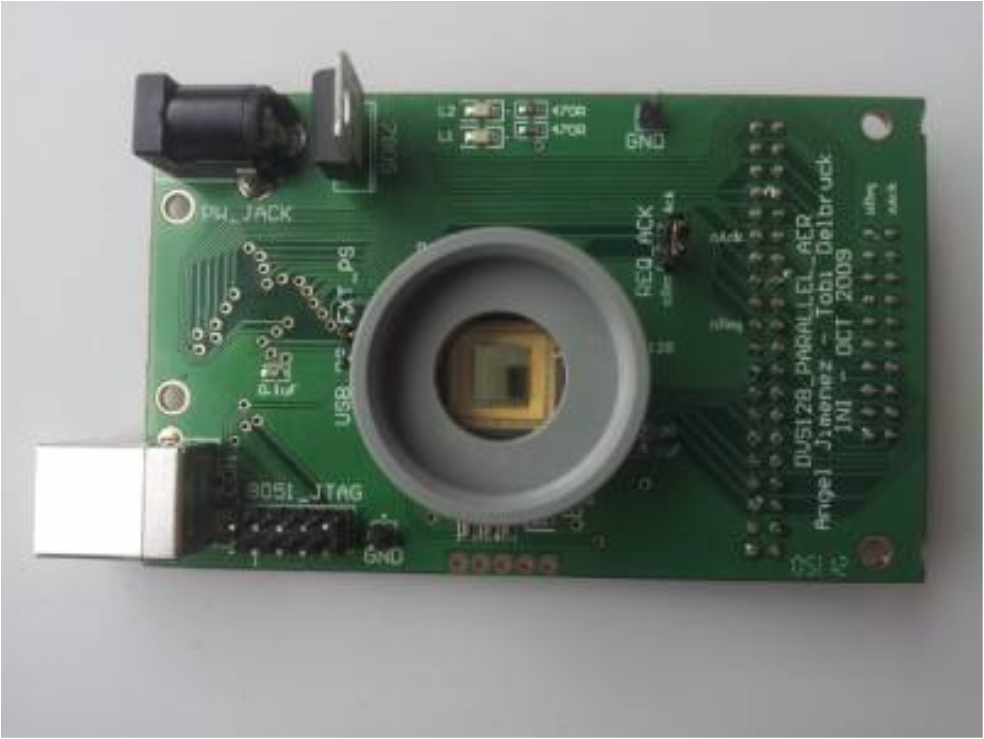
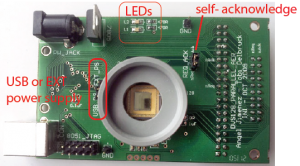
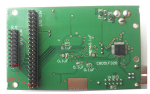
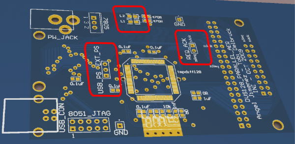

# User guide - DVS128\_PAER Dynamic Vision

This user guide covers DVS128\_PAER devices:

 

## Table of contents
- [What is the DVS128\_PAER?](#what-is-the-dvs128_paer)
- [Specifications](#specifications)
- [How to use](#how-to-use)
  - [DVS128\_PAER LEDs andJumpers](#dvs128_paer-leds-and-jumpers)
- [Additional documentation](#additional-documentation)

## What is the DVS128\_PAER?

The DVS128\_PAER is a bare-board camera that offers parallel AER
connectors for direct interfacing of the DVS sensor to other AER
systems, supporting two connector standards (Rome and CAVIAR). It has a
full-speed USB2.0 controller that allows configuration of the camera
biases and sniffing of AER data up to 100keps. However, the USB function
is only intended to monitor the camera output because the USB interface
is designed to passively monitor ("sniff") the AER bus without affecting
communication with other hardware.

The DVS128\_PAER uses a Silicon Laboratories C8051F320 microcontroller.
On the host side, the same USB driver that communicates with the DVS128
is also used to communicate with the DVS128\_PAER. However the
DVS128\_PAER USB communication bandwidth is much more limited (to a
maximum of about 100k EPS) and the main use of the jAER USB interface is
for sensor bias setting and "sniffing" the events sent on the AER bus to
another device.

## Specifications

Specifications for this and other DVS models can be seen on the
[specifications page](http://www.inilabs.com/products/dvs/specifications).

## How to use

The DVS128\_PAER board can be biased and monitored using JAER in just
the same way as with the DVS128. Information about optics is also
equivalent. Therefore, please refer to the [DVS128 user
guide](http://www.inilabs.com/support/dvs128) for optics,
the [jAER user guide](http://www.inilabs.com/support/jaer)
for software, and the [biasing
guide](http://www.inilabs.com/support/biasing) for how to
bias the device in order to get the best performance out of your device
for your application, in terms of speed, noise etc.

http://www.inilabs.com/support/dvs128

**Additional notes:**

To use the DVS128\_PAER in jAER, use the AEChip DVS128, and load the
biases biasgenSettings/DVS128/DVS128\_PAER.xml. Make sure that the
REQ/ACK jumper is shorted (see below).

### DVS128\_PAER LEDs and Jumpers

 

There are two LEDs, L1 and L2 at the top center of the PCB:

-   L2: USB activity output, indicates USB control commands, e.g. biases
-   L1: AER activity output, blinks to indicate AER activity or transmission

There are also two important jumpers:

-   USB\_PS/EXT\_PS: (left of the tmpdiff128 DVS sensor) This jumper
    powers the board from USB VBUS (5V) power or from the external
    power supply.

-   REQ/ACK: (top right of the tmpdiff128 DVS sensor) This jumper
    connects the AER request and acknowledge signals so that the DVS
    chip handshakes with itself. If this jumper is left unconnected,
    no data will appear in jAER. Disconnect the jumper if the DVS chip
    is handshaking with a receiver device.

The AER header pins are documented in
[AERHardwareAndCabling.pdf](https://svn.code.sf.net/p/jaer/code/docs/AERHardwareAndCabling.pdf).
The 20 pin header uses the so-called Rome standard, and the 40-pin IDE
header uses the CAVIAR standard.

## Additional documentation

-   [DVS128\_PAER PCB Schematics and Layout](https://svn.code.sf.net/p/jaer/code/docs/DVS128_PAER_PCB_2009.pdf)
-   [DVS128\_PAER firmware directory in jAER](https://svn.code.sf.net/p/jaer/code/devices/firmware/SiLabsC8051F320/DVS128_PAER_2009/)
-   [USB\_Main.c - the main firmware file](https://svn.code.sf.net/p/jaer/code/devices/firmware/SiLabsC8051F320/DVS128_PAER_2009/USB_Main.c)
