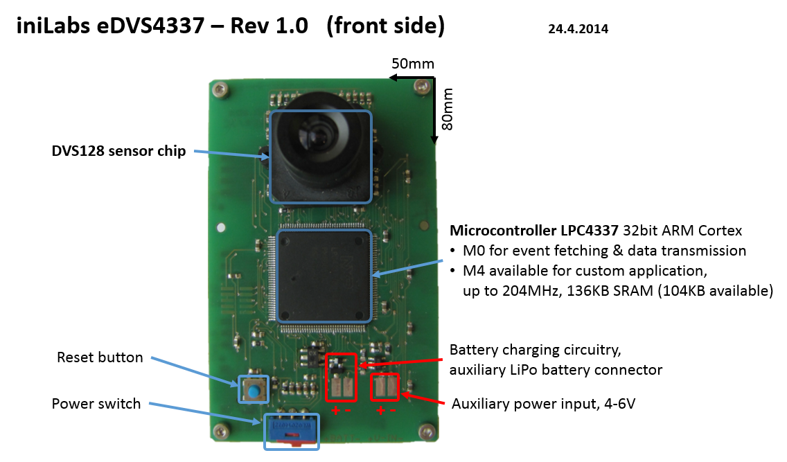
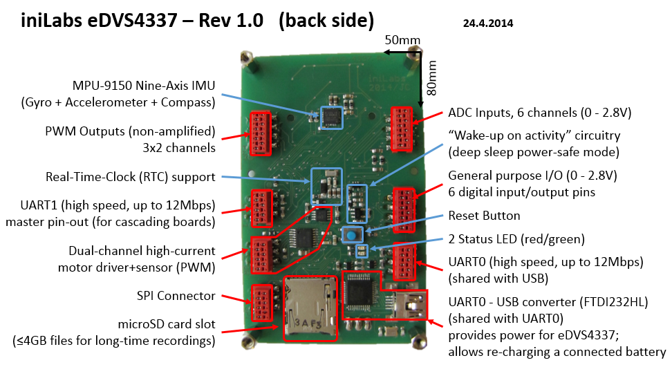
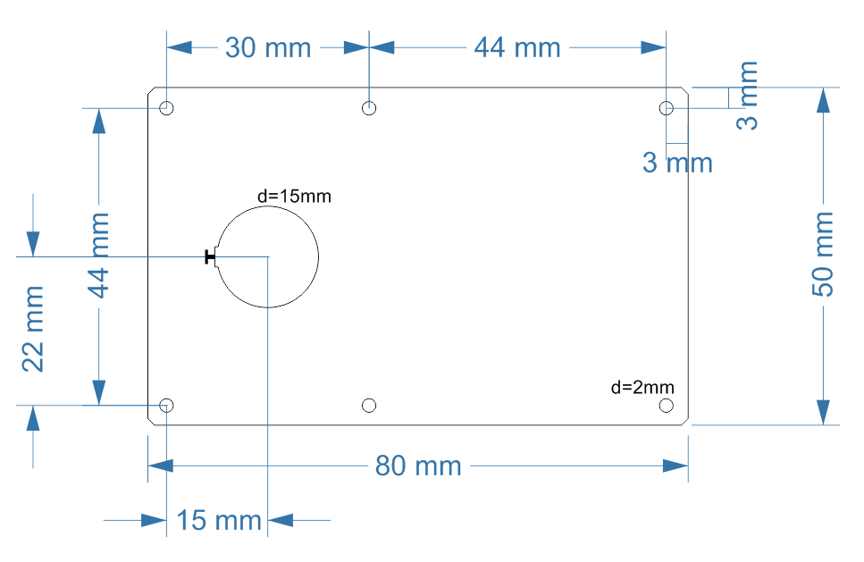
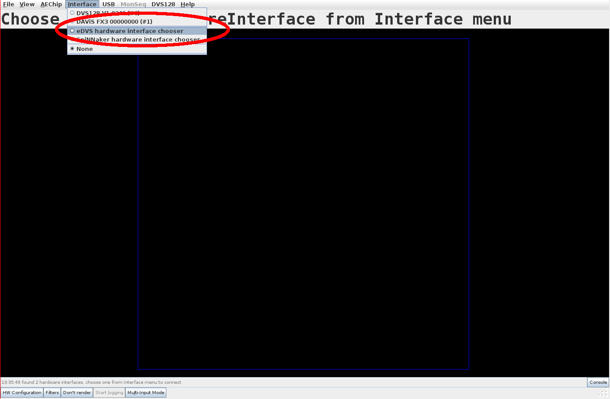
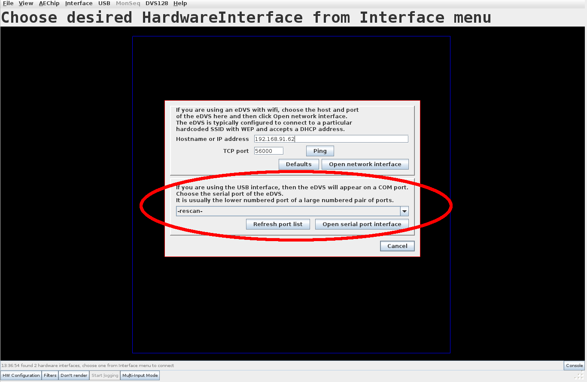
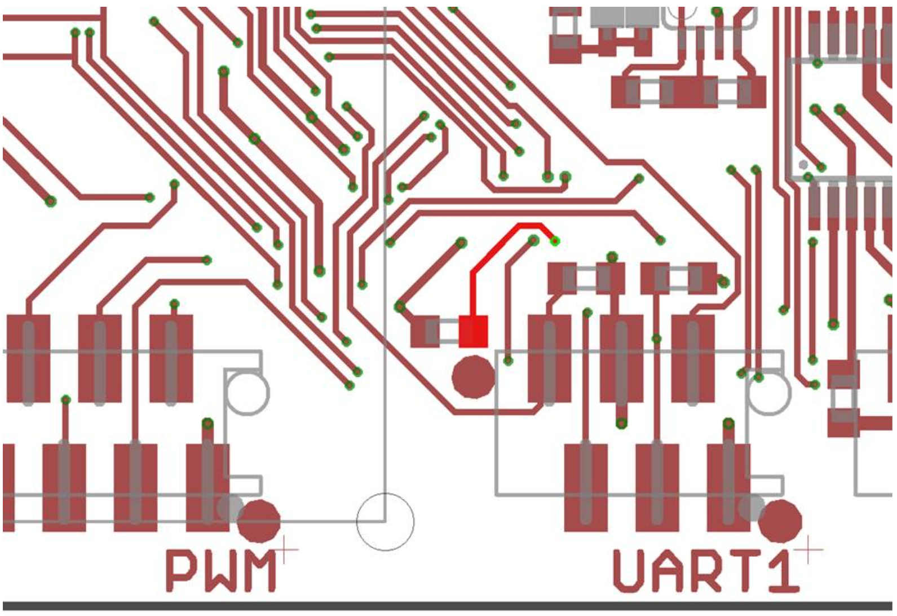
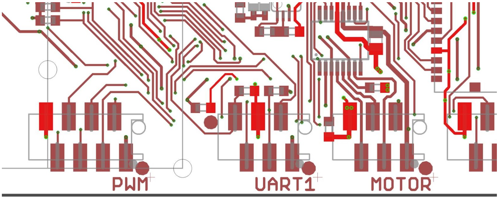
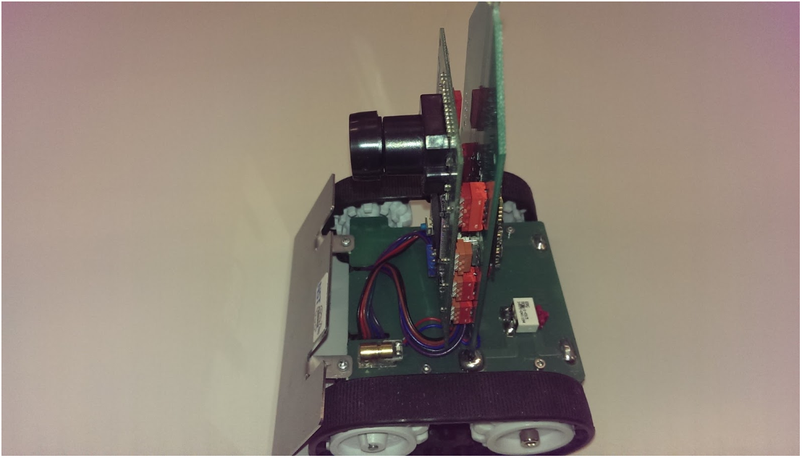
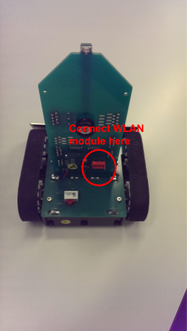
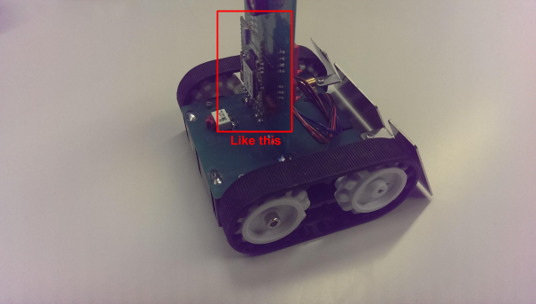

# User Guide - eDVS4337 (embedded Dynamic Vision
> *For more information, visit [iniVation support](https://inivation.com/support/)*
---

This page is about the eDVS4337, launched in 2014:

<p align="center">


If you are confused about which device you have, please see the
[support
overview](http://www.inilabs.com/support/overview). For
support for older eDVS prototypes see here:

[https://wiki.lsr.ei.tum.de/nst/programming/edvsgettingstarted](https://wiki.lsr.ei.tum.de/nst/programming/edvsgettingstarted)

- [Specification](#specification)
- [Board layout](#board-layout)
- [Getting started](#getting-started)
  - [Viewing and processing events](#viewing-and-processing-events)
  - [Biasing the DVS](#biasing-the-dvs)
- [Custom firmware development](#custom-firmware-development)
  - [Firmware reprogramming](#firmware-reprogramming)
    - [Windows & MacOS X](#windows-macos-x)
      - [Step 1 - Communication](#step-1---communication)
      - [Step 2 - Erase](#step-2---erase)
      - [Step 3 - Hex File](#step-3---hex-file)
      - [Step 4 - Options](#step-4---options)
      - [Step 5 - Start](#step-5---start)
      - [Step 6 - Waiting](#step-6---waiting)
      - [Step 7 - Executing](#step-7---executing)
    - [Linux](#linux)
    - [Recovering from faulty firmware](#recovering-from-faulty-firmware)
- [Accessing the device manually](#accessing-the-device-manually)
  - [UART Protocol (PC-\>Board)](#uart-protocol-pc-board)
  - [Enabling / Disabling Data Streaming](#enabling-disabling-data-streaming)
- [Event recording formats](#event-recording-formats)
  - [Streaming](#streaming)
  - [Recording](#recording)
- [Connectors](#connectors)
  - [GPIO](#gpio)
  - [ADC](#adc)
  - [PWM Outputs](#pwm-outputs)
  - [SPI](#spi)
  - [UART0 (Slave)](#uart0-slave)
  - [UART1 (Master)](#uart1-master)
- [Optional: WLAN module](#optional-wlan-module)
  - [Connecting the wlan module to PC via USB-\>UART](#connecting-the-wlan-module-to-pc-via-usb-uart)
  - [Configuring the WIFI network credentials on the module with putty (new ZentriOS wlan
    module)](#configuring-the-wifi-network-credentials-on-the-module-with-putty-new-zentrios-wlan-module)
  - [Configure the wlan module via tcp (the Telnet function on putty) after we get the mac address of\
    the module in the previous section](#configure-the-wlan-module-via-tcp-the-telnet-function-on-putty-after-we-get-the-mac-address-of-the-module-in-the-previous-section)
  - [Communicating with the pushbot via wifi](#communicating-with-the-pushbot-via-wifi)
- [Optional: PushBot](#optional-pushbot)

## Specification

A standalone dynamic vision sensor circuit board with microcontroller

Specifications are compared to those of other DVS models here:

http://www.inilabs.com/products/dynamic-vision-sensors/specifications

Application examples:
-   Autonomous mobile robotics.
-   Surveillance, data recording.
-   High-speed stand-alone tracking.

Microcontroller NXP LPC4337
-   32-bit dual ARM core.
-   204 MHz max operation frequency.
-   Hardware FPU.
-   136 KB on board SRAM.
-   1MB program / data flash.

I/O - connectivity
-   1 USB 2.0 FTDI virtual serial port, up to 12 Mbps (shared with UART0).
-   2 UART connectors, up to 12 Mbps, hardware handshaking (one shared with FTDI/USB).
-   1 SPI/SSI/Microwire interface (up to 25Mbit full duplex; 50Mbit transmit only).
-   6 PWM digital output lines (0-2.8V).
-   4 PWM controlled power signals (for up to 2 independent bi-directional DC motors).
-   6 analog input lines (0-2.8V).
-   6 digital general purpose I/O lines (0-2.8V).
-   1 micro SD Card slot for data logging (32bit FAT file system).

Power
-   Option 1: USB power or any 5V source as input.
-   Option 2: Single Cell LiPo battery (re-charging through USB/5V).

Physical Specs
-   Size: approx. 80x50mm (smaller than a credit card).
-   Lens: S-mount (M12x0.5).
-   Field of view: default \~55deg (hor./ver.); optional lenses 20 - 120deg.

Special Features
-   Wake-up on visual activity, adjustable threshold.
-   Hardware real-time clock.
-   Optional external WLAN module (TCP/UDP socket connection).

Open source customizable microcontroller software, free GNU C compiler
(NXP IDE).

PC demo software (jAER) to demonstrate event-based vision data and
processing algorithms.

## Board layout

**Front:**

<p align="center">


**Back:**

<p align="center">


**Board Dimensions:**

<p align="center">


## Getting started

### Viewing and processing events

The officially supported software to view and process events coming from
the eDVS is jAER. For instructions on installation and usage, see the
[jAER user guide](http://www.inilabs.com/support/jaer).

Once installed, connect the eDVS via USB to your computer. The drivers
for USB serial port emulation are already part of all modern operating
systems, so no special installation is required at this point. The
recently connected devices should show up on your system as a serial
communication device, for example as a COM:\<x\> port on Windows or
/dev/ttyUSB\<x\> on Linux. If your OS does not find drivers, download
FTDI's latest [VCP drivers for FT232HL](http://www.ftdichip.com/Drivers/VCP.htm)

Note for Linux users: you may need to ensure you have the correct
permissions for accessing /dev/ttyUSBn (where n = 0,1,2, etc). For
example, running the following command as root:

> \# chmod 666 /dev/ttyUSB0

Will give you access to device ttyUSB0.

Start jAER and ensure that, in the *AEChip* menu, the
*ch.unizh.ini.jaer.chip.retina.DVS128 chip* class is selected. If it
isn't, just search for it in the menu and select it.

<p align="center">


Click on the *Interface* menu (circled in red above) and select the item
named *eDVS hardware interface chooser*. In the second half of the
configuration screen, select your serial device (*COMx* on Windows) and
then press *Open serial port interface*. If your device isn't showing up
in jAER, try selecting *rescan* from the drop-down menu or click on
*Refresh port list*.

For devices with serial numbers 613xx, use a Baud rate of 4 Mbps; for
devices with serial number 126xx, use a Baud rate of 12 Mbps.

<p align="center">


You should now be seeing DVS events on your screen.

### Biasing the DVS

You need to load a set of biases. The [jAER user
guide](http://www.inilabs.com/support/jaer) explains how to
do this, in the section on "biasing". In order to get the best
performance out of your device for your application, in terms of speed,
noise etc, you need to adjust the biases. The [biasing
guide](http://www.inilabs.com/support/biasing) explains how
to do this.

For the eDVS, you should use the standard bias sets for the DVS128. You
can find these under:

> jAER/biasgenSettings/DVS128

The default biases DVS128Slow.xml or DVS128Fast.xml are suitable for
many situations.

Here is the default set of bias with associated names (which is loaded
on power-up):\

```python
bias[ 0] = 1067;       // 0x00042B // Tmpdiff128.IPot.cas
bias[ 1] = 12316;      // 0x00301C // Tmpdiff128.IPot.injGnd
bias[ 2] = 16777215;   // 0xFFFFFF // Tmpdiff128.IPot.reqPd
bias[ 3] = 5579732;    // 0x5523D4 // Tmpdiff128.IPot.puX
bias[ 4] = 151;        // 0x000097 // Tmpdiff128.IPot.diffOff
bias[ 5] = 427594;     // 0x06864A // Tmpdiff128.IPot.req
bias[ 6] = 0;          // 0x000000 // Tmpdiff128.IPot.refr
bias[ 7] = 16777215;   // 0xFFFFFF // Tmpdiff128.IPot.puY
bias[ 8] = 296253;     // 0x04853D // Tmpdiff128.IPot.diffOn
bias[ 9] = 3624;       // 0x000E28 // Tmpdiff128.IPot.diff
bias[10] = 39;         // 0x000027 // Tmpdiff128.IPot.foll
bias[11] = 4;          // 0x000004 // Tmpdiff128.IPot.Pr
```

## Custom firmware development

To take advantage of the more advanced features offered by the eDVS4337
boards, you might need to tailor the standard firmware to your own
application's needs. The latest version of the firmware can be checked
out with Git from:

https://github.com/inilabs/devices-bin/tree/master/firmware/eDVS4337

Please follow the instructions within that directories README.txt file
to install the LPCXpresso development environment.

## Firmware reprogramming

The post build steps of the LPCXpresso build script generate an Intel
HEX file for reprogramming through the UART0 port or the USB plug.

You can find already compiled HEX files at

https://github.com/inilabs/devices-bin/tree/master/firmware/eDVS4337/Releases

The latest hex files are EDVSBoardOS-4mbps.hex; EDVSBoardOS-6mbps.hex
and EDVSBoardOS-12mbps.hex. Choose the hex file denoted with the baud
rate you want. If the higher baud rates (6 mbps and 12 mbps) don't work,
you can move down to the 4 mbps file.

To enter reprogramming mode, use the programming command from a serial
console (see section "[Accessing the device
manually](#accessing-the-device-manually)", below):

> P\\n

Ensure you do not hit any other keys or send further characters after
entering reprogramming mode. Just close the terminal window.

### Windows & MacOS X

For Windows and Mac OS X, the supported tool is FlashMagic, available at
http://www.flashmagictool.com/.
The current version (9.51) runs on Windows XP/Vista/7/8 and version 8.50
on MacOS X 10.6+. The following instruction were written for FlashMagic
7.85, but still apply to newer version as well.

#### Step 1 - Communication

Device: *LPC4337*\
Flash Bank: *A*\
Com Port: Serial port of the FTDI chip, depends on system.\
Baud Rate: *115200* (try lower baud rates if connection fails; e.g.
*19200*)\
Interface: *None (ISP)*\
Oscillator (MHz): *12*

#### Step 2 - Erase 

*'Erase all Flash'* should be ticked

#### Step 3 - Hex File 

Select the Hex file provided or the one you generated. If you build the
project with LPCExpresso, take the HEX file in the M4/Release (or
M4/Debug) folder. The files in M4 contain the M0 code as well.

#### Step 4 - Options 

'*Verify after programming'* and '*Activate Flash Bank*' must be ticked.

#### Step 5 - Start 

Click the *'Start'* button

#### Step 6 - Waiting 

Please stand by while new firmware is sent through the Serial Port to
your board.

#### Step 7 - Executing

After the programming and verification has ended, restart the device by
simply re-plugging the USB cable. Note: at the end of the process you
might see a message "Operation Failed. (activating flash bank)", this is
normal, and the programming has taken effect.

If you get the error message 'Operation Failed. Failed to autobaud -
step 1' this is likely because you haven't entered programming mode as
shown above.

### Linux

Flash magic is not available for Linux; an open-source alternative is:
[http://www.windscooting.com/softy/mxli.html\#Latest](http://www.windscooting.com/softy/mxli.html#Latest)\
Further instructions on request (the process is similar to the above).

### Recovering from faulty firmware

It is possible to create faulty firmware that isn't able to correctly
boot on the microprocessor of the eDVS. If this firmware gets flashed to
the device, it won't be able to start correctly and you won't be able to
simply reprogram it as detailed above, since the whole infrastructure to
enter programming mode via USB isn't available then.

To correct this, it's possible to manually force the microprocessor to
enter programming mode directly, by shorting a specific pin to GND
(ground). This pin is P2\_7, more information can be found in Section
6.2 \"Pin description\" of the [LPC4337
datasheet](http://cache.nxp.com/documents/data_sheet/LPC435X_3X_2X_1X.pdf?fpsp=1&WT_TYPE=Data%20Sheets&WT_VENDOR=FREESCALE&WT_FILE_FORMAT=pdf&WT_ASSET=Documentation&fileExt=.pdf).

On the PCB, this pin is pulled up to VCC through a pull-up resistor by
default, as can be seen here:

<p align="center">


The track highlighted in red on the under-side of the board is the pin
in question, and to pull it down you can simply short it momentarily
with GND. The following schematic extract shows also all the nearby GND
pads:

<p align="center">


While the pin is shorted to GND, press the RESET button (blue button on
both sides of the board) and release it. If done correctly, the LED
should stop blinking. The controller will then start directly in
programming mode, so you can then use FlashMagic and the usual procedure
to upload new, good firmware.

## Accessing the device manually

It is possible to manually access the eDVS and send commands to it
directly. This can be done by using any serial console emulation program
and connecting it to the device (such as "hyperterm" or "putty" on
Windows OS or "minicom" in Linux).

Here is an example using the popular Putty program on Windows, which can
be downloaded
[here](http://www.chiark.greenend.org.uk/~sgtatham/putty/download.html).

Once you've downloaded Putty, just run its executable. In the *Session*
settings (top left), change the *Connection type* to *Serial* and then
write the correct COM port (in our case *COM3*) into the *Serial line*
textbox, and set the *Speed* to *4000000* for devices with serial number
613xx or to 12000000 for devices with serial numbers 126xx. Then switch
to the *Serial settings* (bottom left) and verify that they match what
you just entered. Further, change *Flow control* to *RTS/CTS* (i.e.
enable hardware handshaking) and ensure *Data bits* is *8*, *Stop bits*
is *1* and *Parity* is *None* (often referred to as *8N1*). Then switch
to the *Terminal settings* (third from the top left), and tick *Implicit
CR* in every *LF*, as well as set to *Force off* both *Local echo* and
*Local line editing*.

After pressing the Open button, you'll be able to send commands to the
device. The list of commands is available in the next section.

### UART Protocol (PC-\>Board) 

Supported Commands (all commands need to be terminated by '\\n'; i.e.
\<return\>):

```
E+/-                  - enable/disable event sending
!ER+/-                - enable/disable event recording (SD card)
!Ex                   - specify event data format, ??E to show options see below for more details)
!ETx                  - set current timestamp to x (default: 0)
!ETM+                 - synch timestamp, master mode, output active
!ETM0                 - synch timestamp, master mode, output stopped
!ETS                  - synch timestamp, slave mode
!ETI                  - single retina, no external synch mode
!B[0-11]=x            - set bias register to value
!BF                   - send bias settings to DVS (flush)
!BDx                  - select and flush predefined bias set x
?Bx                   - get bias register x current value
!L[0,1,2]             - LED off/on/blinking
!U=x                  - set baud rate to x
!U[0,1,2]             - UART echo mode (none, cmd-reply, all)
!S+b,p                - enable sensors streaming, ??S to show options
!S-[b]                - disable sensors streaming, ??S to show options further explanation below)
?Sb                   - get sensor readouts according to bitmap b
??S                   - bitmap b options
R                     - reset board
P                     - enter reprogramming mode
!M+/-                 - enable/disable motor driver
?MC[0,1]              - get motor PID controller gains
!MC[0,1]=p,i,d        - set motor PID controller gains
!MP[0,1]=x            - set motor PWM period in microseconds
!M[0,1]=[%]x          - set motor duty width in microseconds [% 0..100]
!MV[0,1]=[0-100]      - set motor velocity (internal P-controller for PushBot)
!MD[0,1]=[%]          - set motor duty width, slow decay [% 0..100]
!MVD[0,1]=x           - set motor duty velocity, slow decay
!P[A,B,C]=x           - set timer base period in microseconds
!P[A,B,C][0,1]=[%]x   - set timer channel width in microseconds [% 0..100]
!T+/-                 - enable/disable Real Time Clock (RTC)
!Tyyyy-mm-dd hh:mm:ss - set RTC time
?T                    - get RTC time
??                    - display help menu
```

### Enabling / Disabling Data Streaming

Use the !S command to enable or disable data streaming. Format:

> !Snb,p

where n = '-' disables streaming and n = '+' enables streaming; p is the
period (in milliseconds) and b is a bitmask (see below). Example:

> !S+10,8

will stream the ADC channel 0 and channel 2 (10=0b1010) readings at
125Hz (8ms).

upcoming (example) reply:

```
-S1 1000\\n\
-S3 0250\\n
```

List of available sensory data:

  | Bit  | Decimal    | Name             | \#  | Description                                        |    Format                                      |
  |------|------------|------------------|-----|----------------------------------------------------|------------------------------------------------|
  | 0    | 1          | BATTERY          | 1   | battery voltage (in mVolt)                         | up to 4 digits (0..9999)                       |
  | 1    | 2          | ADC CHANNEL 0    | 1   | raw ADC reading from pin 2                         | up to 4 digits (0..1023)                       |
  | 2    | 4          | ADC CHANNEL 1    | 1   | raw ADC reading from pin 3                         | up to 4 digits (0..1023)                       |
  | 3    | 8          | ADC CHANNEL 2    | 1   | raw ADC reading from pin 4                         | up to 4 digits (0..1023)                       |
  | 4    | 16         | ADC CHANNEL 3    | 1   | raw ADC reading from pin 5                         | up to 4 digits (0..1023)                       |
  | 5    | 32         | ADC CHANNEL 4    | 1   | raw ADC reading from pin 6                         | up to 4 digits (0..1023)                       |
  | 6    | 64         | ADC CHANNEL 5    | 1   | raw ADC reading from pin 7                         | up to 4 digits (0..1023)                       |
  | 7    | 128        | RAW GYRO         | 3   | raw gyroscope data (3 axes) (+/- 2000º/s)          | +/- up to 5 digits (+/-32767)                  |
  | 8    | 256        | RAW ACC          | 3   | raw accelerometer data (3 axes) (+/- 2g)           | +/- up to 5 digits (+/-32767)                  |
  | 9    | 512        | RAW COMP         | 3   | raw magnetic values (3 axes) (+/- 1229 uT)         | +/- up to 4 digits (+/-4095)                   |
  | 10   | 1024       | CAL GYRO         | 3   | calibrated gyroscope data in dps                   | up to 8 hexadecimal digits (Q16)               |
  | 11   | 2048       | CAL ACC          | 3   | calibrated accelerometer data in g\'s              | up to 8 hexadecimal digits (Q16)               |
  | 12   | 4096       | CAL COMP         | 3   | calibrated magnetic values in microtesla           | up to 8 hexadecimal digits (Q16)               |
  | 13   | 8192       | QUARTERNION      | 4   | 9 axis quarternion                                 | up to 8 hexadecimal digits (Q30)               |
  | 14   | 16384      | EULER ANGLES     | 4   | Euler angles in degrees                            | up to 8 hexadecimal digits (Q30)               |
  | 15   | 32768      | ROTATION MATRIX  | 9   | rotation matrix                                    | up to 8 hexadecimal digits (Q30)               |
  | 16   | 65536      | HEADING          | 1   | heading in degrees                                 | up to 8 hexadecimal digits (Q16)               |
  | 17   | 131072     | LINEAR ACC       | 3   | linear acceleration in m/s\^2                      | up to 8 hexadecimal digits (Float)             |
  | 18   | 262144     | IMU STATUS       | 2   | IMU status: temperature in milliC, time in milliSec| +/- up to 5 digits (+/99999)and (+/- 31 bits)  |
  | 19   | 524288     | PWM\_SIGNALS     | 4   | currently set PWM duty cycles (in uS and %)        | +/- up to 3 digits (+/-1000000 and +/-100)     |
  | 20   | 1048576    | MOTOR\_CURRENTS  | 2   | motor currents from the motor driver (in mA)       | up to 4 digits (0..9999)                       |
  | 21   | 2097152    | EVENT\_RATE      | 1   | event rate (events per second)                     | up to 7 digits (0..1000000)                    |
  |      |            |                  |     |                                                    |                                                |
  | 28   | 268435456  | MOTOR\_SENSORS   | 2   | wheel tick counter (only present in PushBot)       | +/- up to 11 digits( +/- 31 bits)              |

Custom application sensors should use bits 28 - 31; bits 22 - 27 are
reserved for future applications.

## Event recording formats

### Streaming

You can specify the following formats for data streaming:

```
!E0 - 2 bytes per event, binary: 1yyyyyyy.pxxxxxxx (default) (p = polarity)
!E1 - 3-6 bytes per event; the above address format followed by 1-4 bytes delta-timestamp (7 bits each)
!E2 - 4 bytes per event (as !E0 followed by 16 bit absolute timestamp)
!E3 - 5 bytes per event (as !E0 followed by 24 bit absolute timestamp)
!E4 - 6 bytes per event (as !E0 followed by 32 bit absolute timestamp)
```

Every timestamp has 1 us resolution.

**Examples:**

| Format                            | Data packet                       |
|-----------------------------------|-----------------------------------|
| !E0 will result in data packets   | 1yyyyyyy.pxxxxxxx                 |
| !E1 will result in data packets   | 1yyyyyyy.pxxxxxxx.1ttttttt <br/> (time stamp wrap-around after 2\^7 us = 128 us) <br/> 1yyyyyyy.pxxxxxxx.0ttttttt.1ttttttt <br/> (time stamp wrap-around after 2\^14 us = 16 384 =\~ 16 ms) <br/> 1yyyyyyy.pxxxxxxx.0ttttttt.0ttttttt.1ttttttt <br/> (time stamp wrap-around after 2\^21 us = 2 097 152 us =\~ 2 sec) <br/> 1yyyyyyy.pxxxxxxx.0ttttttt.0ttttttt.0ttttttt.1ttttttt <br/> (time stamp wrap-around after 2\^28 us = 268 435 456 us =\~ 4.5 min) <br/> |
| !E2 will result in data packets:  | 1yyyyyyy.pxxxxxxx.tttttttt.tttttttt <br/> (time stamp wrap-around after 2\^16 us = 65 535 us =\~ 65ms) |
| !E3 will result in data packets:  | 1yyyyyyy.pxxxxxxx.tttttttt.tttttttt.tttttttt <br/> (time stamp wrap-around after 2\^24 = 16 777 216 us =\~ 16 sec) |
| !E3 will result in data packets:  | 1yyyyyyy.pxxxxxxx.tttttttt.tttttttt.tttttttt.tttttttt <br/> (time stamp wrap-around after 2\^24 = 4 294 967 296 us =\~ 72 min) |

### Recording

For event recording on SD-card, the format is always as !E1 above, i.e.
1yyyyyyy.pxxxxxxx (p = polarity), followed by 1-4 bytes delta-timestamp
(7 bits each); this size depends on how much time has passed (see table
below):

| Time           | Data packet                                           |
|----------------|-------------------------------------------------------|
|\< 128us:       | 1yyyyyyy.pxxxxxxx.1ttttttt                            |
|\< 16384 us:    | 1yyyyyyy.pxxxxxxx.0ttttttt.1ttttttt                   |
|\< 2097152 us:  | 1yyyyyyy.pxxxxxxx.0ttttttt.0ttttttt.1ttttttt          |
|else            | 1yyyyyyy.pxxxxxxx.0ttttttt.0ttttttt.0ttttttt.1ttttttt |

(a leading 1 in a time stamp byte indicates the final byte of
time-stamp)

## Connectors

The input voltage available in the connectors is the one present before
the voltage regulator for the board. Most pins available have secondary
functions that can be used if needed.

I2C is available in the PWM outputs connector.

**All connectors on the board are this type (6 pin or 8 pin):**

http://de.farnell.com/te-connectivity-amp/7-188275-6/federleiste-smd-6pol/dp/1056234

http://de.farnell.com/te-connectivity-amp/7-188275-8/federleiste-smd-8pol/dp/2399717

If you want to connect to your custom device, consider acquiring some of
those cables:

http://de.farnell.com/te-connectivity-amp/1483351-2/micromatch-6-pol-150mm/dp/1056211

http://de.farnell.com/te-connectivity-amp/1483352-2/micromatch-8-pol-150mm/dp/1056214

### GPIO

  |Pin  | Primary Function  | Secondary Function(s)|
  |-----|-------------------|----------------------|
  |1    | Supply Voltage    |                      |
  |2    | GPIO2\[5\]        | PWM Channel A 2      |
  |3    | GPIO2\[6\]        | PWM Channel A 2      |
  |4    | GPIO2\[2\]        | PWM Channel C 0      |
  |5    | GPIO5\[12\]       | Timer2 Capture 2     |
  |6    | GPIO5\[13\]       | Timer3 Capture 1     |
  |7    | GPIO5\[14\]       | Timer0 Capture 2     |
  |8    | GND               |                      |

### ADC

  |Pin  | Function       |
  |-----| ---------------|
  |1    | Analog Supply  |
  |2    | ADC 0          |
  |3    | ADC 1          |
  |4    | ADC 2          |
  |5    | ADC 3          |
  |6    | ADC 4          |
  |7    | ADC 5          |
  |8    | Analog GND     |

### PWM Outputs


  |Pin  | Primary Function  | Secondary Function(s)  |            |
  |-----| ------------------|------------------------|------------|
  |1    | Supply Voltage    |                        |            |
  |2    | PWM Channel A 0   | TWI SDA                | GPIO5\[3\] |
  |3    | PWM Channel A 1   | TWI SCK                | GPIO5\[4\] |
  |4    | PWM Channel B 0   | GPIO5\[15\]            |            |
  |5    | PWM Channel B 1   | GPIO5\[16\]            |            |
  |6    | PWM Channel C 0   | GPIO5\[7\]             |            |
  |7    | PWM Channel C 1   | GPIO1\[10\]            |            |
  |8    | GND               |                        |            |
                            |                        |            |
### SPI

  |Pin  | Primary Function  | Secondary Function(s)  |
  |-----|-------------------|------------------------|
  |1    | Supply Voltage    |                        |
  |2    | MOSI              | GPIO0\[9\]             |
  |3    | MISO              | GPIO0\[8\]             |
  |4    | SCK               |                        |
  |5    | SSEL              | GPIO0\[4\]             |
  |6    | GND               |                        |

### UART0 (Slave)

  |Pin  | Primary Function  | Secondary Function(s)  |
  |-----|-------------------|------------------------|
  |1    | Supply Voltage    |                        |
  |2    | RXD               | GPIO5\[1\]             |
  |3    | TXD               | GPIO5\[0\]             |
  |4    | GND               |                        |
  |5    | CTS               | GPIO1\[8\]             |
  |6    | RTS               | GPIO0\[10\]            |

UART is already set up in the default firmware. The UART0 port can be
accessed from outside and it supports exactly the same command structure
that USB supports, since the USB connection is in the end provided by an
FTDI chip connected to UART0. This means you can get events from it
easily.

### UART1 (Master)


  |Pin  | Primary Function  | Secondary Function(s)  |
  |-----| ------------------| -----------------------|
  |1    | Supply Voltage    |                        |
  |2    | TXD               | GPIO1\[14\]            |
  |3    | RXD               | GPIO1\[7\]             |
  |4    | GND               |                        |
  |5    | RTS               | GPIO2\[11\]            |
  |6    | CTS               | GPIO2\[133\]           |

## Optional: WLAN module

It is possible to connect a WLAN module to the eDVS using a cross-over
cable, or directly to the eDVS+PushBot system.

This module connects to UART0 and substitutes as a Master in place of
the USB cable and connector. It is important that USB not be connected
when trying to operate the WLAN module!

It will then be possible to connect to the WLAN module and send commands
to it exactly like you did via USB.

The WLAN module itself needs to be programmed, to set the various WLAN
parameters like SSID, encryption and so on.

The WLAN module automatically enters programming mode when it can't find
or connect to the currently configured WLAN (this will always be the
case on newly purchased modules, which are configured with an 'iniLabs'
SSID).

### Connecting the wlan module to PC via USB-\>UART

To do the programming, you need a separate USB-\>UART programmer, as
well as a cross-over UART cable. Both are included when you purchase the
WLAN module. Proceed as follows:

1)  Connect the cross-over UART cable to the USB-\>UART programmer, and
    to the WLAN module's left UART port.

2)  Connect to it exactly as you would connect to an eDVS, please refer
    to [Accessing the device
    manually](#accessing-the-device-manually)

3)  Write ?? to get a list of all possible supported commands. Note that
    in recent WLAN modules that code has been changed with a '\$\$\$'
    followed by the sign '\>'. To get help on the command line type
    'help all', it will display a list of all available commands.

4)  -S scans for all available networks in range and displays them.

5)  You'll need to set at least SSID (-WS=\<xxx\>), encryption type
    (-WE=\<0,1,2,3\>) and encryption key (-WK=\<xxx\>).

6)  Type -W! to save the settings.

7)  Reset the module by powering it off and on again.

The WLAN module automatically connects to the network that has been
configured at power-on. The red LED will blink at a frequency of
approximately once per second if the connection succeeded. In this case,
you can then connect to it using its IP address and send commands. If
the connection to the saved WLAN fails, the red LED will start blinking
very quickly, and the module will automatically enter programming mode,
which, as described above, allows you to set its parameters and re-try.

To speak to the module once it's up and running, connect to it using its
IP address, port 56000 and the TCP protocol.

Any terminal program that supports telnet connections will do, for
example PuTTY.

It is also possible to enter programming mode over the network, by
sending the following character sequence to the module:

> \<wait for 1s\> /// \<wait for 1s\>

Wait for one second, send three forward slashes, and again wait for one
second.

### Configuring the WIFI network credentials on the module with putty (new ZentriOS wlan module)

After connecting the module with the separate USB-\>UART programmer, as
well as a cross-over UART cable. Both are included when you purchase the
WLAN module. You will need to connect via putty as described in the
section above.

a) To enable configuration of the wlan module, quickly type \"\$\$\$\"
in the putty console, then a \"\>\" character\
will show up indicating that the device is in command mode\
b) Type \"set wlan.ssid YOUR\_NETWORK\_NAME\" to set the network name\
c) Type \"set wlan.passkey YOUR\_NETWORK\_PASSKEY\" to set the password
of your network\
e) Type \"set wlan.auto\_join.enabled true\" to enable auto joining the
network\
f) \#\#\#\#\# This step is very important \#\#\#\#\#\# Type \"set
uart.baud 1 4000000 raw\" to set the baudrate to 4M, so the\
next time you connect the module via serial, remember to set the
baudrate to 4M instead of 12M\
g) Type \"set bus.mode stream\" to enable the module to stream data from
the pushbot\
h) Type \"get wlan.mac\", and the mac address of the module will show
up, please note it down because it might\
be used in the later steps when we want to find it\'s allocated IP
address\
i) Type \"save\" to save the settings\
j) Type \"reboot\" to reboot the module

### Configure the wlan module via tcp (the Telnet function on putty) after we get the mac address of the module in the previous section

a) Connect the module to serial port again just like in section
3 (remember to set the baudrate to 4M instead of\
12M because we have reset it in the previous section), it shall
automatically connect to the previously set\
network.\
b) Quickly type \"\$\$\$\" in the putty console to enter command mode\
c) Type \"get wlan.network.ip\" to get the IPv4 address of the module
allocated by the network\
d) Close the serial port, but keep the module powered on\
e) Now that we know the IP address, we can connect to the module via
telnet\
f) Open putty again and choose the Connection Type as \"Telnet\"\
g) Enter the IP address of the module we just got, and the port number
56001, then press \"Open\", and the PC\
should be able to communicate to the module via tcp now\
h) \#\#\#\#\# Alternatively, we can also fetch the IP address by using
netscaning tools(e.g. \"arp-scan\" on linux\
and MAC OS) and look for the respective mac address of the wlan module

### Communicating with the pushbot via wifi

Use a WLAN module (use batteries in the robot, but NO USB cable), open a
TCP socket to "IPWLANMODULE 56000" (note: use port 56000; Send commands
and/or read data. The DVS data/commands and the "Pushbot" data/commands
are interleaved (both on the same communication channel).

Your software has to handle the "split" between what is retina data and
what is pushbot data (e.g. wheel encoder, IMU sensor).

## Optional: PushBot

The PushBot is powered by 4xAA batteries (not supplied). There is a
power switch on the base which should be switched to the ON position.

Connecting the PushBot to the eDVS is easy. Just plug the eDVS into the
front of the PushBot, and you're ready to go right away, if using the
USB connection. To connect to the eDVS, use the same settings [as
usual](#accessing-the-device-manually). The commands are
also the same, but certain ones, to enable or disable the motors for
example, will now work on the PushBot.

<p align="center">


The PushBot gets really interesting if you've got a WLAN module too, so
you can actually control the robot from a distance.

The WLAN module needs to be connected to the back-side of the robot, as
shown below (right UART port on WLAN module to only UART port on PushBot
back-side). Please ensure that the WLAN module is configured and able to
connect to a network first!

<p align="center">


<p align="center">
