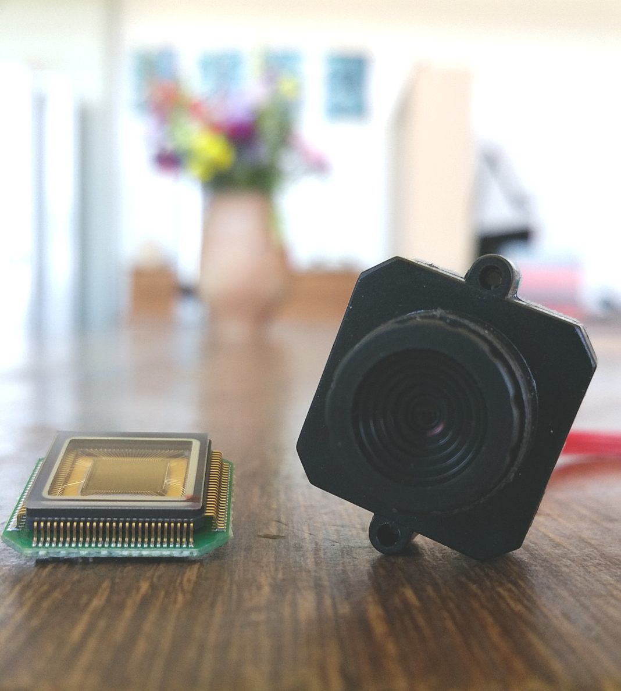
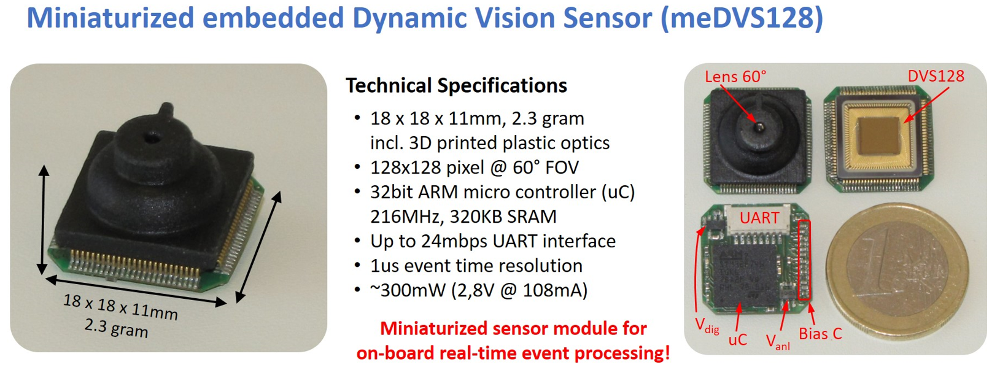
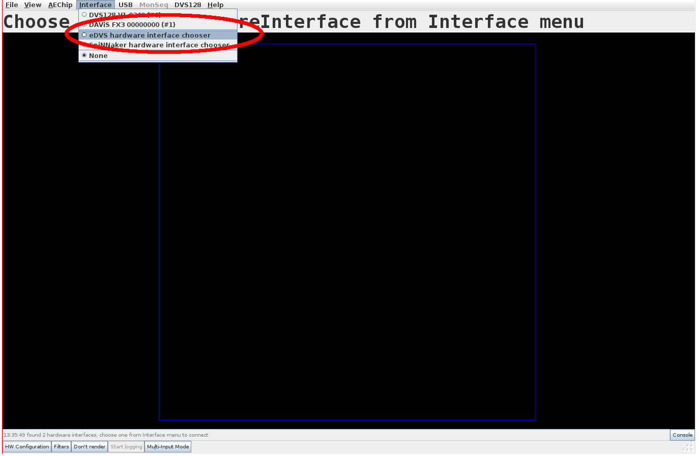
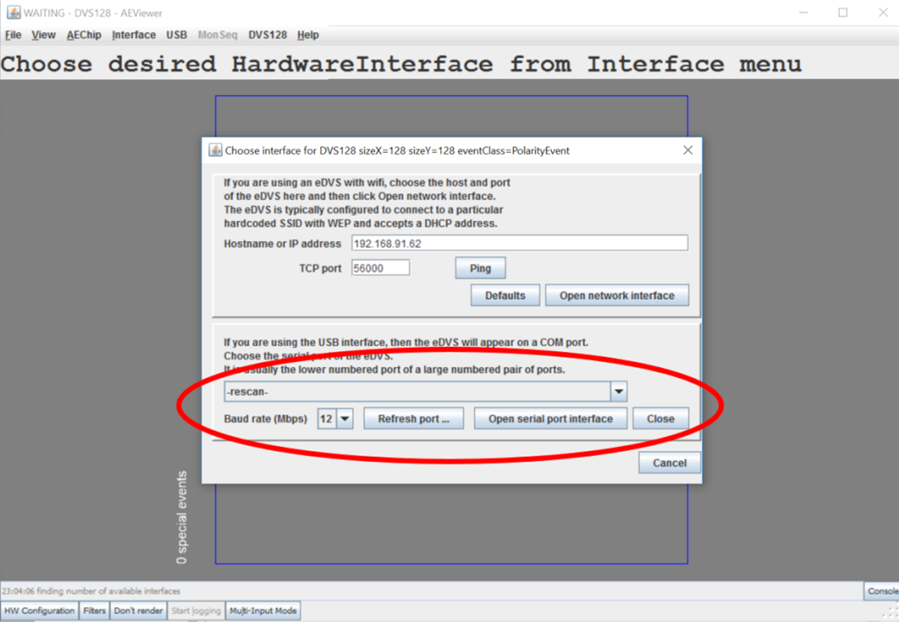

# User Guide - mini eDVS

This page is about the mini-eDVS, launched in 2016:

<p align="center"></p>

## Table of contents

- [Specification](#specification)
- [Getting started](#getting-started)
- [Viewing and processing events](#viewing-and-processing-events)
- [Biasing the DVS](#biasing-the-dvs)
  - [Custom firmware development](#custom-firmware-development)
  - [Accessing the device manually](#accessing-the-device-directly-without-jaer)
- [UART Protocol (PC->Board)](#uart-command-protocol-pc---board)
  - [Event data formats](#event-data-formats)
- [UART - Connector](#uart---connector)
- [Optional: WLAN module](#optional-wlan-module)

## Specification

A small (18x18mm PCB) dynamic vision sensor with on-board
microcontroller for real-time event-streaming over UART port.

For specifications see the [specifications
page](https://inivation.com/wp-content/uploads/2018/01/DVS-Specifications.pdf).

**Application examples:**

  - Gaze tracking.

  - Wearable sensing.

  - Surveillance.

**Specifications**

  - Specs: 18x18x7mm (+lens, typically total height <14mm)

  - Weight: 2.5 – 3gr (depending on lens)

  - Power supply: 3.3V (3.0 - 3.6V tolerated), typical power
    consumption <= 80mA

  - On-board microcontroller: STM32F74xx, 320 KB SRAM, up to 216 MHz
    operating frequency

  - Interface: UART TTL level serial port, 12Mbps data rate (higher
    baud rates up to 27Mbps as customization)

    --> event rate up to 600k-events without timestamp

    --> event rate >= 200 k-events with timestamp (depending on
granularity of timestamp)

  - Product compatible with PC demo software jAER (same interface as
    eDVS)

<p align="center"></p>

The image above shows a customized 3D-printed light-weight lens; the
device for sale features a slightly larger plastic housing with multiple
options of glass or plastic lenses (as shown on picture at the very
top).

## Getting started

### Viewing and processing events

The officially supported software to view and process events coming from
the meDVS is jAER. For instructions on installation and usage, see the
[jAER user guide](https://inivation.com/support/software/jaer/).

Once installed, connect the meDVS via supplied USB adapter board to your
computer. The drivers for USB serial port emulation are already part of
all modern operating systems, so no special installation is required at
this point. The recently connected devices should show up on your system
as a serial communication device, for example as a COM: ```<x>``` port on
Windows or ```/dev/ttyUSB<x>``` on Linux. If your OS does not find drivers,
download FTDI’s latest **VCP drivers** for FT232HL here:
[http://www.ftdichip.com/Drivers/VCP.htm](http://www.ftdichip.com/Drivers/VCP.htm)

Note for Linux users: you may need to ensure you have the correct
permissions for accessing /dev/ttyUSBn (where n = 0,1,2, etc). For
example, running the following command as root will give you access to
device ttyUSB0:

> chmod 666 /dev/ttyUSB0

Start jAER and ensure that, in the *AEChip* menu, the
*ch.unizh.ini.jaer.chip.retina.DVS128 chip* class is selected. If it
isn’t, just search for it in the menu and select it.

<p align="center"></p>

Click on the *Interface* menu (circled in red above) and select the item
named *eDVS hardware interface chooser*. In the second half of the
configuration screen, select your serial device (*COMx* on Windows) and
then press *Open serial port interface*. If your device isn’t showing up
in jAER, try selecting *rescan* from the drop-down menu or click on
*Refresh port list*.

<p align="center"></p>

**Set the baud rate to 12.000.000 baud (12Mbps).**

You should now be seeing DVS events on your screen.

### Biasing the DVS

You need to load a set of biases. The [jAER user guide](https://inivation.com/support/software/jaer/) explains how to do
this, in the section on “biasing”. In order to get the best performance
out of your device for your application, in terms of speed, noise etc,
you need to adjust the biases. The [biasing guide](https://inivation.com/support/hardware/biasing/) explains how to do
this.

For the eDVS, you should use the standard bias sets for the DVS128. You
can find these under:

> jAER/trunk/biasgenSettings/DVS128

The default biases DVS128Slow.xml or DVS128Fast.xml are suitable for
many situations.

## Custom firmware development

Custom firmware can be provided upon special agreement; **we do not
offer open source firmware** as we do for the eDVS4337.

## Accessing the device directly (without jAER)

It is possible to manually access the eDVS (e.g. through an on-board
microcontroller or a mini PC with TTL-level UART), and send commands to
it directly. This can be done by using any serial console emulation
program and connecting it to the device (such as “hyperterm” or “putty”
on Windows OS or “minicom” in Linux).

Here is an example using the popular Putty program on Windows, which can
be downloaded
[here](http://www.chiark.greenend.org.uk/~sgtatham/putty/download.html).

Once you’ve downloaded Putty, just run its executable.

In the *Session* settings (top left), change the *Connection type* to *Serial* and then
write the correct COM port (in our case *COM3*) into the *Serial line*
textbox, and set the *Speed* to *12000000*. Then switch to the *Serial
settings* (bottom left) and verify that they match what you just
entered.

Further, change *Flow control* to *RTS/CTS* (i.e. enable
hardware handshaking) and ensure *Data bits* is *8*, *Stop bits* is *1*
and *Parity* is *None* (often referred to as *8N1*). Then switch to the
*Terminal settings* (third from the top left), and tick *Implicit CR* in
every *LF*, as well as set to *Force off* both *Local echo* and *Local
line editing*.

After pressing the Open button, you’ll be able to send commands to the
device. The list of commands is available in the next section.

## UART Command Protocol (PC -> Board) 

Supported Commands (all commands need to be terminated by ‘\n’; i.e.
return):

```
E+/- - enable/disable event sending
!Ex - specify event data format, ??E to show options (see below for
more details)
!ET=x - set current timestamp to x (default: 0)
!ETM[0,+] - synch timestamp, master mode, 0: output stopped; +:
output active
!ETS - synch timestamp, slave mode
!ETI - single retina, no external synch mode
!B[0-11]=x - set bias register to value
!BF - send bias settings to DVS (flush)
?Bx - get bias register x current value
0,1,2 - LED off/on/blinking
R - reset board
?? - display help menu
??E - display Event data menu
```

### Event data formats

You can specify the following formats for data streaming:

```
!E0 - 2 bytes per event, binary: 1yyyyyyy.pxxxxxxx (default) (p =
polarity)
!E1 - 3..6 bytes per event; the above address format followed by 1..4
bytes delta-timestamp (7bits each)
!E2 - 4 bytes per event (as !E0 followed by 16bit absolute timestamp)
!E3 - 5 bytes per event (as !E0 followed by 24bit absolute timestamp)
!E4 - 6 bytes per event (as !E0 followed by 32bit absolute timestamp)
!E5 - 10 bytes per event ASCII (polarity x-coordinate y-coordinate
<newline>
!E6 - 21 bytes per event (as !E5 followed by timestamp as decimal
number)
```

Every timestamp has 1us resolution.

**Examples:**

| Example                           | Value                                                                                                                 |
| --------------------------------- | --------------------------------------------------------------------------------------------------------------------- |
| !E2 will result in data packets:  | ```1yyyyyyy.pxxxxxxx.tttttttt.tttttttt``` (time stamp wrap-around after 2^16 us = 65.535 us =~ 65ms)              |
| !E3 will result in data packets:  | ```1yyyyyyy.pxxxxxxx.tttttttt.tttttttt.tttttttt``` (time stamp wrap-around after 2^24 = 16.777.216 us =~ 16 sec)  |

## UART - Connector

| Pin | Primary Function            | Signal direction from meDVS            |
| --- | --------------------------- | -------------------------------------- |
| 1   | Supply Voltage (3.2 - 3.6V) | (power input)                          |
| 2   | RXD                         | Input (into meDVS)                     |
| 3   | TXD                         | Output (out of meDVS)                  |
| 4   | GND                         |                                        |
| 5   | CTS                         | Input (into meDVS)                     |
| 6   | RTS                         | Output (out of meDVS)                  |
| 7   | TIME-SYNC                   | Output (as master) // input (as slave) |
| 8   | DISABLE STREAMING           | input (can be left unconnected)        |

## Optional: WLAN module

It is possible to connect a WLAN module to the meDVS, streaming data at
up to 10Mbps over-air TCP into a 2.4GHz WLAN network.

This module connects to UART and substitutes as a Master in place of the
USB cable and connector.

It will then be possible to connect to the WLAN module and send commands
to it exactly like you did via USB.

The WLAN module itself needs to be programmed, to set the various WLAN
parameters like SSID, encryption and so on.

Ask iniLabs for a quote.
