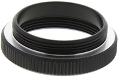

# FAQ and Troubleshooting Guide

Can't find the answer you need? We use multiple Google Groups forums for
all questions regarding inivation products:

- [https://groups.google.com/d/forum/caer-users](https://groups.google.com/d/forum/caer-users)
- [https://groups.google.com/d/forum/jaer-users](https://groups.google.com/d/forum/jaer-users)
- [https://groups.google.com/d/forum/davis-users](https://groups.google.com/d/forum/davis-users)
- [https://groups.google.com/d/forum/dynapse-users](https://groups.google.com/d/forum/dynapse-users)

If your question involves confidential information, however, please use
[support@inivation.com](mailto:support@inivation.com).

## Table of contents
- [Troubleshooting guide](#troubleshooting-guide)
- [FAQ](#faq)

## Troubleshooting guide

| Symptoms                                                                                                                              | Possible solutions                                                                                                                                                                                                                                                                                                                                                                |
| ------------------------------------------------------------------------------------------------------------------------------------- | --------------------------------------------------------------------------------------------------------------------------------------------------------------------------------------------------------------------------------------------------------------------------------------------------------------------------------------------------------------------------------- |
| jAER is running and a DVS is plugged in. Either there are no spikes coming out, or there are some spikes but they don't make sense.  | 1.  Check that there is no lens cap   2. Check that the lens aperture is open.   3. In jAER, load or reload a standard set of biases for your device.   4.	Check that all filters are disabled.   5.	Check that “capture events” and “display events” are both enabled on the user-friendly tab of the “Biases / HW configuration” dialogue (DAVIS only).    |
| I can’t get the image into focus - it’s really blurry.                                                                                | Have you got the CS-C adapter ring between the lens and the camera? The adapter ring looks like this:        This doesn’t apply to eDVS. If you have the eDVS, are you aware that the lens screws in and out of the lens holder in order to focus it?                                                                               |
| I can't install a linux driver for my DVS128                                                                                          | You don't need to; just upgrade to jAER version 1.5 or higher.                                                                                                                                                                                                                                                                                                                    |
| I can’t install a linux driver for my USBAERMini2 board.                                                                              | There isn’t one - use Windows instead.                                                                                                                                                                                                                                                                                                                                            |
| I’m using jAER 1.5, but still can’t access my device from Linux                                                                       | Ensure that the user you’re running jAER as does have access to the device. This might require an udev rule to be added, please refer to the [DAVIS240](https://inivation.com/support/hardware/davis240/) user guide and its section “Install USB driver - Linux”.                                                                                                                  |
| Windows can’t automatically find the right driver for my DAVIS240.                                                                    | Use zadig to install the correct driver. See the [reflashing guide](https://inivation.com/support/software/reflashing/).                                                                                                                                                                                                                                                                   |
| Some columns of pixels are not working on my DAVIS240B.                                                                               | This is by design: see the [specifications page](https://inivation.com/wp-content/uploads/2018/01/DVS-Specifications.pdf), section “DAVIS240B array layout”.                                                                                                                                                                                                                                         |

## FAQ

| Question                                                                              | Answer                                                                                                                                                                                                                                                                                                                                            |
| ------------------------------------------------------------------------------------- | ------------------------------------------------------------------------------------------------------------------------------------------------------------------------------------------------------------------------------------------------------------------------------------------------------------------------------------------------- |
| Can the DVS see infrared (IR)? What is the range of frequencies that the DVS can see? | The DVS chip can see all visible light plus near-infrared (NIR) down to about 1.1 um. However, the DVS128 dies are packaged with glass that blocks NIR. The DAVIS240 has glass with no IR filter. The luminosity function should be that of a standard CMOS sensor (sensitivity peaking around 700-750 nm) although we have not measured this.    |
| Can I synchronise timestamps between two prototypes?                                  |  Yes, DVS128, DAVIS240 and DAS1 can all be synchronised to each other, see the [Synchronisation guide](https://inivation.com/support/hardware/synchronisation/).   eDVS and DVS128_PAER don’t have any built in synchronisation capability.                                                                                                                      |
| Why is there a frame rate (FPS) on the jAER toolbar?                                  | This is the rate at which jAER is rendering frames for visualisation of the data; the DVS doesn’t output frames but rather outputs events in real time, see the [jAER user guide](https://inivation.com/support/software/jaer/). for more details.                                                                                                         |
