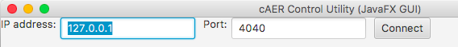
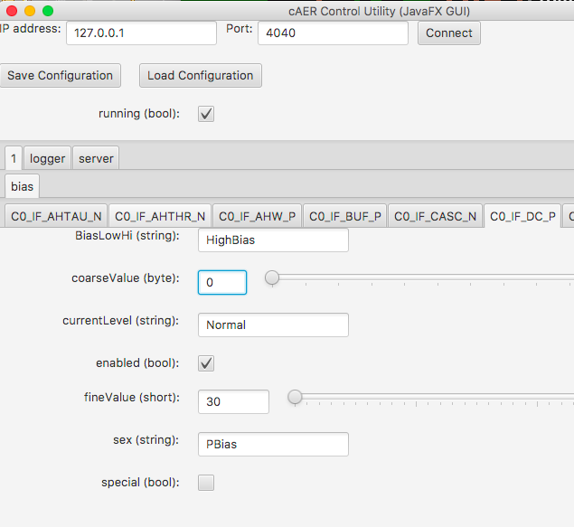

# caerctl-gui-javafx GUI

*Our documentation is regularly being improved along with our products.
If this guide is missing the answer to any question you may have, please
don't hesitate to ask us on the appropriate [support
forum](https://groups.google.com/d/forum/davis-users/). If
your question involves confidential information, however, please use
[support@inilabs.com. First you could try our*
*[troubleshooting
guide](https://www.inilabs.com/support/faq/).*

- [Getting caerctl-gui-javafx](#getting-caerctl-gui-javafx)
- [For users](#for-users)
- [For developers](#for-developers)
- [How to use caerctl-gui-javafx](#how-to-use-caerctl-gui-javafx)

## Getting caerctl-gui-javafx

### For users

Directly runnable JARs can be found at:

[https://github.com/inilabs/caerctl-gui-javafx/releases/](https://github.com/inilabs/caerctl-gui-javafx/releases/)

> \$ java -jar caerctl-gui-javafx-0.6.0-jar-with-dependencies.jar

Please make sure you use, Oracle Java 1.8 (Oracle JDK 8).

### For developers

It requires Oracle Java 1.8 (Oracle JDK 8) to run, since it uses new
technologies such as JavaFX. Please make sure to install at least Java
version 1.8.0 u40. The sourcecode is available in the iniLabs GIT
repository at:

[https://github.com/inilabs/caerctl-gui-javafx/](https://github.com/inilabs/caerctl-gui-javafx/)

It can be opened as a Maven project in both NetBeans and Eclipse.

### How to use caerctl-gui-javafx

Simply connect to the cAER configuration server, for local machine use
127.0.0.1:4040 (default).

During the connection, all the options from caer are gathered together
and the gui is finalized. This can take up to few seconds, the loading
time depends on the number of setting that are being exposed by caer.

You can now start changing options and biases.

You can use caer control utility for changing all filters and bias
settings. Depending on the included modules at compile time, caer will
expose different settings. Therefore the gui could different from the
one in this figure.
