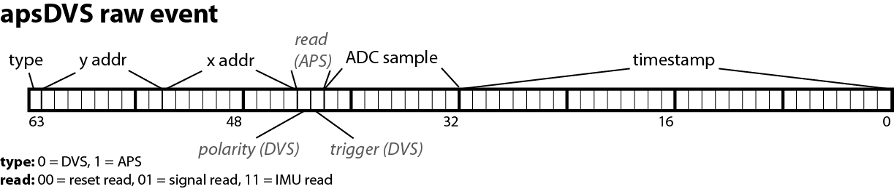

# AEDAT file formats
> *For more information, visit [iniVation support](https://inivation.com/support/)*
---

## Table of contents
- [Introduction](#introduction)
- [Software Support](#software-support)
- [Common Version Header](#common-version-header)
- [AEDAT 1.0](#aedat-10)
  - [Ordering](#ordering)
  - [DVS128](#dvs128)
- [AEDAT 2.0](#aedat-20)
  - [Ordering](#ordering-1)
  - [DAVIS](#davis)
  - [DAS1](#das1)
- [AEDAT 3](#aedat-3)
- [AEDAT 3.1](#aedat-31)
  - [Header Lines](#header-lines)
  - [Event Packets](#event-packets)
    - [Header](#header)
    - [Ordering](#ordering-2)
  - [Events](#events)
    - [Special Event](#special-event)
    - [Polarity Event](#polarity-event)
    - [Frame Event](#frame-event)
    - [IMU 6-axes Event](#imu-6-axes-event)
    - [IMU 9-axes Event](#imu-9-axes-event)
    - [ADC Sample Event](#adc-sample-event)
    - [Ear (Cochlea) Event](#ear-cochlea-event)
    - [Configuration Event](#configuration-event)
    - [Point1D Event](#point1d-event)
    - [Point2D Event](#point2d-event)
    - [Point3D Event](#point3d-event)
    - [Point4D Event](#point4d-event)
    - [Spike (Dynap-se) Event](#spike-dynap-se-event)
  - [Formats](#formats)
    - [RAW (ID=0x00)](#raw-id0x00)
    - [SerializedTS (ID=0x01)](#serializedts-id0x01)
    - [PNGFrames (ID=0x02)](#pngframes-id0x02)
- [AEDAT 3.0](#aedat-30)
  - [Header Lines](#header-lines-1)
  - [Polarity Event](#polarity-event-1)
  - [Frame Event](#frame-event-1)
  - [New Event Types](#new-event-types)
- [Network Streaming](#network-streaming)
- [Supported Devices](#supported-devices)

# Introduction

Files generated by inivation event-based processing software, such as
cAER and jAER, use the custom AEDAT (=Address Event DATa) format to
store the event data and its timestamp information. Over the years this
format has evolved to address various needs, such as storing new data
types more efficiently or having larger timestamp ranges.

Version 1.0 has been supported since the first jAER release in 2008,
version 2.0 of the format is the most commonly found, as it was
supported by jAER and used as default since 2010. Version 3.0 came out
of research done with the cAER framework in 2015, and will soon be the
preferred format. Any new developments should be done with it in mind.
In April 2016, AEDAT 3.1 was specified as an update to the AEDAT 3.0
format, addressing a couple of shortcomings.

# Software Support

The following table summarizes what software supports which formats:

|  Software  |  AEDAT 1.0  |  AEDAT 1.0  |  AEDAT 2.0         |  AEDAT 2.0  |  AEDAT 3.0               |  AEDAT 3.0  |  AEDAT 3.1       |  AEDAT 3.1  |
| :--------: | :---------: | :---------: | :----------------: | :---------: | :----------------------: | :---------: | :--------------: | :---------: |
|            |  Read       |  Write      |  Read              |  Write      |  Read                    |  Write      |  Read            |  Write      |
|  jAER      |  X          |             |  X                 |  X          |  X (RAW format)          |             |  X (RAW format)  |             |
|  cAER      |             |             |  X*  (files only)  |             |  X*                      |             |  X               |  X          |

**X = Complete**

**X* = In progress**

# Common Version Header

AEDAT files have a common, human-readable header format.

A header was initially optional, but with the introduction of new format
revisions, it is now considered required, else it’s impossible to parse
the file correctly.

If it exists, it is the first content present in a file, and is made up
of one or more header lines.

A header line begins with a ‘#’ character and ends with a CRLF (Windows
line ending, ‘\r\n’).

Header lines, unless specified otherwise, are always case sensitive.

The very first header line contains information about the version of the
AEDAT format employed in the rest of the file. If it is not present,
version 1.0 is assumed.

The exact format of the version line is as follows:

> **#!AER-DATx.y\r\n**

where x and y are the two version number components.

Other than the first version header line, no other header lines are
required or specified in a common way across all format versions, and
depend completely upon the software generating them. They should only be
used for informative uses, and not to store critical data or metadata,
unless specified as such below in one of the format versions explicitly.

# AEDAT 1.0

Version 1.0 of the AEDAT format was the first version to be implemented
in jAER back in 2008. It simply consists of an optional
[header](#common-version-header),
followed by a series of [address, timestamp] pairs, each making up an
event. The address is 16 bit wide and the timestamp 32 bit, for a total
of 6 bytes per event. The timestamp is in microseconds, while the
address has to be interpreted according to a specific jAER AEChip class’
definition of that address. All integer data and fields are always
signed and big-endian!

**This format is deprecated and should not be used for any new
development or recording! At most, support reading this format.**

## Ordering

All events in the AEDAT 1.0 format are ordered by their timestamp, and
should guarantee timestamp monotonicity, meaning the next event will
always have an equal or greater timestamp.

It is possible to find older files where this was not guaranteed, due to
older hardware and its logic sometimes not ensuring that timestamp
increase events be always delivered. When this is the case, the jAER
software will detect this, warn the user and continue working by
“jumping back” to the new, but older, timestamp value.

## DVS128

For version 1.0, this was usually the DVS128 chip class, which uses the
following format to store polarity (luminosity change) events generated
by the
device:

| Bits     | Meaning        | Description                                                                      |
| -------- | -------------- | -------------------------------------------------------------------------------- |
| 15       | External event | External event detected on the IN pin (TS-Master mode).                          |
| 14-8     | Y address      | Y event address. (0, 0) in lower left corner of screen.                          |
| 7-1      | X address      | X event address. (0, 0) in lower left corner of screen.                          |
| 0        | Polarity       | Polarity (luminosity change): ‘1’ means increase (ON), ‘0’ means decrease (OFF). |

# AEDAT 2.0

Version 2.0 was introduced in 2010. It is equivalent to version 1.0, but
widens the address field to 32 bit. It also requires the header version
line (see
[above](#common-version-header)), to be
able to disambiguate between formats. Then again an optional header,
followed by a series of [address, timestamp] pairs, each making up an
event. The address is 32 bit wide and the timestamp also 32 bit, for a
total of 8 bytes per event. The timestamp is in microseconds, while the
address has to be interpreted according to a specific jAER AEChip class’
definition of that address. This could be the DVS128 class, same as
[above](#dvs128), or the DAVIS family of
classes (DAVIS240A,B,C; DAVIS346cBSI, DAVIS640, …). All integer data and
fields are always signed and big-endian!

The jAER software, since 2014, also writes several informative header
lines, these include the ***‘HardwareInterface’*** and the
***‘AEChip’*** header line, which contain information on the current
device and the class interpreting its output. Here is an example of
these informational lines:

```
# This is a raw AE data file - do not edit

# Data format is int32 address, int32 timestamp (8 bytes total),
peated for each event

# Timestamps tick is 1 us

# created Thu Dec 03 14:47:00 CET 2015

# HardwareInterface: DAVIS FX3 0002-INI

# AEChip: eu.seebetter.ini.chips.davis.Davis640
```

Further, a full XML-like dump of all the preferences for the above
AEChip class, which includes settings such as the APS exposure time or
the biases, is generated, and kept either fully in the header as header
lines, or, in the future, in a separate XML file, which is named

```html
<filename>-prefs.xml
```

and is referenced in the header as one
header line as follows:

```markdown
# Prefs-File: <filename>-prefs.xml\r\n
```

Entries looks like the following in XML (example is of an addressable bias):

```html
<entry key="DAVIS240C.AddressedIPotCF.ApsROSFBn.LowCurrent" value="false"/>
```

## Ordering

All events in the AEDAT 2.0 format are ordered by their timestamp, and
should guarantee timestamp monotonicity, meaning the next event will
always have an equal or greater timestamp.

It is possible to find older files where this was not guaranteed, due to
older hardware and its logic sometimes not ensuring that timestamp
increase events be always delivered. When this is the case, the jAER
software will detect this, warn the user and continue working by
“jumping back” to the new, but older, timestamp value.

## DAVIS

The DAVIS camera family stores polarity (luminosity change) events, IMU
(Inertial Measurement Unit) samples and pixel intensity values (both APS
reset and signal read) according to the following scheme:

### Bit 31

| Bits     | Meaning        | Description                                                                                       |
| -------- | -------------- | ------------------------------------------------------------------------------------------------- |
| 31       | Type           | Defines the type of address stored here. ‘0’ means DVS, ‘1’ means APS or IMU (see bits 11-10).    |

---
### Bit 30-12
#### IMU:

| Bits     | Meaning         | Description                                                                                                                                          |
| -------- | --------------  | ---------------------------------------------------------------------------------------------------------------------------------------------------- |
| 30-28    | IMU sample type | Type of IMU sample: <br> 0 -> Accel X <br> 1 -> Accel Y <br> 2 -> Accel Z <br> 3 -> Temperature <br> 4 -> Gyro X <br> 5 -> Gyro Y  <br> 6 -> Gyro Z  |
| 27-12    | IMU sample      | For IMU events, 7 words are sent in series, these being: <br> - 3 axes for accel, <br> - Temperature, <br> - 3 axes for gyro.                        |

#### DVS or APS:

| Bits     | Meaning         | Description                                                                      |
| -------- | --------------- | -------------------------------------------------------------------------------- |
| 30-22    | Y address       | Y event address. (0, 0) in lower left corner of screen.                          |
| 21-12    | X address       | X event address. (0, 0) in lower left corner of screen.                          |

---
### Bit 11-10
#### APS:

| Bits     | Meaning         | Description                                                                             |
| -------- | --------------- | --------------------------------------------------------------------------------------- |
| 11-10    | sub-Type        | 00 -> APS Reset Read <br> 01 -> APS Signal Read <br> 10 -> Unused <br> 11 -> IMU Sample |

#### DVS:

| Bits     | Meaning         | Description                                                                                                                     |
| -------- | --------------- | ------------------------------------------------------------------------------------------------------------------------------- |
| 11-10    | sub-Type        | 00 -> DVS Polarity OFF <br> 01 -> External Event (same as 11) <br> 10 -> DVS Polarity ON <br> 11 -> External Event (Same as 01) |

---
### Bit 9-0

| Bits     | Meaning        | Description                                                                      |
| -------- | -------------- | -------------------------------------------------------------------------------- |
| 9-0      | ADC sample     | 10-bit ADC sample representing pixel intensity. Only for Type=APS, else zero.    |

---

The following image explains the same thing in a more graphic way (IMU
data is not shown in this graphic, however):

<p align="center"></p>

Frames, in this format, are laid out as a sequence of events, one for
each pixel. The timestamp for each pixel is also stored and corresponds
to the start of the readout of the column where the pixel resides. To
get start and end of frame and exposure timestamps, one has to look at
the timestamp of the pixel readouts closest to those moments:

- Start of Frame: first reset read pixel.
- Start of Exposure: last reset read pixel for GlobalShutter mode,
  first reset read pixel for RollingShutter mode.
- End of Exposure: first signal read pixel.
- End of Frame: last signal read pixel.

## DAS1

The DAS1 (Dynamic Audio Sensor, CochleaAMS1c AEChip class) stores its
data according to the following format:

### Bit 13-10

| Bits     | Meaning                    | Description                                                                                                                                                                   |
| -------- | -------------------------- | ----------------------------------------------------------------------------------------------------------------------------------------------------------------------------- |
| 13       | Type (ADC or AER)          | Defines the type of address stored here. ‘0’ means AER from Cochlea chip, ‘1’ means sample from external ADC.                                                                 |
| 12       | ADC scanner sync           | Signals if the current ADC sample is newly synchronized with the Scanner. If ‘1’, it is, so we can clear and reset buffers. If ‘0’, just get the ADC data.                    |
| 11-10    | ADC channel                | Defines which of the four possible ADC channels this sample belongs to.                                                                                                       |
| 9-0      | ADC sample or AER address  | If Type=ADC, then this contains the 10-bit ADC sample ; If Type=AER, then this is the 10-bit AER address from the Cochlea chip. The 10 bits are to be interpreted this way:   |

Bits from 9 to 0 are divided in the following way:

| Bits     | Description                                                                                       |
| -------- | ------------------------------------------------------------------------------------------------- |
| 9-8      | Neuron number (0 to 3).                                                                           |
| 7-2      | Channel number (from 0 to 63, where 0 is highest frequency, 63 lowest frequency).                 |
| 1        | Left/Right ear (‘0’ is left, ‘1’ is right).                                                       |
| 0        | Neuron bank (‘0’ if from BPF, ‘1’ if from SOS).                                                   |

Note that although the DAS1 has synchronisation ports, the insertion of
external trigger events into the event stream via a synchronisation
pulse has never been implemented in the firmware.

# AEDAT 3

The AEDAT 3 format was created as part of the cAER framework development
process in 2014 and further refined and version 3.0 finalized in 2015.

The different types of events our sensors produce nowadays, such as
frames or IMU events, have very different storage requirements, and
forcing them all into a [32 bit address, 32 bit timestamp] pair like
in [version 2.0](#aedat-2.0) is highly
inefficient. Also having the interpretation of data depending on jAER’s
AEChip class, such as for the polarity (luminosity change) events, or
depending on external header data, such as for the IMU (Inertial
Measurement Unit) event data ranges, is very complex and error-prone.

The new format version 3 developed in response addresses these problems,
by choosing very efficient representations for each event type,
especially in terms of memory, and then bundling those together into
typed event packets. Further all data values have been expanded and
normalized, so that no further interpretation is needed: a DVS polarity
event will have its X and Y addresses in the same place, regardless of
which device produced it. In addition, an IMU event will have its
gyroscope data always in °/s (deg/s), without needing any further
conversions.

The AEDAT 3 format is currently at version 3.1. Version 3.1 is the first
revision of the AEDAT 3.X series, published in April 2016. It addresses
several issues that came up with the 3.0 format while it has been in
wider use with the cAER framework and several projects. This contains
mainly additions to the basic 3.0 format. The fullest and most recent
format is described here below. Then follows a section about earlier
versions of the format:
[3.0](#aedat-3.0).

# AEDAT 3.1

The file starts with several required header lines, as specified
[here](#header-lines). The [version header line](#common-version-header)
is always the first one, followed by the 3.1 format header line,
followed by any others.

After this is an optional
[header](#common-version-header),
followed by one initial, optional configuration event packet, that holds
all the initial device configuration with a timestamp of zero (to
guarantee monotonicity), and then a series of typed event packets, which
contain in turn all the various events.

All integer data and fields are always signed and little-endian! This
is a departure from previous AEDAT formats, motivated by the fact all
the systems we support, currently x86(_64) and ARM, are in fact native
little-endian systems, and doing so avoids unnecessary conversion
operations.

## Header Lines

- Version header line (required): described
  [above](#common-version-header),
  always the first header line. Specifically, the line is:

  ```markdown
    #!AER-DAT3.1\r\n
  ```

- Format header line (required): follows right after the version
  line, looking like this:
  
  ```markdown
    #Format: <FORMAT>\r\n.
  ```

  The [Format](#formats) header line describes how the event packets have to
  be interpreted later on, allowing for optimizations and extensions to be added as needed.
  Possible formats are: *[**RAW**](#raw-id0x00) (default)*, [***SerializedTS***](#serializedts-id0x01),
  [***PNGFrames***](#pngframes-id0x02).
- Source Identifier header line (required): human-readable
  identifiers for all event source IDs present in the file are a
  mandatory part of the header. The corresponding header line shall
  look like this:

  ```markdown
    #Source <ID>: <DESCRIPTION>\r\n
  ```

  If multiple sources are present, they must be placed in increasing
  order by numerical ID (0, 1, 2, 3, …). The description part must be an
  element from the [list of supported
  devices](#supported-devices). When re-logging or
  re-transmitting data, new source headers have to be created
  representing the new file or network source. The old source headers
  have to be preserved always, by adding a ***‘-’ (minus)*** sign in
  front of them.

  ```markdown
    Example: #-Source 0: DVS128\r\n
  ```

- Start Time header line (required): this header line encodes the
  time at which we started transmitting or logging data. The format
  is the following:

  ```markdown
    #Start-Time: %Y-%m-%d %H:%M:%S (TZ%z)\r\n
  ```

Time is encoded according to the C strftime() function, see
‘[man
strftime](http://man7.org/linux/man-pages/man3/strftime.3.html)’.

- End of header line (required): follows right after all the other
  header lines, looking like this:

  ```markdown
    #!END-HEADER\r\n
  ```
  
  This allows to clearly determine where the file header ends and data
  starts.

## Event Packets

Each event packet is made up of a common header, followed by its
specific event data.

This is not the same header as above, which is placed at the start of a
file!

This header is specific to each and every event packet.

### Header

The common header has a constant size of 28 bytes and the following
format:

| Bytes    | Meaning         | Description                                                                                                                                                      |
| -------- | --------------- | ---------------------------------------------------------------------------------------------------------------------------------------------------------------- |
| 0-1      | eventType       | Numerical type ID, unique to each event type (see ‘Event Types’ table).                                                                                          |
| 2-3      | eventSource     | Numerical source ID, identifies who generated the events inside a system.                                                                                        |
| 4-7      | eventSize       | Size of one event in bytes.                                                                                                                                      | 
| 8-11     | eventTSOffset   | Offset from the start of an event, in bytes, at which the main 32 bit time-stamp can be found.                                                                   |
| 12-15    | eventTSOverflow | Overflow counter for the standard 32bit event time-stamp. Used to generate the 64 bit time-stamp.                                                                |
| 16-19    | eventCapacity   | Maximum number of events this packet can store. **This always equals eventNumber in files and streams, it can only have a different value for in-memory packets. |
| 20-23    | eventNumber     | Total number of events present in this packet (valid + invalid).                                                                                                 |
| 24-27    | eventValid      | Total number of valid events present in this packet.                                                                                                             |

By multiplying ***eventCapacity*** with ***eventSize***, and adding the
***28 bytes of header size***, you can quickly and precisely calculate
the total size of an event packet.

### Ordering

Event packets must be ordered in such a way to guarantee timestamp
monotonicity. This means that for all packets of a same type and source,
the timestamps must always be monotonically increasing. Further, between
packets of different types belonging to the same source, the main
timestamp of the first event decides the order in which packets should
be written. If this timestamp is equal between different packets, they
can be ordered by increasing event type ID, but this is not a
requirement, only a suggestion.

Timestamp monotonicity does not need to be guaranteed globally between
multiple sources, as any one of them can operate on different
time-scales. No order is enforced between sources.

While this ordering requires some additional processing when writing, it
greatly simplifies reading, since one always just has to read up to the
next packet with a greater first timestamp than whatever timestamp one
is interested in, and is guaranteed to have seen all relevant packets
with events up to that point.

The **FRAME_EVENT** packet type has four timestamps defined. Of these,
“End of Frame” is considered the main timestamp for the purpose of
ordering. More generically, the timestamp that is indicated by the
**‘eventTSOffset’** header field is the one relevant for ordering.

If timestamp reset events occur during a recording (because of device
synchronisation or manual reset), then packet timestamp order is no
longer monotonic as subsequent timestamps start again from zero. A
timestamp reset event of type **SPECIAL_EVENT** will indicate such a
reset clearly.

## Events

The first 100 event type IDs are reserved for expansion of this format.
If you create event types within a private distribution, we recommend
that you number them from 100 upwards.

The following event types are supported by default:

| Event ID  | Event             | Description                                                                                                                                                                                                                                                                                                                                                                                                                                                                                                                                                                       |
| --------- | ----------------- | --------------------------------------------------------------------------------------------------------------------------------------------------------------------------------------------------------------------------------------------------------------------------------------------------------------------------------------------------------------------------------------------------------------------------------------------------------------------------------------------------------------------------------------------------------------------------------- |
| 0         | SPECIAL_EVENT     | Encodes special occurrences, such as timestamp related notifications or external input events.                                                                                                                                                                                                                                                                                                                                                                                                                                                                                    |
| 1         | POLARITY_EVENT    | Contains change information, with an X/Y address and an ON/OFF polarity. The (0, 0) address is in the upper left corner (standard computer graphics format).                                                                                                                                                                                                                                                                                                                                                                                                                      |
| 2         | FRAME_EVENT       | Encodes intensity frames, like you would get from a normal APS camera. It supports multiple channels for color, as well as multiple Regions of Interest (ROI). The (0, 0) pixel is in the upper left corner (standard computer graphics format).                                                                                                                                                                                                                                                                                                                                  |
| 3         | IMU6_EVENT        | Contains data coming from the Inertial Measurement Unit chip, with the 3-axes accelerometer and 3-axes gyroscope. Temperature is also included.                                                                                                                                                                                                                                                                                                                                                                                                                                   |
| 4         | IMU9_EVENT        | Contains data coming from the Inertial Measurement Unit chip, with the 3-axes accelerometer and 3-axes gyroscope. Temperature is also included. Further, 3-axes from the magnetometer are included, which can be used to get a compass-like heading.                                                                                                                                                                                                                                                                                                                              |
| 5         | SAMPLE_EVENT      | Represents different types of ADC readings, up to 24 bits of resolution.                                                                                                                                                                                                                                                                                                                                                                                                                                                                                                          |
| 6         | EAR_EVENT         | Encodes events from a silicon cochlea chip, containing information about which ear (microphone) generated the event, as well as which channel was involved and additional information on filters and neurons.                                                                                                                                                                                                                                                                                                                                                                     |
| 7         | CONFIG_EVENT      | Contains information about the current configuration of the device. By having configuration as a standardized event format, it becomes host-software agnostic, and it also becomes part of the event stream, enabling easy tracking of changes through time, by putting them into the event stream at the moment they happen. While the resolution of the timestamps for these events is in microseconds for compatibility with all other event types, the precision is in the order of ~1-20 milliseconds, given that these events are generated and injected on the host-side.  |
| 8         | POINT1D           | Contains one dimensional data points as floats, together with support for distinguishing type and scale.                                                                                                                                                                                                                                                                                                                                                                                                                                                                          |
| 9         | POINT2D           | Contains two dimensional data points as floats, together with support for distinguishing type and scale.                                                                                                                                                                                                                                                                                                                                                                                                                                                                          |
| 10        | POINT3D           | Contains three dimensional data points as floats, together with support for distinguishing type and scale.                                                                                                                                                                                                                                                                                                                                                                                                                                                                        |
| 11        | POINT4D           | Contains four dimensional data points as floats, together with support for distinguishing type and scale.                                                                                                                                                                                                                                                                                                                                                                                                                                                                         |
| 12        | SPIKE_EVENT       | Encodes events from a Dynap-se chip. This event contains information about which chipid generated the event, as well as which core id and which neuron. These addresses are available if the user configure the SRAM of the Dynap-se to route out spikes. Therefore the user can mask or route devices depending on the routing scheme that he decides to use.                                                                                                                                                                                                                    |

Further, the first bit (bit 0) of the first byte of any event is
reserved to be a validity bit. This bit is used to mark whether an event
is still valid or not, and can be used to efficiently filter out events
from a packet. ‘0’ in the 0th bit of the first byte means invalid, ‘1’
means valid. This way zeroing-out an event packet sets all its events to
invalid. Care must be taken to put the field containing the validity
mark always as the first member of an event.

Also, to generate the full 64 bit timestamp, which doesn’t suffer from
wrap-around problems, the packet-level 32 bit timestamp
(***eventTSOverflow***) and the event-level 32 bit timestamp have to be
composed as follows:

```c
    fullTS = (packet.eventTSOverflow << 31) | event.timestamp
```

(The shift is of 31 bits rather than 32 because of the signed
representation).

The various event types and their precise encoding are described in the
following sections.

### Special Event

| Bytes    | Meaning          | Description                               |
| -------- | ---------------- | ----------------------------------------- |
| 0-3      | 32 bit data      | Holds information on the special event.   |
| 4-7      | 32 bit timestamp | Event-level microsecond timestamp.        |

Bytes 0-3 are divided in the following way:

| Bits     | Description                                       |
| -------- | ------------------------------------------------- |
| 0        | Validity mark                                     |
| 1-7      | Type of special event (up to 128 types supported) |
| 8-31     | Optional data (up to 24 bits)                     |

Currently, the following special event types are defined:

| Type ID   | Type                              | Description                                                                                                                                                                                                                                                               |
| --------- | --------------------------------- | ------------------------------------------------------------------------------------------------------------------------------------------------------------------------------------------------------------------------------------------------------------------------- |
| 0         | TIMESTAMP_WRAP                    | A 32 bit timestamp wrap occurred. No ‘optional data’ present.                                                                                                                                                                                                             |
| 1         | TIMESTAMP_RESET                   | A timestamp reset occurred. No ‘optional data’ present. **Note:** Timestamp reset will have the highest possible timestamp value, to ensure it is always the last event of an event stream, and acts thus as a separator between the old and the new event time stream.   |
| 2         | EXTERNAL_INPUT_RISING_EDGE        | A rising edge was detected (External Input module on device). No ‘optional data’ present.                                                                                                                                                                                 |
| 3         | EXTERNAL_INPUT_FALLING_EDGE       | A falling edge was detected (External Input module on device). No ‘optional data’ present.                                                                                                                                                                                |
| 4         | EXTERNAL_INPUT_PULSE              | A pulse was detected (External Input module on device). No ‘optional data’ present.                                                                                                                                                                                       |
| 5         | DVS_ROW_ONLY                      | A DVS row-only event was detected (a row address without any following column addresses). ‘Optional data’ is present, encoding the address of the row that generated this DVS row-only event.                                                                             |
| 6         | EXTERNAL_INPUT1_RISING_EDGE       | A rising edge was detected (External Input module on device, optional Detector 1). No ‘optional data’ present.                                                                                                                                                            |
| 7         | EXTERNAL_INPUT1_FALLING_EDGE      | A falling edge was detected (External Input module on device, optional Detector 1). No ‘optional data’ present.                                                                                                                                                           |
| 8         | EXTERNAL_INPUT1_PULSE             | A pulse was detected (External Input module on device, optional Detector 1). No ‘optional data’ present.                                                                                                                                                                  |
| 9         | EXTERNAL_INPUT2_RISING_EDGE       | A rising edge was detected (External Input module on device, optional Detector 2). No ‘optional data’ present.                                                                                                                                                            |
| 10        | EXTERNAL_INPUT2_FALLING_EDGE      | A falling edge was detected (External Input module on device, optional Detector 2). No ‘optional data’ present.                                                                                                                                                           |
| 11        | EXTERNAL_INPUT2_PULSE             | A pulse was detected (External Input module on device, optional Detector 2). No ‘optional data’ present.                                                                                                                                                                  |
| 12        | EXTERNAL_GENERATOR_RISING_EDGE    | A rising edge was generated (External Input Generator module on device), and an event injected to show this. No ‘optional data’ present.                                                                                                                                  |
| 13        | EXTERNAL_GENERATOR_FALLING_EDGE   | A falling edge was generated (External Input Generator module on device), and an event injected to show this. No ‘optional data’ present.                                                                                                                                 |
| 14        | APS_FRAME_START                   | An APS frame capture has started (Frame Event will follow). No ‘optional data’ present.                                                                                                                                                                                   |
| 15        | APS_FRAME_END                     | An APS frame capture has completed (Frame Event is alongside). No ‘optional data’ present.                                                                                                                                                                                |
| 16        | APS_EXPOSURE_START                | An APS frame exposure has started (Frame Event will follow). No ‘optional data’ present.                                                                                                                                                                                  |
| 17        | APS_EXPOSURE_END                  | An APS frame exposure has completed (Frame Event will follow). No ‘optional data’ present.                                                                                                                                                                                |

### Polarity Event

| Bytes    | Meaning         | Description                                                  |
| -------- | --------------- | ------------------------------------------------------------ |
| 0-3      | 32 bit data     | Holds information on the polarity (luminosity change) event. |
| 4-7      | 32 bit timestamp| Event-level microsecond timestamp.                           |

Bytes 0-3 are divided in the following way:

| Bits     | Description                                                                      |
| -------- | -------------------------------------------------------------------------------- |
| 0        | Validity mark                                                                    |
| 1        | Polarity (luminosity change): ‘1’ means increase (ON), ‘0’ means decrease (OFF). |
| 2-16     | Y event address, up to 15 bits. (0, 0) in upper left corner of screen.           |
| 17-31    | X event address, up to 15 bits. (0, 0) in upper left corner of screen.           |

### Frame Event

| Bytes             | Meaning                                    | Description                                                                                                                                                                                                                                                                                                                                                                                                                                                                                                                                          |
| ----------------- | ------------------------------------------ | ---------------------------------------------------------------------------------------------------------------------------------------------------------------------------------------------------------------------------------------------------------------------------------------------------------------------------------------------------------------------------------------------------------------------------------------------------------------------------------------------------------------------------------------------------- |
| 0-3               | 32 bit data                                | Holds information on the frame event.                                                                                                                                                                                                                                                                                                                                                                                                                                                                                                                |
| 4-7               | 32 bit Start of Frame Capture timestamp    | Event-level microsecond Start of Frame Capture timestamp.                                                                                                                                                                                                                                                                                                                                                                                                                                                                                            |
| 8-11              | 32 bit End of Frame Capture timestamp      | Event-level microsecond End of Frame Capture timestamp. NOTE: This timestamp is considered the primary timestamp for the purpose of ordering packets.                                                                                                                                                                                                                                                                                                                                                                                                |
| 12-15             | 32 bit Start of Exposure timestamp         | Event-level microsecond Start of Exposure timestamp.                                                                                                                                                                                                                                                                                                                                                                                                                                                                                                 |
| 16-19             | 32 bit End of Exposure timestamp           | Event-level microsecond End of Exposure timestamp.                                                                                                                                                                                                                                                                                                                                                                                                                                                                                                   |
| 20-23             | X length                                   | X axis length in pixels.                                                                                                                                                                                                                                                                                                                                                                                                                                                                                                                             |
| 24-27             | Y length                                   | Y axis length in pixels.                                                                                                                                                                                                                                                                                                                                                                                                                                                                                                                             |
| 28-31             | X position                                 | X axis position (upper left offset) in pixels.                                                                                                                                                                                                                                                                                                                                                                                                                                                                                                       |
| 32-35             | Y position                                 | Y axis position (upper left offset) in pixels.                                                                                                                                                                                                                                                                                                                                                                                                                                                                                                       |
| 36-End of Event   | Pixels                                     | Pixel array, 16 bit unsigned integers, normalized to 16 bit depth. Values represent intensity at that pixel and are ready for direct display. First pixel (0, 0) is in upper left corner of screen. Pixels are laid out row by row (increasing X axis), going from top to bottom (increasing Y axis). While the pixel array goes on until the end of the Frame event, only the pixels up to (‘X length’ * ‘Y length’ * ‘Channel number’) are actually valid and contain relevant data. The rest have a value of zero and should not be accessed.     |

Bytes 0-3 are divided in the following way:

| Bits     | Description                                                                                                                                                                                                            |
| -------- | ---------------------------------------------------------------------------------------------------------------------------------------------------------------------------------------------------------------------- |
| 0        | Validity mark                                                                                                                                                                                                          |
| 1-3      | Color channels number, to track multiple color channels, for example RGB. Valid values are: **GRAYSCALE(1)**, **RGB(3)** and **RGBA(4)**.                                                                              |
| 4-7      | Color filter information, used for interpolating color images (demosaicing). Valid values are: **MONO(0)**, **RGBG(1)**, **GRGB(2)**, **GBGR(3)**, **BGRG(4)**, **RGBW(5)**, **GRWB(6)**, **WBGR(7)**, **BWRG(8)**.    |
| 8-14     | ROI (Region of Interest) identifier (up to 128).                                                                                                                                                                       |
| 15-31    | Reserved for future expansion.                                                                                                                                                                                         |

A frame is considered to be one event - a “frame event”. A frame packet
may contain 1 or more frame events. Multiplying **eventSize** by
**eventCapacity** still gives the length of the data portion of the
packet in bytes.

The Frame event is slightly different in that it doesn’t have a
constant, fixed size across all events, due to the pixel data which may
vary due to ROI readouts or different resolutions.

Within a Frame event packet, all Frame events do have the same, constant
size, as given by the **eventSize** field in the event packet header.
This is as expected and follows the usual scheme.

As such, it’s a simple matter to look at the ***eventSize*** field of a
Frame event packet’s header to figure out the exact size of a Frame
event for that particular packet, and thus where each Frame event
begins.

Within a Frame event, only pixels up to (‘X length’ * ‘Y length’ *
‘Channel number’) can be accessed with the expectation of having valid
values. There might be more pixels than that, determined by how much
memory was allocated for the Frame event, but those will all be zero, if
they do exist.

Frame Events can directly be used with standard libraries such as
OpenCV. For example the following code can be used to generate an OpenCV
Mat ‘**frameMat**’ from a Frame Event ‘**f**’, sharing the same pixel
array memory:

```
Size frameSize(caerFrameEventGetLengthX(f),
caerFrameEventGetLengthY(f));

Mat frameMat(frameSize,
CV_16UC(caerFrameEventGetChannelNumber(f)),

caerFrameEventGetPixelArrayUnsafe(f));
```

### IMU 6-axes Event

The X, Y and Z axes are referred to the camera plane. X increases to the
right, Y going up and Z towards where the lens is pointing. Rotation for
the gyroscope is counter-clockwise along the increasing axis, for all
three axes.

| Bytes    | Meaning          | Description                                                                                                                                                     |
| -------- | ---------------- | --------------------------------------------------------------------------------------------------------------------------------------------------------------- |
| 0-3      | 32 bit info      | Holds information on the special event. **This is needed right now only to hold the validity mark, and is sized to 4 bytes for performance/alignment reasons.** |
| 4-7      | 32 bit timestamp | Event-level microsecond timestamp.                                                                                                                              |
| 8-11     | accel_x (float)  | Acceleration in the X axis, measured in g (9.81m/s²).                                                                                                           |
| 12-15    | accel_y (float)  | Acceleration in the Y axis, measured in g (9.81m/s²)..                                                                                                          |
| 16-19    | accel_z (float)  | Acceleration in the Z axis, measured in g (9.81m/s²).                                                                                                           |
| 20-23    | gyro_x (float)   | Rotation in the X axis, measured in °/s.                                                                                                                        |
| 24-27    | gyro_y (float)   | Rotation in the Y axis, measured in °/s.                                                                                                                        |
| 28-31    | gyro_z (float)   | Rotation in the Z axis, measured in °/s.                                                                                                                        |
| 32-35    | temp (float)     | Temperature, measured in °C.                                                                                                                                    |

Bytes 0-3 are divided in the following way:

| Bits     | Description                                       |
| -------- | ------------------------------------------------- |
| 0        | Validity mark                                     |
| 1-31     | Reserved for future expansion                     |

All floating point values are in IEEE 754-2008 binary32 format, little
endian.

### IMU 9-axes Event

The X, Y and Z axes are referred to the camera plane. X increases to the
right, Y going up and Z towards where the lens is pointing. Rotation for
the gyroscope is counter-clockwise along the increasing axis, for all
three axes.

| Bytes    | Meaning         | Description                                                                                                                                                          |
| -------- | --------------- | -------------------------------------------------------------------------------------------------------------------------------------------------------------------- |
| 0-3      | 32 bit info     | Holds information on the IMU 6-axes event. **This is needed right now only to hold the validity mark, and is sized to 4 bytes for performance/alignment reasons.**   |
| 4-7      | 32 bit timestamp| Event-level microsecond timestamp.                                                                                                                                   |
| 8-11     | accel_x (float) | Acceleration in the X axis, measured in g (9.81m/s²).                                                                                                                |
| 12-15    | accel_y (float) | Acceleration in the Y axis, measured in g (9.81m/s²)..                                                                                                               |
| 16-19    | accel_z (float) | Acceleration in the Z axis, measured in g (9.81m/s²).                                                                                                                |
| 20-23    | gyro_x (float)  | Rotation in the X axis, measured in °/s.                                                                                                                             |
| 24-27    | gyro_y (float)  | Rotation in the Y axis, measured in °/s.                                                                                                                             |
| 28-31    | gyro_z (float)  | Rotation in the Z axis, measured in °/s.                                                                                                                             |
| 32-35    | temp (float)    | Temperature, measured in °C.                                                                                                                                         |
| 36-39    | comp_x (float)  | Magnetometer X axis, measured in µT (magnetic flux density).                                                                                                         |
| 40-43    | comp_y (float)  | Magnetometer Y axis, measured in µT (magnetic flux density).                                                                                                         |
| 44-47    | comp_z (float)  | Magnetometer Z axis, measured in µT (magnetic flux density).                                                                                                         |

Bytes 0-3 are divided in the following way:

| Bits     | Description                                       |
| -------- | ------------------------------------------------- |
| 0        | Validity mark                                     |
| 1-31     | Reserved for future expansion                     |

All floating point values are in IEEE 754-2008 binary32 format, little
endian.

### ADC Sample Event

| Bytes    | Meaning         | Description                               |
| -------- | --------------- | ----------------------------------------- |
| 0-3      | 32 bit data     | Holds information on the ADC sample event.|
| 4-7      | 32 bit timestamp| Event-level microsecond timestamp.        |

Bytes 0-3 are divided in the following way:

| Bits     | Description                                                                                    |
| -------- | ---------------------------------------------------------------------------------------------- |
| 0        | Validity mark                                                                                  |
| 1-7      | ADC sample type, to distinguish between multiple ADC samples and their sources (up to 128).    |
| 8-31     | ADC sample value (up to 24 bits). Higher values mean a higher voltage, 0 is ground.            |

### Ear (Cochlea) Event

| Bytes    | Meaning         | Description                                  |
| -------- | --------------- | -----------------------------------------    |
| 0-3      | 32 bit data     | Holds information on the ear (Cochlea) event.|
| 4-7      | 32 bit timestamp| Event-level microsecond timestamp.           |

Bytes 0-3 are divided in the following way:

| Bits     | Description                                                                                    |
| -------- | ---------------------------------------------------------------------------------------------- |
| 0        | Validity mark                                                                                  |
| 1-4      | Ear position (up to 16, 0/1 L/R front, 2/3 L/R back).                                          |
| 5-15     | Channel number (up to 2048, 0 highest frequency).                                              |
| 16-23    | Neuron number (up to 256).                                                                     |
| 24-30    | Filter number/type (up to 128).                                                                |
| 31       | Polarity (1 - ON, 0 - OFF).                                                                    |

### Configuration Event

| Bytes    | Meaning           | Description                                                                                                                                                                                                                                                                            |
| -------- | ---------------   | -------------------------------------------------------------------------------------------------------------------------------------------------------------------------------------------------------------------------------------------------------------------------------------- |
| 0        | module address    | Holds information on the device configuration event, mainly the actual module address and the validity mark.                                                                                                                                                                           |
| 1        | parameter address | Configuration parameter address.                                                                                                                                                                                                                                                       |
| 2-5      | parameter         | Configuration parameter content (4 bytes as 32 bit integer).                                                                                                                                                                                                                           |
| 6-9      | 32 bit timestamp  | Event-level microsecond timestamp. While the resolution of the timestamps for these events is in microseconds for compatibility with all other event types, the precision is in the order of ~1-20 milliseconds, given that these events are generated and injected on the host-side.  |

Byte 0 is divided in the following way:

| Bits     | Description                                       |
| -------- | ------------------------------------------------- |
| 0        | Validity mark                                     |
| 1-7      | Configuration module address.                     |

### Point1D Event

| Bytes    | Meaning          | Description                               |
| -------- | ---------------- | ----------------------------------------- |
| 0-3      | 32 bit info      | Holds information on the Point1D event.   |
| 4-7      | X (float)        | X axis measurement (one data point).      |
| 8-11     | 32 bit timestamp | Event-level microsecond timestamp.        |

Bytes 0-3 are divided in the following way:

| Bits     | Description                                                                                                                                |
| -------- | ------------------------------------------------------------------------------------------------------------------------------------------ |
| 0        | Validity mark                                                                                                                              |
| 1-7      | Type, to distinguish between different types of data points, up to 128 are supported.                                                      |
| 8-15     | Scale, to scale data points by orders of magnitude, from 10^-128 to 10^127 (take these 8 bits as a signed integer and use as exponent).    |
| 16-31    | Reserved for future expansion                                                                                                              |

All floating point values are in IEEE 754-2008 binary32 format, little
endian.

### Point2D Event

| Bytes    | Meaning          | Description                               |
| -------- | ---------------- | ----------------------------------------- |
| 0-3      | 32 bit info      | Holds information on the Point1D event.   |
| 4-7      | X (float)        | X axis measurement (one data point).      |
| 8-11     | Y (float)        | Y axis measurement (second data point).   |
| 12-15    | 32 bit timestamp | Event-level microsecond timestamp.        |

Bytes 0-3 are divided in the following way:

| Bits     | Description                                                                                                                                |
| -------- | ------------------------------------------------------------------------------------------------------------------------------------------ |
| 0        | Validity mark                                                                                                                              |
| 1-7      | Type, to distinguish between different types of data points, up to 128 are supported.                                                      |
| 8-15     | Scale, to scale data points by orders of magnitude, from 10^-128 to 10^127 (take these 8 bits as a signed integer and use as exponent).    |
| 16-31    | Reserved for future expansion                                                                                                              |

All floating point values are in IEEE 754-2008 binary32 format, little
endian.

### Point3D Event

| Bytes    | Meaning          | Description                               |
| -------- | ---------------- | ------------------------------------------|
| 0-3      | 32 bit info      | Holds information on the Point1D event.   |
| 4-7      | X (float)        | X axis measurement (one data point).      |
| 8-11     | Y (float)        | Y axis measurement (second data point).   |
| 12-15    | Z (float)        | Z axis measurement (third data point).    |
| 16-19    | 32 bit timestamp | Event-level microsecond timestamp.        |

Bytes 0-3 are divided in the following way:

| Bits     | Description                                                                                                                                |
| -------- | ------------------------------------------------------------------------------------------------------------------------------------------ |
| 0        | Validity mark                                                                                                                              |
| 1-7      | Type, to distinguish between different types of data points, up to 128 are supported.                                                      |
| 8-15     | Scale, to scale data points by orders of magnitude, from 10^-128 to 10^127 (take these 8 bits as a signed integer and use as exponent).    |
| 16-31    | Reserved for future expansion                                                                                                              |

All floating point values are in IEEE 754-2008 binary32 format, little
endian.

### Point4D Event

| Bytes    | Meaning          | Description                               |
| -------- | ---------------- | ------------------------------------------|
| 0-3      | 32 bit info      | Holds information on the Point1D event.   |
| 4-7      | X (float)        | X axis measurement (one data point).      |
| 8-11     | Y (float)        | Y axis measurement (second data point).   |
| 12-15    | Z (float)        | Z axis measurement (third data point).    |
| 16-19    | W (float)        | W axis measurement (fourth data point, complex coordinates).    |
| 20-23    | 32 bit timestamp | Event-level microsecond timestamp.        |

Bytes 0-3 are divided in the following way:

| Bits     | Description                                                                                                                                |
| -------- | ------------------------------------------------------------------------------------------------------------------------------------------ |
| 0        | Validity mark                                                                                                                              |
| 1-7      | Type, to distinguish between different types of data points, up to 128 are supported.                                                      |
| 8-15     | Scale, to scale data points by orders of magnitude, from 10^-128 to 10^127 (take these 8 bits as a signed integer and use as exponent).    |
| 16-31    | Reserved for future expansion                                                                                                              |

All floating point values are in IEEE 754-2008 binary32 format, little
endian.

### Spike (Dynap-se) Event

| Bytes    | Meaning         | Description                                                    |
| -------- | --------------- | -------------------------------------------------------------- |
| 0-3      | 32 bit data     | Holds information on the spike event from the Dynap-se device. |
| 4-7      | 32 bit timestamp| Event-level microsecond timestamp.                             |

Bytes 0-3 are divided in the following way:

| Bits     | Description                                                                                         |
| -------- | --------------------------------------------------------------------------------------------------- |
| 0        | Validity mark                                                                                       |
| 1-5      | Core id, this is the virtual_core_id programmed in the SRAM cell of the Dynap-se (bits <28:29>)     |
| 6-11     | Chip id, this is the destination_core_id programmed in the SRAM cell of the Dynap-se (bits <18:21>) |                                             |
| 12-31    | Neuron id, the source neuron address                                                                |

## Formats

Here the specifics about the event packet encoding formats, as given by
the Format header line:

### RAW (ID=0x00)

A direct dump of the memory holding an event packet. No processing is
needed at input, allocating the right amount of memory and reading the
bytes into it directly is sufficient.

### SerializedTS (ID=0x01)

TODO: will serialize special, polarity, sample, ear event timestamps,
since often the same timestamp is valid for many events, especially with
serial AER or external input events.

### PNGFrames (ID=0x02)

TODO: compress image data of frame events with lossless PNG.

TODO: will use LZ4 compression to save space. One event packet is one
LZ4 frame.

# AEDAT 3.0

This section explains how version 3.0 differed from version 3.1.

## Header Lines

- The version header line reads as follows:

  ```markdown
      #!AER-DAT3.0\r\n
  ```

- There is no end of header line required. The only way therefore to
  check where the header ends is to check that a line starts with
  the ‘**#**’ character and then read the line up to the new-line
  marker, but this can fail if the very first byte of the first
  event also happens to have a value of 35 (decimal), corresponding
  to the ‘**#**’ character.

## Polarity Event

The origin point is in the lower left of the screen rather than the
upper left, meaning that it is not compatible with the standard computer
graphics way of doing things e.g. libraries such as OpenCV.

## Frame Event

The origin point is in the lower left of the screen rather than the
upper left, meaning that it is not compatible with the standard computer
graphics way of doing things e.g. libraries such as OpenCV.

The color filter enumeration values are different, due in part to a
smaller available range; the ROI identifier is thus positioned
differently. Both features were never in active use for AEDAT 3.0:

| Bytes    | Meaning          | Description                             |
| -------- | ---------------- | --------------------------------------- |
| 0-3      | 32 bit info      | Holds information on the frame event.   |

Bytes 0-1 are divided in the following way:

| Bits     | Description                                                                                                                            |
| -------- | -------------------------------------------------------------------------------------------------------------------------------------- |
| 0        | ...                                                                                                                                    |
| 1-3      | ...                                                                                                                                    |
| 4-6      | Color filter information, used for interpolating color images (demosaicing). Valid values are: **MONO(0)**, **RGBG(1)**, **RGBW(2)**.  |
| 7-13     | ROI (Region of Interest) identifier (up to 128).                                                                                       |

## New Event Types

The following event types were not implemented in version 3.0:

| Point1D       |
| ------------- |
| **Point2D**   |
| **Point3D**   |
| **Point4D**   |
| **Spike**     |

# Network Streaming

Streaming data over the network, instead of to a file, is done with
exactly the same data formats.

The only difference is that with streaming, no
[headers as defined
above](#common-version-header) are sent, meaning that receivers
need software switches to understand what they are receiving and how to
interpret it. In jAER, for versions 1.0 and 2.0, those can be found in
the network streaming dialogs, as well as by selecting the appropriate
AEChip class manually for data parsing.

Version 3.X on the other hand attempts to automate this by sending a 20
bytes network header that signals the presence of version 3.X data with
a magic number at the start.

For stream based protocols, like TCP, this header will be sent once at
the start of the stream.

For message-based network communication, for example UDP, this header
will be part of each message, at the front, to ensure it can be properly
parsed always.

All header fields/integers are little-endian!

The 20 bytes network header format is the following:

| Bytes    | Meaning                        | Description                                                                                                                               |
| -------- | ------------------------------ | ----------------------------------------------------------------------------------------------------------------------------------------- |
| 0-7      | 64bit AEDAT 3.X magic number   | Magic number signalling presence of AEDAT 3.X header and data: **0x1D378BC90B9A6658.**                                                    |
| 8-15     | Sequence Number                | Increasing 64 bit integer to detect missing message parts. **Not used for stream protocols (TCP), set to zero.**                          |
| 16       | Version Number                 | The AEDAT 3.X version number part. 0x00 for AEDAT 3.0, 0x01 for AEDAT 3.1.                                                                |
| 17       | Format Number                  | The numerical ID representing the used  [format](#formats).                                                                               |
| 18-19    | Source ID                      | Source ID for all the events of this network stream. One network stream always carries data from only one Source ID on the sender system. |

# Supported Devices

The following is a list of all supported input devices and their names,
as would be written in [Source
ID](#header-lines) header
lines:

| Device Name    | Alternative names which devices may have been called in the past (not including different capitalisations), these are not to be used for Source ID headers, they are only here as a reference!  |
| -------------- | ------------------------------------------------------------------------------------------------------------------------------------------------------------------------------------------------ |
| File           |                                                                                                                                                                                                  |
| Network        |                                                                                                                                                                                                  |
| DVS128         | Tmpdiff128                                                                                                                                                                                       |
| DAVIS240A      | SBret10                                                                                                                                                                                          |
| DAVIS240B      | SBret20                                                                                                                                                                                          |
| DAVIS240C      | SBret21                                                                                                                                                                                          |
| DAVIS128       | Davis128Mono, Davis128Rgb                                                                                                                                                                        |
| DAVIS208       | Davis208Mono, Davis208Rgbw, PixelParade, SenseDavis192, SensDavis192                                                                                                                             |
| DAVIS346A      | Davis346AMono, Davis346ARgb                                                                                                                                                                      |
| DAVIS346B      | Davis346BMono, Davis346BRgb, Davis346                                                                                                                                                            |
| DAVIS346Cbsi   | Davis346bsi                                                                                                                                                                                      |
| DAVIS640       | Davis640Mono, Davis640Rgb                                                                                                                                                                        |
| DAVISHet640    | DavisHet640Mono, DavisHet640Rgbw, CDavis, CDavis640, Davis640Rgbw, CDavis640Rgbw                                                                                                                 |
| DYNAPSE        | Dynap-se, DYNAPSEFX2                                                                                                                                                                             |
