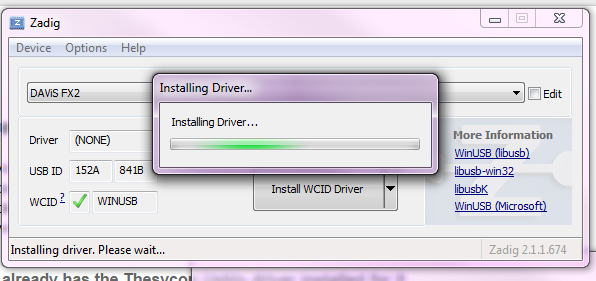
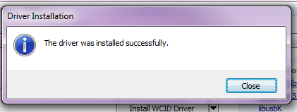
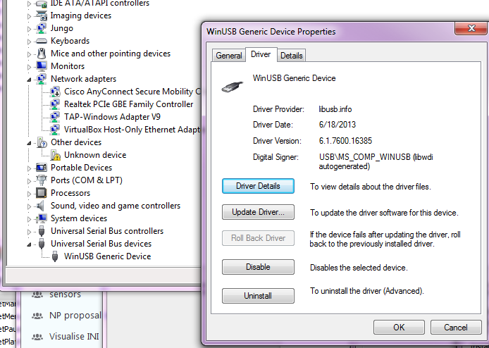
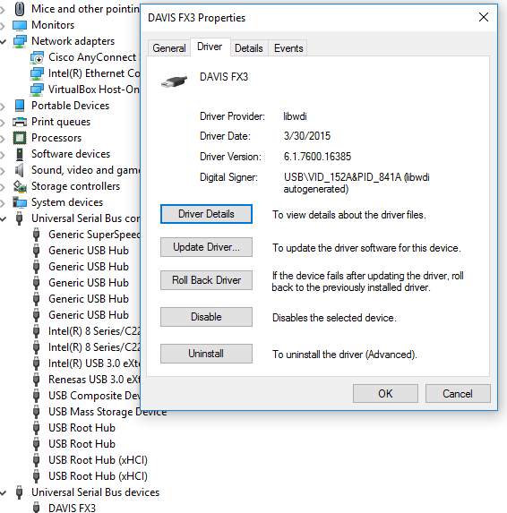
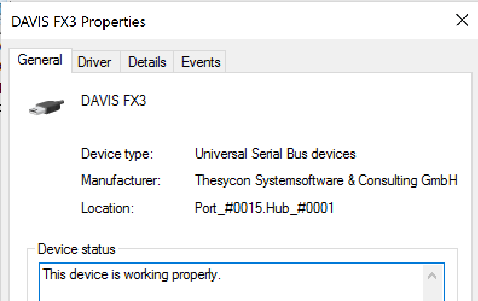
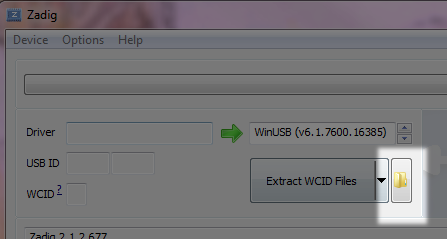
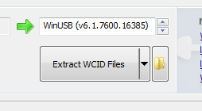

# iniVation USB Device Installation

## Table of Contents
- [Linux](#linux)
- [MacOS X](#macos-x)
- [Windows](#windows)
  - [Using Zadig to install the WinUSB driver](#using-zadig-to-install-the-winusb-driver)

Most of our devices use USB to communicate with a host system.
To ensure our software can recognize and interact with them, the correct
drivers have to be installed and the correct permissions granted,
depending on the operating system in use.

## Linux

Access to USB devices under Linux is provided by the standard kernel
USB drivers and the libusb library.
Permissions for the user running our software have to be configured
correctly to access the device. You must grant the user access to the USB device.
The appropriate udev files must be installed.
Our libcaer packages for Arch, Fedora, Ubuntu and Gentoo already provide these
files automatically, and libcaer compiled from source will also try to
install them into the appropriate location at /lib/udev/rules.d/.
If you're not using libcaer, or want to add the files manually,
this can be achieved by creating, as root, the appropriate udev rules files:

```bash
    /etc/udev/rules.d/65-inivation.rules

    /etc/udev/rules.d/66-inivation_dev.rules
```

You can find ready-to-use udev rules files in [our Git
repository](https://gitlab.com/inivation/devices-bin/tree/master/drivers/linux/udev-rules).

If you're using a distribution that supports SELinux tags (i.e. Fedora
since Fedora Core 2; Debian as of the Etch release; Ubuntu as of 8.04
Hardy Heron; OpenSUSE contains SELinux "basic enablement" as of
version 11.1; SUSE Linux Enterprise 11 features SELinux as a "technology
preview"), please use the udev rules files in the selinux/ sub-folder.

```bash
udevadm control --reload-rules
```

or, for newer udev versions:

```bash
udevadm control --reload
```

Now unplug and replug the camera into your computer.

## MacOS X

No particular steps have to be performed on MacOS X to access
our USB devices. Simply connect them to your system and start working with them!

## Windows

On Windows, our USB devices use the standard WinUSB driver.
All DAVIS models automatically request this driver from Windows the first
time they are connected, and if Windows already has the driver in its
database or has Automatic Driver Update activated, it should just find
the driver for you and properly install it.
Some times this doesn't happen, or the currently installed version is
either too old or incompatible, in that case you'll have to install the
driver manually using the Zadig tool. Very early DVS128 users (pre-2014)
might also still have the old Thesycon UsbIO driver installed; this
must be substituted with the WinUSB driver manually.
Please read the following section of this manual for more detailed instructions.

### Using Zadig to install the WinUSB driver

Zadig is available from [its official website](http://zadig.akeo.ie/).

Once you start Zadig, you should see a list of devices. If not, go to
options and tick "List all devices". Make sure you choose the correct
device (not for instance your mouse!).

Then click *Install WCID Driver* to install the WinUSB driver:
([WCID devices](https://github.com/pbatard/libwdi/wiki/WCID-Devices) are
installed automatically for new instances of devices plugged into the
computer)

<p align="center"></p>

If you already have a device installed, you may instead need to select
*Replace Driver* rather than *Install WCID Driver*. You should check
after installation (see below) that you actually have the correct WinUSB
driver installed.

You will be notified once done.

<p align="center"></p>

You should now see the correct driver (WinUSB Generic Device) in the
Device Manager. The libUSB and libUSBK drivers should NOT be installed;
they are intended for development of applications using the libusb-win32
or libusbK APIs.

After driver installation, you should see the driver installed in the
Device Manager as shown below:

##### Windows 7 example

<p align="center"></p>

##### Windows 10 example

<p align="center"></p>

Note that because iniVation uses a vendor/product identification (VID/PID)
range purchased from Thesycon, Windows will identify the device's manufacturer
as shown below; this is correct.

<p align="center"></p>

#### Troubleshooting Zadig driver installation

1.  We have seen that in some cases, after taking these steps, you
    need to restart your computer in order for our software to
    properly access the devices.
2.  We have also seen that Zadig does not list the device even when it
    is shown as "Unknown Device" in the Device Manager. In this case,
    you may need to extract the WinUSB driver manually. In Zadig,
    switch to *Options/Advanced mode* and use the folder icon to
    select a folder to extract the driver files to. Then use the usual
    Windows driver installer dialog to search this folder for the
    driver.

<p align="center">


</p>
