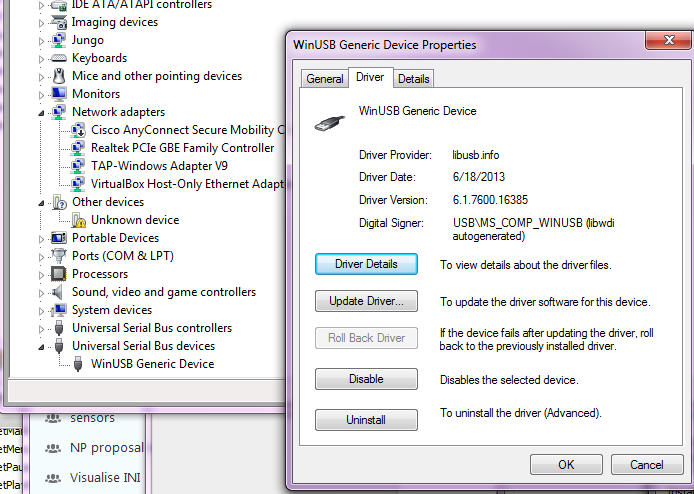

# User Guide - Reflashing Devices
---

This guide explains how to use our “Flashy” tool to benefit from
firmware and logic upgrades. It also documents USB drivers installation
for iniVation devices.

All our devices have a programmable logic device (CPLD or FPGA) for directly
interfacing with the sensor chip, and another chip for communication via USB
(usually a Cypress FX2 or FX3 chip). In this guide:
  - “firmware” refers to the programming of the USB communication chip;
  - “logic” refers to the programmable logic.

**PLEASE NOTE:**
- **THE LATEST FLASHY VERSION IS 1.4.4.**
- **THE LATEST FIRMWARE VERSION IS 6 FOR FX3 DEVICES (DAVIS346), 4 FOR FX2 DEVICES (DAVIS240).**
- **THE LATEST LOGIC VERSION IS 18.1 (after 9912 we have reset the numbering scheme!).**

**Software Compatibility Table**

| libcaer version | jAER version | firmware version | logic version |
| --------------- | ------------ | ---------------- | ------------- |
| 3.2.0           | -            | 6 (FX3), 4 (FX2) | 18.1          |
| 3.1.0           | 1.7.2        | 5 (FX3), 4 (FX2) | 18.0          |
| 3.0.0           | 1.7.1, 1.7.0 | 4                | 16.0          |
| 2.5.X, 2.4.X    | 1.6.X        | 4                | 9912          |


## Table of contents

- [What is Flashy?](#what-is-flashy)
- [Getting Flashy](#getting-flashy)
- [How to use Flashy](#how-to-use-flashy)
  - [Launching Flashy](#launching-flashy)
  - [Selecting a device](#selecting-a-device)
    - [Linux](#linux)
    - [Windows - Using Zadig to install WinUSB driver](#windows---using-zadig-to-install-winusb-driver)
      - [Troubleshooting zadig driver installation](#troubleshooting-zadig-driver-installation)
        - [Windows 7 example](#windows-7-example)
        - [Windows 10 example](#windows-10-example)
  - [Automatic Upgrade](#automatic-upgrade)
- [DAVIS240 problem with early prototypes](#davis240-problem-with-early-prototypes)

# What is Flashy?

With the transition in 2014 from using the Thesycon USB driver to using libusb
based USB device support for all our devices (DVS, DAVIS cameras),
it was decided to remove advanced device flashing capabilities from
jAER, which was the standard end-user tool for firmware updates.

These capabilities, along with other features such as low-level USB
information access, the ability to send arbitrary USB vendor requests,
and perform data stream tests, has instead been outsourced to its own
tool, named Flashy.

# Getting Flashy

Flashy is available as part of our DV software.

Please follow [these instructions](https://inivation.gitlab.io/dv/dv-docs/docs/getting-started/) to install.

# How to use Flashy

## Launching Flashy

Flashy can be launched from the DV GUI.

Please follow [these instructions](https://inivation.gitlab.io/dv/dv-docs/docs/update-firmware/) to upgrade your firmware.

## Selecting a device

Any operation in Flashy requires the user to select the appropriate
device in the upper-left drop-down menu.
If only one device is found, it is automatically selected.
If the desired device is not present as expected in later steps, this
may be for the following reasons:

### Linux

The permissions aren’t configured correctly for that user to access the
device. You must grant your user access to the USB device.
The appropriate udev files have to be installed first.
Our libcaer packages for Fedora, Ubuntu, Arch and Gentoo already provide these
files automatically, and libcaer compiled from source will also try to
install them into the appropriate location at /lib/udev/rules.d/.
In any other case, you'll need to add the files manually,
this can be achieved by creating, as root, the appropriate udev rules files:

```bash
    /etc/udev/rules.d/65-inivation.rules
```

You can find ready-to-use udev rules files in [our Git
repository](https://gitlab.com/inivation/dv/libcaer/-/tree/master/docs/udev-rules).

If you’re using a distribution that supports SELinux tags, such as
Fedora or Ubuntu, please use the udev rules files in the selinux/ sub-folder.

To reload the udev system without rebooting type, as root:

```bash
udevadm control --reload-rules
```

or, for newer udev versions:

```bash
udevadm control --reload
```

Now unplug and replug the camera into your computer. You’re done!

### Windows - Using Zadig to install WinUSB driver

If the desired device is not present it may be that the right driver
isn’t installed on Windows (WinUSB driver).

You may see for example, the message: “Impossible to open device ...”. In
this case, even if your device shows up as a WinUSB device in the device
manager you will need to use zadig to update the driver. You may have an
older WinUSB driver or even an experimental libusb driver that can work
sometimes but cause problems, for example in Windows 10,
frames from DAVIS cameras can stop being transferred using some of
these experimental drivers.

If you were previously using our old firmware (pre-2014, almost only
early DVS128 users), you probably have the
Thesycon UsbIO driver installed for your camera device. This must be
substituted with the WinUSB driver (standard USB driver from Microsoft).
Fortunately, doing so is easy with the Zadig tool.

Zadig is available from [its official website](http://zadig.akeo.ie/).

Once you start Zadig, you should see a list of devices. If not, go to
options and tick “List all devices”. Make sure you choose the correct
device (not for instance your mouse!).

Then click *Install WCID Driver* to install the WinUSB driver:
([WCID devices](https://github.com/pbatard/libwdi/wiki/WCID-Devices) are
installed automatically for new instances of devices plugged into the
computer).

<p align="center"></p>
If you already have a device installed, you may instead need to select
*Replace Driver* rather than *Install WCID Driver*. You should check
after installation (see below) that you actually have the correct WinUSB
driver installed.

You will be notified once done.

<p align="center"></p>
You should now see the correct driver (WinUSB Generic Device) in the
Device Manager. The libUSB and libUSBK drivers should NOT be installed;
they are intended for development of applications using the libusb-win32
or libusbK APIs.

#### Troubleshooting zadig driver installation:

1.  We have seen that in some cases, after taking these steps, you
    need to restart your computer in order for Flashy to not give the
    “Impossible to open device ...” message.
2.  We have also seen that Zadig does not list the device even when it
    is shown as “Unknown Device” in the Device Manager. In this case,
    you may need to extract the WinUSB driver manually. In Zadig,
    switch to *Options/Advanced mode* and use the folder icon to
    select a folder to extract the driver files to. Then use the usual
    Windows driver installer dialog to search this folder for the
    driver.

<p align="center">


</p>

After driver installation, you should see the driver installed in the
Device Manager as shown below:

##### Windows 7 example:

<p align="center"></p>

##### Windows 10 example:

<p align="center"></p>
Note that because iniVation uses a vendor/product identification (VID/PID)
range purchased from Thesycon, Windows will identify the driver as shown
below; this is OK.

<p align="center"></p>

## Automatic Upgrade

This is the standard, recommended way of using Flashy.
As soon as Flashy starts up, it will present you with the 'Basic' tab:

<p align="center"></p>
The first line of text summarizes information about your device.
If your firmware or logic versions are obsolete, you will see an appropriate
message, as well as a button to 'Upgrade Firmware' or 'Upgrade Logic'.
Press the button to start the upgrade process and wait until it is completed.
Then unplug and re-plug your device to complete the upgrade, you're done!

# DAVIS240 problem with early prototypes

If you cannot flash the EEPROM please take a look at the camera’s upper
side and make sure your device looks as follows:

<p align="center"></p>
If your device shows two rows of resistors instead of one as in the
following image, please get in touch with us at
[support@inivation.com](mailto:support@inivation.com)

<p align="center"></p>
