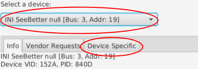
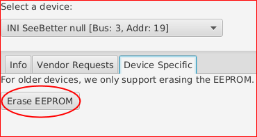
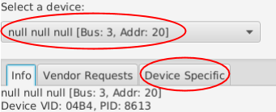
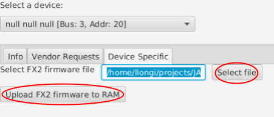
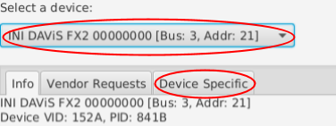
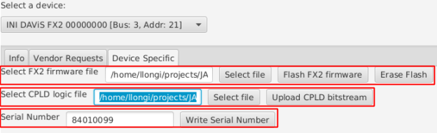
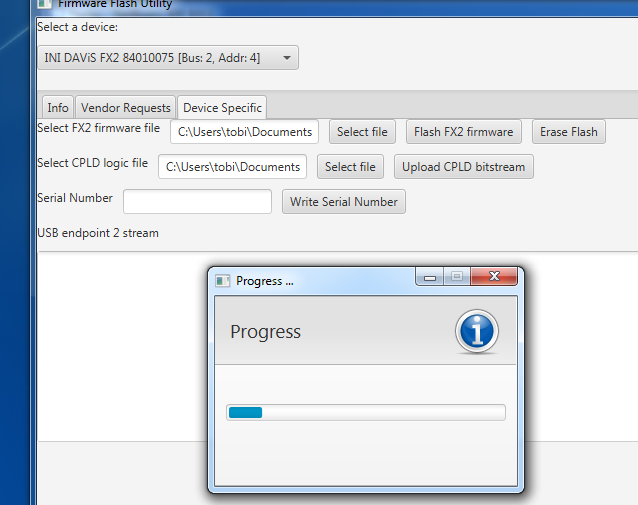

# User Guide - Reflashing Devices
---

This guide explains how to use our “Flashy” tool to benefit from
firmware and logic upgrades. It also documents USB drivers installation
for iniVation devices.

All our devices have a programmable logic device (CPLD or FPGA) for directly
interfacing with the sensor chip, and another chip for communication via USB
(usually a Cypress FX2 or FX3 chip). In this guide:
  - “firmware” refers to the programming of the USB communication chip;
  - “logic” refers to the programmable logic.

PLEASE NOTE:
- THE LATEST FLASHY VERSION IS 1.1.0.
- THE LATEST FIRMWARE VERSION IS 4.
- THE LATEST LOGIC VERSION IS 16 (after 9912 we have reset the numbering scheme!).


## Table of contents
- [What is Flashy?](#what-is-flashy)
- [Getting Flashy](#getting-flashy)
- [How to use Flashy](#how-to-use-flashy)
  - [Launching Flashy](#launching-flashy)
  - [Selecting a device](#selecting-a-device)
    - [Linux](#linux)
    - [Windows - Using Zadig to install WinUSB driver](#windows---using-zadig-to-install-winusb-driver)
      - [Troubleshooting zadig driver installation:](#troubleshooting-zadig-driver-installation)
        - [Windows 7 example:](#windows-7-example)
        - [Windows 10 example:](#windows-10-example)
  - [Automatic Upgrade](#automatic-upgrade)
  - [Manual Upgrade](#manual-upgrade)
    - [Section 1: erasing the EEPROM](#section-1-erasing-the-eeprom)
    - [Section 2: uploading firmware for the first time](#section-2-uploading-firmware-for-the-first-time)
    - [Section 3: uploading new firmware and new logic](#section-3-uploading-new-firmware-and-new-logic)
- [DAVIS240 problem with early prototypes](#davis240-problem-with-early-prototypes)
- [Which device? Which firmware? Which logic?](#which-device-which-firmware-which-logic)

# What is Flashy?

With the transition in 2014 from using the Thesycon USB driver to using libusb
based USB device support for all our devices (DVS, DAVIS cameras),
it was decided to remove advanced device flashing capabilities from
jAER, which was the standard end-user tool for firmware updates.

These capabilities, along with other features such as low-level USB
information access, the ability to send arbitrary USB vendor requests,
and perform data stream tests, has instead been outsourced to its own
tool, named Flashy.

# Getting Flashy

It requires Oracle Java 1.8 (Oracle JDK 8) to run, since it uses new
technologies such as JavaFX. Please make sure to install at least Java
version 1.8.0 u40. The version requirement is verified at startup.
A directly runnable JAR can be found at:

[https://github.com/inivation/flashy/releases](https://github.com/inivation/flashy/releases)

The latest official version is 1.1.0.
Download the -with-dependencies JAR file for easy deployment.

# How to use Flashy

## Launching Flashy

Flashy is launched by executing the JAR file:

> Flashy-1.1.0-jar-with-dependencies.jar

To execute this JAR, on Windows just double-click it.
On Linux or Mac OS X, open a shell prompt and enter:

> java -jar Flashy-1.1.0-jar-with-dependencies.jar

Note: ensure that jAER or cAER are not running at the same time!

## Selecting a device

Any operation in Flashy requires the user to select the appropriate
device in the upper-left drop-down menu.
If only one device is found, it is automatically selected.
If the desired device is not present as expected in later steps, this
may be for the following reasons:

### Linux

The permissions aren’t configured correctly for that user to access the
device. You must grant your user access to the USB device.
The appropriate udev files have to be installed first.
Our libcaer packages for Fedora, Ubuntu and Gentoo already provide these
files automatically, and libcaer compiled from source will also try to
install them into the appropriate location.
If you're not using libcaer, or want to add the files manually,
this can be achieved by creating, as root, the appropriate udev rules files:

```bash
    /etc/udev/rules.d/65-inivation.rules

    /etc/udev/rules.d/66-inivation_dev.rules
```

You can find ready-to-use udev rules files in [our Git
repository](https://github.com/inivation/devices-bin/tree/master/drivers/linux/udev-rules).

If you’re using a distribution that supports SELinux tags, such as
Fedora or Ubuntu, please use the udev rules files in the selinux/ sub-folder.

To reload the udev system without rebooting type, as root:

```bash
    $ udevadm control --reload-rules
```

or, for newer udev versions:

```bash
    $ udevadm control --reload
```

Now unplug and replug the camera into your computer. You’re done!

### Windows - Using Zadig to install WinUSB driver

If the desired device is not present it may be that the right driver
isn’t installed on Windows (WinUSB driver).

You may see for example, the message: “Impossible to open device ...”. In
this case, even if your device shows up as a WinUSB device in the device
manager you will need to use zadig to update the driver. You may have an
older WinUSB driver or even an experimental libusb driver that can work
sometimes but cause problems, for example in Windows 10 with jAER,
frames from DAVIS cameras can stop being transferred using some of
these experimental drivers.

If you were previously using our old firmware (pre-2014, almost only
early DVS128 users), you probably have the
Thesycon UsbIO driver installed for your camera device. This must be
substituted with the WinUSB driver (standard USB driver from Microsoft).
Fortunately, doing so is easy with the Zadig tool.

Zadig is available from [its official website](http://zadig.akeo.ie/).

Once you start Zadig, you should see a list of devices. If not, go to
options and tick “List all devices”. Make sure you choose the correct
device (not for instance your mouse!).

Then click *Install WCID Driver* to install the WinUSB driver:
([WCID devices](https://github.com/pbatard/libwdi/wiki/WCID-Devices) are
installed automatically for new instances of devices plugged into the
computer).

<p align="center"></p>

If you already have a device installed, you may instead need to select
*Replace Driver* rather than *Install WCID Driver*. You should check
after installation (see below) that you actually have the correct WinUSB
driver installed.

You will be notified once done.

<p align="center"></p>

You should now see the correct driver (WinUSB Generic Device) in the
Device Manager. The libUSB and libUSBK drivers should NOT be installed;
they are intended for development of applications using the libusb-win32
or libusbK APIs.

#### Troubleshooting zadig driver installation:

1.  We have seen that in some cases, after taking these steps, you
    need to restart your computer in order for Flashy to not give the
    “Impossible to open device ...” message.
2.  We have also seen that Zadig does not list the device even when it
    is shown as “Unknown Device” in the Device Manager. In this case,
    you may need to extract the WinUSB driver manually. In Zadig,
    switch to *Options/Advanced mode* and use the folder icon to
    select a folder to extract the driver files to. Then use the usual
    Windows driver installer dialog to search this folder for the
    driver.

<p align="center">


</p>

After driver installation, you should see the driver installed in the
Device Manager as shown below:

##### Windows 7 example:

<p align="center"></p>

##### Windows 10 example:

<p align="center"></p>

Note that because iniVation uses a vendor/product identification (VID/PID)
range purchased from Thesycon, Windows will identify the driver as shown
below; this is OK.

<p align="center"></p>

## Automatic Upgrade

This is the standard, recommended way of using Flashy.
As soon as Flashy starts up, it will present you with the 'Basic' tab:

<p align="center"></p>

The first line of text summarizes information about your device.
If your firmware or logic versions are obsolete, you will see an appropriate
message, as well as a button to 'Upgrade Firmware' or 'Upgrade Logic'.
Press the button to start the upgrade process and wait until it is completed.
Then unplug and re-plug your device to complete the upgrade, you're done!


## Manual Upgrade

Please note this is not recommended for standard use-cases.
To do simple upgrades, please follow the [Guided Upgrade](#guided-upgrade) instructions.

If you have an older device which still contains old firmware and logic,
you will first need to erase its EEPROM. Flashy automatically detects
when this is the case and offers you the option. Take a look at
[Section 1](#section-1-erasing-the-eeprom) for detailed instructions.

If you have a device with an empty EEPROM, the first thing to do then is
to upload a temporary firmware, which is then used to write the new,
final firmware to EEPROM and upload the new logic. Please see
[Section 2](#section-2-uploading-firmware-for-the-first-time) for details
on this.

Once you have a running, new firmware, you can just update the firmware
or logic with a new revision at the click of a button. See
[Section 3](#section-3-uploading-new-firmware-and-new-logic) for details.

## Section 1: erasing the EEPROM

Connect your device and launch Flashy, then select your device from the
drop-down menu at the top left. Devices that still run the older
firmware will usually appear as “INI SeeBetter null”.

Navigate then to the “Advanced” tab on the right.

<p align="center"></p>

You will be presented with your only option of erasing the current
content of the EEPROM.

Please click on it and wait for the process to complete.

<p align="center"></p>

Once done, close Flashy and unplug the device. Plug it in again and
continue to Section 2. 

## Section 2: uploading firmware for the first time

Brand new devices from the factory, or after an EEPROM erase such as in
section 1, do not contain any firmware at all. A first, temporary
firmware must be uploaded, to then write the final one to EEPROM.

Connect your device and launch Flashy, then select your device from the
drop-down menu at the top left. Devices without firmware will usually
appear as “null null null”.

Navigate then to the “Advanced” tab on the right.

<p align="center"></p>

There you will need to select a file, containing the firmware you wish
to upload, and then press the appropriate button. The needed firmware
can be found in our Git repository.

For DAVIS240 V4 boards (small USB 2.0 boards), it’s the following
file:

<!--TO CHANGE-->
[https://github.com/inivation/devices-bin/raw/master/firmware/CypressFX2/SeeBetterLogic_DAVIS.bix](https://github.com/inivation/devices-bin/raw/master/firmware/CypressFX2/SeeBetterLogic_DAVIS.bix)(BIX format)

For DVS128 reprogramming, please also use the same DAVIS240 file as
above at this step!

<p align="center"></p>

This upload is usually completed very quickly, you may just see the
progress bar window flash by. Don’t be alarmed by this, it’s expected.

**Once done, close Flashy, but do *NOT* unplug the device! Continue
with Section 3.**

## Section 3: uploading new firmware and new logic

Connect your device and launch Flashy, then select your device from the
drop-down menu at the top left. Devices will usually appear as “INI
DAVIS FX2”, followed by their serial number.

Navigate then to the “Advanced” tab on the right.

<p align="center"></p>

The following screen will appear:

<p align="center"></p>

As you can see, it’s divided into three parts:

1.  The first row is concerned with updating the firmware of the USB chip
    of the device (Cypress FX2 or FX3, depending on the board you have). You
    can either load new firmware, or erase the EEPROM (“Erase Flash”
    button). To load new firmware, select the appropriate file, and then
    press the “Flash FX2/3 firmware” button.

    For DAVIS240 V4 boards (small USB 2.0 boards), it’s the following
    file:

    <!--TO CHANGE-->
    [https://github.com/inivation/devices-bin/raw/master/firmware/CypressFX2/SeeBetterLogic_DAVIS.iic](https://github.com/inivation/devices-bin/raw/master/firmware/CypressFX2/SeeBetterLogic_DAVIS.iic)(IIC format)

    For DVS128 boards, it’s a different
    file:

    <!--TO CHANGE-->
    [https://github.com/inivation/devices-bin/raw/master/firmware/CypressFX2/firmwareFX2_RetinaCPLD.iic](https://github.com/inivation/devices-bin/raw/master/firmware/CypressFX2/firmwareFX2_RetinaCPLD.iic)(IIC format)

2. The second row is used to update the logic (bitstream) on the
    CPLD/FPGA.

    Select the appropriate file and press “Upload CPLD bitstream”. Uploading
    new logic to the small board CPLD requires about 4 minutes.

    All bitstream binaries can be found in the following directory in our
    Git
    repository:

    <!--TO CHANGE-->
    [https://github.com/inivation/devices-bin/tree/master/logic/SystemLogic2/](https://github.com/inivation/devices-bin/tree/master/logic/SystemLogic2/)

    For DAVIS240 V4 boards (small USB 2.0 boards), use the following files:

      - DAVIS240a chips -> <!--TO CHANGE--> [MachXO_DAVIS/SystemLogic2_MachXO_DAVIS240a.xsvf](https://github.com/inivation/devices-bin/raw/master/logic/SystemLogic2/MachXO_DAVIS/SystemLogic2_MachXO_DAVIS240a.xsvf)

      - DAVIS240b chips -> <!--TO CHANGE--> [MachXO_DAVIS/SystemLogic2_MachXO_DAVIS240b.xsvf](https://github.com/inivation/devices-bin/raw/master/logic/SystemLogic2/MachXO_DAVIS/SystemLogic2_MachXO_DAVIS240b.xsvf)

      - DAVIS240c chips -> <!--TO CHANGE--> [MachXO_DAVIS/SystemLogic2_MachXO_DAVIS240c.xsvf](https://github.com/inivation/devices-bin/raw/master/logic/SystemLogic2/MachXO_DAVIS/SystemLogic2_MachXO_DAVIS240c.xsvf)

    For DVS128 boards, uploading new logic is not usually required. If you
    still think it’s needed in your case, the following file is the right
    one:

    <!--TO CHANGE-->
    [https://github.com/inivation/devices-bin/raw/master/logic/SystemLogic1/DVS128_logic.xsvf](https://github.com/inivation/devices-bin/raw/master/logic/SystemLogic1/DVS128_logic.xsvf)

    While flashing firmware or logic, you should see a progress dialog like
    this; if you don’t see this progress bar then there is some error, most
    likely an outdated Java version.

    <p align="center"></p>

3. The third row can be used to set the device’s serial number.

    Just enter up to 8 characters into the text field and press “Write
    Serial Number”. This should only be done the very first time, when the
    device still shows its default serial number of “00000000”.

    Please don’t change the serial number unless you really need to, and be
    prepared to read tiny numbers printed on the board in case of support
    requests to us if you do.

    Once you’re done, close Flashy and unplug the device.

    After plugging it in again, you’re ready to go! Enjoy your up-to-date
    iniVation camera.

# DAVIS240 problem with early prototypes

If you cannot flash the EEPROM please take a look at the camera’s upper
side and make sure your device looks as follows:

<p align="center"></p>

If your device shows two rows of resistors instead of one as in the
following image, please get in touch with us at
[support@inivation.com](mailto:support@inivation.com)

<p align="center"></p>

# Which device? Which firmware? Which logic?

**TO CHANGE ALL LINKS**
                                                                                                                                                        
| Camera model       | Firmware                                                                                                                            | Logic                                                                                                                                                                                                  |
| ------------------ | ----------------------------------------------------------------------------------------------------------------                    | ------------------------------------------------------------------------------------------------------------------------------------------------------------------------------------------------------ |
| DVS128             | [firmwareFX2_RetinaCPLD.iic](https://github.com/inivation/devices-bin/raw/master/firmware/CypressFX2/firmwareFX2_RetinaCPLD.iic)      | [DVS128_logic.xsvf](https://github.com/inivation/devices-bin/raw/master/logic/SystemLogic1/DVS128_logic.xsvf)                                                                                            |
| DAVIS240C          | [SeeBetterLogic_DAVIS.iic](https://github.com/inivation/devices-bin/raw/master/firmware/CypressFX2/SeeBetterLogic_DAVIS.iic)          | [SystemLogic2_MachXO_DAVIS240c.xsvf](https://github.com/inivation/devices-bin/raw/master/logic/SystemLogic2/MachXO_DAVIS/SystemLogic2_MachXO_DAVIS240c.xsvf )                                            |
| DAVIS240B          | [SeeBetterLogic_DAVIS.iic](https://github.com/inivation/devices-bin/raw/master/firmware/CypressFX2/SeeBetterLogic_DAVIS.iic)          | [SystemLogic2_MachXO_DAVIS240b.xsvf](https://github.com/inivation/devices-bin/raw/master/logic/SystemLogic2/MachXO_DAVIS/SystemLogic2_MachXO_DAVIS240b.xsvf)                                             |
| DAVIS240A          | [SeeBetterLogic_DAVIS.iic](https://github.com/inivation/devices-bin/raw/master/firmware/CypressFX2/SeeBetterLogic_DAVIS.iic)          | [SystemLogic2_MachXO_DAVIS240a.xsvf](https://github.com/inivation/devices-bin/raw/master/logic/SystemLogic2/MachXO_DAVIS/SystemLogic2_MachXO_DAVIS240a.xsvf)                                             |
| DAVIS346           | [DAVIS346_80MHz_16bit_v4.img](https://github.com/inivation/devices-bin/raw/master/firmware/CypressFX3/DAVIS346_80MHz_16bit_v4.img)    | [SystemLogic2_MachXO3_DAVIS346.bit](https://github.com/inivation/devices-bin/raw/master/logic/SystemLogic2/MachXO3_DAVIS/SystemLogic2_MachXO3_DAVIS346.bit )                                             |
| DevKit FX3 USB 3.0 | [DAVIS_FX3_80MHz_16bit_v4.img](https://github.com/inivation/devices-bin/raw/master/firmware/CypressFX3/DAVIS_FX3_80MHz_16bit_v4.img ) | Daughter Board - Chip V10 - DAVIS640 -> [SystemLogic2_ECP3_DAVIS640.bit](https://github.com/inivation/devices-bin/raw/master/logic/SystemLogic2/ECP3_DAVIS/SystemLogic2_ECP3_DAVIS640.bit)               |
|                    |                                                                                                                                     | Daughter Board - Chip V9 - DAVIS346B -> [SystemLogic2_ECP3_DAVIS346b.bit](https://github.com/inivation/devices-bin/raw/master/logic/SystemLogic2/ECP3_DAVIS/SystemLogic2_ECP3_DAVIS346b.bit)             |
|                    |                                                                                                                                     | Daughter Board - Chip V8 - DAVIS346Cbsi -> [SystemLogic2_ECP3_DAVIS346cBSI.bit](https://github.com/inivation/devices-bin/raw/master/logic/SystemLogic2/ECP3_DAVIS/SystemLogic2_ECP3_DAVIS346cBSI.bit)    | 
