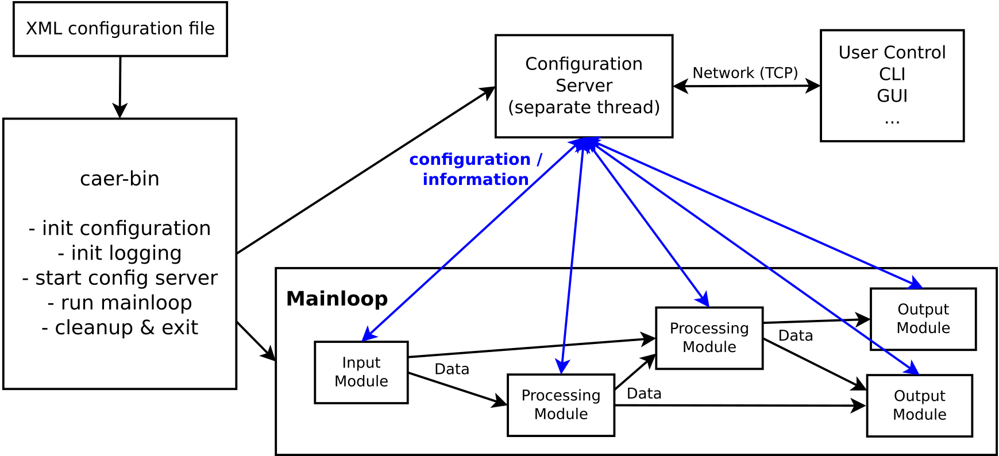

# User guide - cAER
> *For more information, visit [iniVation support](https://inivation.com/support/)*
---

## This guide is still work in progress!
Things to do:

- merge the two files present in the GitHub repository. They are already present in this file (below are the two internal link)
- decide which "installation" guide mantain, the one in cAER README (i vote for it) or this one in this guide
- check if documentation is up to date, remove what unuseful or old or chapters never completed

[cAER repository tex documentation (last modification 19/10/2017)](#cAER-repository-tex-documentation-last-modification-19102017)

[cAER "The modules system" txt file documentation](#cAER-the-modules-system-txt-file-documentation)

# cAER repository tex documentation (last modification 19/10/2017)

This guide gives information about cAER software, a software framework for event processing.

## Table of contents

-   [Introduction](#introduction)
-   [Installation](#installation)
    -   [Automated Installation](#automated-installation)
        -   [Fedora Linux](#fedora-linux)
        -   [Gentoo Linux](#gentoo-linux)
        -   [Ubuntu Linux](#ubuntu-linux)
    -   [Manual Installation](#manual-installation)
-   [Architecture](#architecture)
    -   [Framework](#framework)
    -   [Threads](#threads)
    -   [Events](#events)
    -   [XML Configuration](#xml-configuration)
    -   [Mainloop](#mainloop)
        -   [Asynchronous inputs](#asynchronous-inputs)
    -   [Modules and Connectivity](#modules-and-connectivity)
-   [Usage](#usage)
    -   [caer-config.xml](#caer-configxml)
    -   [caer-bin](#caer-bin)
    -   [Modules](#modules)
        -   [DVS128](#dvs128)
        -   [eDVS](#edvs)
        -   [DAVIS](#davis)
        -   [Dynap-SE](#dynap-se)
        -   [Background Activity Filter](#background-activity-filter)
        -   [Visualizer](#visualizer)
        -   [Camera Calibration](#camera-calibration)
        -   [Frame Enhancer](#frame-enhancer)
        -   [Frame Statistics](#frame-statistics)
        -   [Statistics](#statistics)
        -   [Pose Estimation](#pose-estimation)
        -   [Median Tracker](#median-tracker)
        -   [Rotate Filter](#rotate-filter)
        -   [File](#file)
        -   [Unix socket client](#unix-socket-client)
        -   [UDP network client](#udp-network-client)
        -   [TCP network client](#tcp-network-client)
        -   [TCP network server](#tcp-network-server)
    -   [Command-Line Utilities](#command-line-utilities)
        -   [caerctl](#caerctl)
        -   [unixststat](#unixststat)
        -   [udpststat](#udpststat)
        -   [tcpststat](#tcpststat)
    -   [GUI Utilities](#gui-utilities)
        -   [caerctl-gui-javafx](#caerctl-gui-javafx)
-   [Development](#development)
    -   [Structure](#structure)
    -   [Input modules](#input-modules)
    -   [Processing modules](#processing-modules)
    -   [Output modules](#output-modules)
    -   [SSHS](#sshs)
    -   [Remote configuration](#remote-configuration)
    -   [Logging](#logging)
    -   [Modules](#modules-1)
        -   [Modules API](#modules-api)
        -   [Accessing Event Data](#accessing-event-data)
    -   [Writing a new module](#writing-a-new-module)
        -   [C++ support](#c-support)
    -   [Porting old modules](#porting-old-modules)
    -   [Visualizer: Renderer and Event
        Handlers](#visualizer-renderer-and-event-handlers)

# Introduction

cAER is a software framework for event processing, targeted mainly
towards embedded systems, but also with visualization capabilities that
make it suitable for desktop and research use. Low-power embedded
systems are a natural match for low-power neuromorphic sensors and
processors. In contrast to the
[jAER](https://github.com/SensorsINI/jaer) framework, cAER is written in
C/C++, and does not require a GUI to function; it can also be completely
controlled via network.

It strives to satisfy the following requirements:

  - able to run on a wide range of low-power, embedded systems

  - small memory footprint, conscious usage of CPU cores

  - able to run on the Linux, MacOS X and Windows operating systems

  - able to communicate with external USB and serial devices

  - no specific focus on visualization, no dependency on any graphical
    user interface

  - network-enabled to communicate easily with other systems and
    frameworks (like jAER) or forward data to other processing nodes

  - able to run without supervision for long amounts of time

  - remotely configurable, without the need for a graphical user
    interfaces

  - reusable code: framework structure and modularity, documentation

# Installation

## Automated Installation

We provide ready-made packages for the Linux distributions Fedora,
Gentoo and Ubuntu.

### Fedora Linux

We provide a [COPR
repository](https://copr.fedorainfracloud.org/coprs/llongi/inilabs/) for
Fedora 25, 26 and 27(rawhide) on the x86 and x86_64 architectures.

The following commands install cAER:

```bash
    $ sudo dnf copr enable llongi/inilabs
    $ sudo dnf install caer
```

### Gentoo Linux

A valid Gentoo ebuild repository is available
[here](https://github.com/inilabs/caer/tree/master/packaging/gentoo-ebuild-repository/).
The package is called ‘dev-cpp/caer’.

### Ubuntu Linux

We provide a [PPA
repository](https://launchpad.net/~llongi/+archive/ubuntu/inilabs/) for
Ubuntu Trusty (14.04 LTS), Xenial (16.04 LTS), Zesty (17.04) and Artful
(17.10) on the x86, x86_64, arm and arm64 architectures.

The following commands install cAER:

```bash
    $ sudo add-apt-repository ppa:llongi/inilabs
    $ sudo apt-get update
    $ sudo apt-get install caer
```

Windows, MacOS X and other Linux distribution users, please follow the
’Manual Installation’ [2](#manual-installation) instructions.

## Manual Installation

To enhance portability, we have tried to keep dependencies to a minimum.
The following software is currently required to successfully compile the
base of the cAER framework:

  - A C/C++ compiler supporting the C11 and C++14 language standards.
    [GCC](https://gcc.gnu.org/) 5.2 and newer, as well as
    [LLVM/Clang](https://clang.llvm.org/) 3.6 and newer satisfy that
    requirement.

  - [cmake](https://cmake.org/) >= 2.6 for easy build management and
    cross-platform compilation support.

  - [boost](http://www.boost.org/) >= 1.50 (with system, filesystem and
    program_options modules) for cross-platform file-access and
    networking support, as well as advanced C++ algorithms.

  - <!--TO CHANGE-->
    [libcaer](https://github.com/inilabs/libcaer) >= 2.4.0 for event
    definitions and USB/serial device access.

  - Optional: [tcmalloc](https://github.com/gperftools/gperftools) >=
    2.2 for faster memory allocation.

All the dependencies are usually available through your operating
system’s package manager. On MacOS X, we recommend using
[Homebrew](https://brew.sh/). On Windows, [MSYS2](http://www.msys2.org/)
provides a good package management software.

For detailed installation instructions on libcaer, please visit <!--TO CHANGE--> [this
website](https://inilabs.com/support/software/libcaer/).

For more details on the installation procedure, please refer to the main <!--TO CHANGE--> [README](https://raw.githubusercontent.com/inilabs/caer/master/README.md)
file. Windows users must also look at
<!--TO CHANGE-->
[README.Windows](https://raw.githubusercontent.com/inilabs/caer/master/README.Windows)
for detailed installation instructions.

# Architecture

A work pattern of getting events from an input, then processing and
filtering them, and finally moving them to an output, and repeating
those steps again and again (usually in a loop), is common to most
event-based processing software, and also forms the basis for the
architecture of cAER.

## Framework

The idea behind a framework is to provide easy access and abstractions
to common tasks, in this case tasks such as configuration management,
logging, process/thread set-up, device management and so on. It should
offer the user a simple, well-defined way to put together the parts of
the framework he needs for his application, and be easy to deploy across
various systems. It should further be easily possible to extend the
functionality of the framework with self-written, application-specific
code.

To this end it was decided to implement cAER as a collection of basic
framework functionality and loadable modules, which could easily be
plugged and extended by the user.

A broad overview of the resulting architecture is shown in the figure below. The various
components will be explained in detail in the following sections.

<p align="center"></p>

## Threads

The main program thread is responsible for setting up configuration and
logging, and then start handling data in a continuous loop we call the
*mainloop*. The *mainloop* runs all the modules that a user specifies,
which may in turn start their own threads as needed (for example to
handle asynchronous inputs or outputs). A further thread is started for
the run-time configuration system, to allow users to modify system
settings at any time, while other parts of the program are running. The
total number of always running system threads is thus two (main thread +
configuration thread).

## Events

Data is exchanged between modules in the form of events. The event
format was designed to fulfil the following requirements:

  - low memory consumption

  - fast data access

  - extensibility to future devices

  - low iteration overhead

  - low deletion overhead

Low memory consumption is achieved by correctly sizing each data type
and compressing multiple pieces of data into integers; when the
particular data type would not use all 32 bits available to it, but can
make do with just a fraction of those. For example, with a quantity with
range [0,15] just four bits are enough, and other data can be squeezed
into the remaining 28 bits. A 32 bit integer is taken as the base size,
since accessing it is efficient on all supported architectures,
regardless of the use of 32 or 64 bit processors.

Fast data access is still guaranteed, since, at most, accessing data
stored with the above method would require an integer shift and AND
operation, while storing data an integer shift and OR operation.
Sometimes just an AND or OR operation, when the shift amount is zero.
Such bit-wise operations are extremely fast on modern CPU architectures,
usually taking just 1 CPU cycle. Intel for example reports latency
values of 1 cycle for AND/OR instructions and 1 cycle for shifts
(SHL/SHR instructions) for modern Haswell processors and for its
Silvermont architecture (successor to Atom for low-power scenarios) in
[its manuals](https://software.intel.com/en-us/articles/intel-sdm).

To enhance iteration performance, and generally reduce the load that
moving events from one processing stage to the other incurs; events are
always grouped together into packets, and kept adjacent in memory. Going
from event to event just requires a pointer increment, and moving a
packet between processing stages just involves passing around a pointer
to it.

A further benefit of grouping events into packets is that a packet
header can be defined and used to store useful information about the
events it contains, such as their type or source, in a non-redundant
way, instead of putting that information with each event separately,
further saving memory.

Finally, concerning the low deletion overhead, instead of implementing
the removal of events by copying only the valid ones to a new packet, or
shifting them around inside the current packet, a 1-bit boolean flag has
been made a mandatory part of each event, indicating if the event is to
be considered valid (flag is 1) or invalid (flag is 0). A side-benefit
of this approach is that it is still possible for later processing
stages to examine invalidated events, which can be useful for statistics
for example.

The full definition of each supported event type, as well as how those
events are treated in the context of files and network streams, can be
found in the <!--TO CHANGE--> [AEDAT File
Format](https://inilabs.com/support/software/fileformat/#h.oqxw4mby5yg2)
document. cAER internally uses the event formats defined in libcaer,
which in turn follows the *AEDAT 3.1* specification.

## XML Configuration

An external XML file holds all the configuration that gets applied to
cAER at start-up and loaded into memory. At shut-down, the file is
updated with any changes made to the configuration. While the , the
Super Simple Hierarchical Storage (SSHS, [5](#sshs)) library was
written and then employed. A configuration file from which to load the
initial settings is also part of this system.

On the first execution of the *caer* program, all configuration will be
initialized to its default values.

Manipulating configuration values is possible either by using the
*caerctl* utility (see section [4.1](#caerctl)) at run-time, or
by editing the XML configuration file that is written each time the
program shuts down. The following listing shows an excerpt from the
configuration file in question:

``` html
<sshs version="1.0">
  <node name="" path="/">
    <node name="1" path="/1/">
      <node name="2-FileOutput" path="/1/2-FileOutput/">
        <attr key="directory" type="string">/home/caer</attr>
        <attr key="prefix" type="string">caer_out</attr>
        <attr key="validEventsOnly" type="bool">true</attr>
      </node>
      ...
    </node>
    ...
  </node>
</sshs>
```

The first line specifies that this file conforms to the SSHS format
specification (from section [5](#sshs)), version 1.0. After that,
the tree-like hierarchical structure is clearly visible, with the root
node (line 2) holding all Mainloops (line 3), which in turn hold all the
modules (line 4). The ```<attr>``` tags contain the configuration values
themselves, the *key* attribute identifies and names the value, the
*type* attribute specifies its SSHS type, and the tag’s value itself
represents the effective configuration value.

In the above example, the *validEventsOnly* configuration value is of
boolean type, and can assume values of *true* or *false*.

To allow for consistent configuration updates inside the modules,
changes to the configuration are only applied once per Mainloop cycle,
by the module state machine, right before the actual data processing
code is executed (see *moduleConfig* in section [8](#modules)).
Since changes to the configuration can happen at any time, due to the
configuration server thread (see section
[6](#remote-configuration)), a mechanism had to be developed to
notify the running modules that a configuration refresh was desired on
their next execution. A single, atomic variable in each module is used
for the purpose of asynchronously signaling configuration changes,
allowing the module to quickly determine on each run if it needs to
update its configuration and react to eventual changes. This provides an
efficient inter-thread communication solution, instead of relying on
expensive locks to synchronize some additional state variable. SSHS
listeners are added to each module’s configuration nodes, to set the
above atomic variable appropriately when changes occur.

## Mainloop

As mentioned at the start of chapter [architecture](#architecture), the core of
any kind of data processing architecture is represented by the following
three steps:

  - get data from (one or more) inputs (*sources*)

  - process / filter data

  - send data to (one or more) outputs (*drains*)

Such processing usually happens in a loop, getting new data as soon as
being finished with the old one or at fixed intervals in time.

In event-driven data processing, and especially in low-power scenarios,
the expectation is that those three steps only happen when the input
actually has generated meaningful data that can be processed, not
before, and possibly also not after, to still guarantee acceptable
reaction times to new events. The continuous repetition of the tree
above steps still happens, but the start condition slightly changes to
hinge on the availability of new events to process.

A simple and efficient implementation is still represented by a loop,
which shall run the processing functions only when there is more data,
or else wait for a small time constant, before checking the availability
of data again.

In cAER this process is simply called the Mainloop, short for
Main-Data-Processing-Loop. Mainloops are defined by the user and connect
inputs to processing modules and finally to outputs. They represent the
actual operations the user wants to repeatedly see happen on the data.
The thread-function that runs a Mainloop looks like this (in
pseudo-code):

```c
    while (run_system) {
        if (data_is_available) {
            execute_mainloop_definition();
        }
        else {
            sleep(1 ms);
        }
    }
```

### Asynchronous inputs

To be able to run the Mainloop only when data is available, something
else has to be running and making that data available. The input modules
have a secondary part, which is executing inside a separate thread, and
is responsible for getting the bare data from connected devices, network
streams or files, and signaling its availability to the Mainloop (the
data_is_available variable in the pseudo-code above).

The input threads themselves employ techniques, such as blocking I/O, or
asynchronous USB transfers, that also limit activity to only when data
is available at the device or network level, to avoid unnecessary
overhead. At this point, minimal processing is performed to interpret
the data and format it according to the event packet definitions from
section [3](#events), and then the data is made available to the
Mainloop. The actual exchange of data between the two threads happens by
means of a special lock-free variant of a ring-buffer, a
high-performance, array-based data structure.

Memory allocated by the input threads is later automatically reclaimed
after the current cycle of the Mainloop has completed, completely
removing this particular concern from the user.

## Modules and Connectivity

# Usage

## caer-config.xml

## caer-bin

It also tries to interpret any given command-line parameters and uses
their values to set and override previous configuration settings. The
command-line override takes the following format and can be repeated
multiple times to override multiple options: 

```html
 -o <node string> <key string> <key type string> <value string>
```

The configuration file-name parameter can be either an absolute path to
a file or a single file-name, which is treated as residing inside the
current working directory of the program. It is possible to disable the
loading and saving of the settings to the configuration file by passing
NULL as a value instead of a
    file-name.

## Modules

### DVS128

```c
    void caerInputDVS128(uint16_t moduleID, caerPolarityEventPacket *polarity, caerSpecialEventPacket *special);
```

This input module allows a DVS128 camera to be connected and events to
be captured from it. As can be seen from its function signature above,
it generates polarity event packets and special event packets, by
putting their address into the given pointer. If no event packets of a
certain type are available at the moment, NULL is assigned instead. This
is done to not delay the current Mainloop cycle if certain types of
produced events are much more scarce than others. To indicate that one
is not interested at all in an event packet of a certain type, NULL can
be passed to the function instead of a pointer.

As explained in section [5.1](#asynchronous-inputs), this module
starts a separate thread, the Data Acquisition Thread, that reads the
events from the hardware device and transforms them into suitable event
packets, as defined in section [3](#events), and then passes them on
for further processing to the Mainloop. This module uses the libusb
library for accessing the DVS128 camera, which is connected to its host
via a USB 2.0 interface. For higher performance, asynchronous USB
transfers are employed.

Multiple cameras can be connected and accessed by calling this module
multiple times: each instance will then be connected to one camera. The
order in which cameras are accessed is based on the host USB bus and
device numbers, lower numbers being accessed first by module instances
appearing before in a Mainloop. Across different Mainloops, the order is
undefined.

If no camera is currently connected to the host system, the module will
attempt to connect to one on each Mainloop cycle. Conversely, if a
connected camera is physically disconnected, the module will detect this
and shut itself down.

The DVS128’s configuration node offers the following settings for
customization:

  - bufferNumber  
    the number of the USB buffers currently being used for asynchronous
    data transfers with the device. Type: int, Default value: 8

  - bufferSize  
    the size in bytes of the USB buffers currently being used for
    asynchronous data transfers with the device. Type: int, Default
    value: 4’096 bytes

  - dataExchangeBufferSize  
    the number of elements the ring-buffer used to transfer event
    packets from the Data Acquisition Thread to the Mainloop can hold
    before it gets full and starts rejecting newly produced packets.
    Type: int, Default value: 64

  - polarityPacketMaxInterval  
    the maximum time interval in (mu)s between the first and the last
    event in a polarity event packet, after which it is transferred to
    the Mainloop. Type: int, Default value: 5’000 (mu)s

  - polarityPacketMaxSize  
    the maximum number of events in a polarity event packet, after which
    it is transferred to the Mainloop. Type: int, Default value: 4’096

  - shutdown  
    enables or disables this module. Type: bool, Default value: false

  - specialPacketMaxInterval  
    the maximum time interval in (mu)s between the first and the last
    event in a special event packet, after which it is transferred to
    the Mainloop. Type: int, Default value: 1’000 (mu)s

  - specialPacketMaxSize  
    the maximum number of events in a special event packet, after which
    it is transferred to the Mainloop. Type: int, Default value: 128

A sub-node called */bias/* is also provided to set the DVS128’s bias
currents. The following biases are specified as integer settings: *cas,
diff, diffOff, diffOn, foll, injGnd, pr, puX, puY, refr, req, reqPd*.
Their default values are based on the official fast bias settings for
the DVS128 from the jAER project  repository (DVS128Fast.xml in
jAER/trunk/biasgenSettings/DVS128/).

The */sourceInfo/* sub-node defines the following values that can be
queried by other modules:

  - sizeX  
    the X axis resolution for this camera in pixels. Type: short,
    Default value: 128 pixels

  - sizeY  
    the Y axis resolution for this camera in pixels. Type: short,
    Default value: 128
    pixels

### eDVS

### DAVIS

### Dynap-SE

### Background Activity Filter

```c
    void caerBackgroundActivityFilter(uint16_t moduleID, caerPolarityEventPacket polarity);
```

The Background Activity Filter takes polarity event packets and
invalidates any polarity event that is not supported by other polarity
events in its neighborhood within a certain time window. It implements
this by looking up the latest timestamp before the current one in a map
and comparing the difference against a fixed threshold value set by the
user. This considerably reduces the background noise generated by the
camera and helps in clearing up its output. The following settings are
recognized:

  - deltaT  
    maximum time-difference in (mu)s between the current event and
    the last supported activity by one of its neighbors, after which
    events are declared invalid. Type: int, Default value: 30’000
    (mu)s

  - shutdown  
    enables or disables this module. Type: bool, Default value: false

  - subSampleBy  
    sub-sample by shifting the x and y values by this many positions.
    This results in a logical halving of the map size on both axes for
    each shift. Type: byte, Default value: 0

### Visualizer

Needs SFML. MacOS X Homebrew fix:
https://github.com/Homebrew/homebrew-core/pull/17317

Windows: print to Windows Command Console is very slow, disable the
Statistics module, use a high
    log-level.

### Camera Calibration

### Frame Enhancer

### Frame Statistics

### Statistics

### Pose Estimation

### Median Tracker

### Rotate Filter

### File

```c
    void caerOutputFile(uint16_t moduleID, size_t outputTypesNumber, ...);
```

The file output module writes event packets directly to a file. The
following scheme is utilized to generate the file-name:  

```html
<directory>/<prefix>-YEAR-MONTH-DAY_HOUR:MINUTE:SECOND.aer2*  
```

The user controls the directory and prefix parts, and a suffix
containing the current time is appended, so as to always supply
start-of-recording temporal information automatically. The AER2 file
extension signals that a new file format is being used, based on the
event packets as defined in section [3](#events).

It can take an arbitrary number of event packets and types, and will
output them in the order they are given. The total number of output
packets has to be specified for this to work correctly.

The user may specify if the full event packet (valid and invalid events)
shall be written, or just the valid events. Writing only the valid
events incurs a small performance penalty, since they have to be
separated from the invalid ones. The following settings are recognized:

  - directory  
    the directory where data files will be saved to. Type: string,
    Default value: ```<user home directory>```

  - prefix  
    the file-name prefix part. Type: string, Default value: caer_out

  - shutdown  
    enables or disables this module. Type: bool, Default value: false

  - validEventsOnly  
    only output valid events, discarding the invalid ones. Type: bool,
    Default value:
    false

### Unix socket client

```c
    void caerOutputUnixS(uint16_t moduleID, size_t outputTypesNumber, ...);
```

The Unix socket client output module writes event packets directly to a
local Unix socket and is the preferred way to send data to another
process on the same machine. Order and reliability of the communication
are guaranteed. The specified local Unix socket must already have been
created by another process that wants to receive data from cAER and be
in listening mode (see the *unixststat* utility source-code for an
example).

It can take an arbitrary number of event packets and types, and will
output them in the order they are given. The total number of output
packets has to be specified for this to work correctly.

The user may specify if the full event packet (valid and invalid events)
shall be sent, or just the valid events. Sending only the valid events
incurs a small performance penalty, since they have to be separated from
the invalid ones.

The following settings are recognized:

  - shutdown  
    enables or disables this module. Type: bool, Default value: false

  - socketPath  
    the path to the local Unix socket to connect with. Type: string,
    Default value: /tmp/caer.sock

  - validEventsOnly  
    only output valid events, discarding the invalid ones. Type: bool,
    Default value:
    false


### UDP network client

```c
    void caerOutputNetUDP(uint16_t moduleID, size_t outputTypesNumber, ...);
```

The UDP network client output module sends event packets directly over
an UDP connection to a remote host. The UDP protocol guarantees neither
ordered transmission nor transmission reliability, and should thus only
be used on the local network, where the user has more control over
what’s happening, or in situations where data loss is potentially
acceptable, and where the higher efficiency of UDP, due to decreased
protocol overhead, outweighs the risks. In all other cases, the use of
TCP is recommended. Given the connection-less nature of the UDP
protocol, no checking is performed to verify if, on the specified remote
host, there really is some process ready to listen to the data being
sent. Data packets are simply sent out and then "forgotten" from the
point of view of the cAER framework.

It can take an arbitrary number of event packets and types, and will
output them in the order they are given. The total number of output
packets has to be specified for this to work correctly.

The user may specify if the full event packet (valid and invalid events)
shall be sent, or just the valid events. Sending only the valid events
incurs a small performance penalty, since they have to be separated from
the invalid ones.

The following settings are recognized:

  - ipAddress  
    the IP address of the remote host to send packets to. Type: string,
    Default value: 127.0.0.1

  - portNumber  
    the destination port on the remote host to send packets to. Type:
    short, Default value: 8888

  - shutdown  
    enables or disables this module. Type: bool, Default value: false

  - validEventsOnly  
    only output valid events, discarding the invalid ones. Type: bool,
    Default value:
    false

### TCP network client

```c
    void caerOutputNetTCP(uint16_t moduleID, size_t outputTypesNumber, ...);
```

The TCP network client output module sends event packets directly over a
TCP connection to a remote host. TCP is a reliable, in-order,
connection-oriented protocol. As such, for the connection to succeed, a
TCP server must be ready and waiting for connections on the specified
remote host.

It can take an arbitrary number of event packets and types, and will
output them in the order they are given. The total number of output
packets has to be specified for this to work correctly.

The user may specify if the full event packet (valid and invalid events)
shall be sent, or just the valid events. Sending only the valid events
incurs a small performance penalty, since they have to be separated from
the invalid ones.

The following settings are recognized:

  - ipAddress  
    the IP address of the remote host to connect to. Type: string,
    Default value: 127.0.0.1

  - portNumber  
    the destination port on the remote host to connect to. Type: short,
    Default value: 8888

  - shutdown  
    enables or disables this module. Type: bool, Default value: false

  - validEventsOnly  
    only output valid events, discarding the invalid ones. Type: bool,
    Default value:
    false

### TCP network server

```c
    void caerOutputNetTCPServer(uint16_t moduleID, size_t outputTypesNumber, ...);
```

The TCP network server output module starts a TCP server on the local
host and waits for connections from other systems. Once a remote system
has completed the connection procedure, the output module sends event
packets directly over the established TCP connection to the remote
system. The simple action of connecting to this server by a client and
successfully completing the connection procedure, taking into account
the maximum number of allowed clients, puts it into the list of clients
that data is sent to, starting the data transfer right away. Closing the
connection on the client’s part takes them off this list, putting a stop
to the data transfer. A change to the maximum number of connected
clients also has repercussions on already connected ones: if the new
value is smaller than the number of currently connected clients, some of
them will be disconnected to adhere to the new quota.

It can take an arbitrary number of event packets and types, and will
output them in the order they are given. The total number of output
packets has to be specified for this to work correctly.

The user may specify if the full event packet (valid and invalid events)
shall be sent, or just the valid events. Sending only the valid events
incurs a small performance penalty, since they have to be separated from
the invalid ones. The following settings are recognized:

  - backlogSize  
    maximum number of pending connections kept in the connection queue.
    Type: short, Default value: 5

  - concurrentConnections  
    maximum number of allowed simultaneously connected clients. Type:
    short, Default value: 5

  - ipAddress  
    the local IP address on which to have the server listen for incoming
    connections. Type: string, Default value: 127.0.0.1

  - portNumber  
    the local port on which to have the server listen for incoming
    connections. Type: short, Default value: 7777

  - shutdown  
    enables or disables this module. Type: bool, Default value: false

  - validEventsOnly  
    only output valid events, discarding the invalid ones. Type: bool,
    Default value: false

## Command-Line Utilities

Several command-line utilities are distributed together with the *caer*
program:

  - caerctl  
    is used to query and set configuration values while the *caer*
    program is running.

  - unixststat  
    provides a quick way to test the local Unix socket client output and
    print information on incoming traffic from that output.

  - udpststat  
    provides the same for the UDP network client output.

  - tcpststat  
    again provides similar functionality for the TCP network server
    output.

### caerctl

The *caerctl* utility takes exactly two arguments: an IP address and a
port, to which a connection attempt will be made. At this address, a
*caer* instance with a reachable configuration server should be running.
If no arguments are specified, the default IP:port values of
*127.0.0.1:4040* are used. Once *caerctl* has connected successfully
with the remote configuration server, the following commands are
available for the user to type in and submit:

  - node_exists:  
    checks whether a node exists or not. Usage:
    
    ```html
    node_exists <node string>
    ```

  - attr_exists:  
    checks whether a node’s attribute exists or not. Usage:
    
    ```html
    attr_exists <node string> <key string> <key type string>
    ```

  - get:  
    queries the current value of the specified attribute. Usage: 
    
    ```html
    get <node string> <key string> <key type string>
    ```

  - put:  
    sets the value of the specified attribute to the supplied one.
    Usage:
    
    ```html
    put <node string> <key string> <key type string><value string>
    ```

  - quit or exit:  
    disconnects from the configuration server and closes the program.
    Usage: 

    ```quit / exit```

To simplify interaction with the user and not require him to remember
all the configuration paths, automatic command-completion has been
implemented, by using the GET_CHILDREN, GET_ATTRIBUTES and GET_TYPES
actions from section [6](#remote-configuration). By pressing the
TAB key, the user will be presented with a list of possible completions
to select from. Further completions are cycled by pressing TAB again,
until returning to the original starting point. Unambiguous completions
are selected automatically; in case of multiple choices, the SPACE key
confirms the current choice. Command history is also provided, one can
navigate to previous commands and back with the UP and DOWN arrow keys,
and the commands entered during previous *caerctl* sessions are saved to
a file named *.caerctl_history* in the user’s home directory, and made
available again on the next session.

The implementation of such functionality requires support from an
external library, three of them were evaluated: GNU Readline was the
first choice and discarded because of the forced GPLv2 license, which
might have prevented certain commercial and industrial users from
seriously considering cAER. The mediocre documentation did not help.
Editline was discarded because of problems in getting the contents of
the currently being typed line of text, at least while in
Readline-compatibility mode. Again, the scarce documentation did not
help clear matters up. In the end the choice fell on Linenoise, a very
small library that implements the most basic functionality needed, while
also allowing easier integration into a project by just requiring direct
inclusion of two small source-code files and avoiding any licensing
restrictions by employing the BSD license.

### unixststat

The *unixststat* utility takes exactly one argument: an absolute
file-system path, where a local Unix socket will be created and
configured in listening mode. If no arguments are specified, the default
socket path value of */tmp/caer.sock* is used. A continuous stream of
information on the incoming data packets will then be printed on the
console.

### udpststat

The *udpststat* utility takes exactly two arguments: a local IP address
and a port, on which to start listening for incoming UDP packets. If no
arguments are specified, the default IP:port values of *127.0.0.1:8888*
are used. A continuous stream of information on the incoming data
packets will then be printed to the console.

### tcpststat

The *tcpststat* utility takes exactly two arguments: an IP address and a
port, to which a connection attempt will be made. At this address, a
*caer* instance with a reachable TCP network server output module
(described in section [3.18](#tcp_network_server)) should be
running. If no arguments are specified, the default IP:port values of
*127.0.0.1:7777* are used. A continuous stream of information on the
incoming data packets will then be printed to the console.

## GUI Utilities

### caerctl-gui-javafx

# Development

## Structure

The implementation is divided into multiple files and directories, to
allow for a clean separation of concerns.

The main.c source-code file connects all the parts into a working
program, as detailed in section
[appplication definition](#application-definition).

The base/ directory contains all the framework functionality, explained
in section [1](#framework) and onwards.

The events/ directory houses all the definitions of the events and their
packets, according to the format discussed in section [3](#events).
All event definitions, as well as the common packet header definition,
are implemented as stand-alone, reusable header files, to promote and
simplify integration with other projects, which will easily be able to
interpret data coming from cAER by including these files.

ext/ contains external libraries that are used throughout the program,
as well as internal ones such as SSHS that were developed specifically
for this project (see section [5](#sshs)).

The modules/ folder contains all the input (section
[2](#input-modules)), processing (section
[3](#processing-modules)) and output (section
[4](#output-modules)) modules, that a user may employ for his
application.

Finally, the utilities/ folder contains small helper programs, detailed
in section [utilities](#utilities).

It gets the relevant settings from the configuration sub-system’s
*/logger/* node; those are:

  - logFile  
    the file where log messages are stored. Type: string, Default value:

    ```<current working directory>/caer.log```

  - logLevel  
    the cut-off level for log messages. Messages of lesser importance
    are ignored. Type: byte, Default value: 5 (corresponds to
    LOG_NOTICE as shown in section [7](#logging))

The configuration server stores its own settings in the */server/* node:

  - backlogSize  
    maximum number of pending connections kept in the connection queue.
    Type: short, Default value: 5

  - concurrentConnections  
    maximum number of allowed simultaneously connected clients. Type:
    short, Default value: 5

  - ipAddress  
    IP address on which to listen for connections. Type: string, Default
    value: 127.0.0.1

  - portNumber  
    port number on which to listen for connections. Type: short, Default
    value: 4040

## Input modules

Input modules provide events to a Mainloop.

Each input module defines a configuration sub-node called
*/sourceInfo/*, which contains constants and other read-only information
about the module and the events it produces. This can then be accessed
by other modules to find out values such as the size in pixels of a
camera or the number of audio channels available.

One limitation exists: the same input module accessing the same
underlying event producer (hardware device, network stream, file, ...)
cannot exist more than once across all Mainloops. Sharing the same input
over multiple Mainloops would require expensive copying and distribution
of data, which is best avoided in resource constrained environments.
Hardware device access modules usually try to get exclusive access to
their device, rendering this kind of error impossible: a second instance
of the same module accessing the same device would simply not be able to
open it.

Must define sourceInfo node, must clear it on exit.

## Processing modules

Processing modules modify the data contained in event packets, or can
even create new ones with new types of data, based on their input.

Any processing module should be prepared to have a NULL value instead of
an event packet being handed to it, this can happen for example when no
event packets of that type were available from the preceding input
modules at that moment in time.

## Output modules

Once elaborated, the events need to be either saved or redirected
somewhere, be it for further processing or to control external hardware,
such as a robotic arm: output modules are the ones responsible for this
operation.

Any output module should be prepared to have a NULL value instead of an
event packet being handed to it, this can happen for example when no
event packets of that type were available from the preceding input
modules at that moment in time. Checking that there are valid events on
which to work is also usually a good idea, since an event packet might
have been completely invalidated by preceding processing modules, and
factually be "empty" of any useful data, at the time it reaches an
output module.

Event packets are sent directly 1:1 over the network or stored to file.
This reduces the additional processing to be done at output time, in the
common case, to nothing.

## SSHS

SSHS is a stand-alone library that provides in-memory, hierarchical,
structured information storage capabilities. It is inspired by the Java
Preferences system, but with a better control of where its content is
stored and when it’s written out to disk, which happens exclusively on
the explicit request of the user. The content of the hierarchical
storage can be exported to XML for easy sharing, improved human
readability and editing, and such XML files can also be imported back to
initialize or update the storage’s content.

It implements a tree-like structure, with nodes that contain links to
other nodes (their children), as well as attributes. To retrieve a
specific node, absolute paths from the root node
(*/this/is/an/absolute/path/*) or relative paths from an ancestor node
(*a/relative/path/*) can be utilized. Functions to verify the existence
of nodes are also present.

The attributes contain the actual data, which can be of eight types:
boolean, byte (8-bit integer), short (16-bit integer), int (32-bit
integer), long (64-bit integer), float, double and string. Each
attribute is uniquely identified by its type in combination with a
string identifier. Functions to get and set attribute values are
provided:

list them also C++ std::string variants

Getting an attribute is only possible if the attribute was declared
beforehand, by either loading it from an XML file or by creating it
using CREATE HERE. This ensures that a valid value is present, and
avoids having to specify a default value on each Get() call, as has to
be done, for example, in the Java Preferences system.

Listeners can be added to nodes to react to changes to both the node’s
children and to its attributes.

Listeners must refer the same memory and function when being added and
removed!

FLAGS

Create() does not force update the attribute value if it already exists
and is within range, so if you want to make sure a value is set, call
Put() or updateRO() after Create().

## Remote configuration

SSHS (see section [5](#sshs)) provides the actual mechanism to
store, notify, and, together with the modules, apply configuration
changes. Given the nature of cAER, which might run as a background
process, an external interface was required for the user to actually
tell the program what configuration changes should be done.

This interface was implemented as a TCP network server, listening on a
user-configurable IP address and port combination, and allowing
concurrently connected users to operate on the SSHS back-end and change
the values of settings (attributes). TCP was chosen for its reliability
and ordering guarantees, as it would be unacceptable to loose
configuration updates in transit over the network, or have them applied
in an arbitrary order. To communicate the details of a request, a custom
protocol was implemented. Control messages have the following format:

  - 1 byte for the action

  - 1 byte for the type (representing SSHS types)

  - 8 bytes for length information: 2 bytes extra field length 2 bytes
    node length 2 bytes key length 2 bytes value length

  - then up to 4’086 bytes split between the extra field, the node, the
    key and the value strings. Each part, if present, must be NUL
    terminated, and the length shall also include the terminating NUL
    byte.

This results in a maximum message size of 4’096 bytes (4 KB).

The extra field is currently unused, and as such its length should
always be zero. Its purpose is to allow future enhancements, such as
authentication of requests.

The following requests can be made to the configuration
server:

| Action            | Code  | Type          | Node          | Key           | Value         |
| ----------------- | ----- | ------------- | ------------- | ------------- | ------------- |
| NODE_EXISTS       | 0     | 0 (unused)    | absolute path | no            | no            |
| ATTR_EXISTS       | 1     | any           | absolute path | key string    | no            |
| GET               | 2     | any           | absolute path | key string    | no            |
| PUT               | 3     | any           | absolute path | key string    | value string  |
| GET_CHILDREN      | 5     | 0 (unused)    | absolute path | no            | no            |
| GET_ATTRIBUTES    | 6     | 0 (unused)    | absolute path | no            | no            |
| GET_TYPES         | 7     | 0 (unused)    | absolute path | key string    | no            |

The response from the server follows a simplified version of the request
protocol:

  - 1 byte for the action

  - 1 byte for the type (representing SSHS types)

  - 2 bytes message length

  - then up to 4’092 bytes of response message. The message must again
    be NUL terminated, if present, and the NUL byte shall be included in
    the length calculation.

This results again in a maximum message size of 4’096 bytes (4 KB).

The server always responds either with an error (action code 4) or with
a valid answer, with the same action code as the initial request. The
following table explains the response message format for the various
actions that could have been submitted during the request
phase:

| Action            | Code  | Type              | Message                                       |
| ----------------- | ----- | ----------------- | --------------------------------------------- |
| ERROR             | 4     | string            | error string                                  |
| NODE_EXISTS       | 0     | bool              | true/false                                    |
| ATTR_EXISTS       | 1     | bool              | true/false                                    |
| GET               | 2     | same as request   | result string                                 |
| PUT               | 3     | bool              | true                                          |
| GET_CHILDREN      | 5     | string            | concatenation of string child names           |
| GET_ATTRIBUTES    | 6     | string            | concatenation of string attribute keys        |
| GET_TYPES         | 7     | string            | concatenation of string type names for a key  |

Thanks to this scheme, it is easily possible to implement an automatic
discovery of the topology of the configuration back-end structure with
the GET_CHILDREN, GET_ATTRIBUTES and GET_TYPES actions, in addition
to standard check, get and set functionality, thanks to the
NODE_EXISTS, ATTR_EXISTS, GET and PUT actions.

## Logging

A logging system is a key component of any framework, since being able
to output messages in a consistent way, with additional information such
as the current system time, is quite important to inform the user of
what’s happening and assist in debugging failures.

Program code can call the *caerLog()* logging function, giving it an
importance level and a message. The message will only be logged if it
happens to be more important than a user-set threshold, allowing
efficient filtering of unimportant and undesired messages. The following
log levels are
recognized:

| Log level     | Code  |
| ------------- | ----- |   
| LOG_EMERGENCY | 0     |
| LOG_ALERT     | 1     |
| LOG_CRITICAL  | 2     |
| LOG_ERROR     | 3     |
| LOG_WARNING   | 4     |
| LOG_NOTICE    | 5     |
| LOG_INFO      | 6     |
| LOG_DEBUG     | 7     |

All messages are written out to a log file, to ensure their persistence,
for later analysis. For more immediate visual feedback, messages are
also written out to the console, if cAER is not in daemon mode (see
section [daemon mode](#daemon-mode)), which would
render this impossible.

## Modules

Modules form the core of all data processing within cAER. They implement
ways for data to be made available (input modules), for it to be
elaborated (processing modules) and for it to be sent somewhere else
(output modules).

Each module is composed of a main function, which takes as parameters an
unique module ID, as well as any needed input and output parameters, and
this is the function called by users when defining the Mainloops. This
function is pretty simple in its content: it’s responsible for
retrieving the persistent module data and then calling the module state
machine.

The module state machine takes care of initializing, running,
configuring and shutting down a module, in such a way that each module
can be disabled and reactivated while the Mainloop is still running, to
easily test the effects that a module’s presence or absence has on the
data stream. Each module can also allocate a region of memory to store
permanent state that is to be accessible on each Mainloop cycle, such as
maps, numbers, lists and so on. Every module defines up to four
functions that the state machine calls to do its work; the only required
function is the *moduleRun* function. The other three functions are
optional, but most modules will want to implement them: the *moduleInit*
function takes care of initializing a module, ensuring all configuration
values are present and have appropriate default values, initializing any
memory and variables, etc.; its counterpart *moduleExit* is responsible
for cleaning up any resources at shutdown. The remaining function,
*moduleConfig*, contains the code that shall be executed when one of the
module’s configuration settings is changed by the user. All module
functions must be able to complete their work in one Mainloop cycle,
they cannot for example shut down in multiple stages. This is also
enforced by these functions being required to not return any value that
might indicate their failure or success: they must always succeed. The
sole exception is the *moduleInit* function, which may return a boolean
value of *false*, if initialization was not possible (due to a missing
device, not enough memory, wrong configuration settings, ...), in which
case initialization will be reattempted on the next Mainloop cycle. This
does not allow multi-stage initialization, as there is no persistent
memory between successive *moduleInit* calls that could be used to
implement it.

The following pseudo-code illustrates the working of the module state
machine, as is called on every Mainloop cycle:

```c
    // 'moduleStatus' contains the current module status.
    // 'running' specifies the wanted status: running or not.
    
    if (moduleStatus == RUNNING || running == YES) {
        if (configuration was updated) {
            if (moduleFunctions->moduleConfig is defined) {
                moduleFunctions->moduleConfig(moduleData);
            }
        }
    
        moduleFunctions->moduleRun(moduleData, argsNumber, args);
    }
    else if (moduleStatus == STOPPED || running == YES) {
        if (moduleFunctions->moduleInit is defined) {
            if (!moduleFunctions->moduleInit(moduleData)) {
                return;
            }
        }
    
        moduleStatus = RUNNING;
    }
    else if (moduleStatus == RUNNING || running == NO) {
        moduleStatus = STOPPED;
    
        if (moduleFunctions->moduleExit is defined) {
            moduleFunctions->moduleExit(moduleData);
        }
    }
```

### Modules API

### Accessing Event Data

The *eventType* field stores the type of event that is contained in the
packet. Currently the following event types are defined:

The *eventSource* field encodes a unique numeric ID that represents the
input from which the event originates. The ID is unique inside a data
processing loop and can be used to retrieve information on the input in
later processing stages that work on a particular packet.

getTimestamp/getTimestamp64

## Writing a new module

### C++ support

state memory in C++ must use pointers or explicit placement
new/destructor calls, due to memory being allocated with malloc/free.

## Porting old modules

## Visualizer: Renderer and Event Handlers

return value indicates something was drawn. state memory allocation, how
to set custom size.


This guide describes cAER installation and how to stream event data via
network. We assume you have a Linux or MacOS X system.

# cAER "The modules system" txt file documentation

The aim of the new modules system was to get away from the human-controlled connectivity
of modules and data by editing main.c manually every time, as well as reduce interdepen-
cies between modules, and the hassle of recompiling every time and hope you did it right.
The new system truly separates modules out into shared libraries, which define what kind
of inputs they can take and what kind of outputs they may generate. The main application
provides a platform to load/unload those modules, connect them according to dynamic con-
figuration using the usual hierarchical storage, and then run the modules as usual.
Doing it this way, with the system building up the connectivity map, also means that it's
now possible to query the system about such details; Where does the data I consume come
from? How many modules are using this data? and so forth, without actually having to wait
for the data to be produced and get there. So modules can now wait inside Init() for the
data producers they need to be running, and then get information on sizes or devices right
away, without having to (ab)use the Run() function for that.
The main points to follow when coding a new module are explained in 'README.porting', so
here we'll only touch on how some of those things influence module connectivity.
To start with, there now is only one main loop of execution, whose configuration is loaded
from the XML configuration file at startup, and that can be edited as usual via the config
server at run-time, using caer-ctl or GUI tools. This means all modules and their configu-
ration now live directly in the root path /.

```html
  <sshs version="1.0">
      <node name="" path="/">
          <node name="bafilter" path="/bafilter/">
              ....
          </node>
      </node>
  </sshs>
```

Each module is uniquely identified by a short name now, that the user can freely decide on.
There is only one reserved name: 'caer', which is used for system settings.
Each module, in addition to its own configuration parameters, always contains the following
two parameters:

```html
  <attr key="moduleId" type="short">2</attr>
  <attr key="moduleLibrary" type="string">caer_bafilter</attr>
```

The 'moduleId' short integer is a unique ID that is used internally and in the configuration
to reference modules, inputs and outputs to each-other. The ID is automatically chosed when
adding/removing modules through the appropriate configuration interfaces, and should usually
not be edited by hand; though it is possible to do so: just remember an ID has to be unique,
and to update all the other references to it inside the configuration, if you do so.
The 'moduleLibrary' string is the name of the shared library that is to be loaded for that
module to run. At startup the given modules search path (which can be configured in
'/caer/modules/:moduleSearchPath') is recursively searched for any file with the right
extension for a shared library (.so on Linux, .dll on Windows, .dylib on MacOS X), and those
are added to a list of possible modules. When loading a module, the string in 'moduleLibrary'
is searched for inside this list, and if found, that file is then loaded and processed.
At load time, the module is queried for information on itself by calling its caerModuleGetInfo()
function, which returns a pointer to a 'caerModuleInfo' structure. This structure contains all
the required information to setup the module and then run it; it especially contains information
about what event streams the module can take as input, and what event streams it can generate
as output. An event stream is a sequence of event packets, coming from the same source and
with the same type. Let's take a look at the structure to better understand it:

```c
  static const struct caer_module_info BAFilterInfo = {
      .version = 1,
      .name = "BAFilter",
      .type = CAER_MODULE_PROCESSOR,
      .memSize = sizeof(struct BAFilter_state),
      .functions = &BAFilterFunctions,
      .inputStreams = BAFilterInputs,
      .inputStreamsSize = CAER_EVENT_STREAM_IN_SIZE(BAFilterInputs),
      .outputStreams = NULL,
      .outputStreamsSize = 0
  };
```

The 'version' field simply contains an informative version of the module, and the 'name' field
contains the module's name. The 'type' field is important, as it indicates what kind of module
this is, and what operations it is allowed to do on data; there are three types:

- CAER_MODULE_INPUT: an input module, it generates data and puts it into the cAER processing
  system; such a module can only have output streams defined and no input streams.
- CAER_MODULE_OUTPUT: an output module, it takes data and gets it out of cAER, for example by
  visualizing it or writing it to a file. It can only have input streams, and no output streams.
- CAER_MODULE_PROCESSOR: a processor modules, it takes data in and transforms it or uses it to
  generate new data. Most modules that implement useful algorithms will be PROCESSORs.

The 'memSize' field indicates how much memory has to be allocated for the module's state, and
the 'functions' field specifies where to find the 'Init', 'Exit', 'Run', 'Config' and 'Reset'
functions that make up the meat of a module.

The next fields are critical to the new module system: the 'inputStreams' field specifies what
inputs this module accepts, it is an array of 'inputStreamSize' size, made up of structures of
type 'caer_event_stream_in':

```c
  struct caer_event_stream_in {
      int16_t type; // Use -1 for any type.
      int16_t number; // Use -1 for any number of.
      bool readOnly; // True if input is never modified.
  };
```

'type' specifies the type that can be taken as input, 'number' tells how many of those, and
'readOnly' indicates whether their content is modified (readOnly=false) or not (readOnly=true).
For special cases, it is possible to specify -1 as type, which means any type can be taken as
input, this is useful for modules like Statistics. In this case, number may be either -1 or 1,
to take any number, or exactly 1, such input of any type. When the type=-1 notation is used,
that is the only element allowed in the array.
Else you can have one element per type in the array, ordered by ascending type ID, with number
set to either -1 (for any number of that type), or >0 (for exactly that many of that type).
It is currently not possible to apply 'readOnly' with finer granularity, it will apply to all
inputs of a type, so even if you accept 3 inputs of type A, one of which you do not modify,
you still have to declare the whole group readOnly=false, as you do modify the other two.
Only OUTPUT and PROCESSOR type modules can have inputs specified, in fact they all must have
at least one input element present. All OUTPUT type modules must also declare all their inputs
to be readOnly=true, because moving the data somewhere else or showing it should never change it.

The 'outputStreams' and 'outputStreamsSize' of the main module info structure work analogously,
they define an array of 'caer_event_stream_out' elements that define which new data a module
generates. Only INPUT and PROCESSOR modules can have outputs, where INPUT modules must have at
least one, while PROCESSOR modules can have no new data outputs IFF they have at least one
input that is not marked with readOnly=true, meaning they do modify that event stream at least.
The output elements are simpler than the input ones:

```c
  struct caer_event_stream_out {
      int16_t type; // Use -1 for undefined output (determined at runtime from configuration).
  };
```

In fact they only have a type, since each module can only ever output exactly one event stream
per type. This follows from the fact that event packets only have their type ID and source ID
to differentiate them, since all the data being generated by a module must have the source ID
set to that module's ID, only the type ID remains as a distinction, and there can only be
one per type, as with more, you'd have packets that can't be identified correctly.
Type can also be set to -1, in which case what types this module outputs are determined at
run-time from the configuration, this is useful for modules such as File or Network inputs,
where they can produce any type, but we don't have any information about which types will
actually be produced when setting up module connectivity (this is before any module configuration
or initialization takes place, so we have no idea what File or IP:Port to connect to to even
try and get that information), so this choice is left to the user. In this case, this is the
only element of the output streams array, and the configuration parameter of type string with
name 'moduleOutput' will instead determine the types. That parameter will have the type IDs
separated by a comma, like this (duplicates are not allowed):

```html
  <attr key="moduleOutput" type="string">0,1,3</attr>
```

Every (source ID, type ID) output combination is an event stream, which can then be used
as input by other modules, to read or modify data (provided the types agree).

Now that you've seen that for undefined type outputs (type=-1) a configuration parameter
determines the actual values, you may be wondering if the same is true for the input side
of things when type is set to -1 (any) there; in fact all modules that accept input must
always have a string configuration parameter called 'moduleInput'. This specifies all the
inputs that are actually connected to a module at run-time, whereas the above 'inputStreams'
array just indicates the possibilities that this run-time configuration will then be checked
against. The 'moduleInput' parameter will look like this:

```html
  <attr key="moduleInput" type="string">1[0,1a2] 2[2,3a4]</attr>
```

Each token is made up of a source module ID, the number outside the brackets, and inside you'll
find a comma-separated list of type IDs to take from that source ID. Each (source ID, type ID)
combination defines an event stream to connect as input, so in the above example:
(Source: 1, Type: 0), (Source: 1, Type: 1), (Source: 2, Type: 2) and (Source: 2, Type: 3).
You'll notice that some type IDs have the character 'a' followed by a number in them, this is
the mechanism used to encode dependencies: multiple modules may use an event stream, and some
of them (PROCESSOR type modules) may modify the event stream's content, changing events or
invalidating them. Modules thus need a mechanism to specify at which point they want to tap
the event stream to get their input; the 'a' here stands for 'afterModuleID', so the number
after the character 'a' encodes which module must run before that event stream is used by this
one. No 'a' character means the original event stream, as it comes out of the source, is to
be used. So the above example conveys the following information about the inputs of a module:
- use event stream from Source 1, Type 0, as it comes out originally
- use event stream from Source 1, Type 1, after the module with ID 2 has processed it
- use event stream from Source 2, Type 2, as it comes out originally
- use event stream from Source 2, Type 3, after the module with ID 4 has processed it
Each source ID token can only appear once, and the types inside one bracket pair also can only
appear once. Tokens are separated by a white-space character.

With the above information, you should now be able to understand the example XML configuration
file found in 'docs/davis-config.xml' fully, and possibly edit to include other modules or
change the connectivity, though it is heavily preferred to do so using the graphical tools.

All the modules related configuration is elaborated when the main execution loop starts, so it
is possible to change it while the system is running, and then simply stop and start the main
loop to load the new configuration. The configuration is heavily checked against all possible
manners of errors, such as duplicate IDs, missing libraries, or dependency cycles in event
streams. Once everything has been checked, a dependency graph is built and a final order of
execution for the modules is generated that respects all dependencies and tries to minimize
the times data needs to be copied around (which happens when two different modules declare
they need the same input and both modify it).
