# User guide - jAER
> *For more information, visit [iniVation support](https://inivation.com/support/)*
---

This guide explains how to use our jAER software, an open-source GUI for
visualisation of event-based data and rapid application development.

## Table of contents
- [What is jAER?](#what-is-jaer)
  - [How does jAER work?](#how-does-jaer-work)
  - [What is Address-Event Representation (AER)?](#what-is-address-event-representation-aer)
- [Software setup](#software-setup)
  - [Requirements](#requirements)
  - [Getting the code](#getting-the-code)
  - [Developer setup](#developer-setup)
    - [Netbeans development environment and opening the project](#netbeans-development-environment-and-opening-the-project)
    - [Building](#building)
    - [Developer setup - Linux](#developer-setup---linux)
    - [Developer setup - Mac OS X](#developer-setup---mac-os-x)
    - [Developer setup - using Eclipse](#developer-setup---using-eclipse)
      - [Building](#building-1)
      - [Running](#running)
      - [Generate Javadoc](#generate-javadoc)
- [Running the AEViewer application](#running-the-aeviewer-application)
  - [Main menu](#main-menu)
    - [File](#file)
    - [View](#view)
    - [AEChip](#aechip)
    - [Interface](#interface)
    - [USB](#usb)
    - [MonSeq](#monseq)
    - [... menu](#-menu)
    - [Help](#help)
  - [Tooltips](#tooltips)
  - [Shortcuts](#shortcuts)
  - [Extra viewer windows](#extra-viewer-windows)
  - [Choosing the right chip class](#choosing-the-right-chip-class)
  - [Understanding the display](#understanding-the-display)
    - [Infobar](#infobar)
    - [Viewer](#viewer)
    - [Data slider](#data-slider)
    - [Rendering and display options](#rendering-and-display-options)
      - [Rendering frame rate](#rendering-frame-rate)
      - [Graphics options](#graphics-options)
      - [Color modes](#color-modes)
      - [Display methods](#display-methods)
    - [Viewing live data from a device](#viewing-live-data-from-a-device)
    - [Setting default firmware](#setting-default-firmware)
    - [Viewing recorded data](#viewing-recorded-data)
    - [Logging data](#logging-data)
    - [Logging data on multiple systems simultaneously](#logging-data-on-multiple-systems-simultaneously)
- [Configuring a live device](#configuring-a-live-device)
  - [Loading biases and other configuration settings](#loading-biases-and-other-configuration-settings)
  - [Saving customized bias files](#saving-customized-bias-files)
  - [How to utilize “User-Friendly-Controls”](#how-to-utilize-user-friendly-controls)
    - [Inertial measurement unit (IMU)](#inertial-measurement-unit-imu)
    - [Image Sensor](#image-sensor)
    - [Dynamic Vision Sensor (DVS)](#dynamic-vision-sensor-dvs)
  - [Controlling the biases](#controlling-the-biases)
- [Data recording (logging)](#data-recording-logging)
  - [Working with .aedat data in matlab](#working-with-aedat-data-in-matlab)
    - [Reading raw events into matlab](#reading-raw-events-into-matlab)
    - [Writing a .dat file from matlab that can be sequenced or viewed](#writing-a-dat-file-from-matlab-that-can-be-sequenced-or-viewed)
    - [Extracting raw events to x,y,type](#extracting-raw-events-to-xytype)
    - [Translating x,y,type to raw address to filter specific cells in matlab](#translating-xytype-to-raw-address-to-filter-specific-cells-in-matlab)
    - [Controlling biases from matlab](#controlling-biases-from-matlab)
    - [Using a UDP connection to a running AEViewer or to control the chip or system configuration (i.e. biases)](#using-a-udp-connection-to-a-running-aeviewer-or-to-control-the-chip-or-system-configuration-ie-biases)
- [Using filters](#using-filters)
  - [Selecting and ordering filters](#selecting-and-ordering-filters)
  - [Finding filters](#finding-filters)
  - [Adding default filters for the AEChip](#adding-default-filters-for-the-aechip)
  - [Seeing information about filters](#seeing-information-about-filters)
- [Writing filters](#writing-filters)
  - [Annotating the rendered graphics](#annotating-the-rendered-graphics)
  - [Adding properties](#adding-properties)
  - [Adding Sliders](#adding-sliders)
  - [Adding Actions](#adding-actions)
  - [Iterating over the events in a packet](#iterating-over-the-events-in-a-packet)
  - [Generating new output events](#generating-new-output-events)
  - [Parameter persistence](#parameter-persistence)
  - [Updating your GUI property values automatically](#updating-your-gui-property-values-automatically)
  - [Adding tooltips and grouping properties](#adding-tooltips-and-grouping-properties)
  - [Adding class description](#adding-class-description)
  - [Example of a complete EventFilter](#example-of-a-complete-eventfilter)
  - [Using a filter](#using-a-filter)
  - [Controlling a filter](#controlling-a-filter)
  - [Adding macro to netbeans to ease filter tooltip making](#adding-macro-to-netbeans-to-ease-filter-tooltip-making)
- [Quick reference](#quick-reference)
  - [Starting](#starting)
  - [Tips and Tricks](#tips-and-tricks)
  - [General Keyboard Shortcuts](#general-keyboard-shortcuts)
  - [Playback Mode](#playback-mode)

# What is jAER?

jAER is an acronym for “Java Address-Event Representation”.

jAER is an open-source Java-based GUI for PCs for visualisation of
real-time or recorded event-based data and rapid development of
real-time event-based algorithms and applications., licensed under the
GNU Lesser General Public License (LGPL) v2.1.

By “event-based data” we mean address-events from systems using
[Address-Event
Representation](#what-is-address-event-representation-aer) (AER)
protocol which have been timestamped.

See <!--TO CHANGE--> [this inilabs software
comparison](http://inilabs.com/support/software/) for more
information about different software frameworks and libraries.

AER devices compatible with jAER include dynamic vision and audio
sensors, AER monitor/sequencer boards, servo motor controllers and
optical flow chips.

jAER is centered around an application, jAERViewer that allows you to
plug in an AER device with a USB interface, and then view the events
coming from the device, log them to disk, play them back, and probably
most important, process them efficiently for applications.

For instance, if you use a DVS, you can process the events to clean them
up, track objects, extract low-level features, and do fast visual
robotics. If you use a generic AER monitor interface, you can display
the outputs of your AER chip in real time.

jAER also supports chips with programmable bias current and voltage
generators to provide persistent GUI control of chip biases.
Furthermore, jAER can control hardware USB boards that control servo
motors, so you can use jAER for building fast robotic systems using AER
hardware.

## How does jAER work?

The architecture of jAER is described in [this
paper](https://sourceforge.net/p/jaer/code/HEAD/tree/web/docs/delbruckEventBasedVision_GCOE_Symp_2008.pdf?format=raw),
with a focus on processing output from the <!--TO CHANGE--> [dynamic vision
sensor](http://www.inilabs.com/products/dynamic-vision-sensors)
(DVS).

Events are produced by sensors asynchronously and are timestamped,
typically to 1 us precision. They are then transmitted to a USB host in
packets which contain variable numbers of events. Every time jAER
receives a packet, it applies a set of filters chosen by the user. These
are applied in the order chosen by the user, and the results of one
filter are passed to the next filter. In each filter, events may be
modified or removed and new events may be added.

Meanwhile, the software attempts to render the events that are output by
the final filter. There are various rendering modes and these modes vary
according to the type of device from which the events came. This
rendering aims at a rate chosen by the user, although the actual rate it
achieves may vary according to computational load. If computational load
is too high, event packets may be lost.

These screenshots show jAER rendering the output from 3 boards
simultaneously using various different viewing modes for the spike
events:

<p align="center">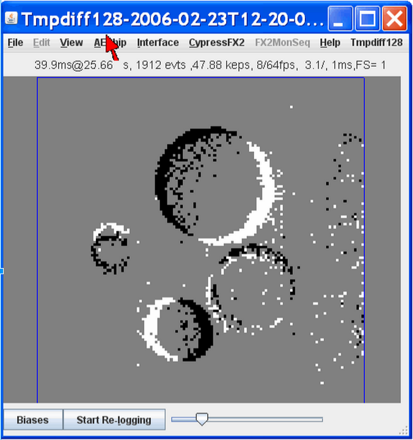</p>
<p align="center">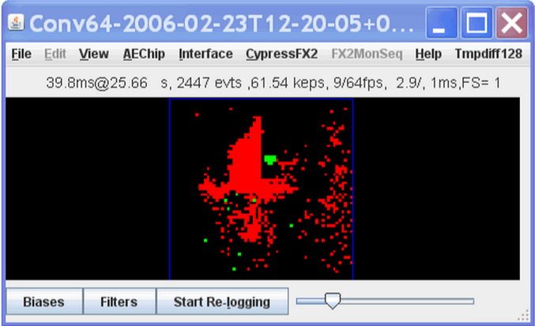</p>
<p align="center">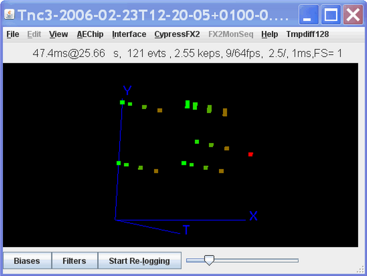</p>

## What is Address-Event Representation (AER)?

Brains use spikes for long-range communication between neurons. Spikes
are binary digital events that occur in analog time. When one neuron
wants to send information to another one far away, it uses a digital
spike that travels along its connections (synapses) to other neurons. In
neuromorphic electronic systems that use AER, spikes are represented as
digital addresses (either of the source or target neuron) - this is the
basis of Address-Event Representation (AER). Chips that use AER often
use asynchronous logic to handle the communication of AER data. Using
AER, chips can communicate ensembles of neural information in the
sparse, data-driven manner that seems to be a foundation of brain
architecture.

In jAER, the notions of binary spikes are extended to a more general
notion of "events" that can carry along entire data structures of
information, e.g. edge orientation, binocular disparity, object
category, etc. You can extend the BasicEvent class to attach any kind of
annotation you want.

# Software setup

## Requirements

  - Windows XP/Windows 7/Windows 8, 32 or 64 bit if you want to use
    all hardware interfaces. The rest of the code (rendering,
    processing, etc.) runs under Linux and Mac OS X too, and there is
    a libusb-based driver for newer sensors that permits full access
    to the hardware.

  - USB 2.0 hardware interface (if you want to capture or sequence
    events). (A USB 1.1 interface will also work with the tmpdiff128
    retina boards but not with the USB 2.0 monitor/sequencer boards
    and will severely limit performance!). USB3.0 is necessary to get
    best performance from the new FX3 prototypes.

  - A compatible hardware device (e.g. <!--TO CHANGE--> [DVS128, DAVIS240](http://www.inilabs.com/products/)), unless you intend
    to work with recorded data.

  - A Java Runtime Environment installation, version 1.8 or newer, for
    example from
    [Oracle](http://java.oracle.com/).

## Getting the code

jAER is hosted on
[GitHub](https://github.com/SensorsINI/jaer).

If you want to just use the software, download from the
[releases
page](https://github.com/SensorsINI/jaer/releases) the latest
release (**jaer-dist.zip**), unzip it, and then go to
[Running the AEViewer
application](#running-the-aeviewer-application).

If you want to develop your own code, you should get a full Git checkout
and set up an IDE, please see [Developer
setup](#developer-setup) for more details.

## Developer setup

Get a full Git checkout as follows:

1.  Install a decent Git shell. A good Windows shell extension is
    [TortoiseGit.](https://tortoisegit.org/)
    Most Linux users will have the git package pre-installed.

2.  Check out the entire repository from GitHub:

    > $ git clone https://github.com/SensorsINI/jaer.git

If you plan to develop Java classes you will need a Java development
environment and the Java development kit (JDK).

The project is presently built with
[Netbeans](https://netbeans.org/), which
is the preferred development environment for Windows.. The JDK and
Netbeans come bundled together as a [Netbeans
bundle](http://www.oracle.com/technetwork/java/javase/downloads/jdk-7-netbeans-download-432126.html).
Remember to download the bundle of Netbeans and the Java JDK, unless you
already have the latest JDK installed. If you are not a Java developer
already, you will need to get both the JDK and a development
environment.

For Mac OS and Linux,
[Eclipse](https://eclipse.org/) is the
preferred development environment, and is actively used.

You may be confused by the plethora of Java versions: What you need is
plain old
[J2SE](http://www.oracle.com/technetwork/java/javase/downloads/jre7-downloads-1880261.html)
(Java 2 Standard Edition), not J2EE or any other Java bundle.

### Netbeans development environment and opening the project

The netbeans project is located at the root of the repository.

You can open this project from the File->Open project menu.

<p align="center">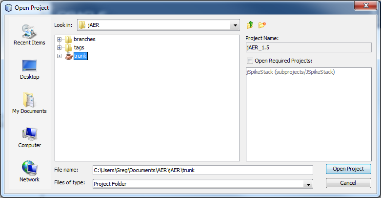</p>

Netbeans Open Project window, project trunk selected (Windows)

### Building

Launch NetBeans IDE.

Select correct runtime configuration which matches your installed Java
Virtual Machine, i.e. selected “win 64-bit JVM” if you installed a
64-bit VM. The runtime configuration is the drop-down box below the
Refactor/Run/Debug menus.

Open project folder. Select jaer folder. Your current version of jAER
should appear with its subfolders Source Packages and Libraries.

<p align="center">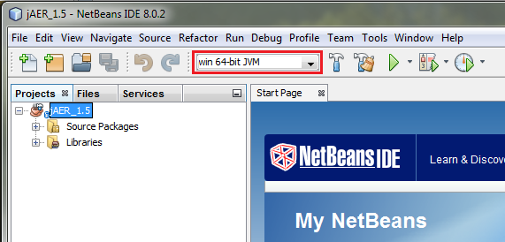</p>

Netbeans project, with win 64-bit JVM selected as the runtime (Windows)

From the Run menu, select Clean and Build Project to re-compile all
classes and rebuild the jar file. In the output console you can ignore
the warning messages. You can ignore this warning because it will only
affect the Help/About... panel contents. The output should look
something like the following:

```
ant -f C:UsersGregDocumentsAERjAERtrunk -Dnb.internal.action.name=rebuild clean jar
init:
deps-clean:
Updating property file: C:UsersGregDocumentsAERjAERtrunkbuildbuilt-clean.properties
jSpikeStack.init:
jSpikeStack.deps-clean:
Updating property file: C:UsersGregDocumentsAERjAERtrunkbuildbuilt-clean.properties
Deleting directory C:UsersGregDocumentsAERjAERtrunksubprojectsJSpikeStackbuild
jSpikeStack.clean:
Deleting directory C:UsersGregDocumentsAERjAERtrunkbuild


...

jaer-exe4jx64:
Building exe4j jAERViewer.exe 64-bit Windows launcher for 64-bit Java Virtual Machines - embedding ico and setting SplashScreen in jAERViewer.exe.
 Don't worry if this task fails for you unless you have changed the classpath.
jAERViewer.exe does not normally need to be rebuilt.
exe4j version 5.1 (build 5121), built on 2016-02-19
Unregistered evaluation version Please run the command line executable with the -L [license key] option or open the exe4j wizard to enter a license key.
Failure for target 'jaer-exe4jx64' of: C:UsersGregDocumentsAERjAERtrunkbuild.xml
The following error occurred while executing this line:
C:UsersGregDocumentsAERjAERtrunkbuild.xml:123: C:UsersGregDocumentsAERutilsexe4j_x64binexe4jc.exe failed with return code 1
Copying 1 file to C:UsersGregDocumentsAERjAERtrunkbuild
jnlp:
jar:
BUILD SUCCESSFUL (total time: 22 seconds)
```

Much of the output will be warnings highlighted in red, however this is
expected and is not a problem, as long as there is a BUILD SUCCESSFUL
message highlighted in green at the end, as see above. If the build is
unsuccessful, consider updating your local Git repository, and then
cleaning and building the project again. If the project still doesn’t
succeed to build, this output is useful for debugging the problem and
requesting support.

### Developer setup - Linux

Linux is actively supported in jAER 1.5.

Eclipse is the preferred and supported environment under Linux. As such,
proceed as detailed in the [Eclipse
instructions](#developer-setup---using-eclipse) described below
to check out the project from Git.

NetBeans is also supported under Linux, if you prefer it to Eclipse.
Instructions for checking out the project in Netbeans are the same as in
the section described above.

On Linux, interaction with devices is realized through the libusb
library, which means no special kernel drivers have to be compiled or
installed. Usually no particular setup is required at all, other than
ensuring the user running jAER has access to the device; which might
involve installing udev rules. Please refer to the <!--TO CHANGE--> [Install USB driver -
Linux](http://inilabs.com/support/hardware/davis240/#h.eok9q1yrz7px)
section of the DAVIS240 User Guide.

### Developer setup - Mac OS X

Mac OS X support is still experimental. Eclipse is the preferred and
supported environment under Mac OS X, as such, proceed as detailed in
the [Eclipse
instructions](#developer-setup---using-eclipse) to set it up.

On Mac OS X, the libusb based driver is the only way to interact with
hardware, more information on it can be found near in the <!--TO CHANGE--> [Install USB driver - Mac OS
X](http://inilabs.com/support/hardware/davis240/#h.7ohp3sio45xp)
section of the DAVIS240 User Guide.

### Developer setup - using Eclipse

First, check out the project from Git. On the console use:

> $ git clone https://github.com/SensorsINI/jaer.git

In the following text $JAER_ROOT denotes the installation directory;
there is no need to set it explicitly in a shell (e.g. /opt/jaer).

In the Git repository there will be two files that represent the Eclipse
project. Those are $JAER_ROOT/.project and $JAER_ROOT/.classpath.

#### Building

After checking out from Git, import the project into Eclipse, by going
to File->Import and selecting General > Existing Projects into
Workspace. Click on "Next" and select the $JAER_ROOT directory as the
root directory for the project. Don't change the project name and click
on "Finish". The project will be built automatically now.

<p align="center">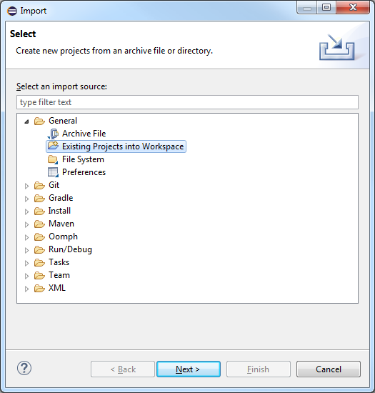</p>

Eclipse project import source options (Windows)

#### Running

Go to Run->Run, choose "Java Application" and type "JAERViewer". Be
aware that you have to allow access to your USB ports
([see below](#main-menu)).

#### Generate Javadoc

Go to Project->Generate Javadoc, select the correct version of jAER and
a destination folder and click “Finish”.

# Running the AEViewer application

If installation has been done correctly, you should be able to run the
Java class jAERViewer to look at AER data. The application is started
either from your IDE (Netbeans, Eclipse, etc) or by running the scripts
located at the root of the jAER project.

Start the main window of jAERViewer by executing an appropriate
launcher. Select the executable launcher based on your platform and java
virtual machine architecture.

  - jAERViewer1.5_linux.sh is a linux bash script.

  - jAERViewer1.5_win32.exe and jAERViewer1.5_win64.exe are Windows
    executable launchers that do not display the logging output.
    
      - For windows with 64-bit java use the jAERViewer1.5_win64.exe
        launcher.
    
      - For windows with 32-bit java use the jAERViewer1.5_win32.exe
        launcher.

<p align="center">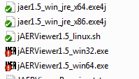</p>

On a 64-bit host operating system, you have the option of installing
either 32-bit or 64-bit Java. You must then run the launcher that
launches jAERViewer with your installed version of Java.

You should then see a window like this:

<p align="center">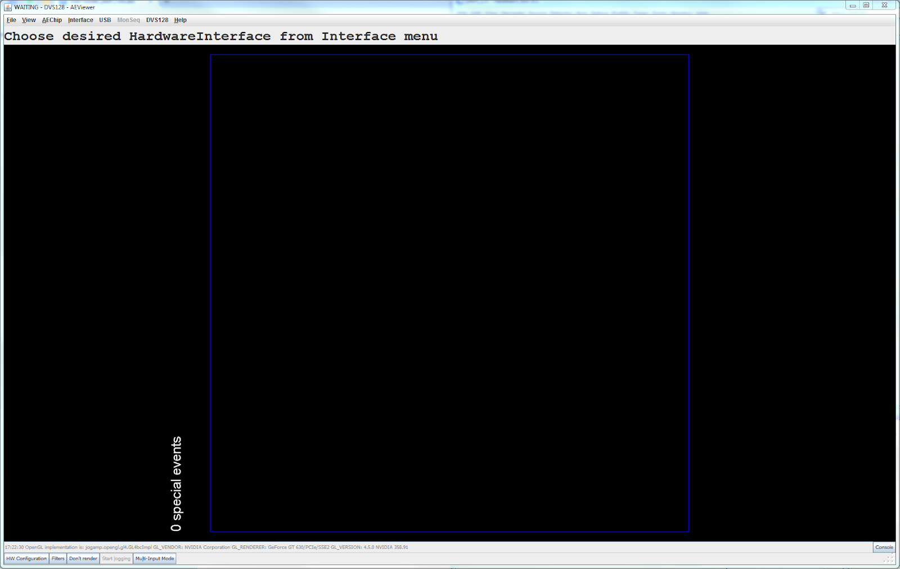</p>

## Main menu

### File

There are two ways of working with the jAERViewer. One is to
[play recorded
data](#viewing-recorded-data), and the other is to
[work with live data from
sensors](#viewing-live-data-from-a-device). The File menu is
concerned with the playing back and also the logging of data files.

**New Viewer (shortcut: ctrl-n)**: opens a new viewer application window
to render and view multiple data streams concurrently.

**Open logged data file… (shortcut: o)**: opens and begins the playback
of a stream of AER events which are stored in the given log (aedat)
file.

**Close (shortcut: ctrl-w)**: closes the current log file if one is
loaded, otherwise doesn’t do anything. Note that this *doesn’t* close a
selected viewer window or the whole application, as might reasonably be
expected.

**Set timestamp reset bitmask… (currently 0x0)**: …

### View

The View menu is concerned with what gets rendered in the viewer.

### AEChip

In either case you need to choose the correct device type from the
[AEChip](#choosing-the-right-chip-class)
menu, i.e. if you are viewing recorded data, you need to choose the
device from which the data was recorded in order to view it correctly.

### Interface

The Interface menu allows you to choose one of the connected sensors to
work with (if there is more than one connected).

### USB

The USB menu allows you to alter the number and size of USB buffers
allocated and also has options regarding firmware updates.

### MonSeq

The MonSeq menu is only for use with monitor and sequencer boards such
as AERUSBMini2.

### ... menu

To the right of the MonSeq menu there is a menu with options specific to
the hardware device chosen.

### Help

## **Tooltips**

If you hover your mouse over most controls on the GUI, you will see a
tooltip pop up, which will help you to understand the control. A tooltip
is a hint that appears in a small hover box that describes the element
the mouse cursor is hovering over. For example, if you hover over the
[infobar](#infobar) then you will see
this pop up:

<p align="center">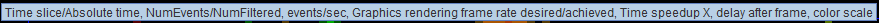</p>

## Shortcuts

Under the File and View windows, you will see that a number of options
have available shortcut keys, shown in blue. These shortcuts greatly
improve the ease of use of the application, and are worthwhile taking
some time to remember.

## Extra viewer windows

By default, jAER opens with one viewer window. However, you can open
more windows by using File->New viewer. In general, you need one viewer
for each device that you want to use or file that you want to view
simultaneously. See <!--TO CHANGE--> [How to calibrate a stereo
setup](http://inilabs.com/support/application-notes/dvs-stereo-calibration/)
for more information.

## Choosing the right chip class

Whether you are working with live or recorded data, you must choose the
chip class for the device from which the data comes in order to render
it correctly. If the menu has been set correctly, your device type
should appear in this list:

<p align="center">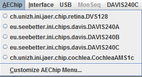</p>

Here is a list of the correct choices for device types supported by
iniLabs:

| Device                     | Class                                     |
| -------------------------- | ----------------------------------------- |
| DVS128, eDVS, DVS128_PAER | ch.unizh.ini.jaer.chip.retina.DVS128      |
| DAVIS240A                  | eu.seebetter.ini.chips.davis.DAVIS240A    |
| DAVIS240B                  | eu.seebetter.ini.chips.davis.DAVIS240B    |
| DAVIS240C                  | eu.seebetter.ini.chips.davis.DAVIS240C    |
| DAVIS128, DAVIS128_RGB    | eu.seebetter.ini.chips.davis.DAVIS128     |
| DAVIS346, DAVIS346_RGB    | eu.seebetter.ini.chips.davis.DAVIS346B    |
| DAVIS346B                  | eu.seebetter.ini.chips.davis.DAVIS346cBSI |
| DAVIS640, DAVIS640_RGB    | eu.seebetter.ini.chips.davis.DAVIS640     |
| CDAVIS640                  | eu.seebetter.ini.chips.davis.DAVISRGBW640 |

If the class you need does not appear in this menu, use the
AEChip->Customize AEChip Menu*…* to bring up the following dialogue:

<p align="center">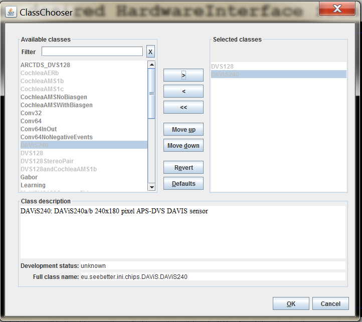</p>

Use the right arrow to move the correct class from the list of Available
classes on the left into the list of Selected classes on the right. Then
click “OK”.

**Note**: there is a known bug with the Linux drivers for Intel chipsets
which results in the application crashing when a class is selected. To
resolve this issue, line 289 in ChipCanvas.java should be commented:

drawable.setSharedAutoDrawable(JAERViewer.sharedDrawable); // comment
this line

**Note**: if you’re having difficulty

## Understanding the display

In this screenshot, some recorded data is being played back:

<p align="center">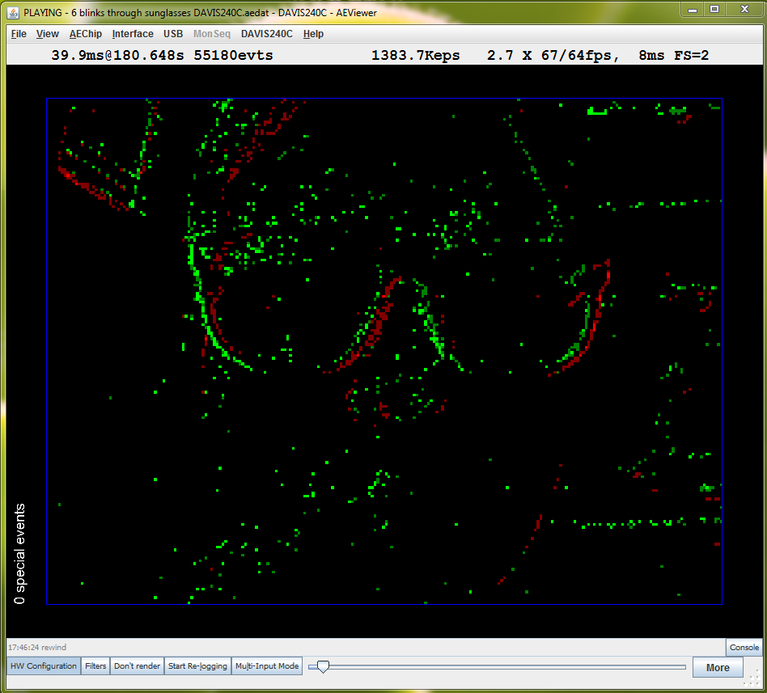</p>

Underneath the main menu, but above the image, there is the
[infobar](#infobar) - a row of
information...

Underneath the infobar is the
[viewer](#viewer) - an image rendered
from the data...

Underneath the viewer is a [data
slider](#data-slider)...

### Infobar

Here is an example of recorded data:

<p align="center">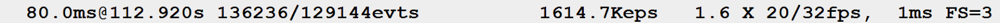</p>

The various elements are listed in this table:

| Item                                              | Description                                                                                                                                                                                                                                                                           | Example from above                                                                                                                            |
| ------------------------------------------------- | ------------------------------------------------------------------------------------------------------------------------------------------------------------------------------------------------------------------------------------------------------------------------------------- | --------------------------------------------------------------------------------------------------------------------------------------------- |
| Time slice                                        | The period of time covered by the currently rendered frame.                                                                                                                                                                                                                           | 80.0ms                                                                                                                                        |
| Absolute time                                     | The last timestamp in the last event packet to be completely processed before the screen refresh.                                                                                                                                                                                     | 112.920s                                                                                                                                      |
| Raw events                                        | The number of events used to render the current frame                                                                                                                                                                                                                                 | 136236evts (evts is events)                                                                                                                   |
| Filtered events                                   | The number of events used after filtering. This count includes APS samples from a DAVIS. If no filters are applied then only raw events are shown                                                                                                                                     | 129144evts <br/> In this case, a BackgroundActivity filter is eliminating some events so the number of filtered events is slightly lower      |
| The event rate                                    | The number of events that being produced per second                                                                                                                                                                                                                                   | 1614.7Keps (eps is events per second)                                                                                                         |
| The play rate                                     | A multiplication factor of playback speed with regards to real time. This can also display “Paused” if the viewer is paused.                                                                                                                                                          | 1.6 X <br/> This means that playback is 1.6 times faster than real time. If you see e.g. “400mX”, this means 0.4 times real time              |
| The actual frame rate and the desired frame rate. | The actual frame rate should never exceed the desired frame rate. The desired frame rate can can be set to a value between 1 and 1000fps                                                                                                                                              | 20/32fps <br/> In this case the viewer is trying to render 32 frames per second, but it only achieves 20 because of high computational load.  |
| The delay after a frame is rendered               | The amount of time that the process is idle before the main loop begins again - this gives an indication of processor load.                                                                                                                                                           | 1ms                                                                                                                                           |
| FS - Full (Colour) Scale                          | For certain event rendering modes, the number of events with a single address within the time slice of the frame necessary to render the corresponding pixel with full colour. You can think of this as a contrast control for the display - a higher number means a lower contrast.  | FS=3                                                                                                                                          |

The infobar is the same for live data, except that the play rate is
replaced with Live/seq, as shown here:

<p align="center">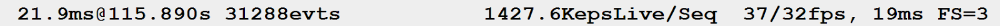</p>

### Viewer

To the bottom left of the view window is a count of the “special events”
that arrived within the frame. The…

DAVIS only:

When viewing DAVIS frames, above the view window appears an extra
infobar, as seen here:

<p align="center">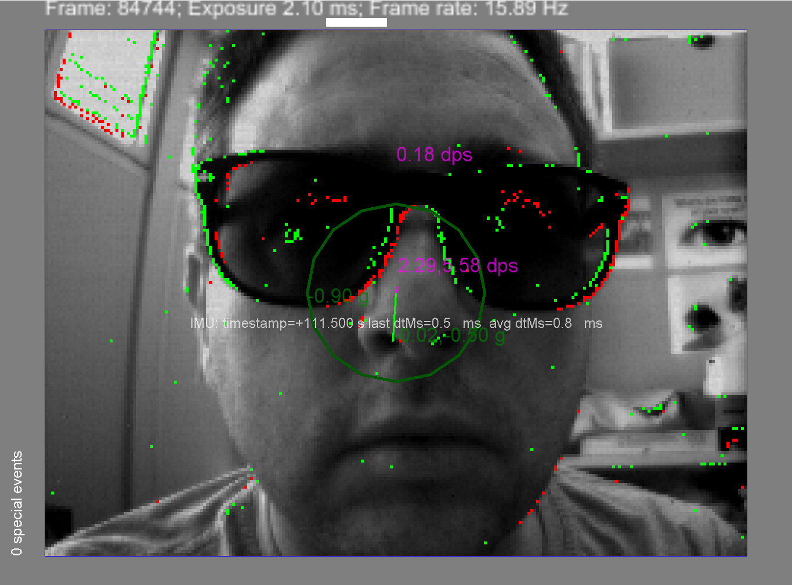</p>

If you do not see this infobar, you may need to resize your window. In
the example
above:

| Item       | Description                                                                                                                    | Example from above     |
| ---------- | ------------------------------------------------------------------------------------------------------------------------------ | ---------------------- |
| Frame      | this is the number of APS frames since the beginning of the recording or from when the live device was plugged in.             | 84744                  |
| Exposure   | this is the effective exposure duration (this should always match the target exposure duration in the HW configuration panel). | 2.20 ms                |
| Frame Rate | this is the effective frame rate, comprising the exposure delay, the frame delay, and any delays due to data transmission.     | 16.18 Hz               |

### Data slider

This is only present for recorded data...

### Rendering and display options

These options can be found under the View menu.

#### Rendering frame rate

Change the target frame rate with:

View->Increase rendering frame rate (shortcut “right arrow key”)

View->Decrease rendering frame rate (shortcut “left arrow key”)

Each change will either halve or double the current frame rate, down to
a minimum of 1fps and up to a maximum of 1000fps. For example, if the
current frame rate is 32fps, an increase will change it to 64fps, whilst
a decrease will change it to 16fps.

To pause the view, select View->Paused. To unpause the view, unselect
it. In both cases, the shortcut is “space”. to step through the frames,
go to View->Single step (shortcut “period”). You can continuously step
through the frames by repeating this action. Note that this also pauses
the view, so to continue, simply unpause.

Note: **This is NOT the frame rate for the APS frames of a DAVIS
camera!**

This changes the rate at which jAER refreshes the screen buffer that is
available to the operating system. Note that if jAER achieves a higher
rate than the screen refresh rate then some refreshes will not be
presented on the screen, so some brief events may be missed.

#### Graphics options

Various graphics options are found under View->Graphics options.

  - Active rendering enabled: Actively push the screen buffer to the
    operating system when it is ready. This delays the display until
    the graphic card acknowledges the update, which may, depending on
    the details of your graphics card, giving the best guarantee that
    frames are presented on the screen.
  - Render blank frames: this ensures that rendering occurs even in
    periods when no events occur.
  - Skip rendering packets: this stops packets of events from being
    rendered, which speeds up processing.
  - Enable subsample rendering: render only a subsample of events,
    which speeds up processing.
  - Choose rendering subsample limit: set the number of subsampled
    events which are rendered.

#### Color modes

View->Cycle color rendering mode cycles through 5 different colour
schemes for viewing events (shortcut ‘c’). The current color mode is
displayed at the bottom of the viewer with its description after the
mode has been changed. Note that the color modes can only be cycled when
using the Standard display
method.

| Color Mode     | Description                                                                                                                                                                                                      | **Example**                                                                       |
| -------------- | ---------------------------------------------------------------------------------------------------------------------------------------------------------------------------------------------------------------- | --------------------------------------------------------------------------------- |
| RedGreen       | ON events are green; OFF events are red                                                                                                                                                                          |                        |
| ColorTime      | Events are colored according to time within displayed slice, with red representing newest events, and blue representing oldest events                                                                            | 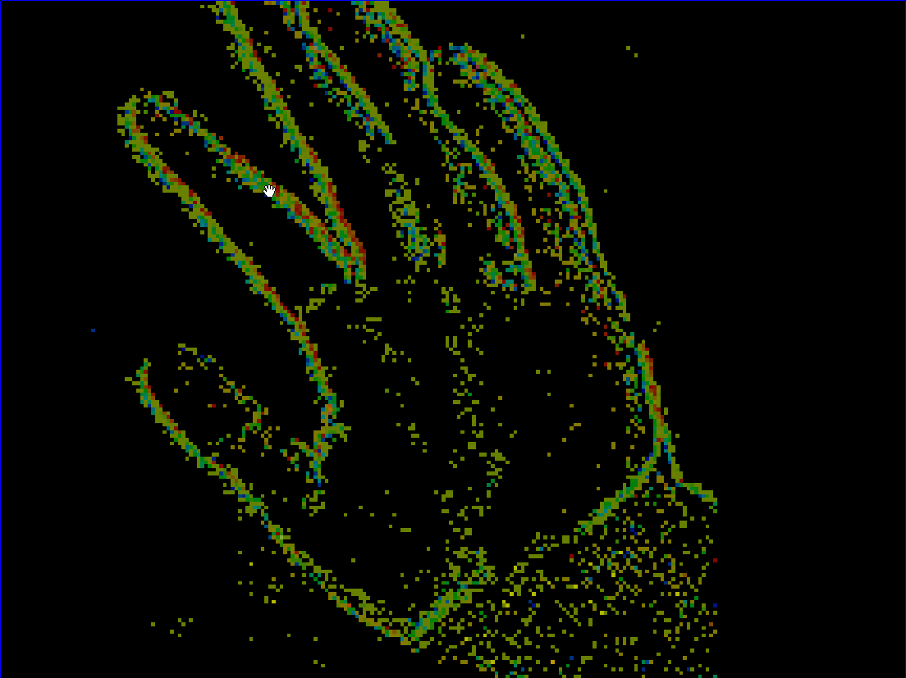                       |
| GrayTime       | Events are colored according to time within displayed slice, with darker greys representing newer events and lighter greys representing old events. Note that white also represents the pixels with no events.   | 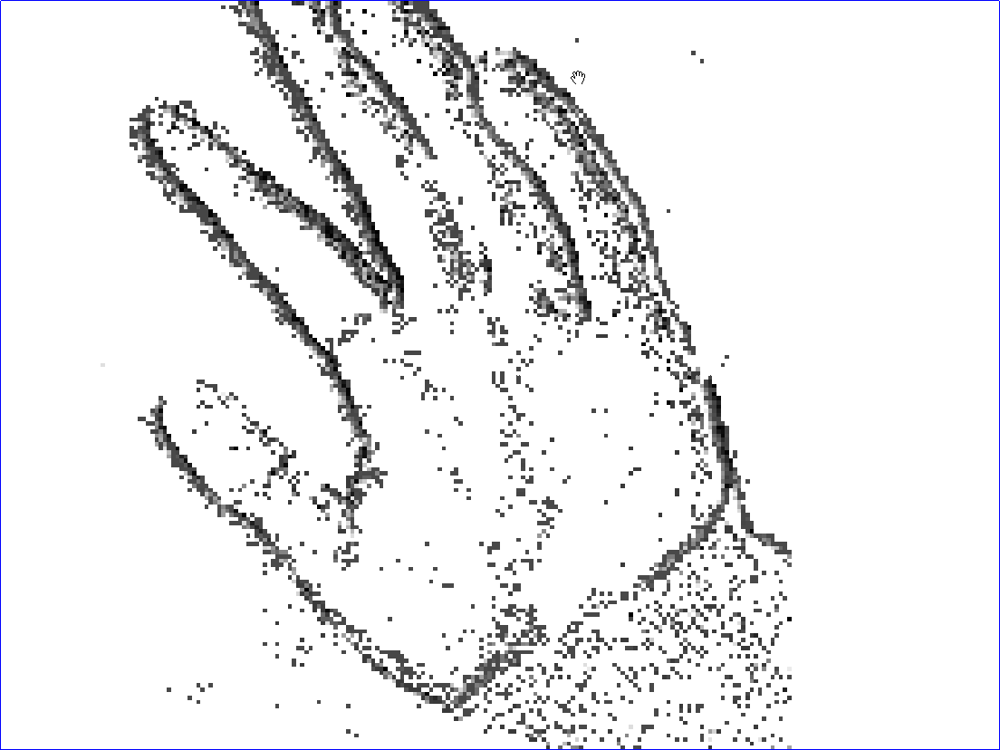                       |
| GrayLevel      | Each event causes linear change in brightness                                                                                                                                                                    | 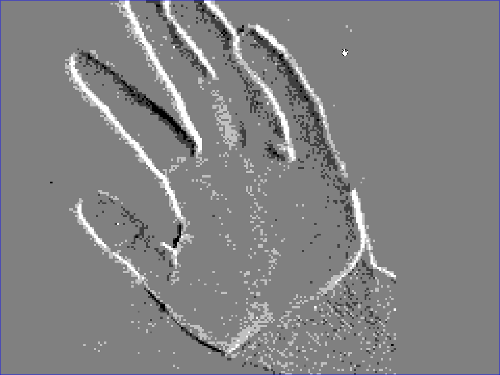                       |
| Contrast       | Similar to GrayLevel, but here each event causes multiplicative change in brightness to produce a logarithmic scale                                                                                              | 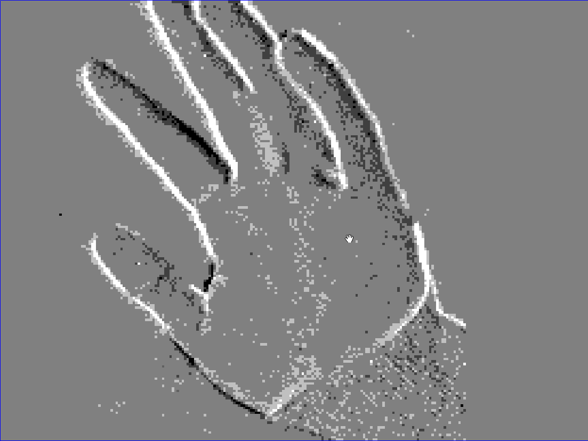                       |

#### Display methods

View->Cycle display method cycles through 3 different display modes for
viewing events (shortcut ‘3’). The java class corresponding to the
current display method is displayed at the bottom of the viewer after
the method has been
changed.

| Display Method                    | Description                                                                                                                                                                                                                                                     | Example                                                                          |
| --------------------------------- | --------------------------------------------------------------------------------------------------------------------------------------------------------------------------------------------------------------------------------------------------------------- | -------------------------------------------------------------------------------- |
| Standard Event Display            | With this method, events are displayed in a 2 dimensional area. This is the default method of display.                                                                                                                                                          | <p align="center">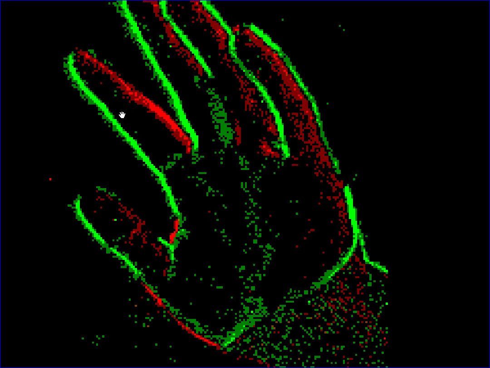</p>      |
| (unset method)                    | This is a placeholder for a future, unimplemented display method. Currently, it will display a blank space.                                                                                                                                                     |                                                                                  |
| Space Time Event Display          | With this method, events are displayed in an area with 3 axes: x, y and t (time). You can rotate the view on the origin of the axes by holding the mouse button down on the view and moving the mouse around. Green events are older, and red events are newer. | <p align="center">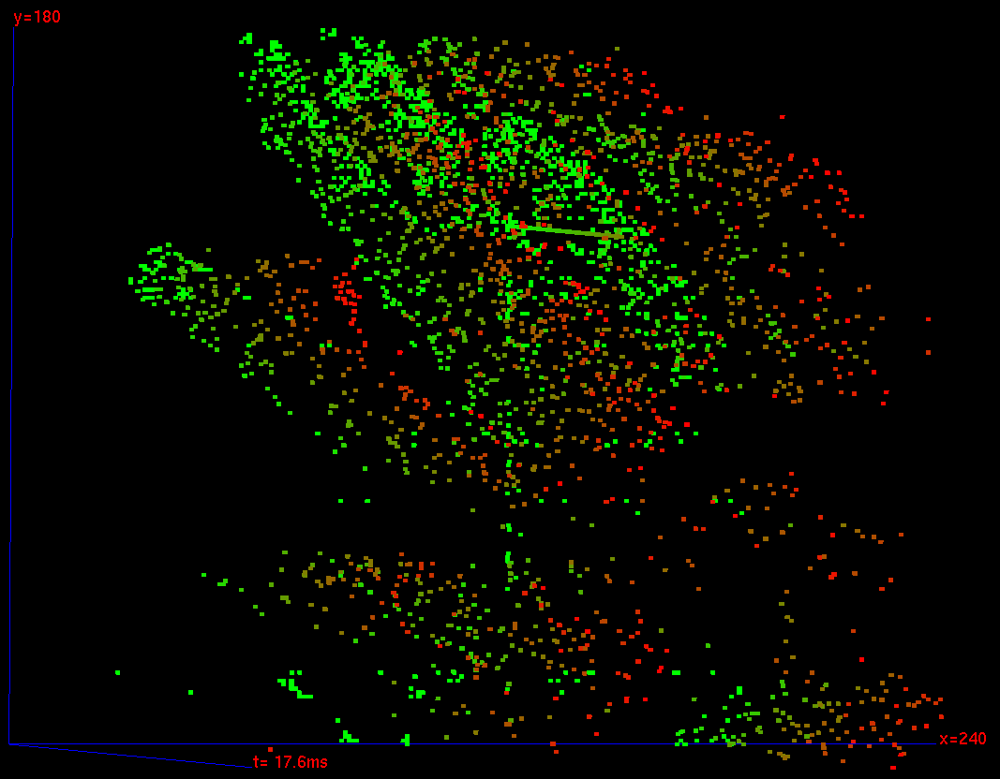</p>     |
| Space Time Rolling Event Display  | Same as the Space TIme Event Display method above, with the origin placed differently, and less computationally expensive. Blue events are newer, green events are older.                                                                                       | <p align="center">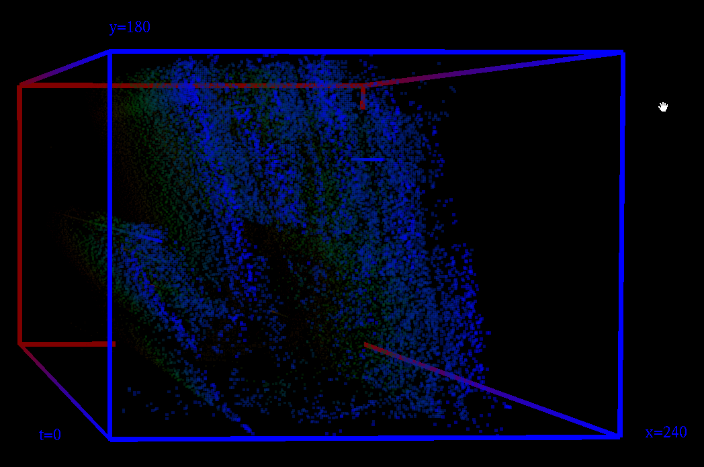</p>    |

## Viewing live data from a device

You can now select a hardware interface from the Interface menu and a
chip type from the AEChip menu and it should start rendering events from
the device (if the device is producing events, of course).

By default, connecting a configured device while the application is
running should provide the user with a display of live data in the
viewer. Likewise, starting the application with an already connected
device should do the same. See [Rendering frame
rate](#rendering-frame-rate) above for controls.

## Setting default firmware

If a device doesn’t have firmware loaded, then you may see the following
exception:

<p align="center">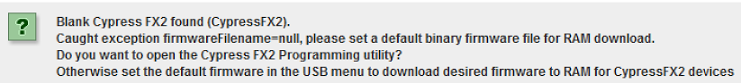</p>

If so, jAER has the ability to automatically load a default firmware
when it encounters a blank device. To do this, on the “USB” menu, select
“Set default firmware for blank device…”. You will then see the
following dialogue:

<p align="center">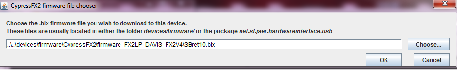</p>

Use this dialogue to choose the right firmware file.

**|point| JUST CHANGE IT!!!! MAYBE IS IMPORTANT!!!!
For example, for the DAS1, the correct firmware file is:
devices  firmware  CypressFX2  firmware_FX2LP_Cochleaams1c 
firmwareFX2_Cochleaams1c.bix**

Once you do this, unplug and replug the device and it should start.

## Viewing recorded data

You can play either single data files (.aedat) or synchronized sets of
files (.index). You can drag and drop either type of file onto a fresh
jAERViewer window. Or you can select the file using menu item
File->Open logged data file (shortcut "o"). Recently played files are
also displayed towards the bottom of the File menu.

<p align="center">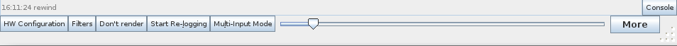</p>

Playing a data file brings up some playback controls at the bottom of
the viewer. These controls can be expanded by clicking the “More”
button, and collapsed by clicking the “Less” button.

<p align="center">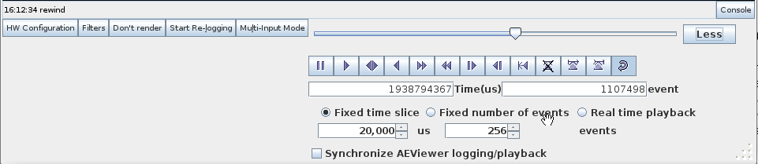</p>

The controls do the
following:

| Control                                                                                                                       | Name                      | Description                                                                                                                                                 |
| ----------------------------------------------------------------------------------------------------------------------------- | ------------------------- | ----------------------------------------------------------------------------------------------------------------------------------------------------------- |
|   | Pause / Play              | start or hold the playback                                                                                                                                  |
| <p align="center"></p>                                     | Play forwards             | play the file from beginning to end                                                                                                                         |
| <p align="center"></p>                                       | Reverse Play              | Reverse the direction of playback                                                                                                                           |
| <p align="center"></p>                                          | Play backwards            | Play the file from end to beginning                                                                                                                         |
| <p align="center"></p>                                        | Faster                    | Increase the speed of playback                                                                                                                              |
| <p align="center"></p>                                        | Slower                    | Decrease the speed of playback                                                                                                                              |
| <p align="center"></p>                                     | Step Forwards             | Plays a single frame at a time, from beginning to end                                                                                                       |
| <p align="center"></p>                                     | Step Backwards            | Plays a single frame at a time, from end to beginning                                                                                                       |
| <p align="center"></p>                                        | Rewind                    | Move playback position to the beginning of the log file                                                                                                     |
| <p align="center"></p>                                    | Clears IN and OUT markers | Clear both markers placed on the log playback                                                                                                               |
| <p align="center"></p>                                       | Marks IN marker           | Place a marker at the current position of playback, from which the playback will always start playing from, instead of the beginning of the log             |
| <p align="center"></p>                                      | Marks OUT marker          | Place a marker at the current position of playback, up to which the playback will always end playing at, instead of the end of the log                      |
| <p align="center"></p>                                          | Loop Play                 | Toggles whether playback stops at the end of the log (or position of the OUT marker), or runs infinitely from the beginning (or position of the IN marker). |

Additionally, the following shortcuts are very useful for playback:
“Faster” (shortcut “f”), “Slower” (shortcut “s”) and “Pause/Play”
(shortcut “space”). Note that, while the same shortcut is used to
play/pause the playback of log files and live viewing, different
shortcuts are used to change the speed of playback from those used to
change the live viewing frame rate. To close the file, go to
File->Close (shortcut “Ctrl+w”).

See [Sample AER
data](https://sourceforge.net/p/jaer/wiki/AER%20data) for some
data files.

## Logging data

The File->Start logging data button lets you start logging data to a
file. (shortcut “l”). Logging is stopped by clicking this option (or
shortcut “l”) again, which pops up a dialog for you to enter the
destination of the data file on your filesystem.

## Logging data on multiple systems simultaneously

To launch multiple viewers simultaneously is not explicitly supported.
However note that jAERViewer supports a UDP connection for controlling
some functions. In particular you can send "startlogging filename.aedat"
to start recording data to a file.

See
[https://sourceforge.net/p/jaer/wiki/Home/](https://sourceforge.net/p/jaer/wiki/Home/),
in particular
[https://sourceforge.net/p/jaer/wiki/Interfacing%20to%20jAER/](https://sourceforge.net/p/jaer/wiki/Interfacing%20to%20jAER/)

You can use this startlogging command and send it to multiple computers
to start logging data nearly simultaneously.

However note that currently starting the recording function takes a
significant amount of time (~2s) because of writing all the Java
Preference values at the start of each file, which can be used later to
recreate the exact state of all parameters used. If this delay is a
problem, you can manually remove line 69
‘*chip.writeAdditionalAEFileOutputStreamHeader(this);*’ from
AEFileOutputStream.java to remove this writing out of the Preferences.

# Configuring a live device

To configure a live device, open the “Biases / Hardware Configuration”
dialog, either by going to View->Biases/HW Configuration, clicking the
HW Configuration button at the bottom left corner of the viewer, or
using the Ctrl + B keyboard shortcut.

The dialog box is different for each device type. This is what the
dialog looks like for Davis240:

<p align="center">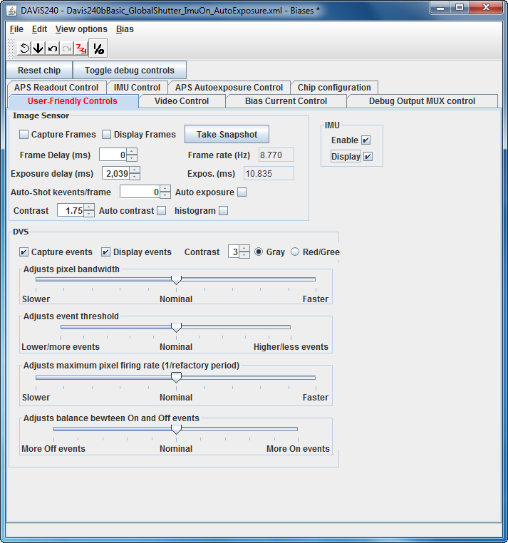</p>

## Loading biases and other configuration settings

If you are using a chip or board that uses biases, you will have to load
bias settings.

and use the File/Load settings... menu item to open a file dialogue.
Biases are stored in the folder java/biasgenSettings. In fact, this
dialogue loads a complete configuration for a device.

## Saving customized bias files

You can save customized bias settings to a location of your choice. Open
the *Hardware Configuration* window from the button at the bottom of the
AEViewer window or from the AEViewer window *View* menu.

Menu File/Load settings… dialog

Settings will be stored as your default preferences. The most recent
loaded or saved bias settings will appear the next time you start the
jAERViewer application. Note: If you change hardware configuration
values you must explicitly save them to preserve those changes. If you
change biases without saving before quitting, then your changes will be
lost.

These settings can be saved to a location of your choice and then opened
from the Biasgen File/Load settings… dialog. After that the settings
will be stored as your default preferences. Other settings are stored in
files starting with the device class name in jAER.

The most recent loaded or saved bias settings are persistent–the next
time you start the jAERViewer application you will get the most recent
saved bias values. If you wish to export these more permanently you can
do so with the File/Save settings… dialog. If you change biases without
saving, then your changes will be lost.

The Biasgen control panel support unlimited Undo and Redo, including
reversion to saved settings, so you can feel safe about playing with the
settings.

## How to utilize “User-Friendly-Controls”

Taking the example of DAVIS240, the user-friendly control panel has
three sections: One (top left) to control APS frames; one (bottom) to
control DVS events; and one (top right) to control the inertial
measurement unit.

### Inertial measurement unit (IMU)

Enable: “On” enables integrated gyroscope and accelerometer. Direction
of gravity (g) is shown by the green arrow. Otherwise “Off” will disable
the IMU.

### Image Sensor

Enable or disable the capture of frames, and, if frames are being
captured, enable or diable their display. If frame capture is enabled,
use frame delay and exposure delay to control the duty cycle of the
capture, or tick auto-exposure to allow the computer to take control of
the exposure delay in order to maximise contrast. For DAVIS240B/C, the
global shutter tick box toggles global shutter (all pixels expose
simultaneously) mode.

### Dynamic Vision Sensor (DVS)

Enable or disable the capture of events, and, if events are being
captured, enable or disable their display. If they are displayed,
control the contrast and color display mode. If they are enabled, there
are four sliders which allow you to control the most basic parameters -
these sliders change the biases of the sensor.

## Controlling the biases

This document explains in detail how to bias dynamic
sensors:

<!--TO CHANGE-->
[http://inilabs.com/support/hardware/biasing/](http://inilabs.com/support/hardware/biasing/)

For DAVIS240, the “Bias Current Config” tab gives you complete control
over the on-chip biases which parametrise the sensor.

<p align="center">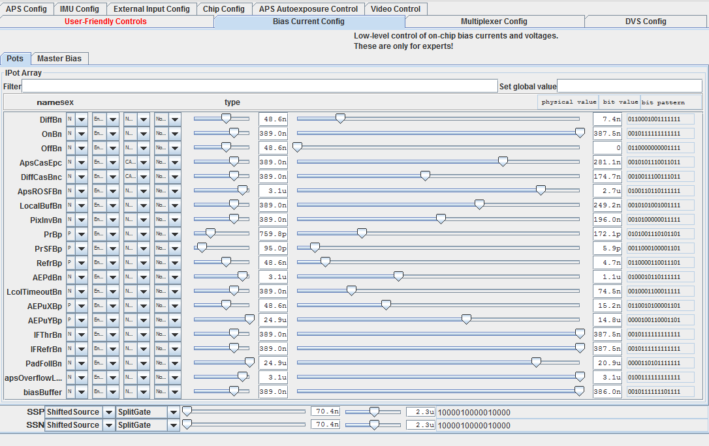</p>

For DVS128, the “Basic controls” tab give you sliders matching the
“User-friendly controls” tab of the DAVIS240, above, whereas the
“Expert controls” tab gives you full control.

The View menu allows disabling unneeded views of the bias values, e.g.
the bit values.

For DVS128, the “Basic controls” tab looks like this:

<p align="center">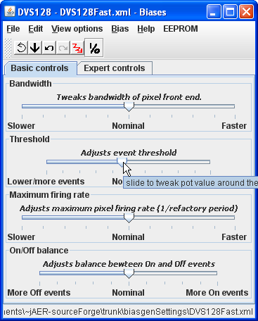</p>

Using these controls you can vary the biases around the nominal values
loaded from the settings file (e.g. DVS128Fast.xml).

The “Expert controls” tab looks something like this:

<p align="center">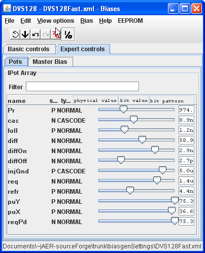</p>

This document explains in detail how to bias dynamic
sensors:

<!--TO CHANGE-->
[http://inilabs.com/support/hardware/biasing/](http://inilabs.com/support/hardware/biasing/)

# Data recording (logging)

Whilst viewing output from a live device, press the ‘L’ key to start
recording (logging) and press it again to stop recording. jAER will then
ask you where you want to save the recording. It will create a file in
.aedat format in the place you specify. The .aedat file will be in aedat
version 2.0 format. See here to understand the details of the file
format:

<!--TO CHANGE-->
[http://inilabs.com/support/software/fileformat/](http://inilabs.com/support/software/fileformat/)

## Working with .aedat data in matlab

These matlab scripts are in the working copy folder
[https://github.com/SensorsINI/scripts/tree/master/matlab](https://github.com/SensorsINI/scripts/tree/master/matlab)

### Reading raw events into matlab

Use the function loadaerdat.m

### Writing a .dat file from matlab that can be sequenced or viewed

Use the function saveaerdat.m

### Extracting raw events to x,y,type

You need to bitand and bitshift if you want to do this in matlab, or you
can use the *EventExtractor* that goes with each chip class. Using the
java class is faster but may fragment matlab memory.

* For matlab example, see the function
[https://github.com/SensorsINI/scripts/blob/master/matlab/retina/extractRetina128EventsFromAddr.m](https://github.com/SensorsINI/scripts/blob/master/matlab/retina/extractRetina128EventsFromAddr.m)

* For java class usage, examine the following example

    ```java
    chip=ch.unizh.ini.caviar.chip.retina.Tmpdiff128;  
    extractor=chip.getEventExtractor; % get the extractor object from this
    chip.  
    % now you can use the extractor to extract a packet of events or you can
    use the methods directly  
    x=extractor.getXFromAddress(raw); % raw is a raw AE
    address  
    y=extractor.getYFromAddress(raw)  
    type=extractor.getTypeFromAddress(raw)
    ```

### Translating x,y,type to raw address to filter specific cells in matlab

You can use a function like this one, which is correct for tmpdiff128.
Note how the x address is flipped because that is how it is rendered in
java to make it rightside up (Java puts the origin at UL corner and
increases x rightwards and y downwards.)

```
function raw=getraw(x,y,pol)  
raw=(y)*256+(127-x)*2+pol;
%extractor.getAddressFromCell(x,y,pol);
```

### Controlling biases from matlab

### Using a UDP connection to a running AEViewer or to control the chip or system configuration (i.e. biases)

This is the best way to control biases and the AEViewer now from an
external process. See [Interfacing to
jAER](https://sourceforge.net/p/jaer/wiki/Interfacing%20to%20jAER/).

# Using filters

## Selecting and ordering filters

From the “AEViewer” window, from the top menu, choose “View” -> “Event
Filtering” -> “Filters”. The following window pops up:

<p align="center">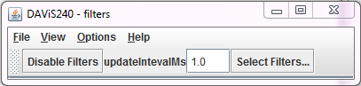</p>

Alternatively, you can click the “Filters” button at bottom of
“AEViewer” window:

<p align="center">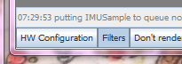</p>

Now choose “Select Filters”. The “Class Chooser” window pops up:

<p align="center">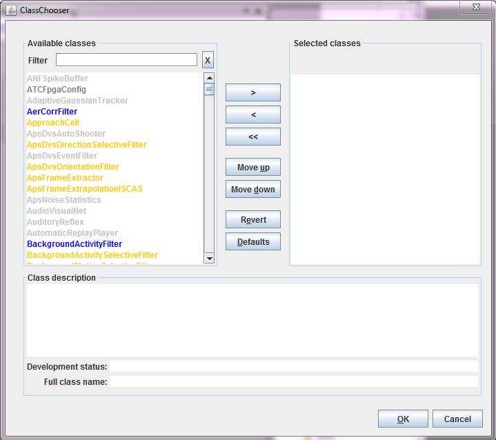</p>

To the left is a list of all the available filters. To the right are all
the filters that have been selected. Those which are selected are
applied in order from the top to the bottom.

The colors of the filters in the Available classes panel show the filter
*DevelopmentStatus*: Blue is Stable, yellow is Experimental, gray means
no status has been assigned yet, and so forth. Blue filters are widely
used.

As an example we will move two filters into the selected list. First,
click on a filter in the left list to select it, then use the right
arrow “>” button to move it to the list to the right:

<p align="center">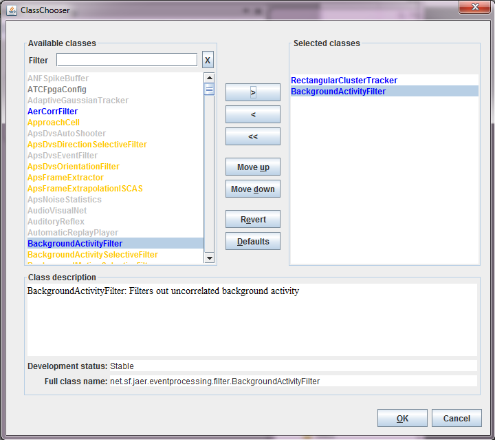</p>

In this example, “RectangularClusterTracker” was moved to the right,
followed by “BackgroundActivityFilter”.

However, this means that “BackgroundActivityFilter” is applied after
“RectangularClusterTracker”. It makes more sense to apply these in the
opposite order, so now “RectangularClusterTracker” is selected in the
list to the right, and the “Move down” button is pressed, resulting in
the following:

<p align="center">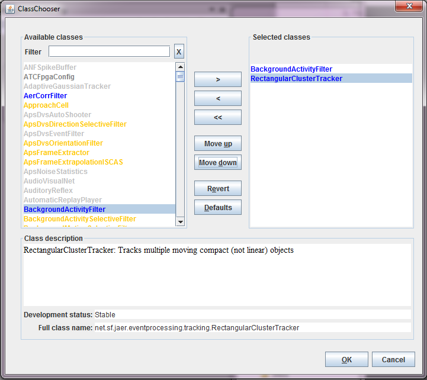</p>

Note that the order of the filters in the right list has been changed.

When you are happy with your selection of filters, click “OK”. The
“filters” window now looks like this:

<p align="center">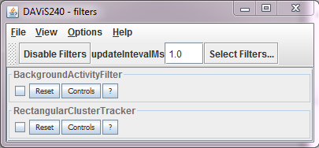</p>

To activate the filters, tick the tick boxes to the left of them:

<p align="center">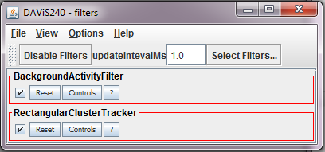</p>

In this example, both are selected, and the top one is applied followed
by the bottom one. It is also possible to leave some filters unselected.
For example:

<p align="center">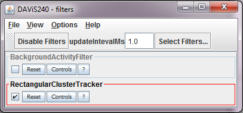</p>

In the above example, the BackgroundAcitivtyFilter has been deselected,
so now only the RectangularClusterTracker is being applied.

## Finding filters

You can search for filters by keyword by typing a string in the Filter
text box. For example, typing “subsample” in the box selects the list
shown below:

<p align="center">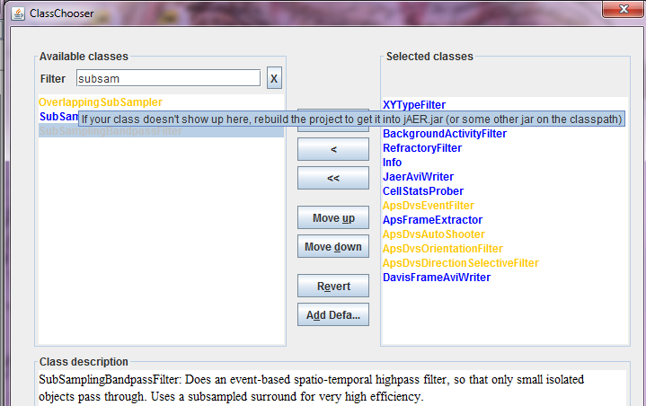</p>

The selected item (SubSamplingBandpassFilter) is an experimental filter
that helps filter out extended objects.

## Adding default filters for the AEChip

For every AEChip (device) there are a set of default filters that are
hard-coded. These are known to be widely used and stable.

Click the Add Defaults button to add default filters for the currently
chosen AEChip:

<p align="center">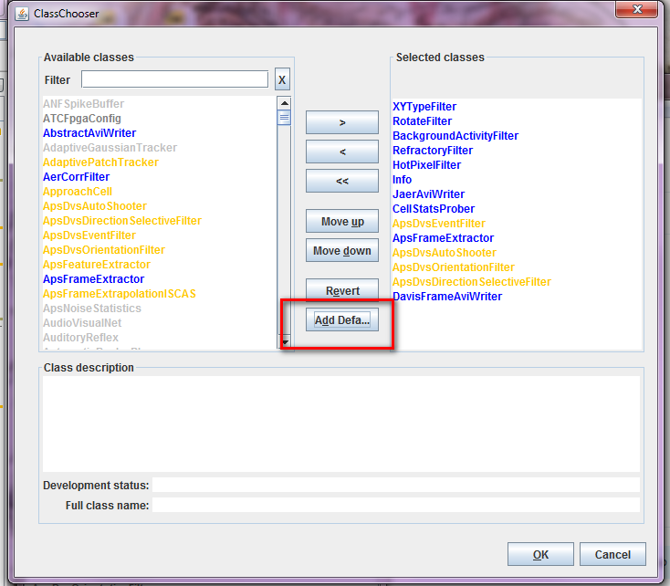</p>

Note that the filters are processed in order, from top to bottom.

## Seeing information about filters

To see information about a filter, select it and you will see a
description and tooltip:

<p align="center">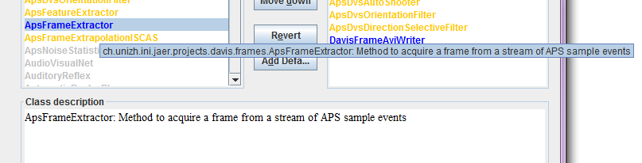</p>

After you click the OK button, your new list of filters will be
populated: The event stream from the sensor is processed for the enabled
filters in order from top to bottom of the list. A filter is enabled
when the checkbox on the left is selected.

<p align="center">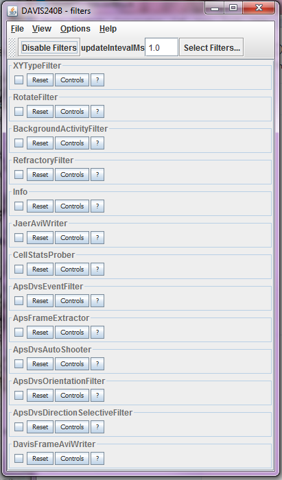</p>

# Writing filters

Event processing is at the heart of jAER's purpose. Although viewing,
logging, and displaying AER from systems is very useful, the true power
of this representation is explored by doing things with the events.

Adding a new event filter is the way you can process events from your
system (retina, multineuron learning chip, etc) in jAER. You
can develop your own event processing filter by following these steps:

1.  Subclass *net.sf.jear.eventprocessing.EventFilter2D*

2.  Since you are extending the *EventFilter2D* which is extending the
    *EventFilter* you need to Override the following methods:
    
    - *filterPacket(EventPacket)* (to extend abstract
      *EventFilter2D*)
    
    - *resetFilter()* (to extend abstract *EventFilter*)
    
    - *initFilter()* (to extend abstract *EventFilter*)

3.  Add properties that will be automatically displayed in the GUI to
    the filter by implementing javabean getter/setter methods.

4.  Document your filter properties by using the EventFilter instance
    method *setPropertyTooltip(String groupName, String parameterName,
    String tip)*. The first parameter is optional and will cause the
    properties to be grouped together if entered. This tooltip will be
    shown to the user when they hover over the property label. See
    below for explicit instructions on adding this netbeans macro.

5.  Run the project to show the *AEViewer* window, and then add the
    filter to the processing chain as follows:

6.  from the menu choose "View" -> "Event filtering" -> "Filters";
    this brings up the "Filters" window;

7.  then choose "View" -> "Select filters"; this brings up the "Class
    Chooser";

8.  select your filter in the list to the left, and use "Add" to move
    it to the right;

9.  The "Class list" to the right defines the filters that will be
    applied and the order in which they will be applied. Your Filter
    will be added to the left in the left automatically if it
    subclasses EventFilter2D either directly or as a child of a
    subclassing class.

10. There is no need to add your new filter class to any static array
    of classes - you can add arbitrary filters for each Chip class as
    just described. Once you return from the "Class chooser", the
    "Filters" window is populated with the filters you have chosen.
    Activate any combination of these that you like by ticking the
    tick box to the left of each filter to enable it.

11. Each time new events arrive -- either from hardware, from a
    network socket, or from a logged data file -- your *filterPacket*
    method will be called automatically and you can do whatever you
    like with the events.

If you're interested in processing event streams coming in from two or
more sensors, see the ["Multi-Modal
Processing"](http://sourceforge.net/p/jaer/wiki/MultiModalProcessing/)
page (content to incorporate …)

## Annotating the rendered graphics

You can annotate the *ChipCanvas* window by implementing the
*FrameAnnotator* interface and then filling in the
_annotate(GLDrawable)'' method if you want to draw something on top of
the rendered events. There are many examples in the existing code base,
browse the [online javadoc for
jAER](http://jaer.sourceforge.net/javadoc) or see for examples
*SimpleOrientationFilter*, or *RectangularClusterTracker*for highly
evolved event processing classes.

## Adding properties

You can add properties (parameters) to your filter that are adjustable
via the GUI by implementing javabean get/set methods for a field.

This can be done for *boolean*, *integer* and *float* variables and will
automatically add the methodname (the common name after 'get' and 'set')
and a textbox to enter values to the filter UI.

For example, the following, taken from the complete example below, adds
a property for an float value:

```java
private float floatProperty = getFloat("floatProperty",0.1f);

/** getter for FloatProperty
 * @return value of floatProperty */
public float getFloatProperty(){
  return floatProperty;
}

/** setter for FloatProperty; updates GUI and saves as preference 
 * @param NewFloat float value to set */
public void setFloatProperty(final float NewFloat) {
  putFloat("floatProperty",NewFloat);
  float OldValue = this.floatProperty;
  this.floatProperty = NewFloat;
  support.firePropertyChange("floatProperty",OldValue,NewFloat);
}
```

## Adding Sliders

As well as adding simple properties it is possible to add sliders to the
filter UI by implementing javabean get/set/min/max methods for a field.

This will add the name, a textbox to enter values and a slider that can
be dragged with the mouse to the filter UI. The Slider can not be
dragged to lower/higher values than set by the min/max methods, but
lower/higher values can be entered in the textbox.

The following code fragment adds a float slider:

```java
private float floatSlider = getFloat("floatSlider",0.789f);

/** getter for FloatSlider
 * @return value of floatSlider */
public float getFloatSlider(){
  return floatSlider;
}

/** setter for FloatSlider; updates GUI and saves as preference 
 * @param NewFloat float value to set */
public void setFloatSlider(float NewFloat) {
  putFloat("floatSlider",NewFloat);
  float OldValue = this.floatSlider;
  this.floatSlider = NewFloat;
  support.firePropertyChange("floatSlider",OldValue,NewFloat);
}

/** getter for minimum value of floatSlider
 * @return minimum value of slider for floatSlider */
public float getMinFloatSlider() {
  return MinFloatSlider;
}

/** getter for maximum value of floatSlider
 * @return maximum value of slider for floatSlider */
public float getMaxFloatSlider() {
  return MaxFloatSlider;
}
```

## Adding Actions

In addition to adding properties and sliders on can add actions, that
will show automatically in the filter UI as pressable buttons by
implementing the javabean 'do' method for a function.

The label of the button is the name of the method after the 'do'
keyword.

The following code fragment adds a action:

```java
/** Implements a button in the filter UI 'yourActionHere' */
public void doYourActionHere() {
  //Add your code here that is exectued
  // upon button press.
}
```

## Iterating over the events in a packet

Events are passed into *filterPacket* as a *EventPacket*. You can
iterate over these events, casting each one to the expected type of
event, e.g. *PolarityEvent* in the case of on/off retina events.
*PolarityEvent* extends *BasicEvent* to add a spike polarity.
*BasicEvent*s have a *timestamp* and *x and y* event locations. The
timestamp is in microseconds.

Here's a code example taken from below:

```java
for(Object e:in){ // iterate over the input packet
BasicEvent i=(BasicEvent)e; // cast the object to basic event to get timestamp, x and y
```

Note how the iterator iterates over the input packet *in* (passed in the
filterPacket call). The events are then cast from Object to BasicEvent.
If you know your input events are a deeper subclass of BasicEvent (e.g.
PolarityEvent), then you can cast to this class directly.

## Generating new output events

To generate output events that are different than the input events (e.g.
in the case of a cleaing-filter that discards events, or an
annotating-filter that annotates events with additional information,
e.g. orientation), you need to use EventFitler's built-in output packet
out. Here's an example. First, before the packet iterator, make sure the
built in output packet has the correct type of output event. In the
example below, the output packet is checked to have the same event type
as the input packet. But you could also call checkOutputEventType with a
class, e.g. PolarityEvent.class, and checkOutputEventType would allocate
these events for output.

```java
checkOutputPacketEventType(in); // always do this check to make sure you have a valid output packet,
unless you are just returning back the input events
```

Next, also before the packet iterator, get the built-in output iterator
*outItr.* This iterator lets you access the next output event.
Calling*out.outputIterator* initializes the output packet (effectively
clearing it).

```java
OutputEventIterator outItr=out.outputIterator(); // initialize the obtain the output event iterator
```

If you want to actually generate an output event, then Inside the packet
iterator make a call something like the following example.

```java
BasicEvent o=(BasicEvent)outItr.nextOutput();  // make an output event
o.copyFrom(i); // copy the BasicEvent fields from the input event

```

Here the *outItr* is called to get a reference to the next output, and
then the fields such as *timestamp*, x_, *and _y* from the event *i*
are copied to *o*.

Finally, if you want to modify the output events, or annotate them, you
can now directly set the output event's fields. For example

o.x=o.x-10; // this will shift the events 10 pixels to the left

Here is where you also annotate the events with new information, e.g.
orientation or direction and speed.

## Parameter persistence

You can add persistence of your filter properties using the
[EventFilter.getPrefs()](https://github.com/SensorsINI/jaer/blob/master/src/net/sf/jaer/eventprocessing/EventFilter.java)
method to obtain a Java Preferences key. In your property setter, use
*getPrefs()* to put your property.

You can see examples of using preferences in the example below.

The methods getInt, putInt, getFloat, getString, etc are built-in and
prepend the class name to the key.

These methods are available for the data types: 'long', 'int', 'float',
'double', 'byteArray', 'floatArray', 'boolean', 'String'.

## Updating your GUI property values automatically

Each EventFilter has a built-in PropertyChangeSupport named "support".
You can use this to fire property changes that will update the GUI
property values if they are changed using the properties set method. For
example, in the fragment below, the preference value is set for property
"dt", it's value is saved, then the value is updated, then the property
change event is fired passing the old and new values of dt. Adding the
property change support is only necessary if the method is called by
threads other than the GUI user interface thread. For example, if your
filter dynamically changes dt and you want the GUI to show the actual
value to the user.

```java
// the built-in method getInt gets the value from Preferences using the key "dt"
protected int dt=getInt("dt",30000);
// adds a tooltip for "dt" property
setPropertyTooltip("Timing","dt", "max delay allowed for passing events");

// this getter/setter pair defines a property for which a control is automaticaly built in the GUI**
public int getDt() { // note how "dt" becomes "Dt"
  return this.dt;
}

public void setDt(final int dt) {
  putInt("dt",dt);
  int olddt=this.dt;
  this.dt = dt;

  // updates the GUI if this method is called from code
  support.firePropertyChange("dt",olddt,dt); 
}
```

## Adding tooltips and grouping properties

As shown above, you can add tooltips for your properties using the
built-in method setPropertyTooltip, as shown in the following fragment
taken from SimpleOrientationFilter's constructor:

```java
/** Creates a new instance of SimpleOrientationFilter */
public SimpleOrientationFilter(AEChip chip) {
  super(chip);
  chip.addObserver(this);
  // properties, tips and groups
  final String size="Size", tim="Timing", disp="Display";

  setPropertyTooltip(disp,"showGlobalEnabled", "shows line of average orientation");
  setPropertyTooltip(tim,"minDtThreshold", "Coincidence time, events that pass this coincidence
test are considerd for orientation output");
  setPropertyTooltip(tim,"dtRejectMultiplier", "reject delta times more than this factor times
minDtThreshold to reduce noise");
  setPropertyTooltip(tim,"dtRejectThreshold", "reject delta times more than this time in us to
reduce effect of very old events");
  setPropertyTooltip("multiOriOutputEnabled", "Enables multiple event output for all events that
 pass test");
  setPropertyTooltip(tim,"useAverageDtEnabled", "Use averarge delta time instead of minimum");
  setPropertyTooltip(disp,"passAllEvents", "Passes all events, even those that do not get labled
 with orientation");
  setPropertyTooltip(size,"subSampleShift", "Shift subsampled timestamp map stores by this many 
bits");
  setPropertyTooltip(size,"width", "width of RF, total is 2*width+1");
  setPropertyTooltip(size,"length", "length of half of RF, total length is length*2+1");
  setPropertyTooltip(tim,"oriHistoryEnabled", "enable use of prior orientation values to filter 
out events not consistent with history");
  setPropertyTooltip(disp,"showVectorsEnabled", "shows local orientation segments");
  setPropertyTooltip(tim,"oriHistoryMixingFactor", "mixing factor for history of local orientation,
 increase to learn new orientations more quickly");
  setPropertyTooltip(tim,"oriDiffThreshold", "orientation must be within this value of historical 
value to pass");
}
```

This creates the following GUI:

<p align="center">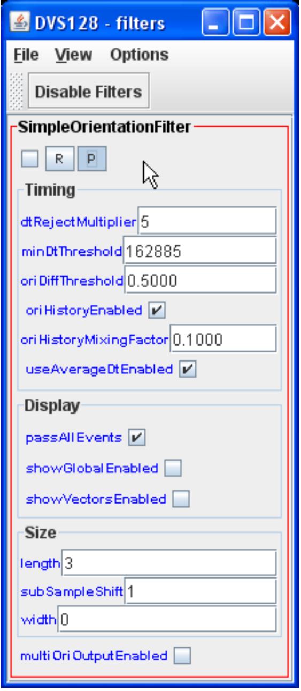</p>

## Adding class description

The annotation Description adds a description that is used to build the
GUIs. Use this to add a tooltip describing your class, as shown below:

```java
// this jAER annotation type is used in GUIs
@Description("Removes uncorrelated background activity") 
public class BackgroundActivityFilter extends EventFilter2D implements Observer  {
```

## Example of a complete EventFilter

Below is commented and simplified code for
[BackgroundActivityFilter](https://github.com/SensorsINI/jaer/blob/master/src/net/sf/jaer/eventprocessing/filter/BackgroundActivityFilter.java).
This filter removes background activity from uncorrelated AEs. It only
pass through events that have received some "support" from the
spatio-temporal neighborhood.

```java
package ch.unizh.ini.caviar.eventprocessing.filter;

import ch.unizh.ini.caviar.chip.*;
import ch.unizh.ini.caviar.event.*;
import ch.unizh.ini.caviar.event.EventPacket;
import ch.unizh.ini.caviar.eventprocessing.EventFilter2D;
import java.util.*;

/**
 * An AE background that filters slow background activity by only passing 
 * inPacket that are supported by another event in the past 
 * {@link #setDt dt} in the immediate spatial neighborhood, defined
 * by a subsampling bit shift.
 * @author tobi */
// this jAER annotation type is used in GUIs
@Description("Removes uncorrelated background activity") 
public class BackgroundActivityFilter extends EventFilter2D implements Observer{
  public boolean isGeneratingFilter(){ return false;}
  final int DEFAULT_TIMESTAMP=Integer.MIN_VALUE;

  /** the time in timestamp ticks (1us at present) that a spike
   * needs to be supported by a prior event in the 
   * neighborhood by to pass through */
  // the built-in method getInt gets the value from Preferences
  protected int dt=getInt("dt",30000);

  /** the amount to subsample x and y event location by in bit shifts 
   * when writing to past event times map. This effectively increases 
   * the range of support. E.g. setting subSamplingShift to 1 quadruples 
   * range because both x and y are shifted right by one bit */
  private int subsampleBy=getPrefs().getInt("BackgroundActivityFilter.subsampleBy",0);

  int[][] lastTimestamps;

  public BackgroundActivityFilter(AEChip chip){
    super(chip); // always call the super method!
    // do this if you want the filter to be informed of 
    //  changes in the chip (e.g. size)
    chip.addObserver(this); 
    initFilter();
    resetFilter();
    // this adds tooltips in GUI
    setPropertyTooltip("dt","Events with less than this delta time to neighbors pass through");
    setPropertyTooltip("subsampleBy","Past events are subsampled by this many bits");
  }

  void allocateMaps(AEChip chip){
    lastTimestamps=new int[chip.getSizeX()][chip.getSizeY()];
  }

  int ts=0; // used to reset filter

  /**filters in to out. If filtering is enabled, the number of out may be less
   * than the number put in
   * @param in input events can be null or empty.
   * @return the processed events, may be fewer in number. 
   *  filtering may occur in place in the in packet. */
  synchronized public EventPacket filterPacket(EventPacket in) {
    if(!filterEnabled) return in; // do this check to avoid always running filter
    if(enclosedFilter!=null) {
      in=enclosedFilter.filterPacket(in); // you can enclose a filter in a filter
    }

    // always do this check to make sure you have a valid output packet, 
    //  unless you are just returning back the input events
    checkOutputPacketEventType(in); 
    if(lastTimestamps==null) allocateMaps(chip);

    // The general idea for this filter is for each event only write it to the 
    //  out buffers if it is within dt of the last time an event happened 
    //  in neighborhood

    // initialize the obtain the output event iterator
    OutputEventIterator outItr=out.outputIterator(); 
    int sx=chip.getSizeX()-1;
    int sy=chip.getSizeY()-1;
    for(Object e:in) { // iterate over the input packet
      // cast the object to basic event to get timestamp, x and y
      BasicEvent i=(BasicEvent)e; 
      ts=i.timestamp;
      short x=(short)(i.x>>>subsampleBy), y=(short)(i.y>>>subsampleBy);
      int lastt=lastTimestamps[x][y];
      int deltat=(ts-lastt);
      if(deltat<dt && lastt!=DEFAULT_TIMESTAMP){
        BasicEvent o=(BasicEvent)outItr.nextOutput();  // make an output event
        o.copyFrom(i); // copy the BasicEvent fields from the input event
      }

      try{
        // for each event stuff the event's timestamp into the lastTimestamps 
        //  array at neighboring locations
        // lastTimestamps[x][y][type]=ts; // don't write to ourselves, we need 
        //  support from neighbor for next event
        // bounds checking here to avoid throwing expensive exceptions, 
        //  even though we duplicate java's bound checking...
        if(x>0) lastTimestamps[x-1][y]=ts;
        if(x<sx) lastTimestamps[x+1][y]=ts;
        if(y>0) lastTimestamps[x][y-1]=ts;
        if(y<sy) lastTimestamps[x][y+1]=ts;
        if(x>0 && y>0) lastTimestamps[x-1][y-1]=ts;
        if(x<sx && y<sy) lastTimestamps[x+1][y+1]=ts;
        if(x>0 && y<sy) lastTimestamps[x-1][y+1]=ts;
        if(x<sx && y>0) lastTimestamps[x+1][y-1]=ts;
      }catch(ArrayIndexOutOfBoundsException eoob){
        allocateMaps(chip);  // the chip size may have changed
      }  // boundaries
    }
    // you must return the output packet (or the original input packet if you 
    //  are not modifying the events
    return out;  
  }

  // this getter/setter pair defines a property for which a control is 
  //  automatically built in the GUI
  /**gets the background allowed delay in us
   * @return delay allowed for spike since last in neighborhood to pass (us) */
  public int getDt() {
    return this.dt;
  }

  /**sets the background delay in us
   * @see #getDt
   * @param dt delay in us */
  public void setDt(final int dt) {
    // the putInt method is built-in, along with putFloat, putString, etc. 
    //  It stores the value using the key "dt"
    putInt("dt",dt); 
    // calling support with the same name updates the GUI
    support.firePropertyChange("dt",this.dt,dt); 
    this.dt = dt;
  }

  public Object getFilterState() {
    return lastTimestamps;
  }

  void resetLastTimestamps(){
    for(int i=0;i<lastTimestamps.length;i++)
      Arrays.fill(lastTimestamps[i],DEFAULT_TIMESTAMP);
  }

  synchronized public void resetFilter() {
    // set all lastTimestamps to max value so that any event is soon enough, 
    //  guarenteed to be less than it
    resetLastTimestamps();
  }

  public void update(Observable o, Object arg) {
    initFilter();
  }

  public void initFilter() {
    allocateMaps(chip);
  }

  public int getSubsampleBy() {
    return subsampleBy;
  }

  /** Sets the number of bits to subsample by when storing events into 
   * the map of past events.
   * Increasing this value will increase the number of events that pass 
   * through and will also allow passing events from small sources that 
   * do not stimulate every pixel.
   * @param subsampleBy the number of bits, 0 means no subsampling, 
   *   1 means cut event time map resolution by a factor of two in x and in y */
  public void setSubsampleBy(int subsampleBy) {
    if(subsampleBy<0) subsampleBy=0; else if(subsampleBy>4) subsampleBy=4;
    this.subsampleBy = subsampleBy;
    putInt("BackgroundActivityFilter.subsampleBy",subsampleBy);
  }
```


## Using a filter

To use this filter, build the project *(remember to build the Project
jar, F11 in netbeans, not just compile the class)*, then open the filter
window and Select View/Customize...

<p align="center">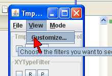</p>

You should get the following dialog:

<p align="center">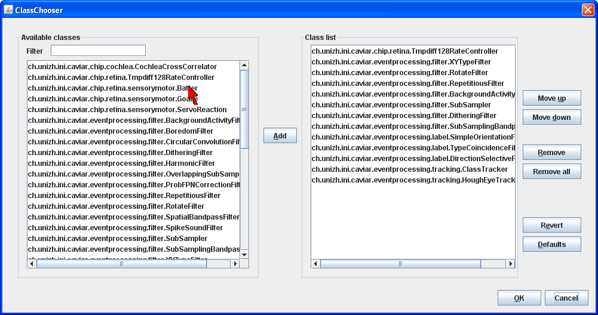</p>

Select your filter on the left side (you can filter on part of it's name
using the Filter box) and double click it or use the Add button to add
it to the list on the right. Edit the list of active filters as you
like. Click OK. Now your filter will be in the list of filters in the
FilterFrame:

<p align="center">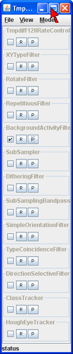</p>

### Controlling a filter

Clicking on the *R* button resets the filter; the *P* button collapses
the list and opens the GUI for controlling the filter

<p align="center">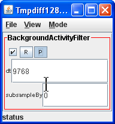</p>

## Adding macro to netbeans to ease filter tooltip making

In netbeans, open the tab *Tools/Options/Editor/Macro* and create a new
macro with the following macro string

*select-word copy-to-clipboard caret-begin-line caret-down
"{setPropertyTooltip("" paste-from-clipboard "","");}"
insert-break caret-up caret-end-line caret-backward caret-backward
caret-backward caret-backward*

To use this macro, click inside the property and hit Ctrl+9.

<p align="center">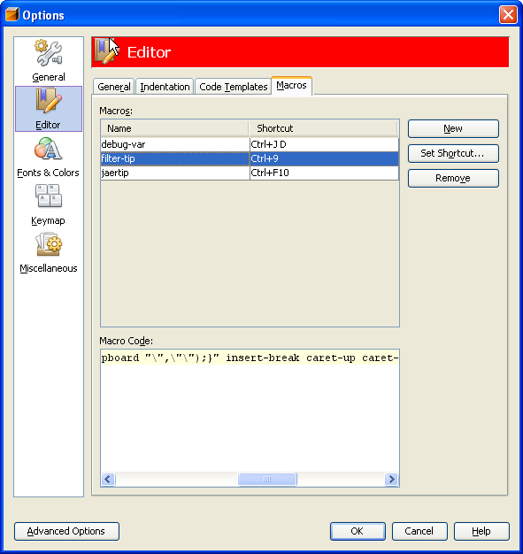</p>

It is possible to enclose a FilterChain of filters inside another
EventFilter. In this case, the preferences for the enclosed filters are
stored in a different node of the Preferences userRoot tree based on the
enclosing EventFilter class. That way filters can have distinct
Preference values.

# Quick reference

## Starting

1.  Launch jAERjAERViewer1.5_win64.exe (assuming 64-bit system)
2.  Go to AEChip, select camera hardware
3.  Go to View → Biases/HW Configuration
4.  In Biases dialog, go to File → Load settings…
    1.  Go into jAERbiasgen Settings and select desired settings
        file
        1. For DVS128: usually DVS128Fast
        
        2. For DAVIS: usually global shutter auto exposure

## Tips and Tricks

Main control: View → Biases/HW Configuration → Tab: User-Friendly
Controls

- Section Image Sensor (DAVIS only)
    - Auto exposure: enabled in general
    - Capture Frames: switch off if not needed to avoid extra DVS noise
    - Frame Delay: set to adjust display refresh rate
- Section DVS
  - Pixel bandwidth → low-pass filter, increase for high-speed scenarios
- Section IMU (DAVIS only)
  - Switch of Enable and Display unless needed

## General Keyboard Shortcuts

| Key    | Action                                                                                           |
| ------ | ------------------------------------------------------------------------------------------------ |
| Space  | Pause/restart display (during either real-time or playback)                                      |
| Arrows | Up/down: FS (number of events needed to be included in frame) <br/> Left/right: Frame bin size   |
| C      | Cycle through event colour schemes                                                               |
| L      | Log events file start/stop                                                                       |

## Playback Mode

File → Open logged data file

File → Playback logged data immediately… (useful with L command to
immediately preview)

| Key    | Action                                          |
| ------ | ----------------------------------------------- |
| S      | Slow down playback                              |
| F      | Faster playback                                 |
| 3      | 3D rendering mode on/off                        |
| Ctrl-W | Close playback window, return to live view mode |

UDP ...

You can also just run jAER as a server for the spike events and stream
out the data to python via the built in UDP or multicast support in
jAER:

<p align="center">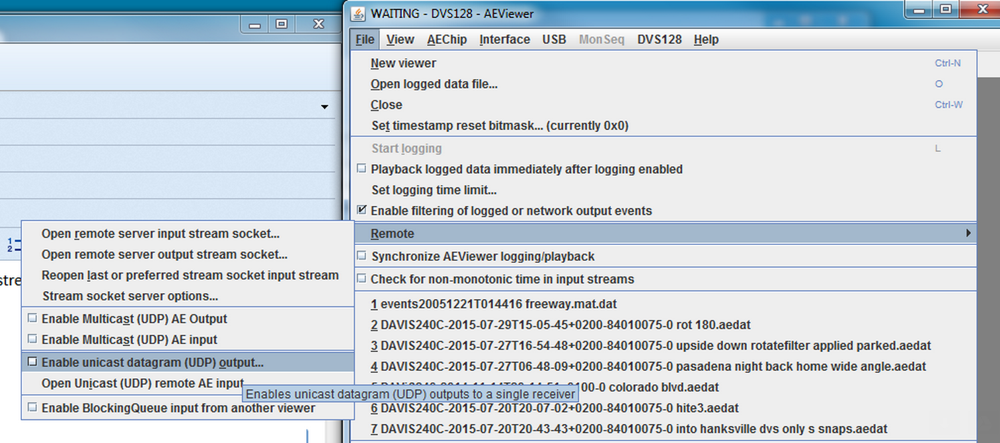</p>

<p align="center">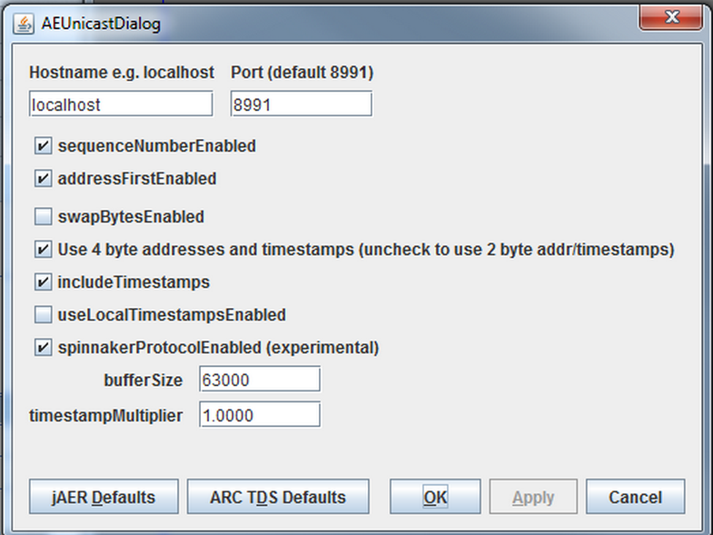</p>

USB menu …
