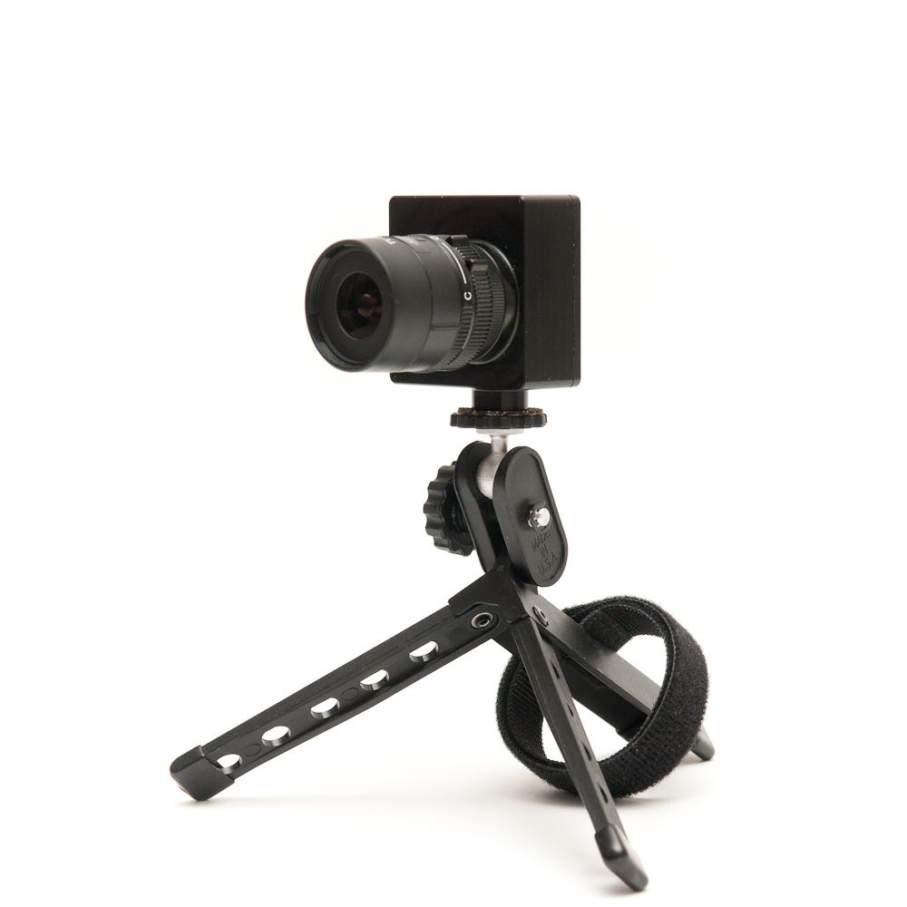
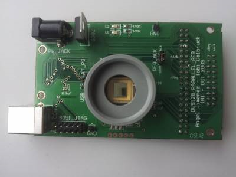
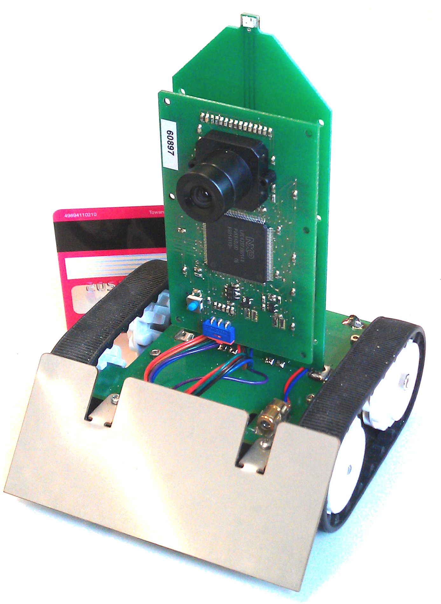
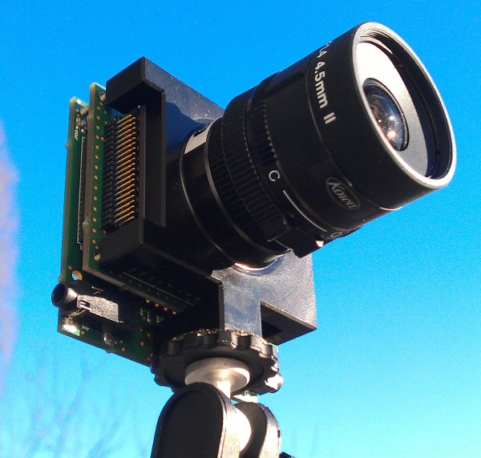

# Support overview

We support all of the products we sell in their intended usage as
research prototypes. We also support the open-source event-based
software platforms jAER and cAER and some related software.

We
[use](https://groups.google.com/d/forum/davis-users)
[several](https://groups.google.com/d/forum/jaer-users)
[Google](https://groups.google.com/d/forum/caer-users)
[Groups](https://groups.google.com/d/forum/dynapse-users)
for all public questions and discussions regarding inivation products.
If your question involves confidential information, however, please use
[support@inivation.com](mailto:support@inilabs.com).
First you could try our [troubleshooting
guide](http://www.inilabs.com/support/faq).

This document explains where to find help, with links to our user
guides.

> [Overview of devices and user guides](#overview-of-devices-and-user-guides)
> 
> [Software for event processing](#software-for-event-processing)
> 
> [What are the different ways I can work with event data from my device?](#what-are-the-different-ways-i-can-work-with-event-data-from-my-device)
> 
> [jAER](#jaer)
> 
> [cAER](#caer)
> 
> [MATLAB](#matlab)
> 
> [eDVS codebase](#edvs-codebase)
> 
> [Unsupported software](#unsupported-software)
> 
> [Additional user guides](#additional-user-guides)
# Overview of devices and user guides

If you are not sure which device you have, use this table to find the
correct user guide:

| Image                                             | Name and brief description |  User guide |
|---------------------------------------------------|----------------------------|-------------|
|           | **DVS128**    A 128x128 DVS in a strong plastic case, with a USB 2.0 interface, CS-mount, tripod mount and  inter-camera synchronization pins.                                                                                                                        | http://www.inivation.com/support/dvs128 |
|      | **DVS128_PAER**     A CS-mount bare-board camera, with a 128x128 DVS and with parallel AER interface (Rome and CAVIAR standards).                                                                                                                                     | http://www.inivation.com/support/dvs128paer |
|             | **eDVS**    A credit-card-sized S-mount PCB with a 128x128 DVS embedded with a 4337 microcontroller, with UART connectors, on-board IMU and microSD, PWM outputs, and optional network adapter.                                                                       | http://www.inivation.com/support/edvs |
|          | **Pushbot**    A robotic platform; ideal for working with the eDVS to quickly prototype sensing behaving systems.                                                                                                                                                     | http://www.inivation.com/support/edvs |
|    | **DAVIS240A/B/C**    A CS-mount bare-board camera, with a 240x180 DAVIS (DVS plus simultaneous global-shutter intensity frames) and word-serial AER (10x higher data rates). It has a USB 2.0 interface (direct AER interface is also possible) and on-board IMU.     | http://www.inivation.com/support/davis240 |
|             | **DAS1**    A stereo x 64 channel dynamic audio sensor (silicon cochlea).                                                                                                                                                                                           | http://www.inivation.com/support/das |

# Software for event processing

inivation supports the development of open-source software for real-time
event-based processing, using neuromorphic / dynamic sensors as inputs.
Most notably, we have taken over development of jAER, developed at INI,
a java-based GUI for visualisation and rapid application development of
event data and algorithms.

The software we support (jAER, cAER, MATLAB scripts) is all hosted under
the sourceforge jAER
project.

## What are the different ways I can work with event data from my device?

All of our devices are USB enabled, so you can stream data to a PC.
There you can work with the data either in real time or offline.

The eDVS has a microcontroller on board so you can directly implement
event-based visual processing algorithms; or you can stream the events
to further hardware via UART.

The DVS128\_PAER and the DAS1 both have a parallel AER bus for direct
connection to other neuromorphic devices. You can also directly access
the word-serial AER bus pins on the DAVIS240.

The logic on all devices is open-source, so you have a basis for
repurposing devices to directly perform front-end visual processing - we
don’t support this.

## jAER

For real-time application, the easiest way to get started is with jAER,
a java-based GUI for visualisation of data and rapid development of
event-based algorithms and applications. Here is the
[user guide](http://www.inilabs.com/support/jaer).

## cAER

You can use cAER for lightweight streaming or logging of data, or as a
platform for your bespoke development. Here is the
[user guide](http://www.inilabs.com/support/caer).

## MATLAB

You can use jAER (or cAER, or the SD card logging function of the eDVS)
to save event data, and then work with it offline. We provide scripts
that import data from our .aedat format into MATLAB, for offline use.
Some users report using MATLAB for real-time processing of events - we
don’t support this.

## Python

The jAER repository also contains scripts for importing saved data into
Python. Furthermore, there are scripts for receiving live events from
cAER.

## eDVS codebase

The default software for the eDVS is open source, and you can use this
as a basis for reprogramming the device to perform the necessary
processing for your application.

## Unsupported software

ROS - Some of our users bridge from cAER to ROS. Although we don’t
support this, we can put you in touch with those users as they are
willing to share code.

V-REP - Coppelia robotics have created a simulator of the DVS128 in
their V-REP software(version 3.0.4 onwards); please contact Coppelia
directly for support.

# Additional user guides

  - > [Biasing sensors](http://inilabs.com/support/biasing) - How to get the best performance from your sensors by controlling their on-board electronic biases.
  - > [Synchronisation](http://inilabs.com/support/synch) How to work with 2 or more sensors simultaneously; also covers stereo configurations.
  - > [Reflashing devices](http://inilabs.com/support/reflashing) - How to benefit from the latest upgrades to device firmware.
